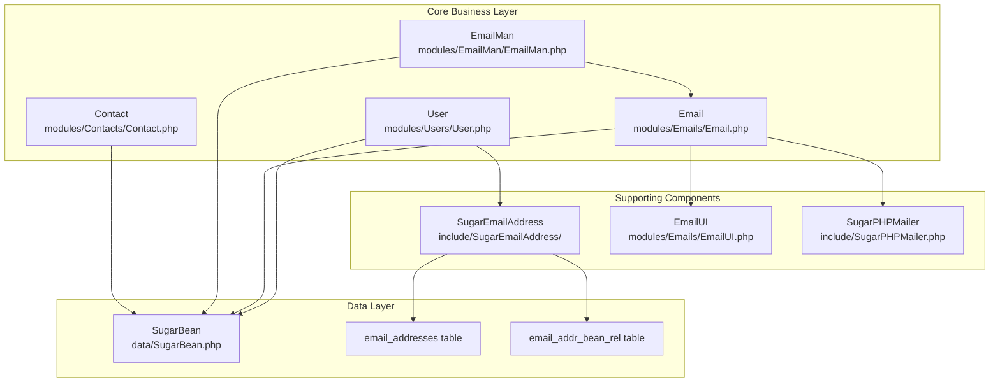
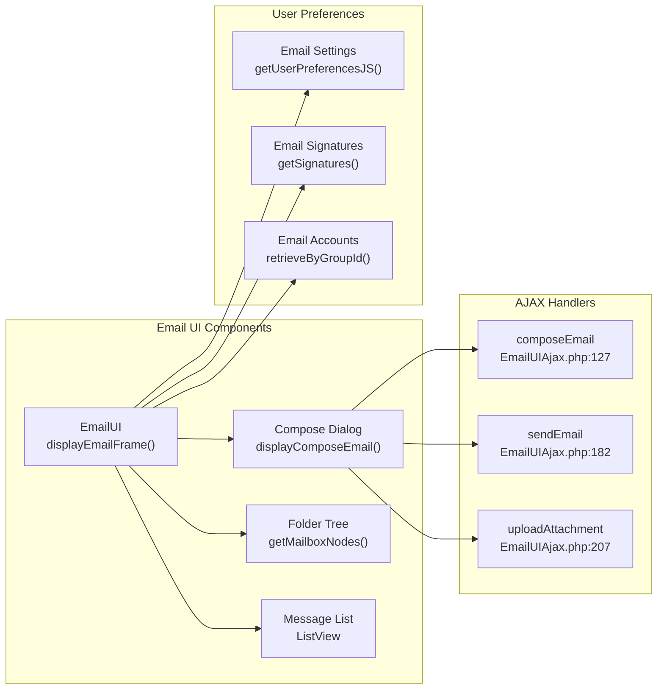
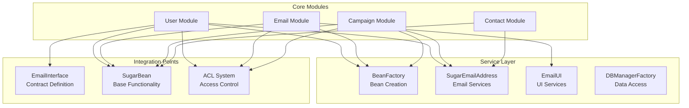

# Core Business Modules

<details>
<summary>Relevant source files</summary>

The following files were used as context for generating this wiki page:

- [include/SugarEmailAddress/SugarEmailAddress.php](include/SugarEmailAddress/SugarEmailAddress.php)
- [include/SugarEmailAddress/getEmailAddressWidget.php](include/SugarEmailAddress/getEmailAddressWidget.php)
- [include/SugarEmailAddress/templates/optInStatusTick.tpl](include/SugarEmailAddress/templates/optInStatusTick.tpl)
- [include/SugarObjects/templates/basic/Basic.php](include/SugarObjects/templates/basic/Basic.php)
- [include/SugarObjects/templates/company/metadata/listviewdefs.php](include/SugarObjects/templates/company/metadata/listviewdefs.php)
- [include/generic/SugarWidgets/SugarWidgetSubPanelEmailLink.php](include/generic/SugarWidgets/SugarWidgetSubPanelEmailLink.php)
- [include/generic/SugarWidgets/SugarWidgetSubPanelTopComposeEmailButton.php](include/generic/SugarWidgets/SugarWidgetSubPanelTopComposeEmailButton.php)
- [include/language/en_us.lang.php](include/language/en_us.lang.php)
- [metadata/email_addressesMetaData.php](metadata/email_addressesMetaData.php)
- [modules/Accounts/metadata/listviewdefs.php](modules/Accounts/metadata/listviewdefs.php)
- [modules/Configurator/Configurator.php](modules/Configurator/Configurator.php)
- [modules/Contacts/Dashlets/MyContactsDashlet/MyContactsDashlet.data.php](modules/Contacts/Dashlets/MyContactsDashlet/MyContactsDashlet.data.php)
- [modules/Contacts/metadata/listviewdefs.php](modules/Contacts/metadata/listviewdefs.php)
- [modules/EmailAddresses/EmailAddress.php](modules/EmailAddresses/EmailAddress.php)
- [modules/EmailAddresses/language/en_us.lang.php](modules/EmailAddresses/language/en_us.lang.php)
- [modules/EmailMan/EmailMan.php](modules/EmailMan/EmailMan.php)
- [modules/Emails/Email.php](modules/Emails/Email.php)
- [modules/Emails/EmailUI.css](modules/Emails/EmailUI.css)
- [modules/Emails/EmailUI.php](modules/Emails/EmailUI.php)
- [modules/Emails/EmailUIAjax.php](modules/Emails/EmailUIAjax.php)
- [modules/Emails/PopupDocuments.html](modules/Emails/PopupDocuments.html)
- [modules/Emails/javascript/EmailUI.js](modules/Emails/javascript/EmailUI.js)
- [modules/Emails/templates/editAccountDialogue.tpl](modules/Emails/templates/editAccountDialogue.tpl)
- [modules/Emails/templates/emailSettingsAccounts.tpl](modules/Emails/templates/emailSettingsAccounts.tpl)
- [modules/Emails/templates/emailSettingsFolders.tpl](modules/Emails/templates/emailSettingsFolders.tpl)
- [modules/Emails/templates/emailSettingsGeneral.tpl](modules/Emails/templates/emailSettingsGeneral.tpl)
- [modules/Emails/templates/outboundDialog.tpl](modules/Emails/templates/outboundDialog.tpl)
- [modules/Users/User.php](modules/Users/User.php)
- [modules/Users/UserViewHelper.php](modules/Users/UserViewHelper.php)
- [modules/Users/controller.php](modules/Users/controller.php)
- [modules/Users/language/en_us.lang.php](modules/Users/language/en_us.lang.php)
- [modules/Users/tpls/EditViewFooter.tpl](modules/Users/tpls/EditViewFooter.tpl)
- [modules/Users/tpls/EditViewHeader.tpl](modules/Users/tpls/EditViewHeader.tpl)
- [modules/Users/tpls/wizard.tpl](modules/Users/tpls/wizard.tpl)
- [modules/Users/views/view.wizard.php](modules/Users/views/view.wizard.php)
- [themes/SuiteP/css/suitep-base/detailview.scss](themes/SuiteP/css/suitep-base/detailview.scss)

</details>


This document covers the primary business logic modules that form the backbone of SuiteCRM's customer relationship management functionality. These modules handle user management, email communications, campaign management, and reporting capabilities that enable core CRM operations.

For information about the user interface systems that present these modules, see [User Interface System](#3). For details about the underlying data layer that supports these modules, see [Data Layer (SugarBean)](#2.2).

## Overview

SuiteCRM's core business modules provide the essential functionality that enables customer relationship management. The system is built around several interconnected modules that handle different aspects of business operations:

| Module | Primary Purpose | Key Components |
|--------|----------------|----------------|
| User Management | Authentication, preferences, access control | `User`, `SugarEmailAddress`, `UserPreference` |
| Email System | Email composition, sending, receiving | `Email`, `EmailUI`, `SugarPHPMailer` |
| Campaign Management | Email marketing, target lists | `EmailMan`, `Campaign`, `ProspectList` |
| Contact Management | Customer and prospect data | `Contact`, `Lead`, `Account` |

The architecture follows a modular design where each business module extends the base `SugarBean` class and implements specific business logic while maintaining consistent data access patterns.



Sources: [include/language/en_us.lang.php:51-112](), [modules/Users/User.php:50-51](), [modules/Emails/Email.php:54](), [modules/EmailMan/EmailMan.php:46]()

## User Management System

The User management system serves as the foundation for authentication, authorization, and user preferences throughout SuiteCRM. The `User` class extends the `Person` template and implements the `EmailInterface` to provide comprehensive user functionality.

### User Entity Architecture

The `User` class provides core user functionality including authentication, preferences, and email management:

```mermaid
graph TB
    User["User<br/>modules/Users/User.php"]
    Person["Person<br/>include/SugarObjects/templates/person/Person.php"]
    Basic["Basic<br/>include/SugarObjects/templates/basic/Basic.php"]
    SugarBean["SugarBean<br/>data/SugarBean.php"]
    EmailInterface["EmailInterface<br/>include/EmailInterface.php"]
    
    User --> Person
    User --> EmailInterface
    Person --> Basic
    Basic --> SugarBean
    
    User --> UserPreference["UserPreference<br/>modules/UserPreferences/"]
    User --> SugarEmailAddress["SugarEmailAddress<br/>include/SugarEmailAddress/"]
    
    UserPreference --> "user_preferences table"
    SugarEmailAddress --> "email_addresses table"
```

The `User` class contains extensive functionality for managing user accounts:

- **Authentication**: Password validation, external authentication support
- **Preferences**: User-specific settings, locale, timezone configuration  
- **Email Integration**: Email signatures, outbound email accounts
- **Security**: Access control, factor authentication support

Sources: [modules/Users/User.php:50-51](), [modules/Users/User.php:140-145](), [include/SugarObjects/templates/basic/Basic.php:43]()

### Email Address Management

The `SugarEmailAddress` class provides sophisticated email address management capabilities that are used throughout the CRM system:

```mermaid
graph LR
    subgraph "Email Address System"
        SugarEmailAddress["SugarEmailAddress<br/>saveEmail()"]
        EmailAddressBean["EmailAddress<br/>Bean Entity"]
        EmailAddrBeanRel["email_addr_bean_rel<br/>Relationship Table"]
    end
    
    subgraph "Business Entities"
        User["User"]
        Contact["Contact"] 
        Lead["Lead"]
        Account["Account"]
    end
    
    User --> SugarEmailAddress
    Contact --> SugarEmailAddress
    Lead --> SugarEmailAddress
    Account --> SugarEmailAddress
    
    SugarEmailAddress --> EmailAddressBean
    SugarEmailAddress --> EmailAddrBeanRel
    
    EmailAddrBeanRel --> "primary_address flag"
    EmailAddrBeanRel --> "reply_to_address flag"
    EmailAddrBeanRel --> "opt_out flag"
    EmailAddrBeanRel --> "invalid_email flag"
```

Key features of the email address system include:

- **Multi-address Support**: Each entity can have multiple email addresses
- **Primary/Reply-to Designation**: Flexible addressing for communications
- **Opt-out Management**: Compliance with email marketing regulations
- **Validation**: Email format validation and duplicate detection

Sources: [include/SugarEmailAddress/SugarEmailAddress.php:49-50](), [include/SugarEmailAddress/SugarEmailAddress.php:632-682](), [include/SugarEmailAddress/SugarEmailAddress.php:278-408]()

## Email Communication System

The email system provides comprehensive email functionality including composition, sending, receiving, and management. It integrates closely with the user management system and provides both programmatic and user interface capabilities.

### Email Core Components

The email system architecture centers around the `Email` class and supporting components:

```mermaid
graph TB
    subgraph "Email Core"
        Email["Email<br/>modules/Emails/Email.php<br/>email2Send()"]
        EmailUI["EmailUI<br/>modules/Emails/EmailUI.php<br/>displayEmailFrame()"]
        SugarPHPMailer["SugarPHPMailer<br/>include/SugarPHPMailer.php"]
    end
    
    subgraph "Email Processing"
        EmailUIAjax["EmailUIAjax<br/>modules/Emails/EmailUIAjax.php<br/>sendEmail action"]
        InboundEmail["InboundEmail<br/>modules/InboundEmail/"]
        OutboundEmail["OutboundEmail<br/>include/OutboundEmail/"]
    end
    
    subgraph "Storage"
        EmailsTable["emails table"]
        EmailText["emails_text table"]
        Attachments["notes table<br/>(attachments)"]
    end
    
    Email --> EmailUI
    Email --> SugarPHPMailer
    EmailUI --> EmailUIAjax
    
    Email --> InboundEmail
    Email --> OutboundEmail
    
    Email --> EmailsTable
    Email --> EmailText
    Email --> Attachments
    
    EmailUIAjax --> "AJAX handlers<br/>composeEmail<br/>sendEmail<br/>uploadAttachment"
```

The `Email` class provides the core email functionality with methods for:

- **Composition**: `email2Send()` method handles email creation and sending
- **Address Parsing**: `email2ParseAddresses()` processes recipient lists
- **Attachment Handling**: Integration with the Notes system for file attachments
- **Template Processing**: Support for email templates and variable substitution

Sources: [modules/Emails/Email.php:54](), [modules/Emails/Email.php:911-912](), [modules/Emails/EmailUI.php:55](), [modules/Emails/EmailUIAjax.php:127-128]()

### Email User Interface

The `EmailUI` class provides the sophisticated web-based email interface that allows users to manage emails through the browser:



Key features of the email UI include:

- **Rich Compose Interface**: WYSIWYG editor, attachment support, address book integration
- **Folder Management**: Hierarchical folder structure, inbox organization
- **Account Management**: Multiple email account support, IMAP/POP integration
- **Real-time Updates**: AJAX-based interface for responsive email handling

Sources: [modules/Emails/EmailUI.php:84-99](), [modules/Emails/EmailUI.php:108-109](), [modules/Emails/EmailUIAjax.php:110-121]()

## Campaign Management System

The campaign management system enables email marketing capabilities through the `EmailMan` class and related components. This system manages bulk email sending, target list management, and campaign tracking.

### Campaign Architecture

The campaign system coordinates between multiple modules to deliver email marketing functionality:

```mermaid
graph TB
    subgraph "Campaign Management"
        EmailMan["EmailMan<br/>modules/EmailMan/EmailMan.php"]
        Campaign["Campaign<br/>modules/Campaigns/"]
        EmailMarketing["EmailMarketing<br/>modules/EmailMarketing/"]
    end
    
    subgraph "Target Management"
        ProspectList["ProspectList<br/>modules/ProspectLists/"]
        Prospects["Prospects<br/>modules/Prospects/"]
        Leads["Leads<br/>modules/Leads/"]
        Contacts["Contacts<br/>modules/Contacts/"]
    end
    
    subgraph "Email Processing"
        EmailTemplate["EmailTemplate<br/>modules/EmailTemplates/"]
        Email["Email<br/>modules/Emails/Email.php"]
        SugarPHPMailer["SugarPHPMailer"]
    end
    
    EmailMan --> Campaign
    EmailMan --> EmailMarketing
    EmailMan --> ProspectList
    
    ProspectList --> Prospects
    ProspectList --> Leads
    ProspectList --> Contacts
    
    EmailMan --> EmailTemplate
    EmailMan --> Email
    Email --> SugarPHPMailer
    
    EmailMan --> "emailman table<br/>Queue Management"
    Campaign --> "campaigns table"
    EmailMarketing --> "email_marketing table"
```

The `EmailMan` class serves as the central coordinator for campaign email delivery:

- **Queue Management**: Manages email delivery queues and scheduling
- **Target Processing**: Handles recipient list processing and filtering
- **Template Merging**: Applies email templates with personalized content
- **Delivery Tracking**: Records delivery status and campaign metrics

Sources: [modules/EmailMan/EmailMan.php:46](), [modules/EmailMan/EmailMan.php:152-154](), [modules/EmailMan/EmailMan.php:182-195]()

### Email Queue Processing

The EmailMan system includes sophisticated queue processing capabilities:

```mermaid
graph LR
    subgraph "Queue Processing Flow"
        QueueEntry["EmailMan Entry<br/>in_queue = 1"]
        ProcessEmail["sendEmailViaEmailMan()<br/>EmailMan.php:785"]
        TemplateProcess["Template Processing<br/>parse_template()"]
        Delivery["Email Delivery<br/>SugarPHPMailer"]
        StatusUpdate["Status Update<br/>send_attempts++"]
    end
    
    subgraph "Queue Queries"
        CreateQueue["create_queue_items_query()<br/>EmailMan.php:279"]
        NewListQuery["create_new_list_query()<br/>EmailMan.php:182"]
    end
    
    QueueEntry --> ProcessEmail
    ProcessEmail --> TemplateProcess
    TemplateProcess --> Delivery
    Delivery --> StatusUpdate
    
    CreateQueue --> "Queue View Queries"
    NewListQuery --> "Campaign Reports"
```

Key queue processing features include:

- **Batch Processing**: Handles large volume email campaigns efficiently
- **Retry Logic**: Automatic retry for failed deliveries with attempt tracking
- **Opt-out Compliance**: Respects opt-out flags and invalid email markers
- **Performance Optimization**: Optimized queries for large recipient lists

Sources: [modules/EmailMan/EmailMan.php:279-347](), [modules/EmailMan/EmailMan.php:785](), [modules/EmailMan/EmailMan.php:182-263]()

## Integration Patterns

The core business modules follow consistent integration patterns that enable seamless data flow and functionality across the CRM system.

### Email Integration Pattern

All major business entities integrate with the email system through standardized patterns:

```mermaid
graph TB
    subgraph "Business Entities"
        User["User"]
        Contact["Contact"]
        Lead["Lead"]
        Account["Account"]
        Opportunity["Opportunity"]
    end
    
    subgraph "Email Integration Layer"
        SugarEmailAddress["SugarEmailAddress<br/>Email Address Management"]
        EmailCompose["Email Composition<br/>SugarWidgetSubPanelTopComposeEmailButton"]
        EmailHistory["Email History<br/>emails_beans_rel"]
    end
    
    subgraph "Email System"
        Email["Email Class"]
        EmailUI["EmailUI"]
        EmailMan["EmailMan"]
    end
    
    User --> SugarEmailAddress
    Contact --> SugarEmailAddress
    Lead --> SugarEmailAddress
    Account --> SugarEmailAddress
    Opportunity --> EmailCompose
    
    SugarEmailAddress --> Email
    EmailCompose --> EmailUI
    EmailHistory --> EmailMan
    
    Email --> "Compose Email<br/>data-module<br/>data-record-id<br/>data-email-address"
```

This integration pattern enables:

- **Unified Email Access**: Consistent email functionality across all modules
- **Contextual Communication**: Emails automatically linked to relevant records
- **Address Management**: Centralized email address handling with validation
- **Activity Tracking**: Complete email history associated with business records

Sources: [include/generic/SugarWidgets/SugarWidgetSubPanelTopComposeEmailButton.php:45](), [include/generic/SugarWidgets/SugarWidgetSubPanelTopComposeEmailButton.php:105-110](), [include/SugarObjects/templates/basic/Basic.php:75-87]()

### Module Communication Architecture

The core business modules communicate through well-defined interfaces and shared services:



This architecture provides:

- **Loose Coupling**: Modules interact through well-defined interfaces
- **Service Reuse**: Common functionality shared across modules
- **Consistent Access Control**: Unified security model across all modules
- **Extensibility**: Clear extension points for customization

Sources: [modules/Users/User.php:50](), [include/EmailInterface.php:46](), [include/SugarObjects/templates/basic/Basic.php:43](), [modules/Emails/Email.php:604-612]()