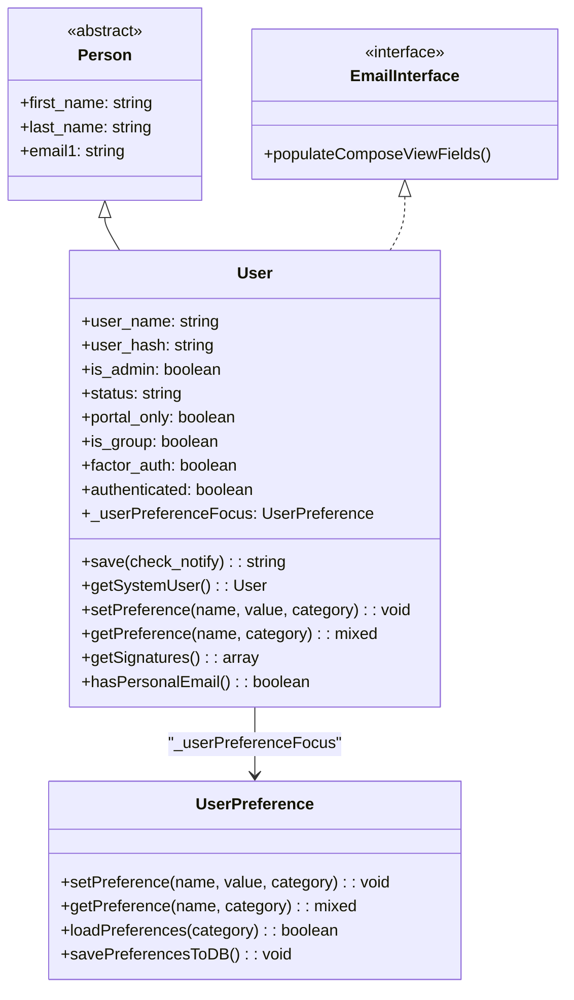
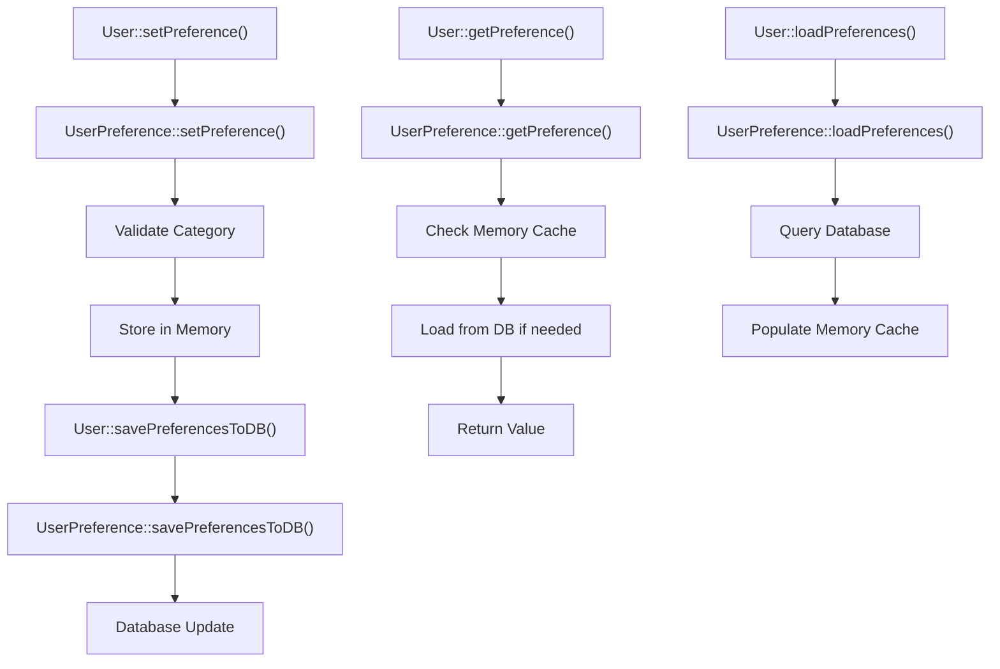
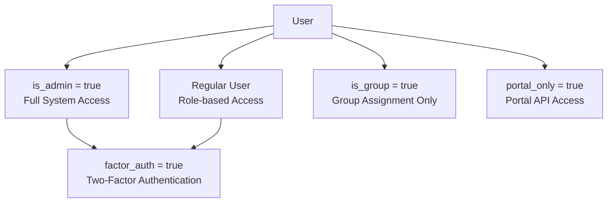
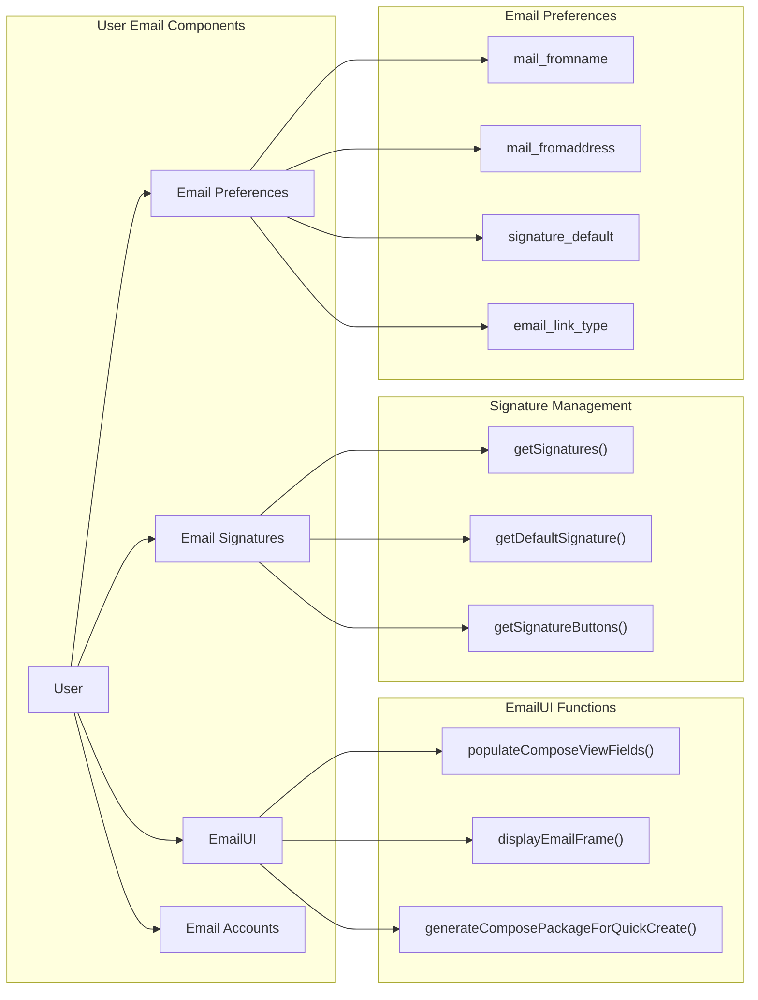
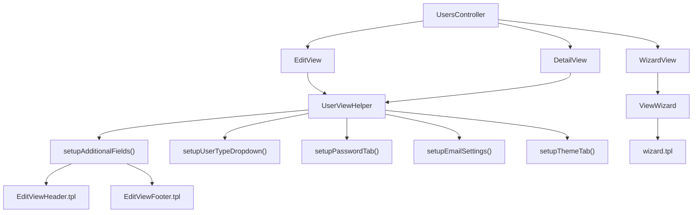
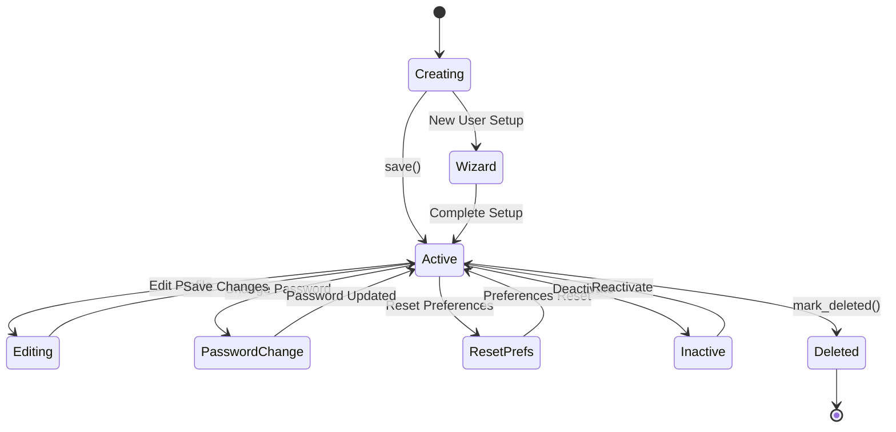

# User Management

Relevant source files

The following files were used as context for generating this wiki page:

- [include/SugarEmailAddress/templates/optInStatusTick.tpl](include/SugarEmailAddress/templates/optInStatusTick.tpl)
- [include/generic/SugarWidgets/SugarWidgetSubPanelEmailLink.php](include/generic/SugarWidgets/SugarWidgetSubPanelEmailLink.php)
- [include/generic/SugarWidgets/SugarWidgetSubPanelTopComposeEmailButton.php](include/generic/SugarWidgets/SugarWidgetSubPanelTopComposeEmailButton.php)
- [modules/Emails/EmailUI.css](modules/Emails/EmailUI.css)
- [modules/Emails/EmailUI.php](modules/Emails/EmailUI.php)
- [modules/Emails/EmailUIAjax.php](modules/Emails/EmailUIAjax.php)
- [modules/Emails/PopupDocuments.html](modules/Emails/PopupDocuments.html)
- [modules/Emails/javascript/EmailUI.js](modules/Emails/javascript/EmailUI.js)
- [modules/Emails/templates/editAccountDialogue.tpl](modules/Emails/templates/editAccountDialogue.tpl)
- [modules/Emails/templates/emailSettingsAccounts.tpl](modules/Emails/templates/emailSettingsAccounts.tpl)
- [modules/Emails/templates/emailSettingsFolders.tpl](modules/Emails/templates/emailSettingsFolders.tpl)
- [modules/Emails/templates/emailSettingsGeneral.tpl](modules/Emails/templates/emailSettingsGeneral.tpl)
- [modules/Emails/templates/outboundDialog.tpl](modules/Emails/templates/outboundDialog.tpl)
- [modules/Users/User.php](modules/Users/User.php)
- [modules/Users/UserViewHelper.php](modules/Users/UserViewHelper.php)
- [modules/Users/controller.php](modules/Users/controller.php)
- [modules/Users/language/en_us.lang.php](modules/Users/language/en_us.lang.php)
- [modules/Users/tpls/EditViewFooter.tpl](modules/Users/tpls/EditViewFooter.tpl)
- [modules/Users/tpls/EditViewHeader.tpl](modules/Users/tpls/EditViewHeader.tpl)
- [modules/Users/tpls/wizard.tpl](modules/Users/tpls/wizard.tpl)
- [modules/Users/views/view.wizard.php](modules/Users/views/view.wizard.php)

## Purpose and Scope

The User Management system in SuiteCRM handles user entities, authentication, preferences, and email integration. This system provides comprehensive user account management including user profiles, preferences, authentication, email settings, and administrative functions. For email-specific functionality beyond user settings, see [Email System](#4.2). For broader authentication and security configurations, see [Administration Panel](#5.2).

## Core User Entity

The `User` class serves as the central entity for user management, extending the `Person` class and implementing the `EmailInterface`. Located in [modules/Users/User.php:50](), this class manages user data, preferences, and email functionality.

The User class contains essential user properties including authentication fields (`user_name`, `user_hash`, `authenticated`), access control fields (`is_admin`, `portal_only`, `is_group`), and two-factor authentication settings (`factor_auth`, `factor_auth_interface`).

**Sources:** [modules/Users/User.php:50-138]()

## User Preferences Management

The user preferences system integrates with the `UserPreference` class to manage user-specific settings across different categories. The User class provides an interface to preference management through its `_userPreferenceFocus` property.

Key preference categories include:
- `global`: General user settings
- `Emails`: Email-specific preferences  
- `ETag`: UI cache management

The system supports various preference types including timezone, date/time formats, currency settings, email signatures, and UI customizations.

**Sources:** [modules/Users/User.php:379-394](), [modules/Users/User.php:518-531](), [modules/Users/UserViewHelper.php:730-970]()

## Authentication and Access Control

The User class implements several authentication and authorization mechanisms:

### User Types and Access Levels

### Authentication Flow

The authentication process involves multiple validation steps including two-factor authentication support:

- Password validation with configurable complexity requirements
- Two-factor authentication through `factor_auth` and `factor_auth_interface` fields
- SMTP server validation for email-based authentication features
- Session management through the `authenticated` property

**Sources:** [modules/Users/User.php:621-654](), [modules/Users/UserViewHelper.php:115-168]()

## Email Integration System

The User class integrates extensively with the email system through the `EmailUI` class and email preference management. This integration includes signature management, email account configuration, and compose functionality.

### Email Signature System

The signature management system allows users to create and manage multiple email signatures:

- Signatures are stored in the `users_signatures` table
- Users can set a default signature via preferences
- HTML and plain text signature support
- Signature selection in compose dialogs

### Email UI Integration

The `EmailUI` class provides comprehensive email functionality including:

- Email composition interface generation
- Account management dialogs
- Folder management
- Template integration
- Quick compose functionality

**Sources:** [modules/Users/User.php:181-325](), [modules/Emails/EmailUI.php:84-369](), [modules/Emails/EmailUI.php:458-605]()

## User Management UI Components

The user interface system consists of several view components and helpers that manage user data presentation and interaction.

### User View Helper

The `UserViewHelper` class manages complex UI rendering for user edit and detail views:

- User type dropdown configuration
- Password change interface
- Email settings integration
- Theme selection
- Advanced preference tabs

### User Controller Actions

The `UsersController` provides several key actions:

- `action_editview()` and `action_detailview()`: Standard CRUD operations with access control
- `action_resetPreferences()`: User preference reset functionality
- `action_delete()`: User deactivation and cleanup
- `action_wizard()` and `action_saveuserwizard()`: New user onboarding

**Sources:** [modules/Users/UserViewHelper.php:49-112](), [modules/Users/controller.php:49-244](), [modules/Users/views/view.wizard.php:55-131]()

## User Lifecycle Management

The user management system handles the complete user lifecycle from creation to deletion, including specialized user types and account management.

### User Creation and Setup

New users go through a wizard process that configures:
- Personal information
- Locale preferences (timezone, date/time formats, currency)
- Email settings
- Theme selection
- Initial module access

### User Types and Permissions

The system supports multiple user types with different capabilities:

- **Regular Users**: Standard CRM access with role-based permissions
- **Administrators**: Full system access including user management
- **Group Users**: Used for assignment purposes, cannot log in
- **Portal Users**: Limited to portal API access

### Account Maintenance

The system provides tools for ongoing user account maintenance:
- Preference reset functionality
- Password management with complexity requirements
- Email account configuration
- Theme and UI customization

**Sources:** [modules/Users/controller.php:104-220](), [modules/Users/views/view.wizard.php:72-200](), [modules/Users/User.php:605-728]()