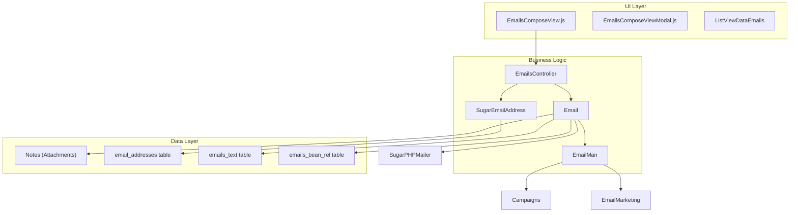
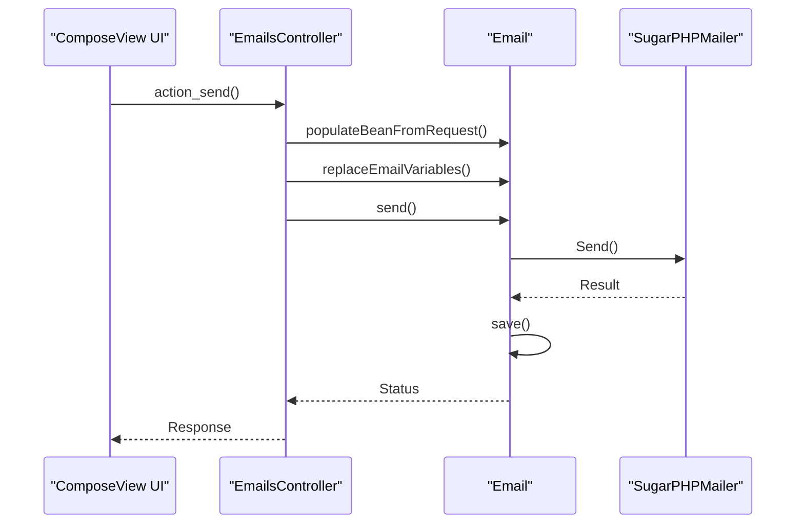
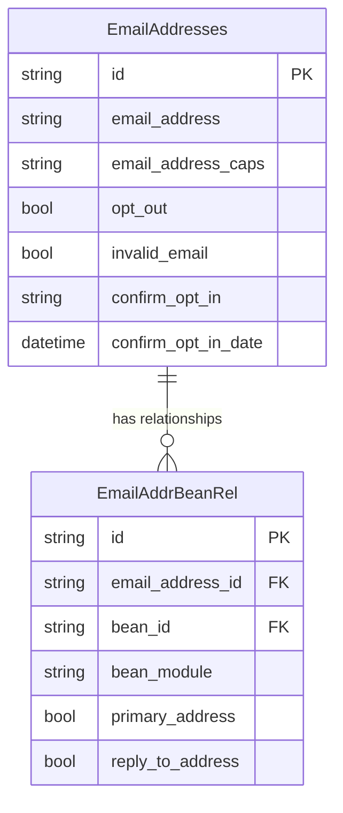
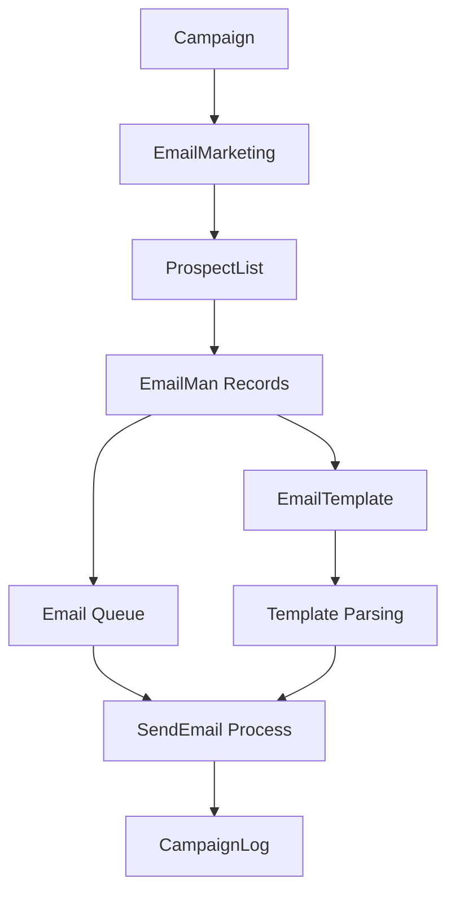
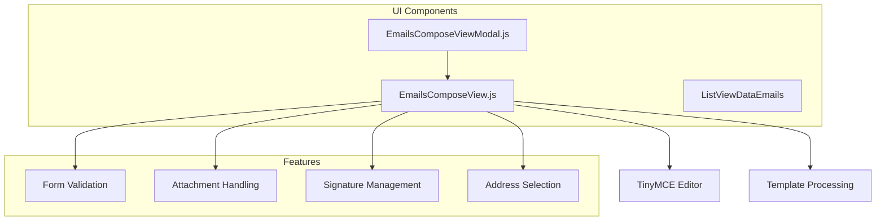
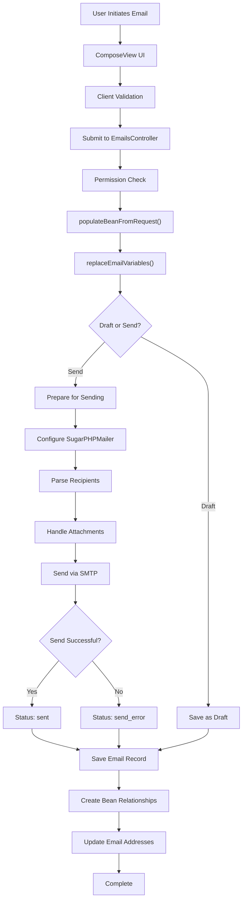

# Email System

<details>
<summary>Relevant source files</summary>

The following files were used as context for generating this wiki page:

- [include/SugarEmailAddress/SugarEmailAddress.php](include/SugarEmailAddress/SugarEmailAddress.php)
- [include/SugarEmailAddress/getEmailAddressWidget.php](include/SugarEmailAddress/getEmailAddressWidget.php)
- [include/SugarObjects/templates/basic/Basic.php](include/SugarObjects/templates/basic/Basic.php)
- [include/SugarObjects/templates/company/metadata/listviewdefs.php](include/SugarObjects/templates/company/metadata/listviewdefs.php)
- [include/TemplateHandler/TemplateHandler.php](include/TemplateHandler/TemplateHandler.php)
- [include/javascript/EmailsComposeViewModal.js](include/javascript/EmailsComposeViewModal.js)
- [include/language/en_us.lang.php](include/language/en_us.lang.php)
- [jssource/src_files/include/javascript/EmailsComposeViewModal.js](jssource/src_files/include/javascript/EmailsComposeViewModal.js)
- [jssource/src_files/include/javascript/message-box.js](jssource/src_files/include/javascript/message-box.js)
- [metadata/email_addressesMetaData.php](metadata/email_addressesMetaData.php)
- [modules/Accounts/metadata/listviewdefs.php](modules/Accounts/metadata/listviewdefs.php)
- [modules/Configurator/Configurator.php](modules/Configurator/Configurator.php)
- [modules/Contacts/Dashlets/MyContactsDashlet/MyContactsDashlet.data.php](modules/Contacts/Dashlets/MyContactsDashlet/MyContactsDashlet.data.php)
- [modules/Contacts/metadata/listviewdefs.php](modules/Contacts/metadata/listviewdefs.php)
- [modules/EmailAddresses/EmailAddress.php](modules/EmailAddresses/EmailAddress.php)
- [modules/EmailAddresses/language/en_us.lang.php](modules/EmailAddresses/language/en_us.lang.php)
- [modules/EmailMan/EmailMan.php](modules/EmailMan/EmailMan.php)
- [modules/Emails/Email.php](modules/Emails/Email.php)
- [modules/Emails/EmailsController.php](modules/Emails/EmailsController.php)
- [modules/Emails/EmailsControllerActionGetFromFields.php](modules/Emails/EmailsControllerActionGetFromFields.php)
- [modules/Emails/EmailsDataAddress.php](modules/Emails/EmailsDataAddress.php)
- [modules/Emails/EmailsDataAddressCollector.php](modules/Emails/EmailsDataAddressCollector.php)
- [modules/Emails/EmailsSignatureResolver.php](modules/Emails/EmailsSignatureResolver.php)
- [modules/Emails/Folder.php](modules/Emails/Folder.php)
- [modules/Emails/controller.php](modules/Emails/controller.php)
- [modules/Emails/include/ComposeView/ComposeView.tpl](modules/Emails/include/ComposeView/ComposeView.tpl)
- [modules/Emails/include/ComposeView/ComposeViewToolbar.tpl](modules/Emails/include/ComposeView/ComposeViewToolbar.tpl)
- [modules/Emails/include/ComposeView/EmailsComposeView.js](modules/Emails/include/ComposeView/EmailsComposeView.js)
- [modules/Emails/include/ImportView/ImportView.tpl](modules/Emails/include/ImportView/ImportView.tpl)
- [modules/Emails/include/ListView/ComposeViewModal.js](modules/Emails/include/ListView/ComposeViewModal.js)
- [modules/Emails/include/ListView/ListViewDataEmails.php](modules/Emails/include/ListView/ListViewDataEmails.php)
- [modules/Emails/include/ListView/ListViewDataEmailsSearchAbstract.php](modules/Emails/include/ListView/ListViewDataEmailsSearchAbstract.php)
- [modules/Emails/include/ListView/ListViewDataEmailsSearchOnCrm.php](modules/Emails/include/ListView/ListViewDataEmailsSearchOnCrm.php)
- [modules/Emails/include/ListView/ListViewDataEmailsSearchOnIMap.php](modules/Emails/include/ListView/ListViewDataEmailsSearchOnIMap.php)
- [modules/Emails/javascript/composeEmailTemplate.js](modules/Emails/javascript/composeEmailTemplate.js)
- [modules/Emails/language/en_us.lang.php](modules/Emails/language/en_us.lang.php)
- [modules/Emails/metadata/composeviewdefs.php](modules/Emails/metadata/composeviewdefs.php)
- [modules/Emails/metadata/editviewdefs.php](modules/Emails/metadata/editviewdefs.php)
- [modules/Emails/metadata/importviewdefs.php](modules/Emails/metadata/importviewdefs.php)
- [modules/Emails/metadata/listviewdefs.php](modules/Emails/metadata/listviewdefs.php)
- [modules/Emails/vardefs.php](modules/Emails/vardefs.php)
- [modules/Emails/views/view.compose.php](modules/Emails/views/view.compose.php)
- [modules/Emails/views/view.import.php](modules/Emails/views/view.import.php)
- [modules/OutboundEmailAccounts/js/panel_toggle.js](modules/OutboundEmailAccounts/js/panel_toggle.js)
- [themes/SuiteP/css/Noon/style.css](themes/SuiteP/css/Noon/style.css)
- [themes/SuiteP/css/suitep-base/detailview.scss](themes/SuiteP/css/suitep-base/detailview.scss)
- [themes/SuiteP/css/suitep-base/email.scss](themes/SuiteP/css/suitep-base/email.scss)

</details>


## Purpose and Scope

The Email System provides comprehensive email functionality within SuiteCRM, including email composition, sending, receiving, storage, and management. This system handles both individual emails and mass email campaigns, managing email addresses, attachments, and relationships to other CRM entities.

For inbound email processing and IMAP handling, see [Inbound Email Processing](#4.5). For email marketing and campaign functionality, see [Campaign Management](#4.3).

## System Architecture Overview

The email system consists of several interconnected components that work together to provide complete email functionality:



**Email System Architecture**

Sources: [modules/Emails/Email.php](), [modules/Emails/EmailsController.php](), [include/SugarEmailAddress/SugarEmailAddress.php](), [modules/EmailMan/EmailMan.php](), [modules/Emails/include/ComposeView/EmailsComposeView.js]()

## Core Email Entity

The `Email` class serves as the primary entity for all email operations, extending the `Basic` template and providing comprehensive email functionality.

### Email Class Structure

The `Email` class defines the core email entity with the following key properties:

| Property | Type | Purpose |
|----------|------|---------|
| `from_addr` | string | Sender email address |
| `reply_to_addr` | string | Reply-to email address |
| `to_addrs`, `cc_addrs`, `bcc_addrs` | string | Recipient addresses |
| `message_id` | string | Unique message identifier |
| `type` | string | Email type (archived, draft, out, etc.) |
| `status` | string | Email status (sent, draft, send_error, etc.) |
| `description_html` | string | HTML email content |
| `raw_source` | string | Raw email source |
| `parent_id`, `parent_type` | string | Related record information |

### Email Processing Methods

```mermaid
graph LR
    compose["email2Send()"] --> validate["isDraftEmail()"]
    validate --> parse["email2ParseAddresses()"]
    parse --> template["EmailTemplate::parse_template()"]
    template --> mail["setMailer()"]
    mail --> send["SugarPHPMailer::Send()"]
    send --> save["save()"]
    save --> attachments["handleMultipleFileAttachments()"]
```



**Email Processing Flow**

Key methods in the `Email` class include:

- `email2Send()` - Main email sending method [modules/Emails/Email.php:911-1500]()
- `email2ParseAddresses()` - Parses email addresses from UI input [modules/Emails/Email.php:685-725]()
- `handleMultipleFileAttachments()` - Processes email attachments [modules/Emails/Email.php:3080-3150]()
- `setMailer()` - Configures PHPMailer instance [modules/Emails/Email.php:2150-2300]()

Sources: [modules/Emails/Email.php:54-480](), [modules/Emails/vardefs.php:45-450]()

## Email Controllers and Actions

The `EmailsController` manages email-related HTTP requests and coordinates between the UI and business logic layers.

### Controller Actions

The controller provides several key actions for email management:

| Action | Method | Purpose |
|--------|--------|---------|
| `ComposeView` | `action_ComposeView()` | Display email composition interface |
| `send` | `action_send()` | Process email sending |
| `SaveDraft` | `action_SaveDraft()` | Save email as draft |
| `ReplyTo` | `action_ReplyTo()` | Handle email replies |
| `Forward` | `action_Forward()` | Handle email forwarding |
| `getFromFields` | `action_getFromFields()` | Get available sender addresses |

### Email Composition Flow



**Email Sending Sequence**

### Request Validation and Processing

The controller implements comprehensive validation before processing email requests:

- User permission validation [modules/Emails/EmailsController.php:274-317]()
- Email variable replacement with template parsing [modules/Emails/EmailsController.php:330-372]()
- Outbound email account validation [modules/Emails/EmailsController.php:254-273]()

Sources: [modules/Emails/EmailsController.php:53-450](), [modules/Emails/controller.php:41-45]()

## Email Address Management

The `SugarEmailAddress` class provides centralized email address management, validation, and relationship handling throughout the system.

### Email Address Entity Structure



**Email Address Data Model**

### Email Address Operations

The `SugarEmailAddress` class provides several key operations:

- **Email Validation**: Using regex pattern validation [include/SugarEmailAddress/SugarEmailAddress.php:104]()
- **Opt-in/Opt-out Management**: Handling email preferences and confirmations
- **Bean Relationships**: Managing email address associations with CRM entities
- **User Profile Management**: Special handling for user email addresses [include/SugarEmailAddress/SugarEmailAddress.php:279-408]()

### Opt-in Status Management

The system supports comprehensive opt-in status tracking:

| Status | Constant | Description |
|--------|----------|-------------|
| Opt-in | `COI_STAT_OPT_IN` | User has opted in |
| Confirmed Opt-in | `COI_STAT_CONFIRMED_OPT_IN` | Email confirmed |
| Disabled | `COI_STAT_DISABLED` | Opt-in disabled |

Sources: [include/SugarEmailAddress/SugarEmailAddress.php:49-550](), [modules/EmailAddresses/EmailAddress.php:1-120](), [metadata/email_addressesMetaData.php:1-350]()

## Email Campaign Management (EmailMan)

The `EmailMan` class handles mass email campaigns, queue management, and email marketing operations.

### EmailMan Entity Structure

The `EmailMan` class manages individual email campaign entries:

| Property | Type | Purpose |
|----------|------|---------|
| `campaign_id` | string | Associated campaign |
| `marketing_id` | string | Email marketing template |
| `list_id` | string | Target list identifier |
| `related_id`, `related_type` | string | Target record information |
| `send_date_time` | datetime | Scheduled send time |
| `send_attempts` | int | Number of send attempts |
| `in_queue` | bool | Queue status |

### Campaign Processing Flow



**Campaign Email Processing**

### Queue Management

The EmailMan system provides sophisticated queue management:

- **Queue Creation**: `create_queue_items_query()` [modules/EmailMan/EmailMan.php:279-347]()
- **Batch Processing**: Handling large email volumes efficiently
- **Retry Logic**: Managing failed send attempts
- **Status Tracking**: Monitoring email delivery status

Sources: [modules/EmailMan/EmailMan.php:46-850]()

## User Interface Components

The email system provides a rich JavaScript-based user interface for email composition and management.

### Compose View Components

The email composition interface is built using several key JavaScript components:



**Email UI Component Architecture**

### Key UI Features

The compose view provides comprehensive email composition features:

- **Rich Text Editing**: TinyMCE integration for HTML email composition [modules/Emails/include/ComposeView/EmailsComposeView.js:515-535]()
- **Address Validation**: Client-side email address validation [modules/Emails/include/ComposeView/EmailsComposeView.js:337-349]()
- **Signature Management**: Automatic signature insertion and updates [modules/Emails/include/ComposeView/EmailsComposeView.js:352-428]()
- **Attachment Handling**: File and document attachment support

### Form Validation

The UI implements comprehensive validation:

| Validation | Method | Purpose |
|------------|--------|---------|
| Email Addresses | `isValidEmailAddresses()` | Validates email format |
| Subject | `isSubjectValid()` | Ensures subject is present |
| Body | `isBodyValid()` | Validates email content |
| Recipients | `isToValid()` | Validates recipient addresses |

Sources: [modules/Emails/include/ComposeView/EmailsComposeView.js:47-1000](), [jssource/src_files/include/javascript/EmailsComposeViewModal.js:40-220](), [modules/Emails/metadata/composeviewdefs.php:41-150]()

## Email Storage and Relationships

The email system maintains complex relationships between emails and other CRM entities through a sophisticated data model.

### Email Data Storage

```mermaid
erDiagram
    Emails {
        string id PK
        string name
        string type
        string status
        datetime date_sent_received
        string parent_id
        string parent_type
        string assigned_user_id
    }
    
    EmailsText {
        string email_id PK FK
        text from_addr
        text to_addrs
        text cc_addrs
        text bcc_addrs
        longtext description
        longtext description_html
        longtext raw_source
    }
    
    EmailsBeanRel {
        string id PK
        string email_id FK
        string bean_id FK
        string bean_module
    }
    
    Notes {
        string id PK
        string parent_id FK
        string parent_type
        string filename
    }
    
    Emails ||--|| EmailsText : "has content"
    Emails ||--o{ EmailsBeanRel : "relates to beans"
    Emails ||--o{ Notes : "has attachments"
```

**Email Storage Data Model**

### Relationship Management

The email system maintains relationships with various CRM entities:

| Relationship | Table | Purpose |
|--------------|-------|---------|
| `emails_accounts_rel` | Accounts | Link emails to accounts |
| `emails_contacts_rel` | Contacts | Link emails to contacts |
| `emails_leads_rel` | Leads | Link emails to leads |
| `emails_users_rel` | Users | Link emails to users |
| `emails_cases_rel` | Cases | Link emails to cases |

### Email Type Classifications

The system supports multiple email types defined in the language files:

- **Outbound**: `out` - Sent emails
- **Inbound**: `inbound` - Received emails  
- **Draft**: `draft` - Unsent emails
- **Archived**: `archived` - Imported emails
- **Campaign**: `campaign` - Mass email campaigns

Sources: [modules/Emails/vardefs.php:45-800](), [include/language/en_us.lang.php:741-760](), [modules/Emails/language/en_us.lang.php:45-400]()

## Email Processing Workflow

The complete email processing workflow integrates all system components from composition to delivery and storage.



**Complete Email Processing Workflow**

This workflow demonstrates the integration between UI components, controllers, business logic, and data persistence layers, showing how emails flow through the system from user interaction to final storage and relationship creation.

Sources: [modules/Emails/EmailsController.php:237-317](), [modules/Emails/Email.php:911-1500](), [include/SugarEmailAddress/SugarEmailAddress.php:220-450]()