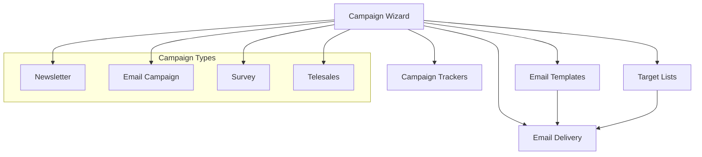
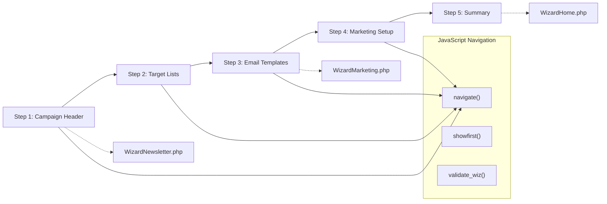
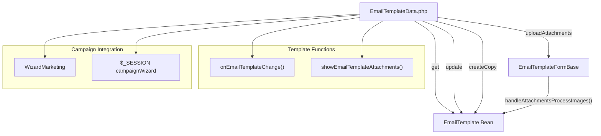
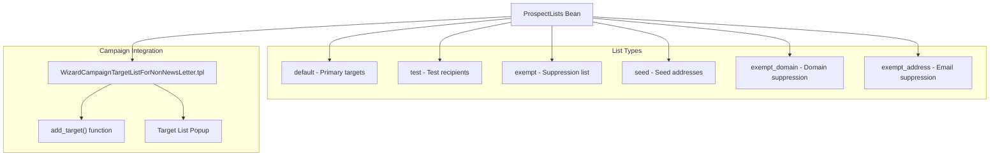
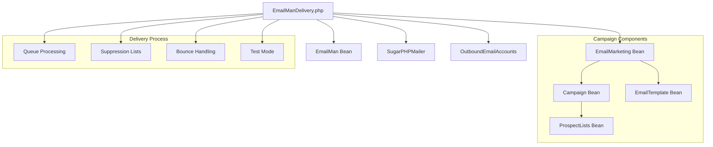
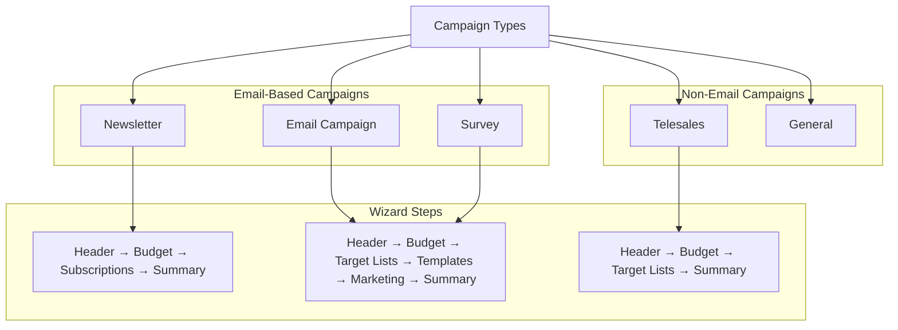

# Campaign Management

Relevant source files

The following files were used as context for generating this wiki page:

- [include/generic/SugarWidgets/SugarWidgetSubPanelTopCreateCampaignMarketingEmailButton.php](include/generic/SugarWidgets/SugarWidgetSubPanelTopCreateCampaignMarketingEmailButton.php)
- [jssource/src_files/modules/Campaigns/wizard.js](jssource/src_files/modules/Campaigns/wizard.js)
- [modules/Campaigns/DotListWizardMenu.php](modules/Campaigns/DotListWizardMenu.php)
- [modules/Campaigns/Subscriptions.html](modules/Campaigns/Subscriptions.html)
- [modules/Campaigns/Subscriptions.php](modules/Campaigns/Subscriptions.php)
- [modules/Campaigns/Subscriptions.tpl](modules/Campaigns/Subscriptions.tpl)
- [modules/Campaigns/WizardEmailSetup.html](modules/Campaigns/WizardEmailSetup.html)
- [modules/Campaigns/WizardHome.html](modules/Campaigns/WizardHome.html)
- [modules/Campaigns/WizardHome.php](modules/Campaigns/WizardHome.php)
- [modules/Campaigns/WizardMarketing.html](modules/Campaigns/WizardMarketing.html)
- [modules/Campaigns/WizardMarketing.php](modules/Campaigns/WizardMarketing.php)
- [modules/Campaigns/WizardNewsletter.html](modules/Campaigns/WizardNewsletter.html)
- [modules/Campaigns/WizardNewsletter.php](modules/Campaigns/WizardNewsletter.php)
- [modules/Campaigns/language/en_us.lang.php](modules/Campaigns/language/en_us.lang.php)
- [modules/Campaigns/metadata/listviewdefs.php](modules/Campaigns/metadata/listviewdefs.php)
- [modules/Campaigns/metadata/subpaneldefs.php](modules/Campaigns/metadata/subpaneldefs.php)
- [modules/Campaigns/tpls/WizardCampaignBudget.tpl](modules/Campaigns/tpls/WizardCampaignBudget.tpl)
- [modules/Campaigns/tpls/WizardCampaignHeader.tpl](modules/Campaigns/tpls/WizardCampaignHeader.tpl)
- [modules/Campaigns/tpls/WizardCampaignTargetList.tpl](modules/Campaigns/tpls/WizardCampaignTargetList.tpl)
- [modules/Campaigns/tpls/WizardCampaignTargetListForNonNewsLetter.tpl](modules/Campaigns/tpls/WizardCampaignTargetListForNonNewsLetter.tpl)
- [modules/Campaigns/tpls/WizardCampaignTracker.tpl](modules/Campaigns/tpls/WizardCampaignTracker.tpl)
- [modules/Campaigns/tpls/WizardHomeStart.tpl](modules/Campaigns/tpls/WizardHomeStart.tpl)
- [modules/Campaigns/tpls/WizardNewsletter.tpl](modules/Campaigns/tpls/WizardNewsletter.tpl)
- [modules/Campaigns/tpls/progressStepsStyle.html](modules/Campaigns/tpls/progressStepsStyle.html)
- [modules/Campaigns/wizard.js](modules/Campaigns/wizard.js)
- [modules/EmailMan/EmailManDelivery.php](modules/EmailMan/EmailManDelivery.php)
- [modules/EmailMarketing/List.php](modules/EmailMarketing/List.php)
- [modules/EmailTemplates/EmailTemplate.css](modules/EmailTemplates/EmailTemplate.css)
- [modules/EmailTemplates/EmailTemplateData.php](modules/EmailTemplates/EmailTemplateData.php)
- [modules/EmailTemplates/EmailTemplateFormBase.php](modules/EmailTemplates/EmailTemplateFormBase.php)

This document covers the Campaign Management system in SuiteCRM, which provides comprehensive tools for creating, managing, and executing marketing campaigns. The system includes a multi-step wizard interface, email template management, target list handling, and email delivery capabilities.

For information about the underlying email system infrastructure, see [Email System](#4.2). For user management and authentication details, see [User Management](#4.1).

## System Architecture Overview

The Campaign Management system is built around a wizard-based interface that guides users through campaign creation. The system supports multiple campaign types including newsletters, email campaigns, and surveys, with integrated email template management and target list handling.

**Sources:** [modules/Campaigns/WizardMarketing.php:1-600](), [modules/Campaigns/WizardNewsletter.php:1-600](), [modules/Campaigns/language/en_us.lang.php:45-470]()

## Campaign Wizard System

The campaign wizard provides a multi-step interface for campaign creation, implemented through several key components:

### Wizard Navigation and Flow

The wizard uses a step-based navigation system controlled by JavaScript functions and PHP backend processing:

### Core Wizard Classes and Functions

| Component | File | Key Functions |
|-----------|------|---------------|
| `DotListWizardMenu` | [modules/Campaigns/DotListWizardMenu.php]() | `getWizardMenuHTML()`, `getWizardMenuItemHTML()` |
| `navigate()` | [modules/Campaigns/wizard.js:134-248]() | Step navigation logic |
| `validate_wiz()` | [modules/Campaigns/wizard.js:365-402]() | Form validation |
| `campaignCreateAndRefreshPage()` | [modules/Campaigns/wizard.js:251-279]() | Campaign creation |

**Sources:** [modules/Campaigns/wizard.js:1-500](), [modules/Campaigns/DotListWizardMenu.php:1-58](), [modules/Campaigns/WizardMarketing.html:45-500]()

## Email Template Management

The system provides comprehensive email template management through the `EmailTemplateData.php` entry point and related classes:

### Template Operations

### Template Data Handling

The template system supports various operations through the `EmailTemplateData.php` entry point:

| Operation | Function | Description |
|-----------|----------|-------------|
| `get` | Default operation | Retrieves template data including attachments |
| `update` | Template modification | Updates existing template with new content |
| `createCopy` | Template duplication | Creates a copy of existing template |
| `uploadAttachments` | File handling | Manages template attachments |

**Sources:** [modules/EmailTemplates/EmailTemplateData.php:1-158](), [modules/EmailTemplates/EmailTemplateFormBase.php:1-600](), [modules/Campaigns/wizard.js:416-500]()

## Target List Management

Target lists are managed through the campaign wizard interface with support for different list types:

### Target List Types and Structure

### Target List JavaScript Functions

The target list management includes several JavaScript functions for dynamic list handling:

| Function | Location | Purpose |
|----------|----------|---------|
| `add_target()` | [modules/Campaigns/tpls/WizardCampaignTargetListForNonNewsLetter.tpl:222-280]() | Adds target lists to campaign |
| `addTargetListData()` | [modules/Campaigns/wizard.js:475-483]() | Handles target list selection |
| `set_return_prospect_list()` | Referenced in templates | Popup callback for list selection |

**Sources:** [modules/Campaigns/tpls/WizardCampaignTargetListForNonNewsLetter.tpl:1-400](), [modules/Campaigns/WizardNewsletter.php:420-470](), [modules/Campaigns/wizard.js:475-500]()

## Email Marketing and Delivery

The email delivery system is handled through the `EmailManDelivery.php` system with integration to campaign marketing records:

### Email Delivery Architecture

### Email Delivery Flow

The delivery system processes emails through several stages:

1. **Queue Selection**: Based on `send_date_time` and campaign criteria
2. **Validation**: Verifies campaign, marketing, and template records
3. **Suppression Processing**: Checks exempt lists and domains
4. **SMTP Configuration**: Uses campaign-specific or system SMTP settings
5. **Delivery Execution**: Sends emails with tracking and bounce handling

**Sources:** [modules/EmailMan/EmailManDelivery.php:1-300](), [modules/Campaigns/WizardMarketing.php:220-290]()

## Campaign Types and Wizard Variations

The system supports multiple campaign types with different wizard flows:

### Campaign Type Configuration

### Type-Specific Functionality

| Campaign Type | Key Features | Special Templates |
|---------------|--------------|------------------|
| Newsletter | Subscription management | [modules/Campaigns/tpls/WizardCampaignTargetList.tpl]() |
| Email | Multiple target lists | [modules/Campaigns/tpls/WizardCampaignTargetListForNonNewsLetter.tpl]() |
| Survey | Survey integration | Survey selection in header |
| Telesales | No email components | Simplified wizard flow |

**Sources:** [modules/Campaigns/WizardNewsletter.php:122-135](), [modules/Campaigns/language/en_us.lang.php:453-456](), [modules/Campaigns/tpls/WizardCampaignHeader.tpl:74-85]()

## Key Classes and Components

### Core Campaign Classes

| Class/Component | File | Primary Purpose |
|-----------------|------|-----------------|
| `Campaign` | Bean class | Core campaign entity |
| `EmailMarketing` | Bean class | Marketing message configuration |
| `EmailTemplate` | Bean class | Email template management |
| `ProspectLists` | Bean class | Target list management |
| `CampaignTrackers` | Bean class | URL tracking management |
| `EmailMan` | Bean class | Email queue management |

### Wizard Controllers and Actions

| Controller | File | Actions |
|------------|------|---------|
| `WizardNewsletter` | [modules/Campaigns/WizardNewsletter.php]() | Campaign header, budget, target lists |
| `WizardMarketing` | [modules/Campaigns/WizardMarketing.php]() | Email templates, marketing setup |
| `WizardHome` | [modules/Campaigns/WizardHome.php]() | Campaign summary and management |
| `EmailTemplateData` | [modules/EmailTemplates/EmailTemplateData.php]() | Template CRUD operations |

### JavaScript Navigation System

The wizard navigation is controlled by JavaScript functions that manage step transitions, validation, and form submission:

| Function | Purpose | Key Logic |
|----------|---------|-----------|
| `navigate()` | Step navigation | Validates current step, updates UI |
| `showfirst()` | Initial wizard setup | Shows first step, configures buttons |
| `validate_wiz()` | Step validation | Calls custom validation functions |
| `onEmailTemplateChange()` | Template selection | Loads template data via AJAX |

**Sources:** [modules/Campaigns/wizard.js:1-500](), [modules/Campaigns/WizardMarketing.php:1-600](), [modules/Campaigns/WizardNewsletter.php:1-600](), [modules/Campaigns/WizardHome.php:1-400]()