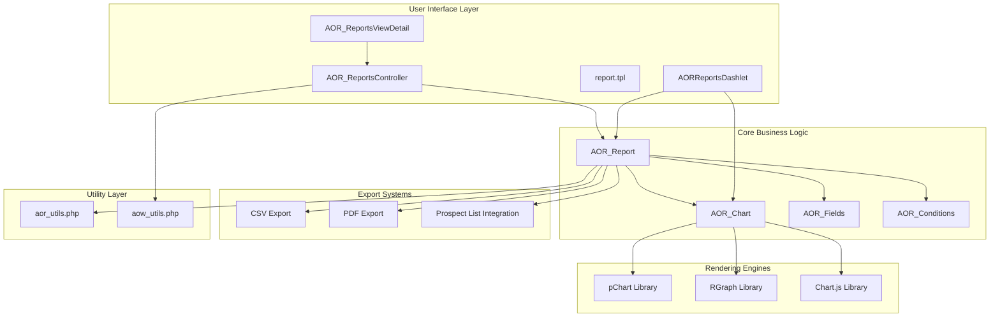
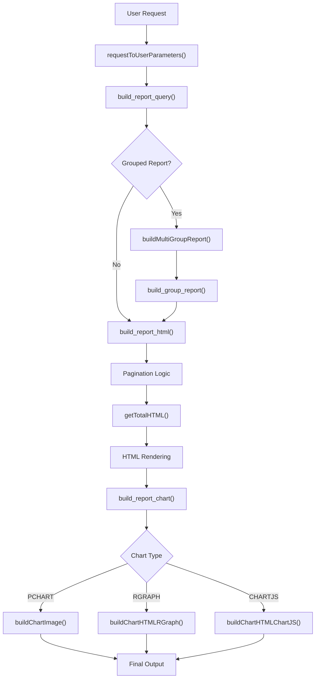
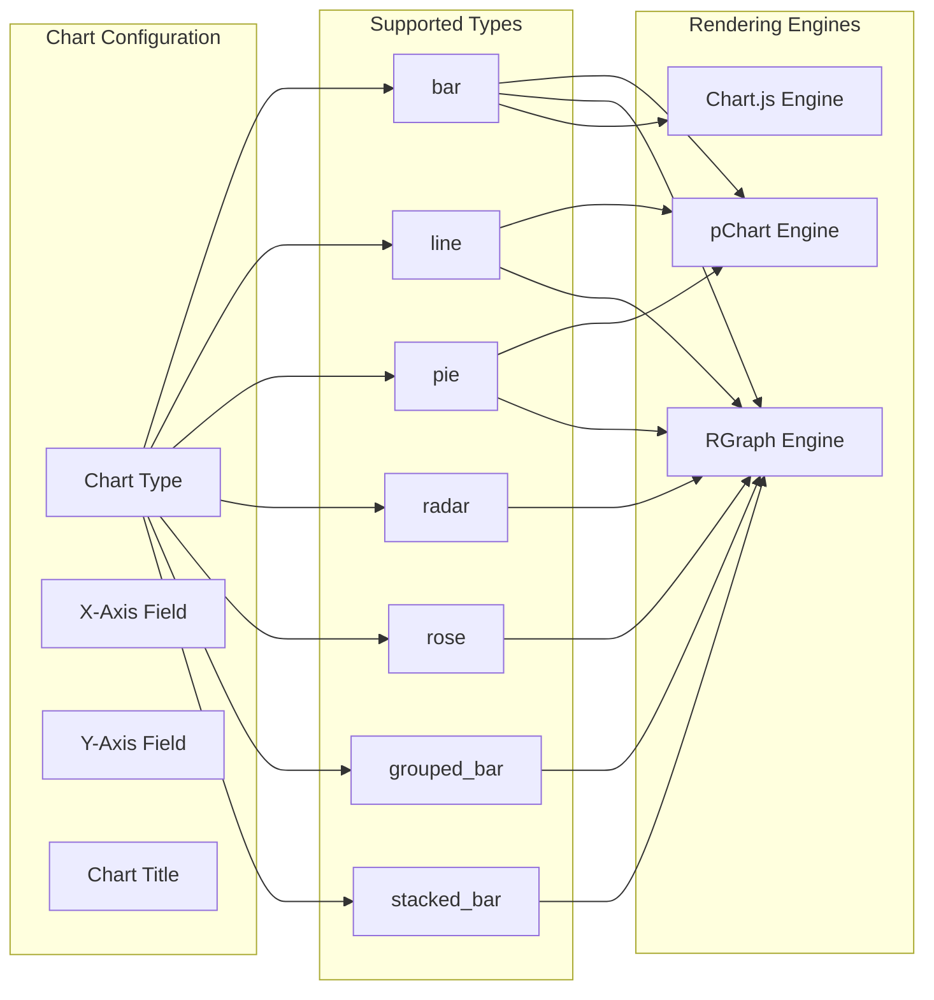
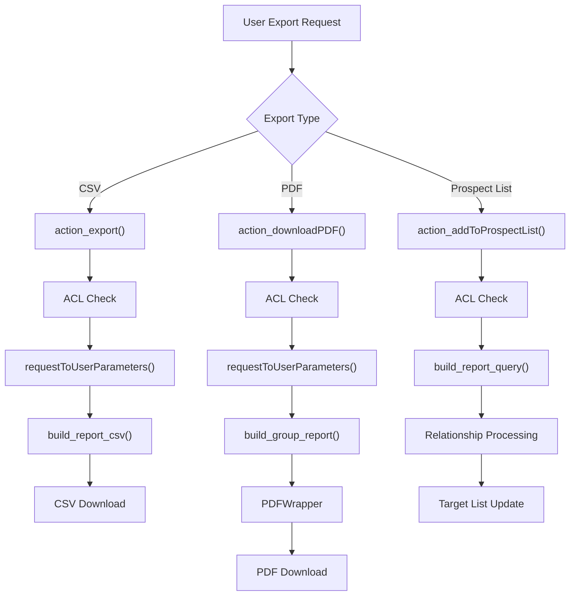
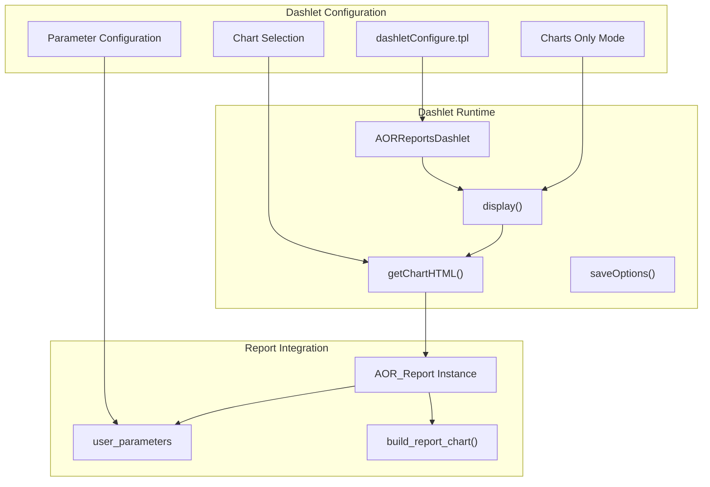
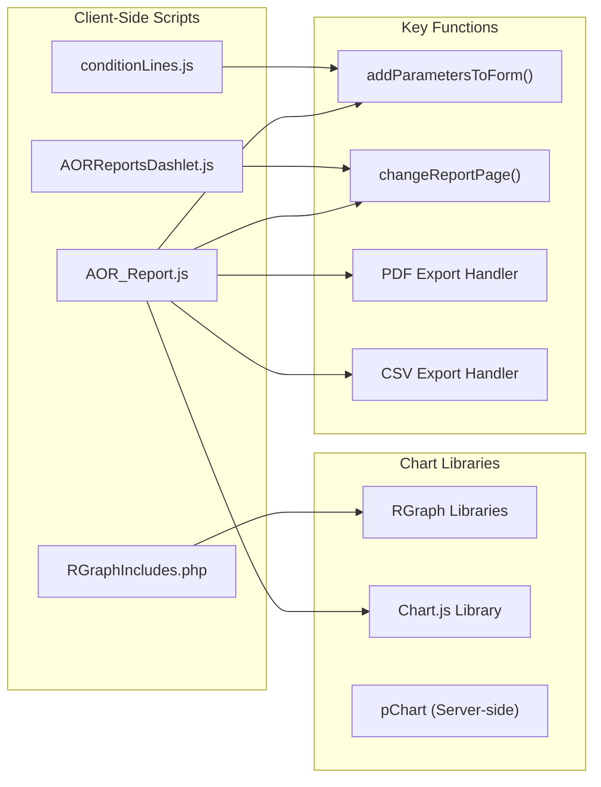
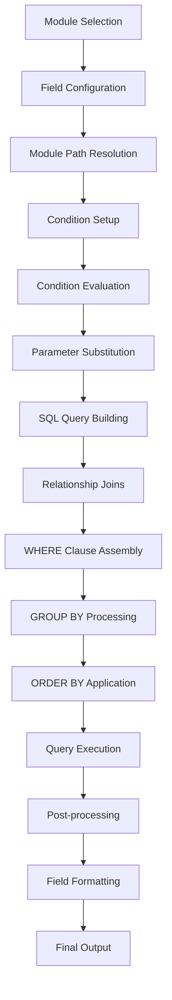

# Reports and Analytics

<details>
<summary>Relevant source files</summary>

The following files were used as context for generating this wiki page:

- [include/SuiteGraphs/RGraphIncludes.php](include/SuiteGraphs/RGraphIncludes.php)
- [modules/AOR_Charts/AOR_Chart.php](modules/AOR_Charts/AOR_Chart.php)
- [modules/AOR_Reports/AOR_Report.js](modules/AOR_Reports/AOR_Report.js)
- [modules/AOR_Reports/AOR_Report.php](modules/AOR_Reports/AOR_Report.php)
- [modules/AOR_Reports/Dashlets/AORReportsDashlet/AORReportsDashlet.js](modules/AOR_Reports/Dashlets/AORReportsDashlet/AORReportsDashlet.js)
- [modules/AOR_Reports/Dashlets/AORReportsDashlet/AORReportsDashlet.php](modules/AOR_Reports/Dashlets/AORReportsDashlet/AORReportsDashlet.php)
- [modules/AOR_Reports/Dashlets/AORReportsDashlet/dashlet.tpl](modules/AOR_Reports/Dashlets/AORReportsDashlet/dashlet.tpl)
- [modules/AOR_Reports/Dashlets/AORReportsDashlet/dashletConfigure.tpl](modules/AOR_Reports/Dashlets/AORReportsDashlet/dashletConfigure.tpl)
- [modules/AOR_Reports/Menu.php](modules/AOR_Reports/Menu.php)
- [modules/AOR_Reports/aor_utils.php](modules/AOR_Reports/aor_utils.php)
- [modules/AOR_Reports/controller.php](modules/AOR_Reports/controller.php)
- [modules/AOR_Reports/language/en_us.lang.php](modules/AOR_Reports/language/en_us.lang.php)
- [modules/AOR_Reports/metadata/detailviewdefs.php](modules/AOR_Reports/metadata/detailviewdefs.php)
- [modules/AOR_Reports/tpls/report.tpl](modules/AOR_Reports/tpls/report.tpl)
- [modules/AOR_Reports/vardefs.php](modules/AOR_Reports/vardefs.php)
- [modules/AOR_Reports/views/view.detail.php](modules/AOR_Reports/views/view.detail.php)
- [modules/AOW_WorkFlow/aow_utils.php](modules/AOW_WorkFlow/aow_utils.php)

</details>


This document covers the Advanced OpenReports (AOR) system in SuiteCRM, which provides comprehensive reporting and data visualization capabilities. The system allows users to create custom reports from any module data, apply filtering conditions, generate various chart types, and export results in multiple formats.

For general search functionality, see page [5.3](#5.3). For campaign management and email analytics, see page [4.3](#4.3).

## System Architecture

The Reports and Analytics system is built around several core modules that work together to provide end-to-end reporting functionality.



**System Architecture Overview**

Sources: [modules/AOR_Reports/AOR_Report.php:1-80](), [modules/AOR_Reports/controller.php:1-50](), [modules/AOR_Charts/AOR_Chart.php:1-60]()

## Core Entities

### AOR_Report Class

The `AOR_Report` class serves as the primary entity for report definitions and execution.

```mermaid
classDiagram
    class AOR_Report {
        +string report_module
        +int graphs_per_row
        +array user_parameters
        +save()
        +build_report_html()
        +build_group_report()
        +build_report_chart()
        +build_report_csv()
        +getReportFields()
        +ACLAccess()
    }
    
    class AOR_Chart {
        +string type
        +string x_field
        +string y_field
        +string name
        +buildChartHTML()
        +buildChartImage()
        +save_lines()
    }
    
    class AOR_Fields {
        +string field
        +string label
        +string field_function
        +boolean display
        +boolean group_display
        +int field_order
    }
    
    class AOR_Conditions {
        +string field
        +string operator
        +string value_type
        +string value
        +boolean parameter
        +int condition_order
    }
    
    AOR_Report ||--o{ AOR_Fields : "has many"
    AOR_Report ||--o{ AOR_Conditions : "has many"
    AOR_Report ||--o{ AOR_Chart : "has many"
```

**Core Entity Relationships**

Sources: [modules/AOR_Reports/AOR_Report.php:48-80](), [modules/AOR_Charts/AOR_Chart.php:26-65](), [modules/AOR_Reports/vardefs.php:122-150]()

## Report Generation Process

The report generation system follows a multi-stage process to transform database queries into formatted output.



**Report Generation Flow**

The core report generation process begins with parameter processing through `requestToUserParameters()` [modules/AOR_Reports/aor_utils.php:96-173](), followed by query building and HTML rendering via `build_report_html()` [modules/AOR_Reports/AOR_Report.php:624-875]().

Sources: [modules/AOR_Reports/AOR_Report.php:302-361](), [modules/AOR_Reports/aor_utils.php:96-173](), [modules/AOR_Reports/views/view.detail.php:75-85]()

## Chart System

The system supports multiple chart rendering engines and various visualization types.

### Chart Types and Rendering



**Chart Type Support Matrix**

Chart rendering is handled by the `buildChartHTML()` method [modules/AOR_Charts/AOR_Chart.php:232-243]() which delegates to specific engines based on the `chartType` parameter.

Sources: [modules/AOR_Charts/AOR_Chart.php:93-96](), [modules/AOR_Charts/AOR_Chart.php:181-184](), [modules/AOR_Charts/AOR_Chart.php:266-351]()

## Export Functionality

### Export Actions and Controllers



**Export Process Flow**

The export system provides three main output formats controlled by dedicated controller actions. CSV export uses `build_report_csv()` while PDF export leverages the `PDFWrapper` class for document generation.

Sources: [modules/AOR_Reports/controller.php:175-186](), [modules/AOR_Reports/controller.php:192-272](), [modules/AOR_Reports/controller.php:133-166]()

## Dashboard Integration

### AORReportsDashlet Architecture

The dashlet system allows reports to be embedded in user dashboards with configurable parameters and chart display options.



**Dashlet Integration Architecture**

The `AORReportsDashlet` class [modules/AOR_Reports/Dashlets/AORReportsDashlet/AORReportsDashlet.php:11-169]() manages report embedding with configurable parameters and chart filtering capabilities.

Sources: [modules/AOR_Reports/Dashlets/AORReportsDashlet/AORReportsDashlet.php:18-50](), [modules/AOR_Reports/Dashlets/AORReportsDashlet/AORReportsDashlet.php:73-81](), [modules/AOR_Reports/Dashlets/AORReportsDashlet/dashletConfigure.tpl:1-200]()

## User Interface Components

### Report Display Template System

| Component | Template File | JavaScript Controller | Purpose |
|-----------|---------------|----------------------|---------|
| Main Report View | `report.tpl` | `AOR_Report.js` | Primary report display |
| Parameter Panel | Embedded in `report.tpl` | `conditionLines.js` | Dynamic filtering |
| Pagination | Generated in `build_report_html()` | `changeReportPage()` | Result navigation |
| Chart Container | Dynamic HTML | RGraph/Chart.js | Visualization display |

The main report interface uses `report.tpl` [modules/AOR_Reports/tpls/report.tpl:1-117]() which integrates parameter controls, chart rendering areas, and tabular data display.

### JavaScript Integration



**JavaScript Architecture**

The client-side functionality centers around parameter management through `addParametersToForm()` [modules/AOR_Reports/AOR_Report.js:117-128]() and dynamic report updates via `changeReportPage()` [modules/AOR_Reports/AOR_Report.js:164-200]().

Sources: [modules/AOR_Reports/AOR_Report.js:24-53](), [modules/AOR_Reports/tpls/report.tpl:69-96](), [include/SuiteGraphs/RGraphIncludes.php:1-181]()

## Data Processing Pipeline

### Field and Condition Processing

The system processes report definitions through a sophisticated pipeline that handles field selection, condition evaluation, and data aggregation.



**Data Processing Pipeline**

Field processing utilizes `getModuleFields()` [modules/AOW_WorkFlow/aow_utils.php:45-126]() for dynamic field discovery, while condition evaluation leverages `getConditionsAsParameters()` [modules/AOR_Reports/aor_utils.php:175-222]() for parameter-based filtering.

Sources: [modules/AOR_Reports/AOR_Report.php:168-179](), [modules/AOW_WorkFlow/aow_utils.php:149-170](), [modules/AOR_Reports/aor_utils.php:51-94]()