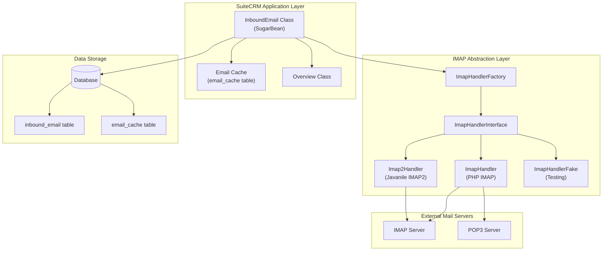
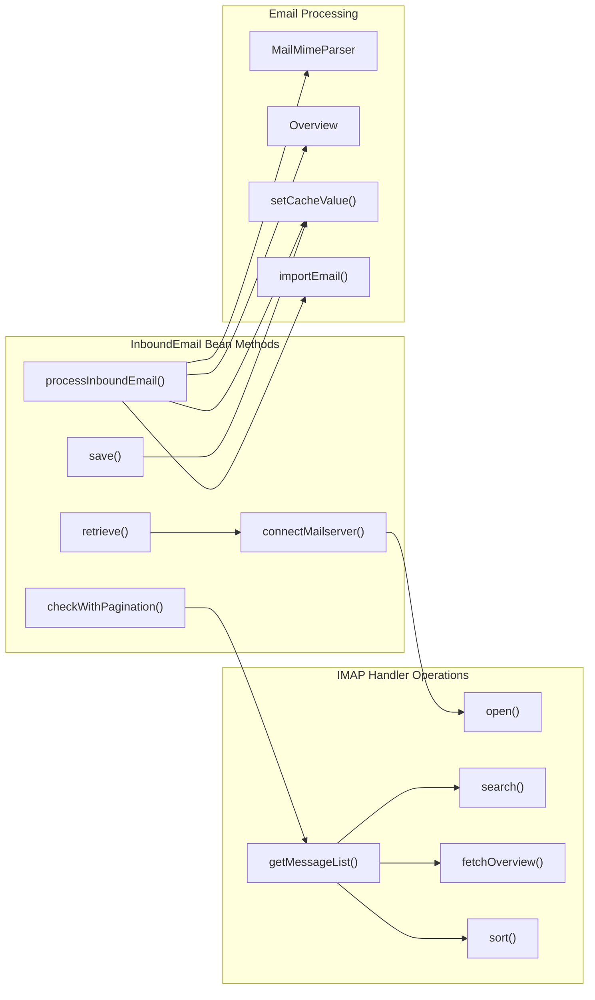
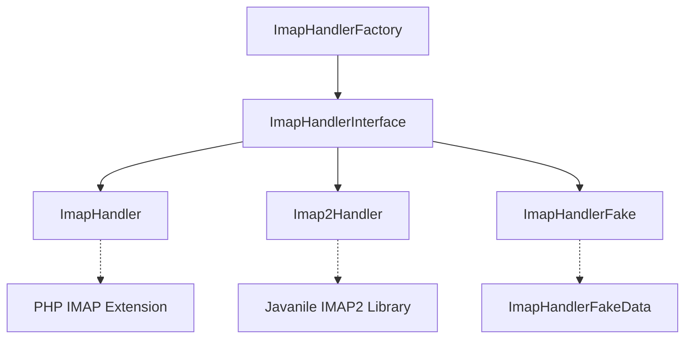
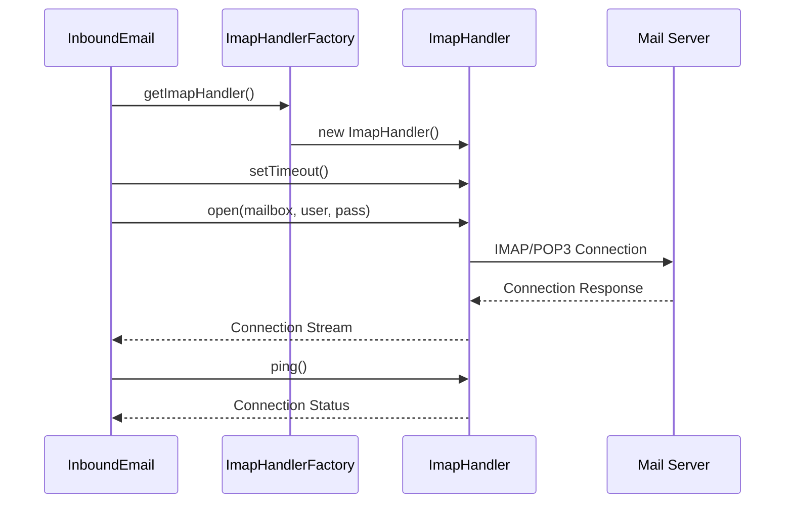
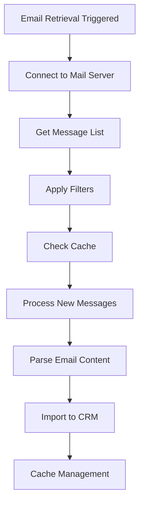

# Inbound Email Processing

<details>
<summary>Relevant source files</summary>

The following files were used as context for generating this wiki page:

- [include/Imap/Imap2Handler.php](include/Imap/Imap2Handler.php)
- [include/Imap/ImapHandler.php](include/Imap/ImapHandler.php)
- [include/Imap/ImapHandlerException.php](include/Imap/ImapHandlerException.php)
- [include/Imap/ImapHandlerFactory.php](include/Imap/ImapHandlerFactory.php)
- [include/Imap/ImapHandlerFake.php](include/Imap/ImapHandlerFake.php)
- [include/Imap/ImapHandlerFakeCalls.php](include/Imap/ImapHandlerFakeCalls.php)
- [include/Imap/ImapHandlerFakeData.php](include/Imap/ImapHandlerFakeData.php)
- [include/Imap/ImapHandlerInterface.php](include/Imap/ImapHandlerInterface.php)
- [include/Imap/ImapTestSettingsEntry.php](include/Imap/ImapTestSettingsEntry.php)
- [include/Imap/ImapTestSettingsEntryHandler.php](include/Imap/ImapTestSettingsEntryHandler.php)
- [modules/InboundEmail/InboundEmail.php](modules/InboundEmail/InboundEmail.php)
- [tests/SuiteCRM/Test/BeanFactoryTestCase.php](tests/SuiteCRM/Test/BeanFactoryTestCase.php)
- [tests/_support/Step/Acceptance/NavigationBarTester.php](tests/_support/Step/Acceptance/NavigationBarTester.php)
- [tests/unit/phpunit/data/BeanFactoryTest.php](tests/unit/phpunit/data/BeanFactoryTest.php)

</details>


## Purpose and Scope

The Inbound Email Processing system handles the retrieval, synchronization, and processing of emails from external mail servers (IMAP/POP3) into SuiteCRM. This system enables users to configure email accounts, automatically import emails, create cases from incoming messages, and manage email data within the CRM.

For information about outbound email sending, see [Email System](#4.2). For campaign email management, see [Campaign Management](#4.3).

## System Architecture

The inbound email system is built around the `InboundEmail` SugarBean class and uses an abstracted IMAP handler system for mail server communication.

### Core Architecture Overview



Sources: [modules/InboundEmail/InboundEmail.php:54-185](), [include/Imap/ImapHandlerFactory.php:56-266](), [include/Imap/ImapHandlerInterface.php:51-387]()

### Class Relationships and Data Flow



Sources: [modules/InboundEmail/InboundEmail.php:379-425](), [include/Imap/ImapHandler.php:910-1020](), [modules/InboundEmail/InboundEmail.php:647-681]()

## Core Components

### InboundEmail Class

The `InboundEmail` class extends `SugarBean` and serves as the primary entity for managing email account configurations and operations.

| Property | Type | Purpose |
|----------|------|---------|
| `server_url` | string | Mail server hostname |
| `email_user` | string | Authentication username |
| `email_password` | string | Encrypted password |
| `port` | int | Server port number |
| `service` | string | Protocol (imap/pop3) |
| `mailbox` | string | Mailbox paths |
| `auth_type` | string | Authentication method (basic/oauth) |
| `is_personal` | bool | Personal vs group account |

Key methods include:

- `connectMailserver()` - Establishes mail server connection
- `checkWithPagination()` - Retrieves paginated email lists
- `processInboundEmail()` - Processes individual emails
- `setCacheValue()` - Manages email cache

Sources: [modules/InboundEmail/InboundEmail.php:61-304](), [modules/InboundEmail/InboundEmail.php:647-681]()

### IMAP Handler System

The system uses a factory pattern to provide different IMAP implementations:



The `ImapHandlerFactory` selects the appropriate handler based on configuration:

- **ImapHandler** - Uses PHP's built-in IMAP extension
- **Imap2Handler** - Uses Javanile IMAP2 library as alternative
- **ImapHandlerFake** - Provides test doubles for unit testing

Sources: [include/Imap/ImapHandlerFactory.php:197-223](), [include/Imap/ImapHandler.php:55-1051](), [include/Imap/Imap2Handler.php:58-923]()

## Email Retrieval and Processing

### Connection Process

The email connection process follows this sequence:



Sources: [modules/InboundEmail/InboundEmail.php:345-370](), [include/Imap/ImapHandler.php:279-304]()

### Message List Retrieval

The `checkWithPagination()` method provides efficient email listing with filtering and sorting:

```php
public function checkWithPagination(
    $offset = 0,
    $pageSize = 20,
    $order = array(),
    $filter = array(),
    $columns = array()
)
```

This method:
1. Establishes server connection via `connectMailserver()`
2. Processes sort and filter criteria
3. Delegates to `ImapHandler::getMessageList()`
4. Returns paginated email headers with mailbox info

Sources: [modules/InboundEmail/InboundEmail.php:647-681](), [include/Imap/ImapHandler.php:910-1020]()

### Caching System

The system maintains an email cache in the `email_cache` table for performance:

| Cache Operations | Method | Purpose |
|------------------|--------|---------|
| Store headers | `setCacheValue()` | Cache email metadata |
| Retrieve cached data | `getCacheValue()` | Get cached email list |
| Check timestamp | `getCacheTimestamp()` | Validate cache freshness |
| Clear cache | `deleteCache()` | Remove stale data |

The cache stores email overview data including:
- Message UIDs and IDs
- Subject, sender, recipient
- Date and size information
- Read/unread status

Sources: [modules/InboundEmail/InboundEmail.php:1189-1362](), [modules/InboundEmail/InboundEmail.php:975-982]()

## Authentication and Security

### Authentication Types

The system supports multiple authentication methods:

**Basic Authentication:**
- Username/password stored encrypted using `blowfishEncode()`
- Password decrypted on retrieval via `blowfishDecode()`

**OAuth Authentication:**
- Uses `external_oauth_connection_id` for OAuth providers
- Clears password field when OAuth is selected

### Access Control

Personal email accounts have restricted access:
- Only account owner or admin can access personal accounts
- `hasAccessToPersonalAccount()` method enforces security
- Access denied events are logged via `logPersonalAccountAccessDenied()`

Sources: [modules/InboundEmail/InboundEmail.php:400-425](), [modules/InboundEmail/InboundEmail.php:431-462](), [modules/InboundEmail/InboundEmail.php:467-501]()

## Email Processing Workflow

### Message Import Process



The system processes emails through several stages:

1. **Connection**: Establish secure connection to mail server
2. **Retrieval**: Get message list with pagination and filtering
3. **Caching**: Store/retrieve email metadata for performance
4. **Processing**: Parse email content using `MailMimeParser`
5. **Import**: Create Email records and related CRM data
6. **Cleanup**: Manage cache and optionally move messages

### Message Structure Handling

The system can detect and process email attachments:

```php
public function messageStructureHasAttachment($imapStructure)
```

This method analyzes IMAP message structure to identify:
- Multipart messages with attachments
- Message types and encoding
- Disposition parameters for file attachments

Sources: [modules/InboundEmail/InboundEmail.php:687-714](), [include/Imap/ImapHandler.php:1026-1050]()

## Configuration and Administration

### Required Configuration Fields

The `InboundEmail` entity requires these essential fields:

```php
public $required_fields = [
    'name' => 'name',
    'server_url' => 'server_url', 
    'mailbox' => 'mailbox',
    'user' => 'user',
    'port' => 'port',
];
```

### Mailbox Management

The system supports multiple mailbox folders:
- Comma-separated mailbox paths in `mailbox` field
- Automatic folder hierarchy generation
- Support for IMAP folder operations (create, rename, delete)

### Job Scheduling

Automated email processing is handled via the scheduler:
- Job name: `function::pollMonitoredInboxes`
- Processes all configured inbound email accounts
- Configurable polling intervals

Sources: [modules/InboundEmail/InboundEmail.php:143-149](), [modules/InboundEmail/InboundEmail.php:168](), [modules/InboundEmail/InboundEmail.php:589-621]()