# Administration & Configuration

Relevant source files

The following files were used as context for generating this wiki page:

- [include/Smarty/plugins/function.diff_for_humans.php](include/Smarty/plugins/function.diff_for_humans.php)
- [include/language/getJSLanguage.php](include/language/getJSLanguage.php)
- [install.php](install.php)
- [install/dbConfig_a.php](install/dbConfig_a.php)
- [install/install.css](install/install.css)
- [install/install2.css](install/install2.css)
- [install/installConfig.php](install/installConfig.php)
- [install/installDisabled.php](install/installDisabled.php)
- [install/installType.php](install/installType.php)
- [install/install_utils.php](install/install_utils.php)
- [install/language/en_us.lang.php](install/language/en_us.lang.php)
- [install/license.php](install/license.php)
- [install/old_php.js](install/old_php.js)
- [install/old_php.php](install/old_php.php)
- [install/performSetup.php](install/performSetup.php)
- [install/ready.css](install/ready.css)
- [install/ready.php](install/ready.php)
- [install/siteConfig_a.php](install/siteConfig_a.php)
- [install/siteConfig_b.php](install/siteConfig_b.php)
- [install/suite_install/enabledTabs.php](install/suite_install/enabledTabs.php)
- [install/suite_install/scenarios.php](install/suite_install/scenarios.php)
- [install/welcome.php](install/welcome.php)
- [lib/Search/Index/IndexingSchedulerTrait.php](lib/Search/Index/IndexingSchedulerTrait.php)
- [lib/Search/UI/SearchThrowableHandler.php](lib/Search/UI/SearchThrowableHandler.php)
- [modules/Administration/ElasticSearchSettings.php](modules/Administration/ElasticSearchSettings.php)
- [modules/Administration/Search/ElasticSearch/Controller.php](modules/Administration/Search/ElasticSearch/Controller.php)
- [modules/Administration/Search/ElasticSearch/View.php](modules/Administration/Search/ElasticSearch/View.php)
- [modules/Administration/Search/ElasticSearch/scripts.js](modules/Administration/Search/ElasticSearch/scripts.js)
- [modules/Administration/Search/ElasticSearch/view.tpl](modules/Administration/Search/ElasticSearch/view.tpl)
- [modules/Administration/Search/MVC/Controller.php](modules/Administration/Search/MVC/Controller.php)
- [modules/Administration/UpgradeAccess.php](modules/Administration/UpgradeAccess.php)
- [modules/Administration/language/en_us.lang.php](modules/Administration/language/en_us.lang.php)
- [modules/Administration/metadata/adminpaneldefs.php](modules/Administration/metadata/adminpaneldefs.php)
- [modules/Home/Search.php](modules/Home/Search.php)
- [modules/Home/language/en_us.lang.php](modules/Home/language/en_us.lang.php)
- [modules/Import/views/ImportView.php](modules/Import/views/ImportView.php)
- [modules/OAuth2Clients/Menu.php](modules/OAuth2Clients/Menu.php)
- [modules/OAuth2Tokens/Menu.php](modules/OAuth2Tokens/Menu.php)
- [modules/Schedulers/Scheduler.php](modules/Schedulers/Scheduler.php)
- [modules/Schedulers/_AddJobsHere.php](modules/Schedulers/_AddJobsHere.php)
- [modules/Schedulers/language/en_us.lang.php](modules/Schedulers/language/en_us.lang.php)
- [modules/Studio/parsers/StudioParser.php](modules/Studio/parsers/StudioParser.php)

This document covers SuiteCRM's administration and configuration systems, including installation, system settings management, background job scheduling, and administrative interfaces. The administration system provides centralized control over system-wide settings, user management, module configuration, and maintenance tasks.

For information about specific business modules and their configuration, see other module-specific documentation. For API-level configuration, see [API Architecture](#6.2).

## Installation System

The SuiteCRM installation system provides a web-based wizard for initial system setup, database configuration, and basic system settings.

### Installation Entry Point and Flow

The installation process begins with `install.php`, which serves as the main entry point and orchestrates the multi-step installation wizard.

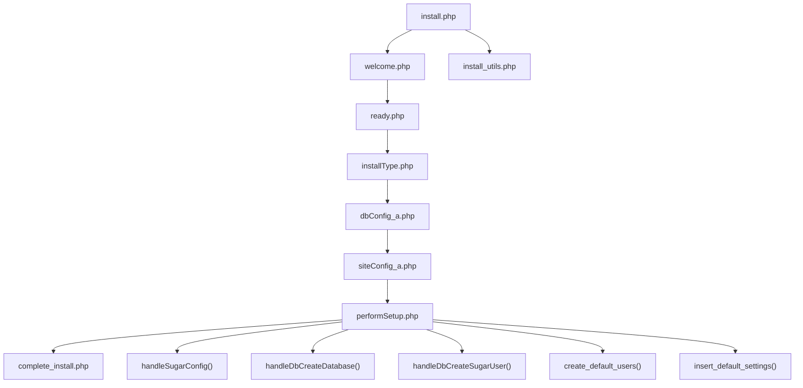

**Installation System Architecture**

Sources: [install.php:1-900](), [install/welcome.php:1-400](), [install/performSetup.php:1-600]()

### Database Configuration and Setup

The installation system supports multiple database types and handles database creation, user setup, and initial data population.

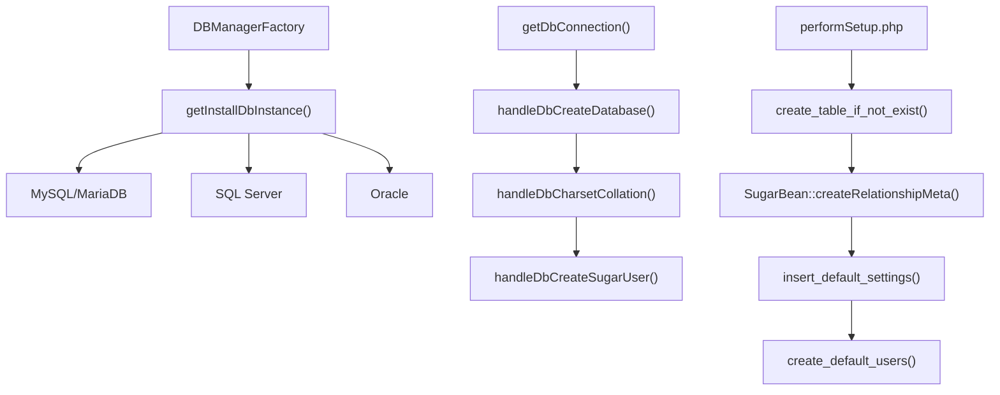

**Database Setup Process**

The `performSetup.php` file coordinates database creation and initial data setup through several key functions:

- `handleDbCreateDatabase()` - Creates the main database
- `handleDbCharsetCollation()` - Sets UTF-8 charset and collation
- `handleDbCreateSugarUser()` - Creates application database user
- `create_table_if_not_exist()` - Creates all module tables

Sources: [install/performSetup.php:175-350](), [install/install_utils.php:594-700]()

### Configuration File Generation

The installation process generates the main `config.php` file and other configuration files needed for system operation.

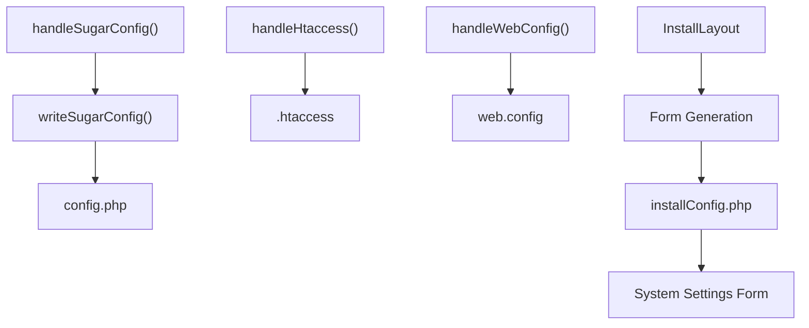

**Configuration Generation Components**

Sources: [install/performSetup.php:155-170](), [install/install_utils.php:461-472](), [install/installConfig.php:90-250]()

## Administration Panel

The administration panel provides a centralized interface for managing all system settings, organized into logical groups for different administrative functions.

### Admin Panel Structure

The administration panel is defined through `adminpaneldefs.php`, which organizes administrative functions into groups.

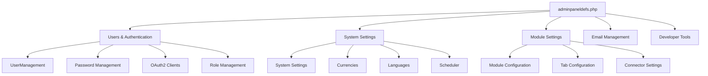

**Administration Panel Organization**

The admin panel groups are defined in `$admin_group_header` arrays, with each group containing multiple administrative options.

Sources: [modules/Administration/metadata/adminpaneldefs.php:44-98](), [modules/Administration/metadata/adminpaneldefs.php:100-167]()

### System Configuration Management

The `Configurator` module handles system-wide settings through a centralized configuration interface.

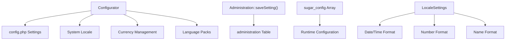

**Configuration Storage and Management**

System settings are stored in two primary locations:
- `config.php` file for core system settings
- `administration` database table for dynamic settings

Sources: [modules/Administration/metadata/adminpaneldefs.php:102-108](), [install/installConfig.php:50-88]()

## Scheduler System

The scheduler system manages background jobs and automated tasks through the `Schedulers` module, providing cron-like functionality for maintenance and processing tasks.

### Scheduler Architecture

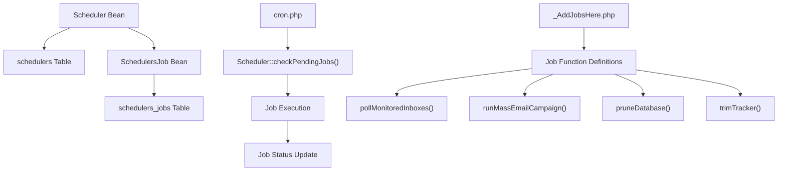

**Scheduler Job Management System**

The scheduler system consists of several key components:
- `Scheduler` bean for job definitions
- `SchedulersJob` bean for job execution tracking  
- Job function definitions in `_AddJobsHere.php`
- Cron-based execution through `cron.php`

Sources: [modules/Schedulers/Scheduler.php:48-99](), [modules/Schedulers/_AddJobsHere.php:69-87]()

### Built-in Scheduler Jobs

SuiteCRM includes several out-of-the-box scheduler jobs for system maintenance and processing.

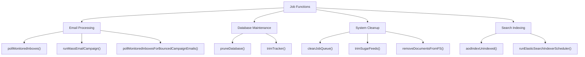

**Scheduler Job Types and Functions**

Key scheduler jobs include:
- Email processing (`pollMonitoredInboxes`, `runMassEmailCampaign`)
- Database maintenance (`pruneDatabase`, `trimTracker`)
- System cleanup (`cleanJobQueue`, `trimSugarFeeds`)
- Search indexing (`aodIndexUnindexed`, `runElasticSearchIndexerScheduler`)

Sources: [modules/Schedulers/_AddJobsHere.php:102-268](), [modules/Schedulers/_AddJobsHere.php:272-295](), [modules/Schedulers/_AddJobsHere.php:298-361]()

### Scheduler Job Execution

The scheduler execution system handles job queuing, execution, and status tracking.

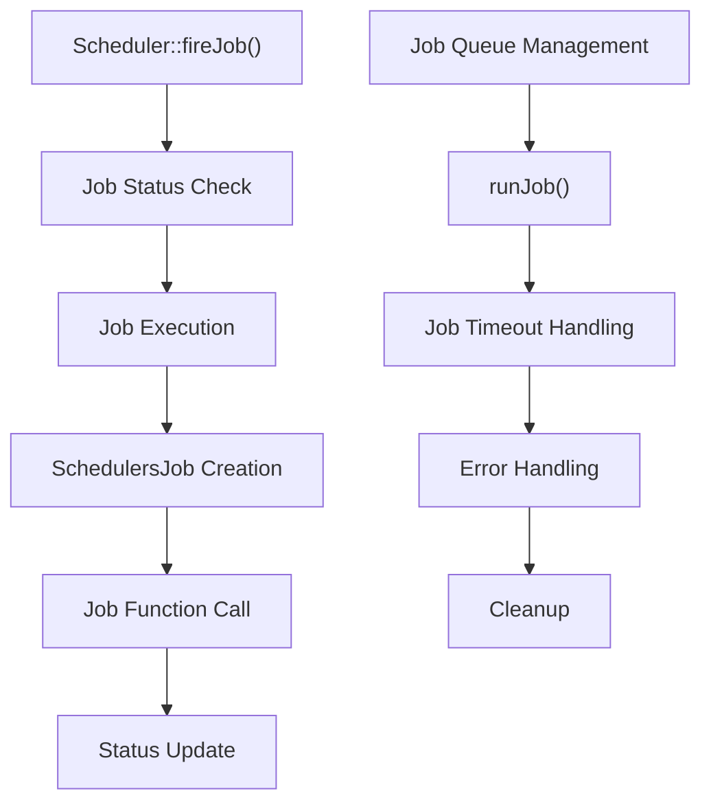

**Job Execution Flow**

Sources: [modules/Schedulers/Scheduler.php:400-500](), [modules/Schedulers/language/en_us.lang.php:46-61]()

## Search Configuration

SuiteCRM provides configurable search capabilities including traditional database search and ElasticSearch integration.

### ElasticSearch Configuration

The ElasticSearch integration provides advanced full-text search capabilities with configurable indexing and search options.

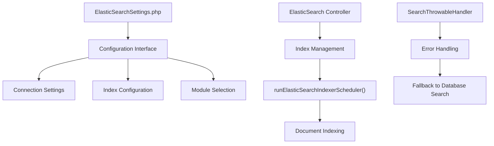

**ElasticSearch Integration Architecture**

The ElasticSearch system includes:
- Configuration interface through `ElasticSearchSettings.php`
- Scheduler-based indexing through `runElasticSearchIndexerScheduler()`
- Error handling and fallback mechanisms
- Module-specific indexing configuration

Sources: [modules/Administration/ElasticSearchSettings.php:1-100](), [modules/Administration/Search/ElasticSearch/Controller.php:1-200](), [lib/Search/UI/SearchThrowableHandler.php:1-200]()

### Search System Components

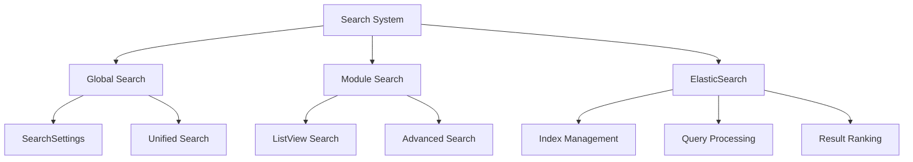

**Search Configuration Options**

Sources: [modules/Administration/metadata/adminpaneldefs.php:137-150](), [modules/Administration/Search/MVC/Controller.php:1-100]()

## Module and Extension Management

The administration system provides tools for managing modules, language packs, and system extensions.

### Module Installation System

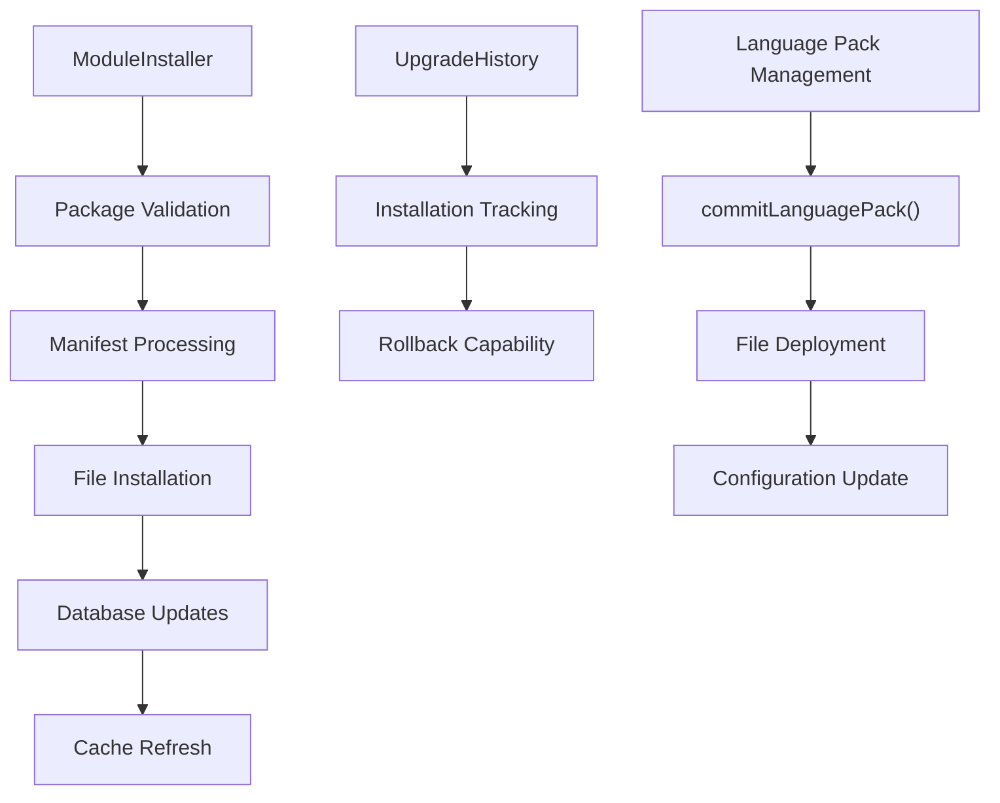

**Module Management Components**

The module management system handles:
- Package validation and installation
- Language pack deployment
- Upgrade history tracking
- System cache management

Sources: [install/install_utils.php:113-245](), [install/install_utils.php:316-390](), [modules/Administration/UpgradeAccess.php:45-84]()

### System Maintenance Tools

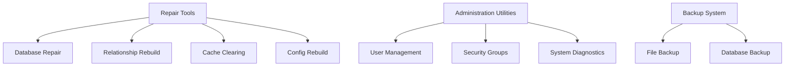

**System Maintenance Architecture**

Sources: [modules/Administration/language/en_us.lang.php:434-506](), [modules/Administration/metadata/adminpaneldefs.php:170-235]()

## Configuration Data Flow

The administration system manages configuration data through multiple storage mechanisms and access patterns.

### Configuration Storage Architecture

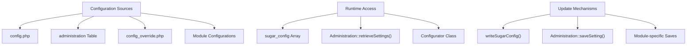

**Configuration Data Management**

Configuration data flows through several layers:
- File-based configuration (`config.php`, `config_override.php`)
- Database-stored settings (`administration` table)
- Runtime configuration (`sugar_config` global array)
- Module-specific configuration files

Sources: [install/install_utils.php:461-472](), [modules/Administration/metadata/adminpaneldefs.php:44-250]()

### Administrative Interface Integration

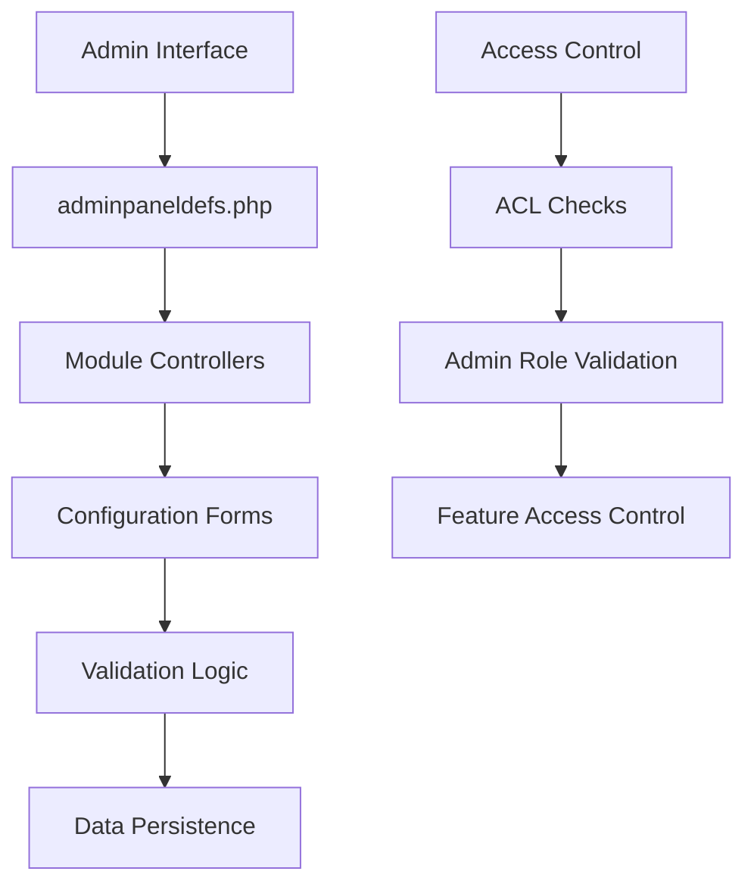

**Administrative Interface Flow**

The administrative interface coordinates:
- Panel definition and organization
- Form generation and validation
- Access control and security
- Configuration persistence

Sources: [modules/Administration/metadata/adminpaneldefs.php:1-350](), [install/installConfig.php:91-200]()