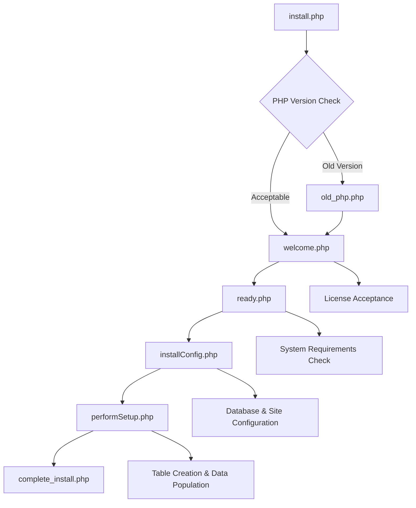
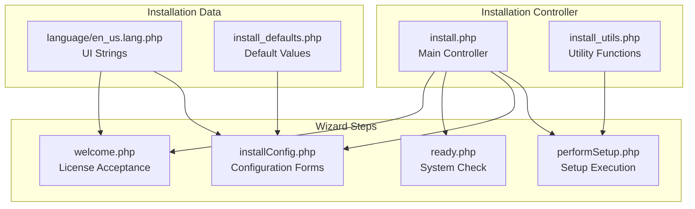
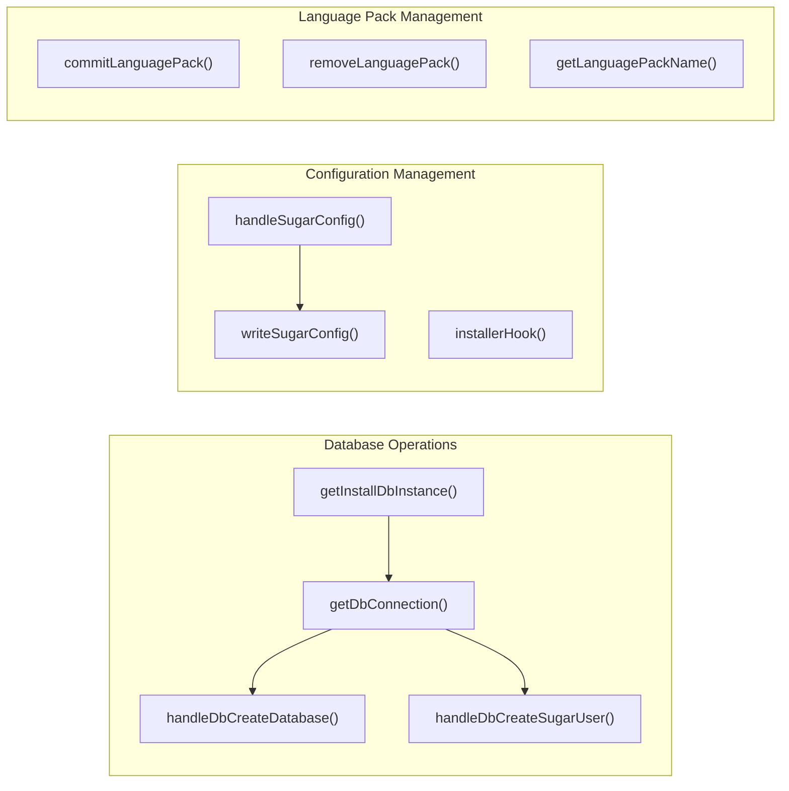
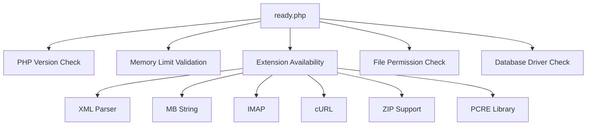
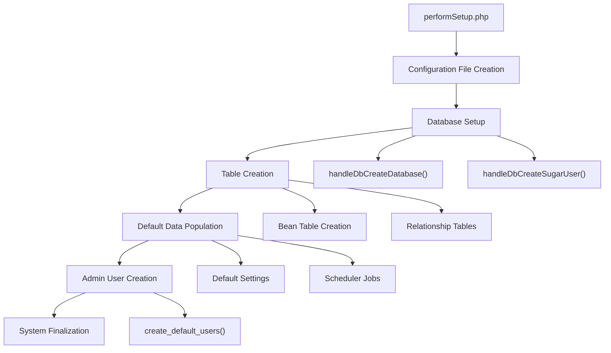
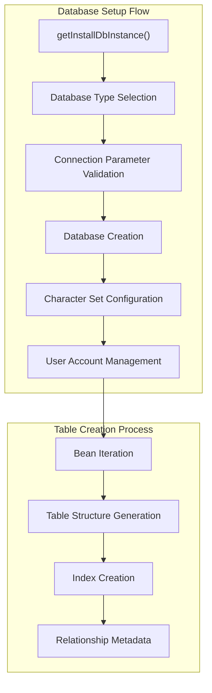
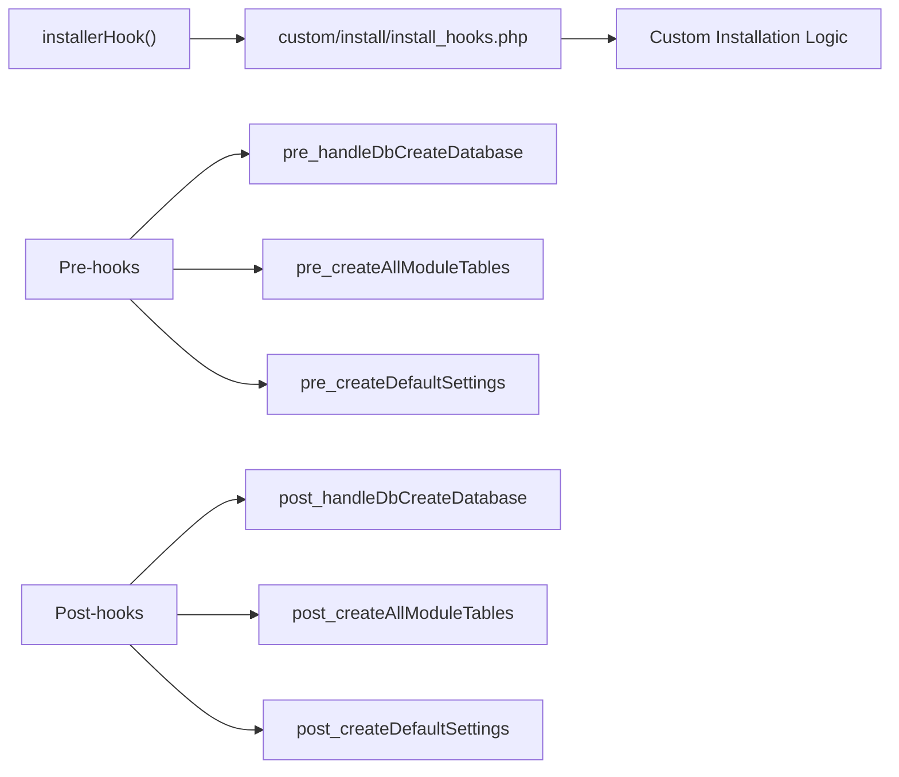

# Installation System

Relevant source files

The following files were used as context for generating this wiki page:

- [include/language/getJSLanguage.php](include/language/getJSLanguage.php)
- [install.php](install.php)
- [install/dbConfig_a.php](install/dbConfig_a.php)
- [install/install.css](install/install.css)
- [install/install2.css](install/install2.css)
- [install/installConfig.php](install/installConfig.php)
- [install/installDisabled.php](install/installDisabled.php)
- [install/installType.php](install/installType.php)
- [install/install_utils.php](install/install_utils.php)
- [install/language/en_us.lang.php](install/language/en_us.lang.php)
- [install/license.php](install/license.php)
- [install/old_php.js](install/old_php.js)
- [install/old_php.php](install/old_php.php)
- [install/performSetup.php](install/performSetup.php)
- [install/ready.css](install/ready.css)
- [install/ready.php](install/ready.php)
- [install/siteConfig_a.php](install/siteConfig_a.php)
- [install/siteConfig_b.php](install/siteConfig_b.php)
- [install/welcome.php](install/welcome.php)
- [modules/Administration/UpgradeAccess.php](modules/Administration/UpgradeAccess.php)
- [modules/Import/views/ImportView.php](modules/Import/views/ImportView.php)
- [modules/Studio/parsers/StudioParser.php](modules/Studio/parsers/StudioParser.php)

This document covers SuiteCRM's installation wizard system, which handles the initial setup and configuration of a new SuiteCRM instance. The installation system is a web-based wizard that guides users through license acceptance, system requirements validation, database configuration, and initial data population.

For information about post-installation administration, see [Administration Panel](#5.2). For upgrade procedures, see the upgrade documentation in the administration section.

## Overview

The installation system is implemented as a multi-step web wizard that orchestrates the complete setup process for a new SuiteCRM installation. The system validates system requirements, configures database connections, creates necessary tables, populates default data, and establishes the initial administrative user.

### Installation Workflow

**Sources:** [install.php:380-460](), [install.php:462-477]()

### Core Installation Components

**Sources:** [install.php:1-50](), [install/install_utils.php:1-50](), [install/performSetup.php:1-50]()

## Installation Controller

### Main Entry Point

The `install.php` file serves as the primary controller for the installation process. It manages session state, workflow progression, and step validation.

| Component | Purpose | Key Functions |
|-----------|---------|---------------|
| `$workflow` array | Defines installation step sequence | Step progression control |
| `$next_step` | Current workflow position | Navigation management |
| Session management | Preserves configuration across steps | State persistence |
| Language handling | Multi-language support | Localization |

**Key workflow management:**
- Workflow steps are defined in a simple array structure [install.php:380-460]()
- Step progression is controlled via `$_REQUEST['goto']` parameter [install.php:462-477]()
- Session variables maintain state between steps [install.php:367-372]()

**Sources:** [install.php:380-460](), [install.php:462-477](), [install.php:367-372]()

### Installation Utilities

The `install_utils.php` file provides core utility functions used throughout the installation process:

**Sources:** [install/install_utils.php:594-620](), [install/install_utils.php:747-870](), [install/install_utils.php:113-245]()

## Installation Steps

### License Acceptance (`welcome.php`)

The welcome step handles license acceptance and language selection:

- Displays SuiteCRM license text from `LICENSE.txt`
- Provides language selection dropdown
- Requires explicit license acceptance before proceeding
- Performs initial system compatibility check via AJAX

**Key components:**
- License text display in textarea [install/welcome.php:139]()
- JavaScript-based license acceptance validation [install/welcome.php:218-290]()
- AJAX system check integration [install/welcome.php:218-290]()

**Sources:** [install/welcome.php:54-66](), [install/welcome.php:139](), [install/welcome.php:218-290]()

### System Requirements Check (`ready.php`)

The ready step validates system requirements and displays environment information:

| Check Category | Components Validated |
|----------------|---------------------|
| PHP Environment | Version, memory limit, extensions |
| File System | Directory permissions, writability |
| Database Support | Available database drivers |
| Optional Features | IMAP, cURL, image processing |

**Sources:** [install/ready.php:59-61](), [install/ready.php:98-140](), [install/ready.php:172-190]()

### Configuration (`installConfig.php`)

The configuration step provides forms for database and site settings:

**Database Configuration:**
- Database type selection (MySQL, SQL Server, etc.)
- Connection parameters (host, port, credentials)
- Database creation options
- User account management

**Site Configuration:**
- Admin user creation
- Site URL specification
- System name setting
- Security options

The configuration interface uses the `InstallLayout` class to generate forms dynamically based on database driver capabilities [install/installConfig.php:91-248]().

**Sources:** [install/installConfig.php:91-248](), [install/installConfig.php:249-700]()

### Setup Execution (`performSetup.php`)

The setup execution step performs the actual installation:

**Key processes:**
1. **Configuration Generation**: Creates `config.php` with database and site settings [install/performSetup.php:747-870]()
2. **Database Initialization**: Creates database and user accounts if needed [install/performSetup.php:176-204]()
3. **Table Creation**: Iterates through all Bean classes to create tables [install/performSetup.php:241-297]()
4. **Relationship Setup**: Creates relationship metadata tables [install/performSetup.php:308-323]()
5. **Default Data**: Populates configuration settings and creates admin user [install/performSetup.php:333-357]()

**Sources:** [install/performSetup.php:155-188](), [install/performSetup.php:241-297](), [install/performSetup.php:333-357]()

## Database Installation Process

### Database Creation and Configuration

The installation system handles multiple database platforms through a unified interface:

**Database operations:**
- **Type Selection**: Supports MySQL, SQL Server via driver abstraction [install/install_utils.php:594-597]()
- **Connection Management**: Establishes admin connections for setup [install/install_utils.php:599-620]()
- **Table Creation**: Processes all SugarBean classes to create tables [install/performSetup.php:241-297]()
- **Relationship Setup**: Creates join tables and metadata [install/performSetup.php:308-323]()

**Sources:** [install/install_utils.php:594-620](), [install/performSetup.php:241-297](), [install/performSetup.php:308-323]()

### Configuration File Generation

The `handleSugarConfig()` function creates the main `config.php` file:

| Configuration Section | Purpose | Key Settings |
|----------------------|---------|--------------|
| Database Config | Connection parameters | Host, credentials, database name |
| Site Settings | Base system configuration | URL, session paths, logging |
| Security Options | Application security | Session management, authentication |
| Feature Flags | Optional functionality | Module availability, features |

**Sources:** [install/install_utils.php:747-870]()

## Installation Hooks and Extensibility

The installation system provides hooks for customization through the `installerHook()` function:

**Available hook points:**
- Database creation (pre/post)
- Table creation (pre/post)  
- Default settings (pre/post)
- User creation (pre/post)
- System finalization

**Sources:** [install/install_utils.php:56-80](), [install/performSetup.php:178-180](), [install/performSetup.php:238-240]()

## Error Handling and Validation

The installation system includes comprehensive validation and error handling:

### System Requirements Validation

- **PHP Version**: Validates minimum and recommended versions [install/ready.php:59-61]()
- **Extension Checks**: Verifies required PHP extensions [install/ready.php:172-190]()
- **File Permissions**: Validates directory writability [install/ready.php:80-95]()
- **Memory Limits**: Checks PHP memory configuration [install/ready.php:98-140]()

### Configuration Validation

- **Database Connectivity**: Tests database connections before proceeding
- **Required Fields**: Validates all mandatory configuration fields
- **Security Validation**: Ensures secure password requirements
- **URL Validation**: Verifies site URL accessibility

**Sources:** [install/ready.php:98-140](), [install/ready.php:172-190](), [install/installConfig.php:304-344]()