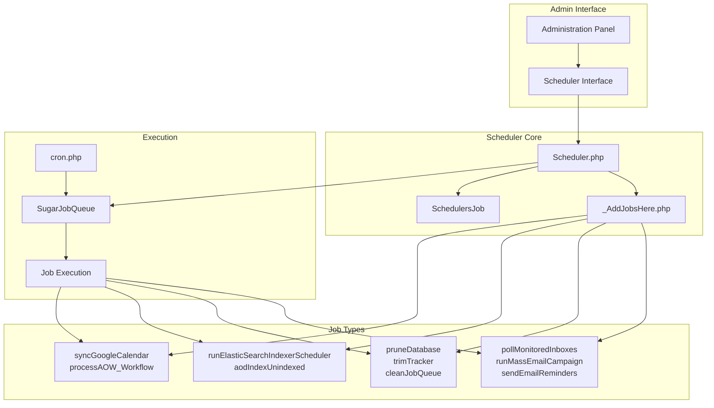
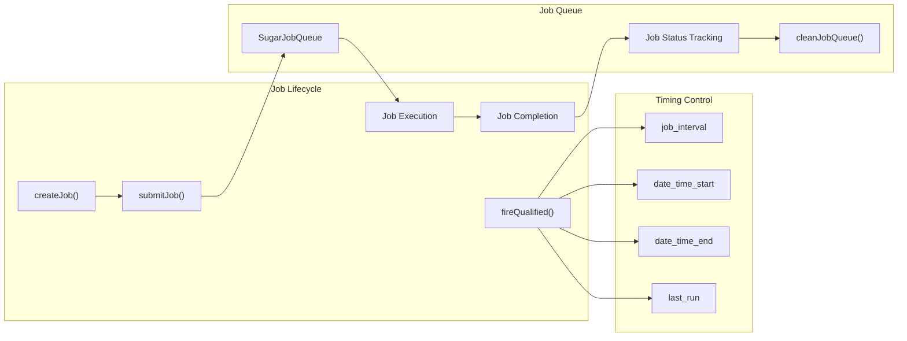
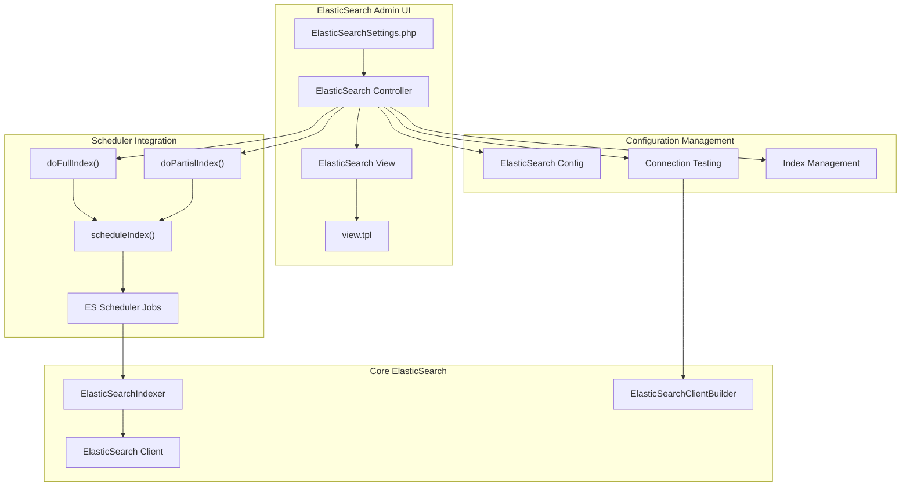
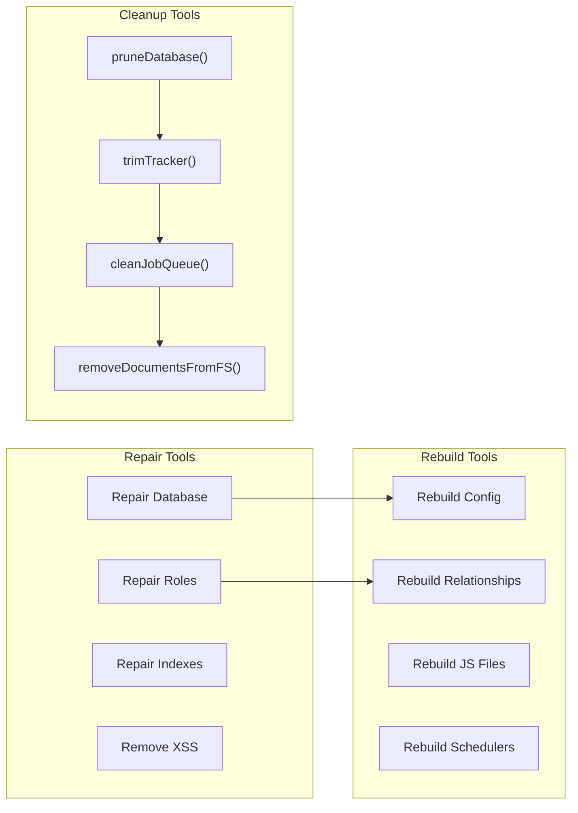
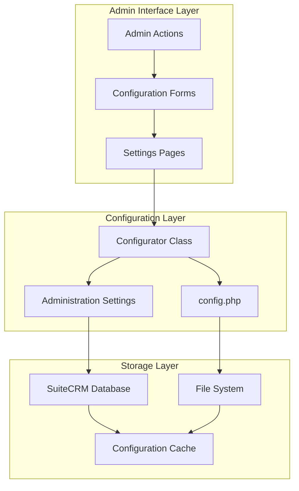

# Administration Panel

<details>
<summary>Relevant source files</summary>

The following files were used as context for generating this wiki page:

- [include/Smarty/plugins/function.diff_for_humans.php](include/Smarty/plugins/function.diff_for_humans.php)
- [install/suite_install/enabledTabs.php](install/suite_install/enabledTabs.php)
- [install/suite_install/scenarios.php](install/suite_install/scenarios.php)
- [lib/Search/Index/IndexingSchedulerTrait.php](lib/Search/Index/IndexingSchedulerTrait.php)
- [lib/Search/UI/SearchThrowableHandler.php](lib/Search/UI/SearchThrowableHandler.php)
- [modules/Administration/ElasticSearchSettings.php](modules/Administration/ElasticSearchSettings.php)
- [modules/Administration/Search/ElasticSearch/Controller.php](modules/Administration/Search/ElasticSearch/Controller.php)
- [modules/Administration/Search/ElasticSearch/View.php](modules/Administration/Search/ElasticSearch/View.php)
- [modules/Administration/Search/ElasticSearch/scripts.js](modules/Administration/Search/ElasticSearch/scripts.js)
- [modules/Administration/Search/ElasticSearch/view.tpl](modules/Administration/Search/ElasticSearch/view.tpl)
- [modules/Administration/Search/MVC/Controller.php](modules/Administration/Search/MVC/Controller.php)
- [modules/Administration/language/en_us.lang.php](modules/Administration/language/en_us.lang.php)
- [modules/Administration/metadata/adminpaneldefs.php](modules/Administration/metadata/adminpaneldefs.php)
- [modules/Home/Search.php](modules/Home/Search.php)
- [modules/Home/language/en_us.lang.php](modules/Home/language/en_us.lang.php)
- [modules/OAuth2Clients/Menu.php](modules/OAuth2Clients/Menu.php)
- [modules/OAuth2Tokens/Menu.php](modules/OAuth2Tokens/Menu.php)
- [modules/Schedulers/Scheduler.php](modules/Schedulers/Scheduler.php)
- [modules/Schedulers/_AddJobsHere.php](modules/Schedulers/_AddJobsHere.php)
- [modules/Schedulers/language/en_us.lang.php](modules/Schedulers/language/en_us.lang.php)

</details>


The Administration Panel serves as the central control hub for SuiteCRM system configuration and management. It provides administrators with access to system settings, user management, scheduler configuration, and various maintenance tools. This document covers the admin panel structure, scheduler system integration, and key administrative functions.

For information about system installation and initial setup, see [Installation System](#5.1). For details about search configuration and maintenance, see [Search System](#5.3).

## Admin Panel Architecture

The Administration Panel is organized into logical groups of related functionality, each containing specific configuration options and tools. The panel structure is defined through metadata files and presents a hierarchical interface for system management.

```mermaid
graph TB
    subgraph "Admin Panel Groups"
        USERS["Users & Authentication"]
        SYSTEM["System Settings"] 
        MODULES["Module Settings"]
        EMAIL["Email Management"]
        TOOLS["Admin Tools"]
        STUDIO["Studio & Development"]
        GOOGLE["Google Suite Integration"]
    end
    
    subgraph "Core Admin Classes"
        AdminPanel["adminpaneldefs.php"]
        Controller["Administration Controller"]
        Configurator["Configurator"]
    end
    
    subgraph "Key Subsystems"
        Scheduler["Scheduler System"]
        ElasticSearch["ElasticSearch Config"]
        EmailConfig["Email Configuration"]
        UserMgmt["User Management"]
    end
    
    AdminPanel --> USERS
    AdminPanel --> SYSTEM
    AdminPanel --> MODULES
    AdminPanel --> EMAIL
    AdminPanel --> TOOLS
    AdminPanel --> STUDIO
    AdminPanel --> GOOGLE
    
    SYSTEM --> Scheduler
    SYSTEM --> ElasticSearch
    EMAIL --> EmailConfig
    USERS --> UserMgmt
    
    Controller --> Configurator
    Configurator --> "config.php"
```

Sources: [modules/Administration/metadata/adminpaneldefs.php:44-498]()

## Admin Panel Group Structure

The admin panel organizes functionality into distinct groups, each containing related configuration options and management tools:

| Group | Key Components | Purpose |
|-------|----------------|---------|
| Users & Authentication | User Management, Password Policy, Role Management, Security Groups | User account and access control |
| System | System Settings, Currencies, Languages, Locale, Scheduler | Core system configuration |
| Module Settings | Activity Streams, Business Hours, Module Configuration | Module-specific settings |
| Email Management | Inbound/Outbound Email, Campaign Settings, OAuth Connections | Email system configuration |
| Admin Tools | Repair, Backup, Diagnostics, Module Loader | Maintenance and troubleshooting |
| Studio & Development | Studio, Module Builder, Dropdown Editor, Workflow | Development and customization |
| Google Suite | Calendar Settings, Maps Configuration | Google integration |

Sources: [modules/Administration/metadata/adminpaneldefs.php:98-449]()

## Scheduler System Integration

The Scheduler system is a critical component accessible through the Administration Panel, responsible for executing background tasks and automated processes. It provides job queue management and periodic task execution capabilities.



Sources: [modules/Schedulers/Scheduler.php:48-99](), [modules/Schedulers/_AddJobsHere.php:69-87]()

### Scheduler Job Management

The Scheduler class provides comprehensive job management functionality, including job qualification checking, execution timing, and queue management:



Sources: [modules/Schedulers/Scheduler.php:148-211](), [modules/Schedulers/_AddJobsHere.php:540-558]()

## ElasticSearch Administration

The Administration Panel includes dedicated configuration for ElasticSearch integration, providing connection management, indexing controls, and scheduler integration for search functionality.



Sources: [modules/Administration/Search/ElasticSearch/Controller.php:66-217](), [modules/Administration/ElasticSearchSettings.php:44-55]()

### ElasticSearch Configuration Interface

The ElasticSearch administration interface provides comprehensive configuration management:

| Component | Function | Description |
|-----------|----------|-------------|
| `doSaveConfig()` | Configuration Persistence | Saves ES connection settings to config |
| `doTestConnection()` | Connection Validation | Tests ES server connectivity and returns status |
| `doFullIndex()` | Complete Indexing | Schedules full system reindexing |
| `doPartialIndex()` | Incremental Indexing | Schedules partial/differential indexing |
| `getSchedulers()` | Job Status | Retrieves ES-related scheduler job information |

Sources: [modules/Administration/Search/ElasticSearch/Controller.php:88-216]()

## Key Administrative Functions

The Administration Panel provides access to several critical system management functions organized by functional area:

### System Maintenance Tools



Sources: [modules/Administration/language/en_us.lang.php:297-558](), [modules/Schedulers/_AddJobsHere.php:299-558]()

### Email System Configuration

The Administration Panel provides comprehensive email system management through multiple configuration interfaces:

| Configuration Area | Components | Purpose |
|-------------------|------------|---------|
| Inbound Email | Mailbox Setup, IMAP/POP3 Configuration | Incoming email processing |
| Outbound Email | SMTP Configuration, Authentication | Outgoing email delivery |
| Campaign Management | Mass Email Settings, Bounce Handling | Email marketing functionality |
| OAuth Integration | External OAuth Providers/Connections | Modern authentication for email services |

Sources: [modules/Administration/metadata/adminpaneldefs.php:238-293]()

## Configuration Management Architecture

The Administration Panel integrates with the core configuration system to persist settings and manage system state:



Sources: [modules/Administration/Search/ElasticSearch/Controller.php:97-110]()