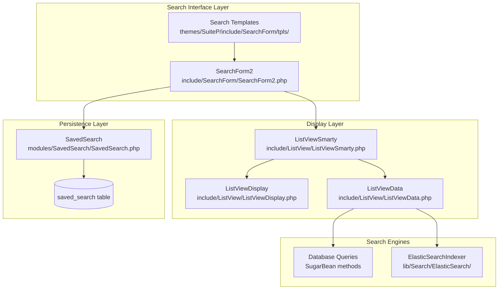
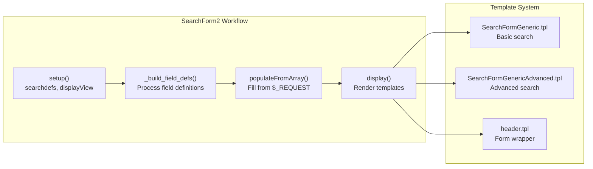
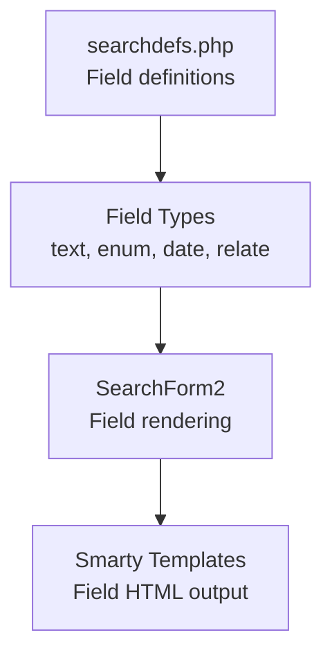
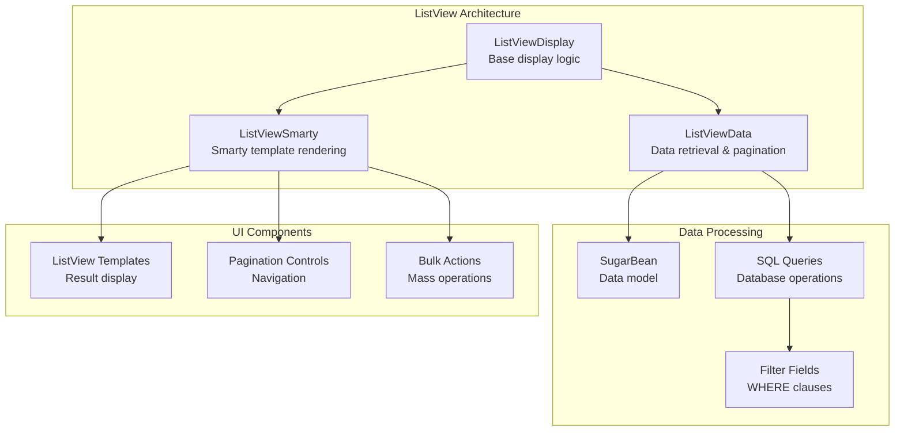
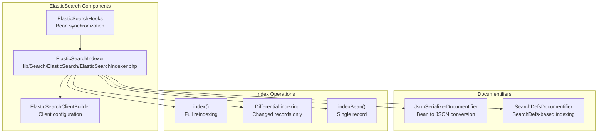
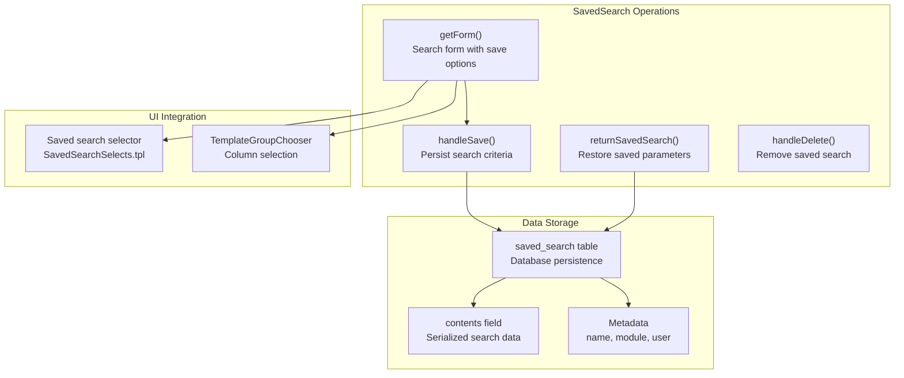
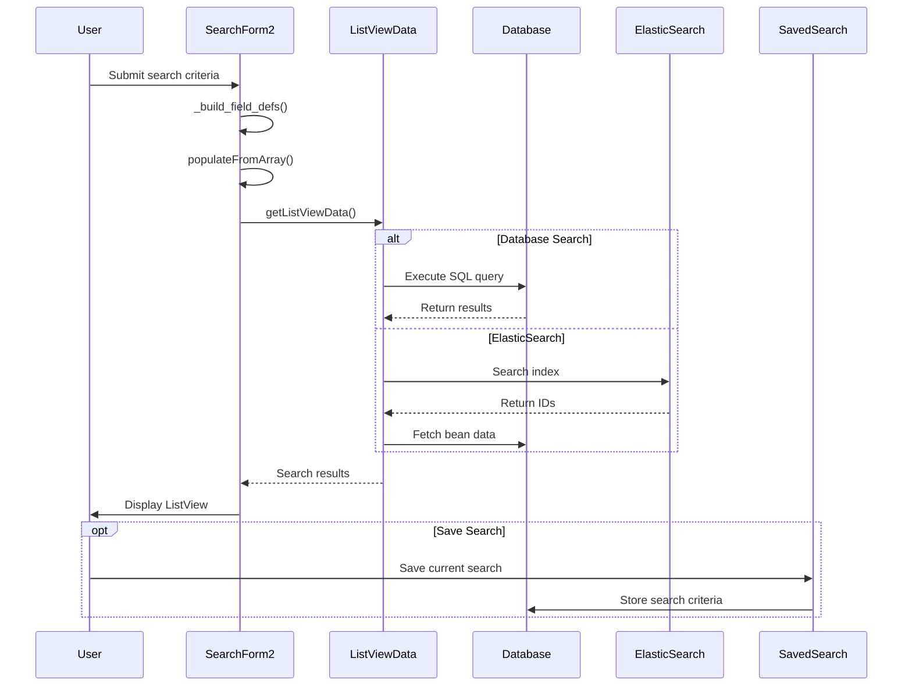

# Search System

<details>
<summary>Relevant source files</summary>

The following files were used as context for generating this wiki page:

- [ModuleInstall/PackageManager/tpls/ModuleLoaderListView.tpl](ModuleInstall/PackageManager/tpls/ModuleLoaderListView.tpl)
- [include/ListView/ListViewColumnsFilterLink.tpl](include/ListView/ListViewColumnsFilterLink.tpl)
- [include/ListView/ListViewData.php](include/ListView/ListViewData.php)
- [include/ListView/ListViewDisplay.php](include/ListView/ListViewDisplay.php)
- [include/ListView/ListViewSearchLink.tpl](include/ListView/ListViewSearchLink.tpl)
- [include/ListView/ListViewSmarty.php](include/ListView/ListViewSmarty.php)
- [include/Popups/PopupSmarty.php](include/Popups/PopupSmarty.php)
- [include/Popups/tpls/header.tpl](include/Popups/tpls/header.tpl)
- [include/SearchForm/SearchForm.php](include/SearchForm/SearchForm.php)
- [include/SearchForm/SearchForm2.php](include/SearchForm/SearchForm2.php)
- [include/SearchForm/tpls/SearchFormGeneric.tpl](include/SearchForm/tpls/SearchFormGeneric.tpl)
- [include/SearchForm/tpls/SearchFormGenericAdvanced.tpl](include/SearchForm/tpls/SearchFormGenericAdvanced.tpl)
- [include/SearchForm/tpls/footer.tpl](include/SearchForm/tpls/footer.tpl)
- [include/SearchForm/tpls/footerPopup.tpl](include/SearchForm/tpls/footerPopup.tpl)
- [include/SearchForm/tpls/header.tpl](include/SearchForm/tpls/header.tpl)
- [include/SearchForm/tpls/headerPopup.tpl](include/SearchForm/tpls/headerPopup.tpl)
- [lib/Robo/Plugin/Commands/ElasticSearchCommands.php](lib/Robo/Plugin/Commands/ElasticSearchCommands.php)
- [lib/Search/ElasticSearch/ElasticSearchClientBuilder.php](lib/Search/ElasticSearch/ElasticSearchClientBuilder.php)
- [lib/Search/ElasticSearch/ElasticSearchHooks.php](lib/Search/ElasticSearch/ElasticSearchHooks.php)
- [lib/Search/ElasticSearch/ElasticSearchIndexer.php](lib/Search/ElasticSearch/ElasticSearchIndexer.php)
- [lib/Search/Index/AbstractIndexer.php](lib/Search/Index/AbstractIndexer.php)
- [lib/Search/Index/Documentify/AbstractDocumentifier.php](lib/Search/Index/Documentify/AbstractDocumentifier.php)
- [lib/Search/Index/Documentify/JsonSerializerDocumentifier.php](lib/Search/Index/Documentify/JsonSerializerDocumentifier.php)
- [lib/Search/Index/Documentify/SearchDefsDocumentifier.php](lib/Search/Index/Documentify/SearchDefsDocumentifier.php)
- [lib/Search/Index/Documentify/SearchDefsDocumentifier.yml](lib/Search/Index/Documentify/SearchDefsDocumentifier.yml)
- [lib/Utility/BeanJsonSerializer.php](lib/Utility/BeanJsonSerializer.php)
- [modules/SavedSearch/SavedSearch.php](modules/SavedSearch/SavedSearch.php)
- [modules/SavedSearch/SavedSearchForm.tpl](modules/SavedSearch/SavedSearchForm.tpl)
- [modules/SavedSearch/language/en_us.lang.php](modules/SavedSearch/language/en_us.lang.php)
- [themes/SuiteP/include/SearchForm/tpls/SearchFormGeneric.tpl](themes/SuiteP/include/SearchForm/tpls/SearchFormGeneric.tpl)
- [themes/SuiteP/include/SearchForm/tpls/SearchFormGenericAdvanced.tpl](themes/SuiteP/include/SearchForm/tpls/SearchFormGenericAdvanced.tpl)
- [themes/SuiteP/include/SearchForm/tpls/footer.tpl](themes/SuiteP/include/SearchForm/tpls/footer.tpl)
- [themes/SuiteP/include/SearchForm/tpls/header.tpl](themes/SuiteP/include/SearchForm/tpls/header.tpl)

</details>


## Purpose and Scope

The Search System provides comprehensive search and filtering capabilities across SuiteCRM modules. It encompasses search form interfaces, result display through list views, ElasticSearch integration for enhanced search performance, and saved search functionality for persistent queries. This system handles both basic quick filters and advanced multi-field searches.

For ListView display configuration, see [User Interface System](#3). For ElasticSearch server configuration, see [Administration Panel](#5.2).

## Core Architecture

The search system consists of four main components working together to provide a complete search experience:



Sources: [include/SearchForm/SearchForm2.php:1-1148](), [include/ListView/ListViewSmarty.php:1-367](), [lib/Search/ElasticSearch/ElasticSearchIndexer.php:1-592](), [modules/SavedSearch/SavedSearch.php:1-507]()

## Search Form Framework

### SearchForm2 Class

The `SearchForm2` class handles search form generation, field population, and query processing:

| Component | Purpose | Key Methods |
|-----------|---------|-------------|
| Form Generation | Builds search forms from searchdefs | `_build_field_defs()`, `setup()` |
| Field Processing | Populates form fields from request data | `populateFromArray()` |
| Template Rendering | Generates HTML output | `display()` |
| Tab Management | Handles basic/advanced search tabs | `_displayTabs()` |



Sources: [include/SearchForm/SearchForm2.php:95-171](), [include/SearchForm/SearchForm2.php:622-727](), [themes/SuiteP/include/SearchForm/tpls/SearchFormGeneric.tpl:1-116]()

### Search Field Configuration

Search forms are configured through `searchdefs.php` files defining available search fields per module:



Sources: [include/SearchForm/SearchForm2.php:626-640](), [include/SearchForm/SearchForm2.php:641-727]()

## ListView Integration

### Display Components

The ListView system renders search results through coordinated components:



Sources: [include/ListView/ListViewDisplay.php:48-242](), [include/ListView/ListViewSmarty.php:78-342](), [include/ListView/ListViewData.php:249-531]()

### Search Result Processing

ListView processes search parameters and generates appropriate queries:

| Method | Purpose | Location |
|--------|---------|----------|
| `getListViewData()` | Main data retrieval | [include/ListView/ListViewData.php:249-531]() |
| `getOrderBy()` | Sort order handling | [include/ListView/ListViewData.php:85-117]() |
| `process()` | Template data preparation | [include/ListView/ListViewSmarty.php:111-258]() |

Sources: [include/ListView/ListViewData.php:249-531](), [include/ListView/ListViewSmarty.php:111-258]()

## ElasticSearch Integration

### Indexing System

The ElasticSearch indexer maintains synchronized search indices for enhanced performance:



Sources: [lib/Search/ElasticSearch/ElasticSearchIndexer.php:65-591](), [lib/Search/ElasticSearch/ElasticSearchHooks.php:56-209](), [lib/Search/Index/Documentify/JsonSerializerDocumentifier.php:1-73]()

### Index Management

ElasticSearch indexing supports both full and differential modes:

| Mode | Method | Use Case |
|------|--------|----------|
| Full | `index()` with `differentialIndexing = false` | Initial setup, complete refresh |
| Differential | `index()` with `differentialIndexing = true` | Regular updates, performance |
| Real-time | `ElasticSearchHooks` callbacks | Bean save/delete operations |

Sources: [lib/Search/ElasticSearch/ElasticSearchIndexer.php:112-164](), [lib/Search/ElasticSearch/ElasticSearchHooks.php:73-96]()

## Saved Search Management

### SavedSearch Class

The SavedSearch module provides persistent search query storage and retrieval:



Sources: [modules/SavedSearch/SavedSearch.php:87-137](), [modules/SavedSearch/SavedSearch.php:352-418](), [modules/SavedSearch/SavedSearch.php:251-307]()

### Search Persistence

Saved searches store complete search state including:

- Search field values and operators
- Column display preferences
- Sort order and pagination settings
- Module context and user ownership

Sources: [modules/SavedSearch/SavedSearch.php:352-418](), [modules/SavedSearch/SavedSearch.php:139-208]()

## Search Flow Architecture

The complete search process integrates all components:



Sources: [include/SearchForm/SearchForm2.php:172-314](), [include/ListView/ListViewData.php:249-531](), [modules/SavedSearch/SavedSearch.php:352-418]()

## Configuration and Customization

### Module Search Configuration

Each module defines searchable fields through `searchdefs.php`:

```php
// Example structure from searchdefs.php
$searchdefs['ModuleName'] = array(
    'layout' => array(
        'basic_search' => array('field_name', 'another_field'),
        'advanced_search' => array(
            array('name' => 'field_name', 'label' => 'LBL_FIELD'),
            array('name' => 'date_field', 'type' => 'date_range')
        )
    )
);
```

### Template Customization

Search forms use Smarty templates that can be customized per theme:

| Template | Purpose | Location |
|----------|---------|----------|
| `SearchFormGeneric.tpl` | Basic search layout | [themes/SuiteP/include/SearchForm/tpls/SearchFormGeneric.tpl:1-116]() |
| `SearchFormGenericAdvanced.tpl` | Advanced search layout | [themes/SuiteP/include/SearchForm/tpls/SearchFormGenericAdvanced.tpl:1-180]() |
| `header.tpl` | Form wrapper and JavaScript | [themes/SuiteP/include/SearchForm/tpls/header.tpl:1-135]() |

Sources: [include/SearchForm/SearchForm2.php:127-171](), [themes/SuiteP/include/SearchForm/tpls/SearchFormGeneric.tpl:1-116](), [themes/SuiteP/include/SearchForm/tpls/SearchFormGenericAdvanced.tpl:1-180]()