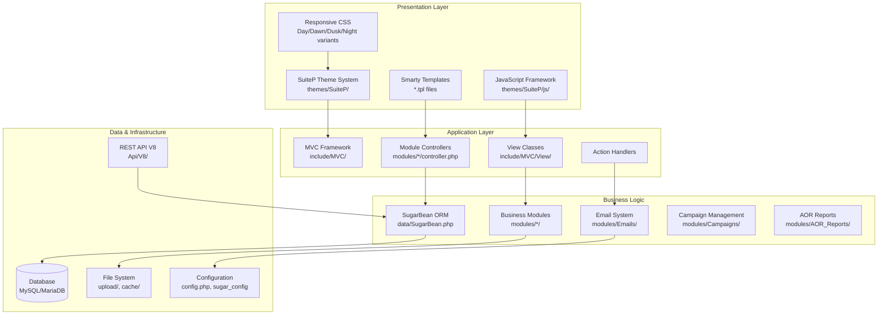
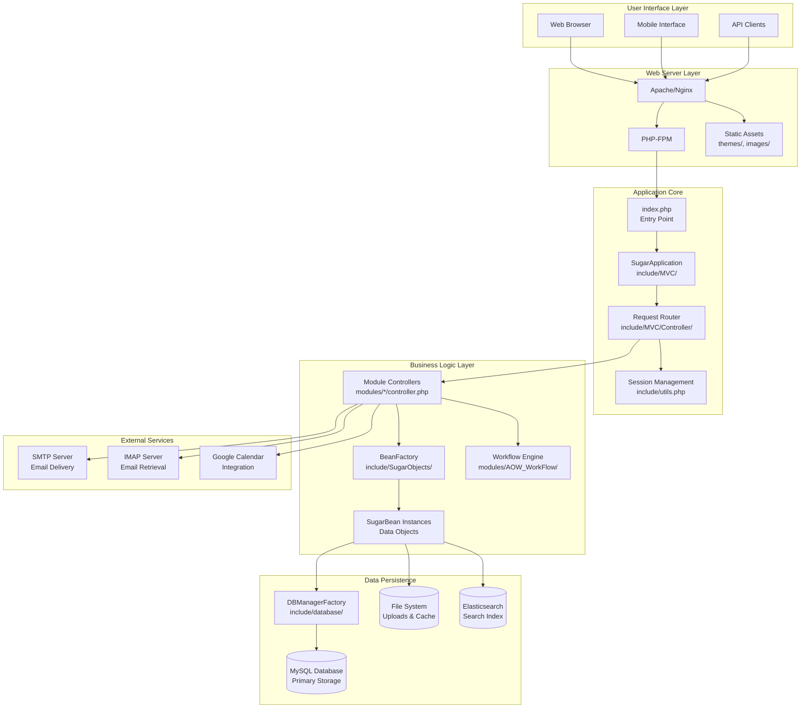
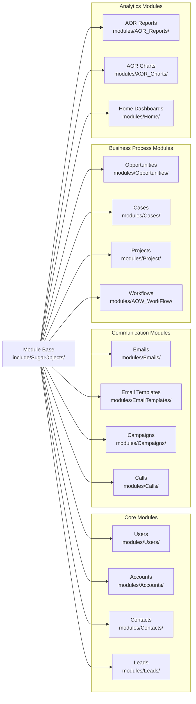
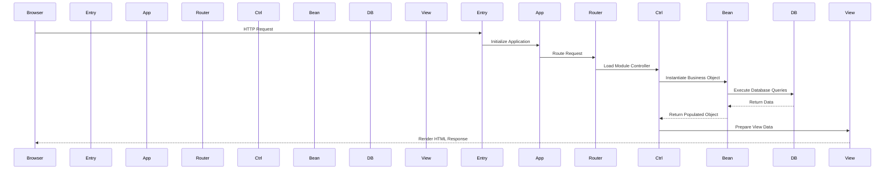

# SuiteCRM Overview

Relevant source files

The following files were used as context for generating this wiki page:

- [README.md](README.md)
- [composer.json](composer.json)
- [composer.lock](composer.lock)
- [files.md5](files.md5)
- [include/utils.php](include/utils.php)
- [modules/Import/tpls/last.tpl](modules/Import/tpls/last.tpl)
- [modules/Import/tpls/listview.tpl](modules/Import/tpls/listview.tpl)
- [suitecrm_version.php](suitecrm_version.php)
- [themes/SuiteP/css/Dawn/style.css](themes/SuiteP/css/Dawn/style.css)
- [themes/SuiteP/css/Dawn/variables.scss](themes/SuiteP/css/Dawn/variables.scss)
- [themes/SuiteP/css/Day/style.css](themes/SuiteP/css/Day/style.css)
- [themes/SuiteP/css/Day/variables.scss](themes/SuiteP/css/Day/variables.scss)
- [themes/SuiteP/css/Dusk/style.css](themes/SuiteP/css/Dusk/style.css)
- [themes/SuiteP/css/Dusk/variables.scss](themes/SuiteP/css/Dusk/variables.scss)
- [themes/SuiteP/css/Night/style.css](themes/SuiteP/css/Night/style.css)
- [themes/SuiteP/css/Night/variables.scss](themes/SuiteP/css/Night/variables.scss)
- [themes/SuiteP/css/suitep-base/editview.scss](themes/SuiteP/css/suitep-base/editview.scss)
- [themes/SuiteP/css/suitep-base/listview.scss](themes/SuiteP/css/suitep-base/listview.scss)
- [themes/SuiteP/css/suitep-base/navbar.scss](themes/SuiteP/css/suitep-base/navbar.scss)
- [themes/SuiteP/include/DetailView/DetailView.tpl](themes/SuiteP/include/DetailView/DetailView.tpl)
- [themes/SuiteP/include/DetailView/footer.tpl](themes/SuiteP/include/DetailView/footer.tpl)
- [themes/SuiteP/include/DetailView/header.tpl](themes/SuiteP/include/DetailView/header.tpl)
- [themes/SuiteP/include/DetailView/tab_panel_content.tpl](themes/SuiteP/include/DetailView/tab_panel_content.tpl)
- [themes/SuiteP/include/DetailView/test.tpl](themes/SuiteP/include/DetailView/test.tpl)
- [themes/SuiteP/include/EditView/QuickCreate.tpl](themes/SuiteP/include/EditView/QuickCreate.tpl)
- [themes/SuiteP/js/style.js](themes/SuiteP/js/style.js)
- [themes/SuiteP/modules/Studio/TabGroups/EditViewTabs.tpl](themes/SuiteP/modules/Studio/TabGroups/EditViewTabs.tpl)
- [themes/SuiteP/tpls/_headerModuleList.tpl](themes/SuiteP/tpls/_headerModuleList.tpl)

This document provides a comprehensive overview of SuiteCRM's architecture, core systems, and key components. SuiteCRM is an open-source Customer Relationship Management (CRM) system that provides enterprise-grade functionality for managing customer relationships, sales processes, and business operations.

For detailed information about specific subsystems, see [Core Architecture](#2) for foundational patterns, [User Interface System](#3) for presentation layer details, [Core Business Modules](#4) for CRM functionality, and [Administration & Configuration](#5) for system management.

## System Purpose and Architecture

SuiteCRM is built on a PHP-based Model-View-Controller (MVC) architecture that extends the original SugarCRM Community Edition. The system provides a web-based interface for managing customer data, sales processes, email communications, reporting, and administrative functions.

Sources: [README.md:5-6](), [composer.json:2-4](), [suitecrm_version.php:6](), [include/utils.php:46]()

## Core Technology Stack

SuiteCRM leverages several key technologies and frameworks to deliver its functionality:

| Component | Technology | Purpose |
|-----------|------------|---------|
| **Backend Framework** | PHP 7.4+ | Server-side application logic |
| **Templating Engine** | Smarty 4.x | Dynamic HTML generation |
| **Database Abstraction** | `SugarBean` ORM | Data persistence and relationships |
| **Frontend Framework** | Bootstrap 3.3.7 | Responsive UI components |
| **Theme System** | SuiteP with SCSS | Customizable visual presentation |
| **Search Engine** | Elasticsearch 7.x | Advanced search capabilities |
| **Email Processing** | PHPMailer 6.x | Email composition and delivery |
| **API Layer** | Slim Framework 3.x | RESTful web services |
| **Authentication** | OAuth2 Server | Secure API access |

Sources: [composer.json:35-77](), [themes/SuiteP/css/Day/style.css:2-6](), [include/utils.php:54-290]()

## System Architecture Overview

The following diagram illustrates how SuiteCRM's major subsystems interact and the data flow between them:

Sources: [index.php](), [include/utils.php:54-290](), [include/MVC/](), [modules/]()

## Key System Components

### Configuration Management

SuiteCRM uses a centralized configuration system managed through the `sugar_config` array and utility functions:

- **Primary Config**: `config.php` contains the main `$sugar_config` array
- **Config Utilities**: `make_sugar_config()` and `get_sugar_config_defaults()` functions in [include/utils.php:54-594]()
- **Runtime Config**: Dynamic configuration loading and caching

### Database Abstraction Layer

The `SugarBean` class serves as the primary ORM and provides:

- **Data Modeling**: Base class for all business objects
- **Relationship Management**: Link definitions and relationship handling
- **Query Building**: Database-agnostic query construction
- **Caching**: Automatic result caching and invalidation

### Theme and Presentation System

SuiteCRM implements a sophisticated theming system through SuiteP:

- **Theme Variants**: Day, Dawn, Dusk, and Night color schemes
- **Responsive Design**: Bootstrap-based responsive layouts
- **SCSS Compilation**: [themes/SuiteP/css/suitep-base/]() contains source SCSS files
- **Template Engine**: Smarty templates for dynamic content generation

### Module Architecture

Business functionality is organized into discrete modules:

Sources: [modules/](), [include/SugarObjects/]()

## Request Processing Flow

SuiteCRM processes web requests through a well-defined pipeline:

Sources: [index.php](), [include/MVC/](), [include/SugarObjects/]()

## File Organization Structure

The SuiteCRM codebase follows a logical directory structure:

| Directory | Purpose |
|-----------|---------|
| `modules/` | Business logic modules and MVC components |
| `include/` | Core framework classes and utilities |
| `themes/` | UI themes, templates, and presentation assets |
| `Api/` | REST API implementation (V8) |
| `cache/` | Runtime cache files and compiled templates |
| `custom/` | Customizations and extensions |
| `upload/` | User-uploaded files and attachments |
| `vendor/` | Third-party dependencies (Composer) |

Sources: [composer.json:99-117](), file structure analysis

This architectural overview provides the foundation for understanding SuiteCRM's design patterns and implementation approach. The system's modular architecture enables extensibility while maintaining clear separation of concerns between presentation, business logic, and data persistence layers.