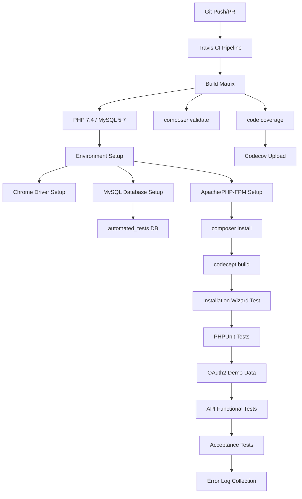
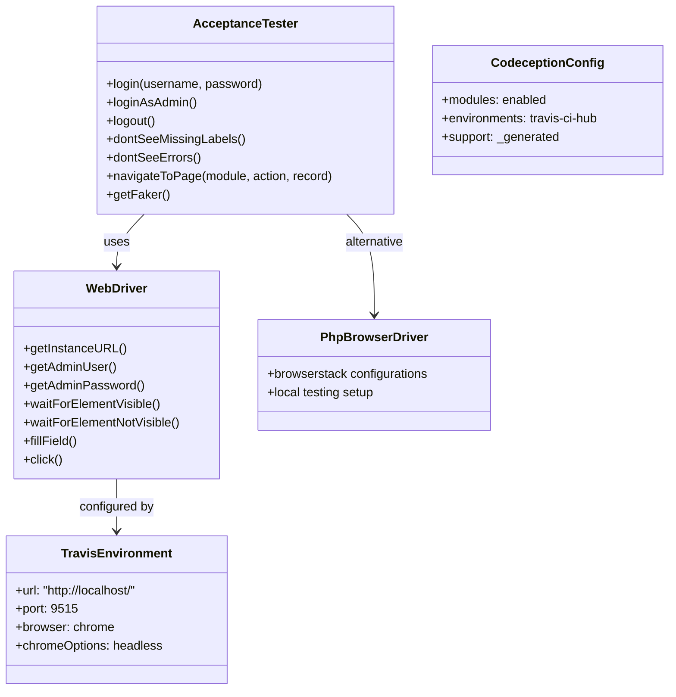
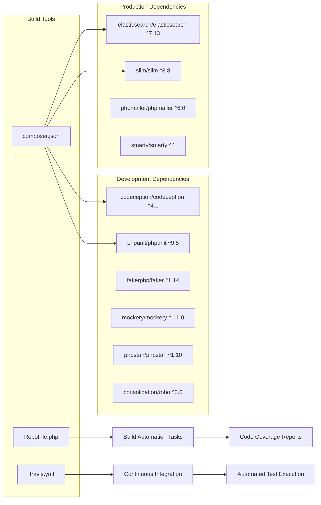
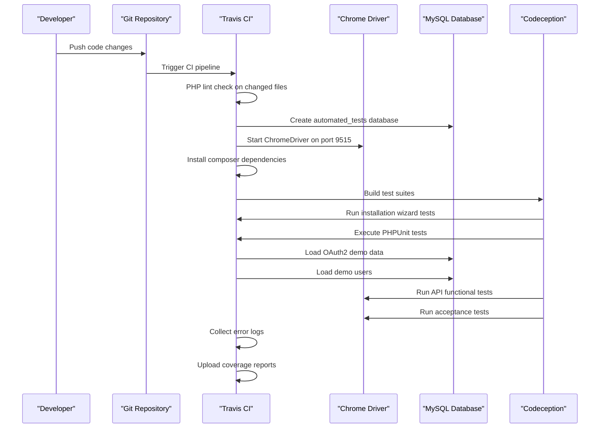

# Development & Testing

Relevant source files

The following files were used as context for generating this wiki page:

- [.travis.yml](.travis.yml)
- [README.md](README.md)
- [composer.json](composer.json)
- [composer.lock](composer.lock)
- [files.md5](files.md5)
- [include/utils.php](include/utils.php)
- [modules/Import/tpls/last.tpl](modules/Import/tpls/last.tpl)
- [modules/Import/tpls/listview.tpl](modules/Import/tpls/listview.tpl)
- [php_version.php](php_version.php)
- [suitecrm_version.php](suitecrm_version.php)
- [tests/SuiteCRM/Test/Driver/PhpBrowserDriver.php](tests/SuiteCRM/Test/Driver/PhpBrowserDriver.php)
- [tests/SuiteCRM/Test/Driver/WebDriver.php](tests/SuiteCRM/Test/Driver/WebDriver.php)
- [tests/_envs/travis-ci-hub.yml](tests/_envs/travis-ci-hub.yml)
- [tests/_support/AcceptanceTester.php](tests/_support/AcceptanceTester.php)
- [themes/SuiteP/css/Dawn/style.css](themes/SuiteP/css/Dawn/style.css)
- [themes/SuiteP/css/Dawn/variables.scss](themes/SuiteP/css/Dawn/variables.scss)
- [themes/SuiteP/css/Day/style.css](themes/SuiteP/css/Day/style.css)
- [themes/SuiteP/css/Day/variables.scss](themes/SuiteP/css/Day/variables.scss)
- [themes/SuiteP/css/Dusk/style.css](themes/SuiteP/css/Dusk/style.css)
- [themes/SuiteP/css/Dusk/variables.scss](themes/SuiteP/css/Dusk/variables.scss)
- [themes/SuiteP/css/Night/style.css](themes/SuiteP/css/Night/style.css)
- [themes/SuiteP/css/Night/variables.scss](themes/SuiteP/css/Night/variables.scss)
- [themes/SuiteP/css/suitep-base/editview.scss](themes/SuiteP/css/suitep-base/editview.scss)
- [themes/SuiteP/css/suitep-base/listview.scss](themes/SuiteP/css/suitep-base/listview.scss)
- [themes/SuiteP/css/suitep-base/navbar.scss](themes/SuiteP/css/suitep-base/navbar.scss)
- [travis.php.ini](travis.php.ini)

This section covers the development infrastructure, testing frameworks, and continuous integration systems that support SuiteCRM development. This includes automated testing suites, CI/CD pipelines, build tools, and development workflow processes.

For information about the API testing framework, see [API Architecture](#6.2). For details about installation and system configuration, see [Installation System](#5.1).

## CI/CD Pipeline Architecture

SuiteCRM uses Travis CI for continuous integration with a comprehensive pipeline that includes multiple test suites and validation stages.

**Travis CI Configuration Structure**

Sources: [.travis.yml:1-115]()

## Testing Framework Architecture

SuiteCRM uses Codeception as the primary testing framework with custom drivers and helper classes for web application testing.

**Test Infrastructure Components**

Sources: [tests/_support/AcceptanceTester.php:1-113](), [tests/SuiteCRM/Test/Driver/WebDriver.php:1-67](), [tests/_envs/travis-ci-hub.yml:1-18]()

## Build System and Development Tools

The development workflow is managed through Composer for dependency management and Robo for build automation.

**Dependency and Build Configuration**

Sources: [composer.json:1-153](), [RoboFile.php:1](), [.travis.yml:69-71]()

## Test Environment Configuration

The testing infrastructure supports multiple environments with specific configurations for different testing scenarios.

| Environment | Purpose | Configuration |
|-------------|---------|---------------|
| `travis-ci-hub` | CI/CD Pipeline | Headless Chrome, localhost URL, port 9515 |
| Local Development | Developer Testing | Custom WebDriver configurations |
| BrowserStack | Cross-browser Testing | Remote browser automation |

**Travis CI Environment Setup**

The CI environment includes comprehensive setup for web application testing:

- **Database Setup**: Creates `automated_tests` database with UTF8MB4 collation
- **Web Server**: Apache with PHP-FPM and mod_rewrite enabled
- **Browser Testing**: Headless Chrome with ChromeDriver on port 9515
- **Test Data**: OAuth2 demo data and test users loaded from SQL files

Sources: [.travis.yml:48-71](), [tests/_envs/travis-ci-hub.yml:1-18]()

## Testing Workflow Process

**Testing Types and Coverage**

1. **Installation Tests**: Verify the setup wizard functionality
2. **Unit Tests**: PHPUnit-based component testing
3. **API Tests**: Functional testing of V8 API endpoints with OAuth2
4. **Acceptance Tests**: End-to-end browser automation tests
5. **Code Coverage**: Comprehensive coverage reporting with Codecov integration

Sources: [.travis.yml:73-98](), [tests/_support/AcceptanceTester.php:60-89]()

## Development Tools Integration

The development environment provides several tools for code quality and testing:

**Static Analysis Tools**
- `phpstan/phpstan` for static code analysis
- `friendsofphp/php-cs-fixer` for code style enforcement
- `rector/rector` for automated code refactoring

**Testing Utilities**
- `mikey179/vfsstream` for virtual filesystem testing
- `jeroendesloovere/vcard` for vCard handling tests
- `flow/jsonpath` for JSON data manipulation in tests

**Build and Automation**
- `consolidation/robo` provides task automation capabilities
- Composer scripts handle post-install tasks and dependency management
- Travis CI matrix builds ensure compatibility across different PHP versions

Sources: [composer.json:79-97](), [composer.json:130-134]()