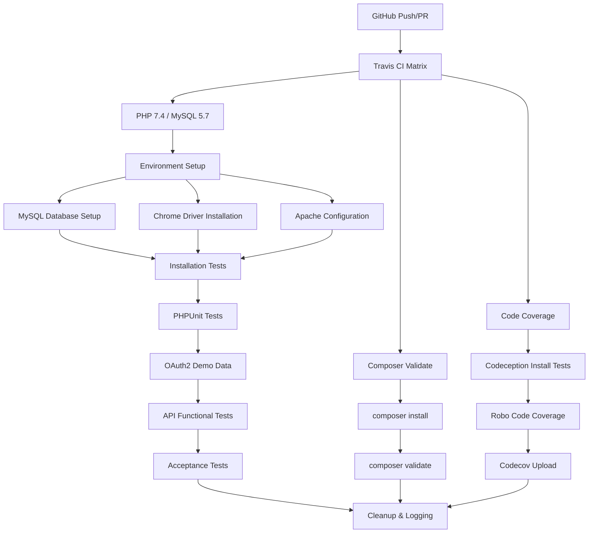
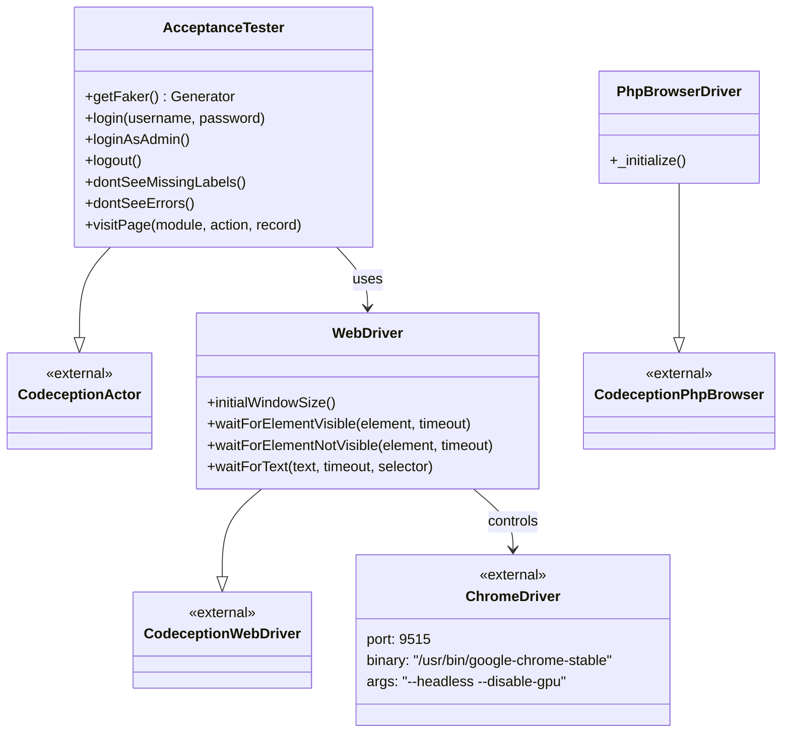
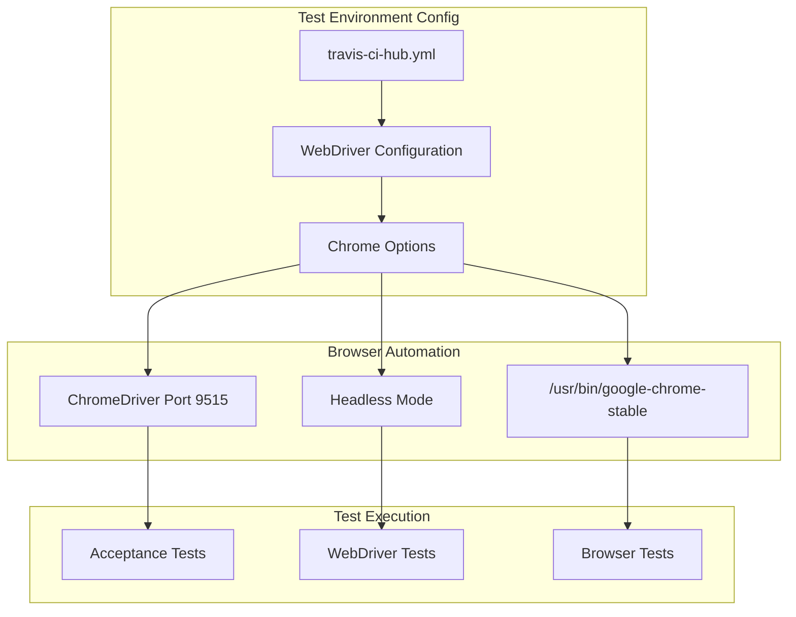
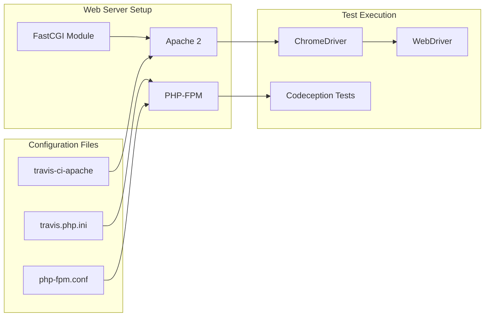
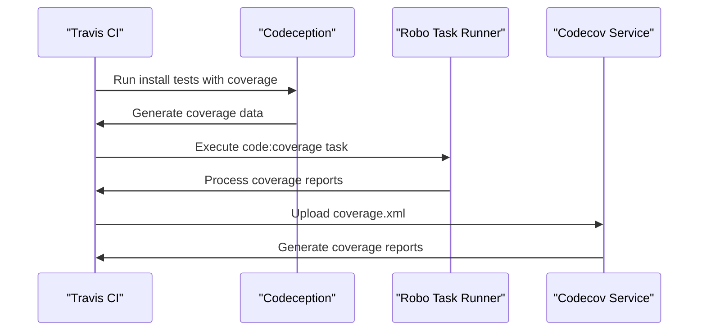

# Testing & CI/CD

<details>
<summary>Relevant source files</summary>

The following files were used as context for generating this wiki page:

- [.travis.yml](.travis.yml)
- [php_version.php](php_version.php)
- [tests/SuiteCRM/Test/Driver/PhpBrowserDriver.php](tests/SuiteCRM/Test/Driver/PhpBrowserDriver.php)
- [tests/SuiteCRM/Test/Driver/WebDriver.php](tests/SuiteCRM/Test/Driver/WebDriver.php)
- [tests/_envs/travis-ci-hub.yml](tests/_envs/travis-ci-hub.yml)
- [tests/_support/AcceptanceTester.php](tests/_support/AcceptanceTester.php)
- [travis.php.ini](travis.php.ini)

</details>


## Purpose and Scope

This document covers SuiteCRM's automated testing infrastructure and continuous integration/continuous deployment (CI/CD) processes. It explains the Travis CI configuration, Codeception testing framework, test execution pipeline, and code coverage reporting system. 

For information about the installation system that is tested as part of the CI pipeline, see [Installation System](#5.1). For details about the API architecture that includes API testing, see [API Architecture](#6.2).

## CI/CD Pipeline Architecture

SuiteCRM uses Travis CI as its primary continuous integration platform, orchestrating multiple test suites and validation steps across different environments.

### Travis CI Pipeline Flow



**Sources:** [.travis.yml:1-115]()

### Environment Configuration Matrix

The CI pipeline supports multiple testing environments and validation steps:

| Test Type | PHP Version | Services | Purpose |
|-----------|-------------|----------|---------|
| Main Tests | 7.4 | MySQL 5.7, Elasticsearch, Chrome | Full test suite execution |
| Composer Validation | 7.4 | None | Dependency validation |
| Code Coverage | 7.4 | MySQL 5.7, Elasticsearch, Chrome | Coverage reporting |

**Sources:** [.travis.yml:4-19]()

## Testing Framework Architecture

SuiteCRM uses the Codeception testing framework with custom drivers and support classes to handle different types of testing scenarios.

### Codeception Framework Structure



**Sources:** [tests/_support/AcceptanceTester.php:1-126](), [tests/SuiteCRM/Test/Driver/WebDriver.php:1-95](), [tests/SuiteCRM/Test/Driver/PhpBrowserDriver.php:1-57]()

### Test Environment Configuration

The testing framework supports different browser environments through configuration:



**Sources:** [tests/_envs/travis-ci-hub.yml:1-18]()

## Test Types and Execution

The CI pipeline executes multiple test types in a specific sequence to ensure comprehensive validation.

### Test Execution Flow

| Phase | Test Type | Framework | Command | Purpose |
|-------|-----------|-----------|---------|---------|
| 1 | Installation | Codeception | `codecept run install` | Validates installation wizard |
| 2 | Unit Tests | PHPUnit | `phpunit --configuration tests/phpunit.xml.dist` | Unit test execution |
| 3 | API Tests | Codeception | `codecept run tests/api/V8/` | API functionality validation |
| 4 | Acceptance Tests | Codeception | `codecept run acceptance` | End-to-end user scenarios |

**Sources:** [.travis.yml:74-98]()

### AcceptanceTester Helper Methods

The `AcceptanceTester` class provides specialized methods for common testing scenarios:

#### Authentication Methods
- `login($username, $password)` - Generic login functionality
- `loginAsAdmin()` - Admin user login using configured credentials
- `logout()` - User logout through menu navigation

#### Validation Methods
- `dontSeeMissingLabels()` - Ensures no untranslated labels (LBL_ prefixes)
- `dontSeeErrors()` - Checks for PHP warnings, notices, and errors

#### Navigation Methods
- `visitPage($module, $action, $record = null)` - Navigate to specific SuiteCRM pages

**Sources:** [tests/_support/AcceptanceTester.php:60-124]()

## Environment Setup and Configuration

### PHP Version Requirements

SuiteCRM defines specific PHP version requirements for different environments:

```php
define('SUITECRM_PHP_MIN_VERSION', '7.4.0');
define('SUITECRM_PHP_REC_VERSION', '7.4.0');
```

**Sources:** [php_version.php:7-10]()

### Travis CI Environment Variables

The CI environment uses specific configuration variables:

| Variable | Value | Purpose |
|----------|-------|---------|
| `INSTANCE_URL` | `http://localhost` | Base URL for testing |
| `DATABASE_DRIVER` | `MYSQL` | Database type |
| `DATABASE_NAME` | `automated_tests` | Test database name |
| `DATABASE_HOST` | `localhost` | Database host |
| `DATABASE_USER` | `automated_tests` | Database user |
| `DATABASE_PASSWORD` | `automated_tests` | Database password |
| `INSTANCE_ADMIN_USER` | `admin` | Default admin username |
| `INSTANCE_ADMIN_PASSWORD` | `admin1` | Default admin password |

**Sources:** [.travis.yml:31-32]()

### Apache and PHP-FPM Configuration

The CI pipeline configures Apache with PHP-FPM for web server testing:



**Sources:** [.travis.yml:52-68]()

## Code Coverage and Reporting

### Coverage Collection Process

The code coverage pipeline uses multiple tools for comprehensive coverage reporting:



The coverage collection command sequence:
1. `./vendor/bin/codecept run install --env travis-ci-hub -f --ext DotReporter`
2. `./vendor/bin/robo code:coverage --ci`
3. `bash <(curl -s https://codecov.io/bash) -f tests/_output/coverage.xml`

**Sources:** [.travis.yml:19]()

### PHP Configuration for Testing

Travis CI uses a custom PHP configuration to optimize testing performance:

```ini
memory_limit = -1
display_errors = On
log_errors = On
trace_errors = On
error_log = error.log
```

**Sources:** [travis.php.ini:1-6]()

## Branch-Based CI Execution

The CI pipeline executes on specific branches to ensure proper testing coverage:

- `master` - Production branch
- `develop` - Development branch  
- `hotfix.*` - Hotfix branches
- `feature.*` - Feature branches
- `fix.*` - Bug fix branches
- `staging.*` - Staging branches

**Sources:** [.travis.yml:107-115]()