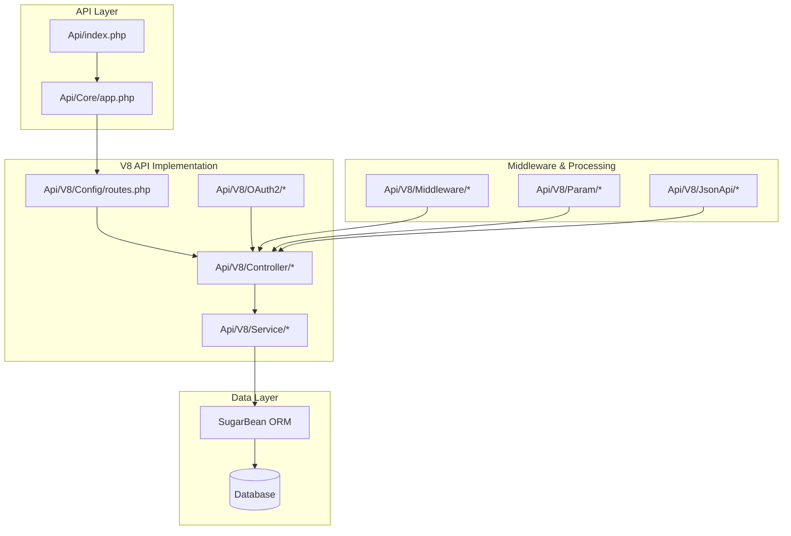
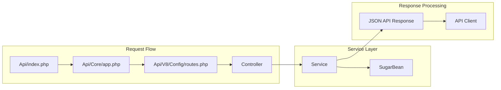
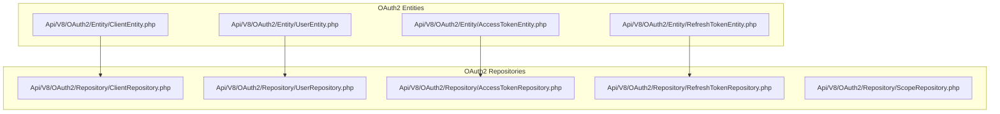
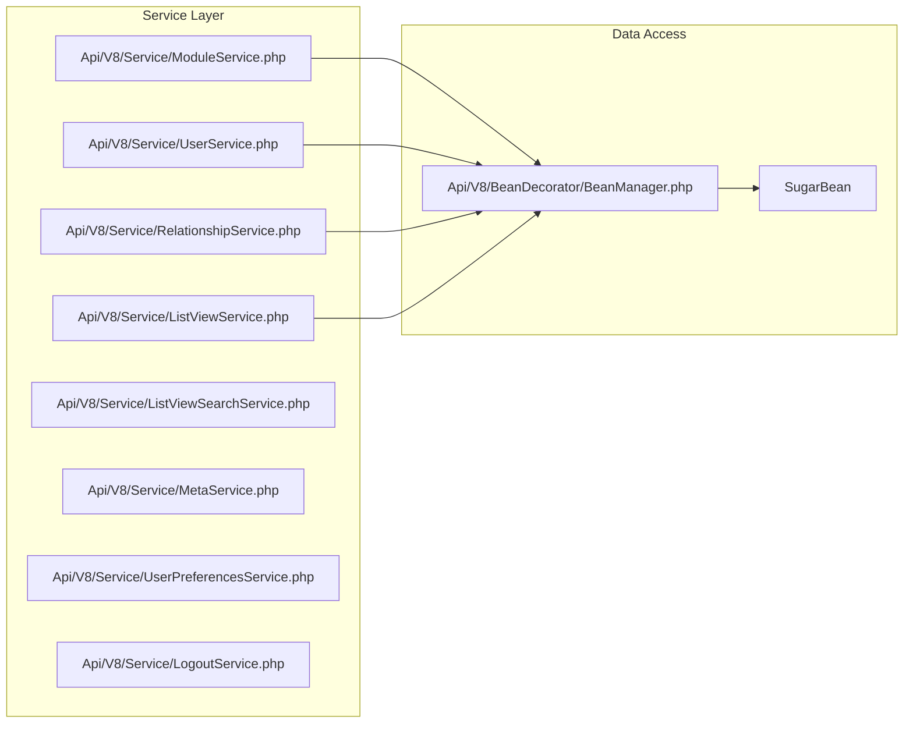
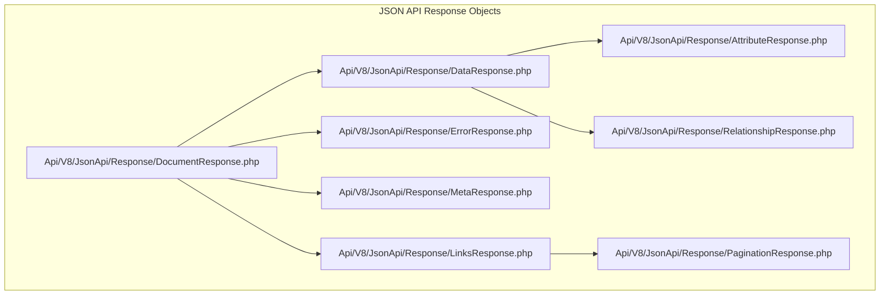
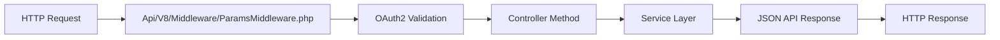
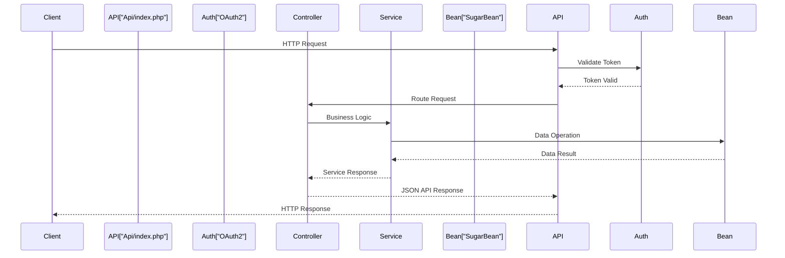

# API Architecture

Relevant source files

The following files were used as context for generating this wiki page:

- [README.md](README.md)
- [composer.json](composer.json)
- [composer.lock](composer.lock)
- [files.md5](files.md5)
- [include/utils.php](include/utils.php)
- [modules/Import/tpls/last.tpl](modules/Import/tpls/last.tpl)
- [modules/Import/tpls/listview.tpl](modules/Import/tpls/listview.tpl)
- [suitecrm_version.php](suitecrm_version.php)
- [themes/SuiteP/css/Dawn/style.css](themes/SuiteP/css/Dawn/style.css)
- [themes/SuiteP/css/Dawn/variables.scss](themes/SuiteP/css/Dawn/variables.scss)
- [themes/SuiteP/css/Day/style.css](themes/SuiteP/css/Day/style.css)
- [themes/SuiteP/css/Day/variables.scss](themes/SuiteP/css/Day/variables.scss)
- [themes/SuiteP/css/Dusk/style.css](themes/SuiteP/css/Dusk/style.css)
- [themes/SuiteP/css/Dusk/variables.scss](themes/SuiteP/css/Dusk/variables.scss)
- [themes/SuiteP/css/Night/style.css](themes/SuiteP/css/Night/style.css)
- [themes/SuiteP/css/Night/variables.scss](themes/SuiteP/css/Night/variables.scss)
- [themes/SuiteP/css/suitep-base/editview.scss](themes/SuiteP/css/suitep-base/editview.scss)
- [themes/SuiteP/css/suitep-base/listview.scss](themes/SuiteP/css/suitep-base/listview.scss)
- [themes/SuiteP/css/suitep-base/navbar.scss](themes/SuiteP/css/suitep-base/navbar.scss)

This document covers the SuiteCRM V8 REST API architecture, including its core components, authentication mechanisms, request flow, and service layer organization. The API provides programmatic access to SuiteCRM's business entities and functionality through a RESTful interface following JSON API specifications.

For information about user interface interactions, see [User Interface System](#3). For database and data layer details, see [Data Layer (SugarBean)](#2.2).

## Overview

The SuiteCRM API architecture is built around a modern REST API implementation (V8) that provides standardized access to CRM data and operations. The system follows a layered architecture with clear separation between authentication, routing, business logic, and data persistence.

Sources: [Api/index.php](), [Api/Core/app.php](), [Api/V8/Config/routes.php]()

## V8 API Structure

The V8 API represents the current generation of SuiteCRM's REST API, implementing a comprehensive set of endpoints for module management, user operations, and system administration.

### Core Components

| Component | Location | Purpose |
|-----------|----------|---------|
| Entry Point | `Api/index.php` | Main API entry point and bootstrap |
| Application Core | `Api/Core/app.php` | Slim framework application setup |
| Route Configuration | `Api/V8/Config/routes.php` | API endpoint definitions |
| Service Container | `Api/V8/Config/services.php` | Dependency injection configuration |

Sources: [Api/index.php](), [Api/Core/app.php](), [Api/V8/Config/routes.php](), [Api/V8/Config/services.php]()

## Authentication System

The API implements OAuth2 authentication with support for client credentials and refresh token flows.

### OAuth2 Implementation

### Authentication Flow

| Step | Component | Description |
|------|-----------|-------------|
| 1 | Client Registration | OAuth2 client credentials setup |
| 2 | Token Request | Client requests access token using credentials |
| 3 | Token Validation | API validates token for each request |
| 4 | Token Refresh | Refresh tokens extend session lifecycle |

Sources: [Api/V8/OAuth2/Entity/](), [Api/V8/OAuth2/Repository/]()

## Controller Layer

The controller layer handles HTTP request routing and delegates business logic to appropriate services.

### Primary Controllers

```mermaid
graph TB
    BaseController["Api/V8/Controller/BaseController.php"]
    
    subgraph "Entity Controllers"
        ModuleController["Api/V8/Controller/ModuleController.php"]
        UserController["Api/V8/Controller/UserController.php"]
        RelationshipController["Api/V8/Controller/RelationshipController.php"]
    end
    
    subgraph "View Controllers"
        ListViewController["Api/V8/Controller/ListViewController.php"]
        ListViewSearchController["Api/V8/Controller/ListViewSearchController.php"]
    end
    
    subgraph "System Controllers"
        MetaController["Api/V8/Controller/MetaController.php"]
        UserPreferencesController["Api/V8/Controller/UserPreferencesController.php"]
        LogoutController["Api/V8/Controller/LogoutController.php"]
    end
    
    BaseController --> ModuleController
    BaseController --> UserController
    BaseController --> RelationshipController
    BaseController --> ListViewController
    BaseController --> ListViewSearchController
    BaseController --> MetaController
    BaseController --> UserPreferencesController
    BaseController --> LogoutController
```

### Controller Responsibilities

| Controller | Primary Function | Key Methods |
|------------|------------------|-------------|
| `ModuleController` | CRUD operations on modules | GET, POST, PATCH, DELETE |
| `UserController` | User account management | User authentication, profile |
| `RelationshipController` | Entity relationship management | Link/unlink related records |
| `ListViewController` | List view data retrieval | Paginated module records |
| `MetaController` | Metadata and configuration | Field definitions, module info |

Sources: [Api/V8/Controller/BaseController.php](), [Api/V8/Controller/ModuleController.php](), [Api/V8/Controller/UserController.php]()

## Service Layer

The service layer encapsulates business logic and provides a clean interface between controllers and data access.

### Service Operations

| Service | Core Functionality |
|---------|-------------------|
| `ModuleService` | Module CRUD, validation, business rules |
| `UserService` | User authentication, session management |
| `RelationshipService` | Entity relationship operations |
| `ListViewService` | Data retrieval with filtering, sorting |
| `MetaService` | System metadata and configuration |

Sources: [Api/V8/Service/ModuleService.php](), [Api/V8/Service/UserService.php](), [Api/V8/Service/RelationshipService.php]()

## JSON API Implementation

The API follows JSON API specification for consistent request/response formatting.

### Response Structure Components

### Helper Components

| Component | Purpose |
|-----------|---------|
| `AttributeObjectHelper` | Processes entity attributes |
| `RelationshipObjectHelper` | Manages entity relationships |
| `PaginationObjectHelper` | Handles pagination metadata |

Sources: [Api/V8/JsonApi/Response/](), [Api/V8/JsonApi/Helper/]()

## Request Processing Pipeline

### Middleware System

### Parameter Processing

The API uses a comprehensive parameter system for request validation and processing:

| Parameter Type | Location | Purpose |
|---------------|----------|---------|
| Base Parameters | `Api/V8/Param/BaseParam.php` | Common parameter handling |
| Module Parameters | `Api/V8/Param/*ModuleParams.php` | Module-specific operations |
| Options | `Api/V8/Param/Options/` | Query options (filters, sorting) |

### Request Flow Example

Sources: [Api/V8/Middleware/ParamsMiddleware.php](), [Api/V8/Param/BaseParam.php](), [Api/V8/Param/Options/]()

## Configuration and Routing

### Service Configuration

The API uses dependency injection configured through service definitions:

| Configuration File | Purpose |
|-------------------|---------|
| `services.php` | Main service container setup |
| `controllers.php` | Controller service definitions |
| `factories.php` | Factory service definitions |
| `middlewares.php` | Middleware configuration |
| `validators.php` | Validation service setup |

### Route Management

Routes are defined in `Api/V8/Config/routes.php` and follow REST conventions:

- `GET /modules/{module}` - List module records
- `POST /modules/{module}` - Create module record  
- `GET /modules/{module}/{id}` - Get specific record
- `PATCH /modules/{module}/{id}` - Update record
- `DELETE /modules/{module}/{id}` - Delete record

Sources: [Api/V8/Config/services.php](), [Api/V8/Config/routes.php](), [Api/V8/Config/services/]()