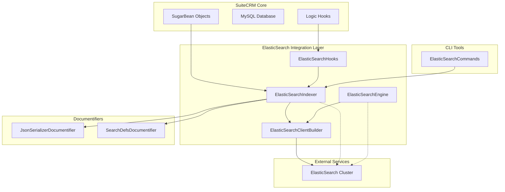
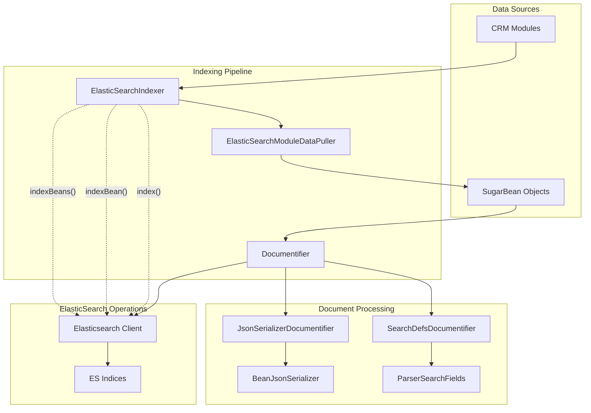
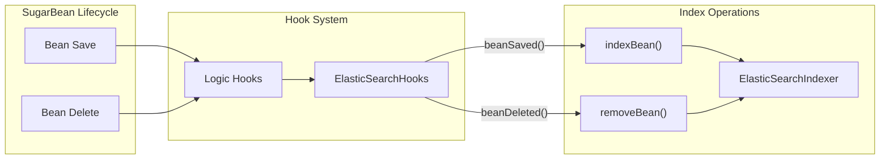
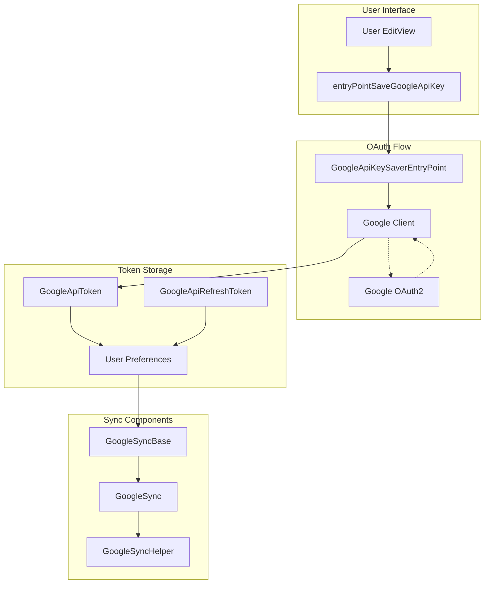
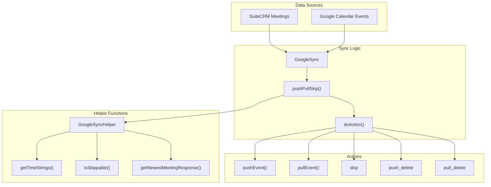
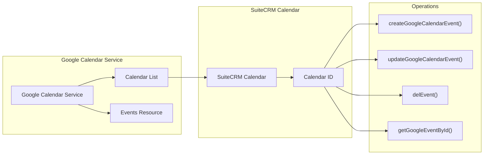

# External Integrations

<details>
<summary>Relevant source files</summary>

The following files were used as context for generating this wiki page:

- [include/GoogleSync/GoogleSync.php](include/GoogleSync/GoogleSync.php)
- [include/GoogleSync/GoogleSyncBase.php](include/GoogleSync/GoogleSyncBase.php)
- [include/GoogleSync/GoogleSyncExceptions.php](include/GoogleSync/GoogleSyncExceptions.php)
- [include/GoogleSync/GoogleSyncHelper.php](include/GoogleSync/GoogleSyncHelper.php)
- [lib/Robo/Plugin/Commands/ElasticSearchCommands.php](lib/Robo/Plugin/Commands/ElasticSearchCommands.php)
- [lib/Search/ElasticSearch/ElasticSearchClientBuilder.php](lib/Search/ElasticSearch/ElasticSearchClientBuilder.php)
- [lib/Search/ElasticSearch/ElasticSearchHooks.php](lib/Search/ElasticSearch/ElasticSearchHooks.php)
- [lib/Search/ElasticSearch/ElasticSearchIndexer.php](lib/Search/ElasticSearch/ElasticSearchIndexer.php)
- [lib/Search/Index/AbstractIndexer.php](lib/Search/Index/AbstractIndexer.php)
- [lib/Search/Index/Documentify/AbstractDocumentifier.php](lib/Search/Index/Documentify/AbstractDocumentifier.php)
- [lib/Search/Index/Documentify/JsonSerializerDocumentifier.php](lib/Search/Index/Documentify/JsonSerializerDocumentifier.php)
- [lib/Search/Index/Documentify/SearchDefsDocumentifier.php](lib/Search/Index/Documentify/SearchDefsDocumentifier.php)
- [lib/Search/Index/Documentify/SearchDefsDocumentifier.yml](lib/Search/Index/Documentify/SearchDefsDocumentifier.yml)
- [lib/Utility/BeanJsonSerializer.php](lib/Utility/BeanJsonSerializer.php)
- [modules/Configurator/language/en_us.lang.php](modules/Configurator/language/en_us.lang.php)
- [modules/Configurator/tpls/EditView.tpl](modules/Configurator/tpls/EditView.tpl)
- [modules/Configurator/views/view.edit.php](modules/Configurator/views/view.edit.php)
- [modules/Users/GoogleApiKeySaverEntryPoint.php](modules/Users/GoogleApiKeySaverEntryPoint.php)
- [modules/Users/entryPointSaveGoogleApiKey.php](modules/Users/entryPointSaveGoogleApiKey.php)
- [modules/Users/googleApiKeySaverEntryPointError.tpl](modules/Users/googleApiKeySaverEntryPointError.tpl)
- [tests/unit/phpunit/lib/Search/UI/SearchResultsControllerTest.php](tests/unit/phpunit/lib/Search/UI/SearchResultsControllerTest.php)
- [tests/unit/phpunit/lib/SuiteCRM/Log/CliLoggerHandlerTest.php](tests/unit/phpunit/lib/SuiteCRM/Log/CliLoggerHandlerTest.php)
- [tests/unit/phpunit/lib/SuiteCRM/Search/AbstractDocumentifierTest.php](tests/unit/phpunit/lib/SuiteCRM/Search/AbstractDocumentifierTest.php)
- [tests/unit/phpunit/lib/SuiteCRM/Search/ElasticSearch/ElasticSearchClientBuilderTest.php](tests/unit/phpunit/lib/SuiteCRM/Search/ElasticSearch/ElasticSearchClientBuilderTest.php)
- [tests/unit/phpunit/lib/SuiteCRM/Search/ElasticSearch/ElasticSearchEngineTest.php](tests/unit/phpunit/lib/SuiteCRM/Search/ElasticSearch/ElasticSearchEngineTest.php)
- [tests/unit/phpunit/lib/SuiteCRM/Search/ElasticSearch/ElasticSearchIndexerTest.php](tests/unit/phpunit/lib/SuiteCRM/Search/ElasticSearch/ElasticSearchIndexerTest.php)
- [tests/unit/phpunit/lib/SuiteCRM/Search/SearchTestAbstract.php](tests/unit/phpunit/lib/SuiteCRM/Search/SearchTestAbstract.php)
- [tests/unit/phpunit/lib/SuiteCRM/Search/SearchWrapperTest.php](tests/unit/phpunit/lib/SuiteCRM/Search/SearchWrapperTest.php)
- [tests/unit/phpunit/lib/SuiteCRM/Utility/ArrayMapperTest.php](tests/unit/phpunit/lib/SuiteCRM/Utility/ArrayMapperTest.php)
- [tests/unit/phpunit/lib/SuiteCRM/Utility/BeanJsonSerializerTest.php](tests/unit/phpunit/lib/SuiteCRM/Utility/BeanJsonSerializerTest.php)
- [tests/unit/phpunit/modules/Administration/BaseHandlerTest.php](tests/unit/phpunit/modules/Administration/BaseHandlerTest.php)
- [tests/unit/phpunit/modules/Users/GoogleApiKeySaverEntryPointMock.php](tests/unit/phpunit/modules/Users/GoogleApiKeySaverEntryPointMock.php)
- [tests/unit/phpunit/modules/Users/GoogleApiKeySaverEntryPointTest.php](tests/unit/phpunit/modules/Users/GoogleApiKeySaverEntryPointTest.php)

</details>


## Purpose and Scope

This document covers SuiteCRM's external service integrations, which extend the platform's capabilities by connecting to third-party systems. The primary integrations are ElasticSearch for advanced search functionality and Google Calendar for calendar synchronization.

For information about the core search system and its UI components, see [Search System](#5.3). For general API architecture and service layers, see [API Architecture](#6.2).

## ElasticSearch Integration

The ElasticSearch integration provides advanced full-text search capabilities that supplement SuiteCRM's built-in database search. This system maintains a synchronized search index of CRM data and offers sophisticated query capabilities.

### Architecture Overview



Sources: [lib/Search/ElasticSearch/ElasticSearchIndexer.php:1-592](), [lib/Search/ElasticSearch/ElasticSearchHooks.php:1-210](), [lib/Search/ElasticSearch/ElasticSearchClientBuilder.php:1-217]()

### Indexing Process

The indexing system converts SugarBean objects into search-friendly documents and maintains them in ElasticSearch indices.



The indexer supports two main documentifiers:

| Documentifier | Purpose | Configuration Source |
|---------------|---------|---------------------|
| `JsonSerializerDocumentifier` | Human-friendly documents with nested structure | Uses `BeanJsonSerializer` |
| `SearchDefsDocumentifier` | Customizable fields based on search definitions | Uses module search defs files |

Sources: [lib/Search/ElasticSearch/ElasticSearchIndexer.php:111-164](), [lib/Search/Index/Documentify/JsonSerializerDocumentifier.php:1-79](), [lib/Search/Index/Documentify/SearchDefsDocumentifier.php:1-214]()

### Real-time Index Updates

Logic hooks ensure the search index stays synchronized with database changes:



Sources: [lib/Search/ElasticSearch/ElasticSearchHooks.php:67-96](), [lib/Search/ElasticSearch/ElasticSearchHooks.php:123-190]()

### Configuration

ElasticSearch configuration is managed through the global `$sugar_config` array:

```php
$sugar_config['search']['ElasticSearch'] = [
    'enabled' => true,
    'host' => '127.0.0.1:9200',
    'user' => 'elastic_user',  // optional
    'pass' => 'elastic_pass'   // optional
];
```

The `ElasticSearchClientBuilder` class handles client configuration and connection management.

Sources: [lib/Search/ElasticSearch/ElasticSearchClientBuilder.php:166-188](), [lib/Search/ElasticSearch/ElasticSearchIndexer.php:97-109]()

## Google Calendar Integration

The Google Calendar integration provides bidirectional synchronization between SuiteCRM meetings and Google Calendar events, allowing users to maintain unified calendar views.

### Authentication Architecture



Sources: [modules/Users/entryPointSaveGoogleApiKey.php:1-58](), [modules/Users/GoogleApiKeySaverEntryPoint.php:1-265](), [include/GoogleSync/GoogleSyncBase.php:1-1127]()

### Synchronization Process

The sync system implements a sophisticated conflict resolution strategy:



The sync decision logic follows this priority:

| Condition | Action | Description |
|-----------|--------|-------------|
| Only SuiteCRM meeting exists | `push` | Create Google event |
| Only Google event exists | `pull` | Create SuiteCRM meeting |
| Both exist, no conflicts | `skip` | No action needed |
| Google newer | `pull` or `pull_delete` | Update from Google |
| SuiteCRM newer | `push` or `push_delete` | Update to Google |

Sources: [include/GoogleSync/GoogleSync.php:194-228](), [include/GoogleSync/GoogleSyncHelper.php:69-80](), [include/GoogleSync/GoogleSyncHelper.php:123-136]()

### Calendar Management



The system automatically creates a "SuiteCRM" calendar in the user's Google account if it doesn't exist. The calendar name is configurable via `$sugar_config['google_calendar_sync_name']`.

Sources: [include/GoogleSync/GoogleSyncBase.php:328-371](), [include/GoogleSync/GoogleSyncBase.php:380-389](), [include/GoogleSync/GoogleSyncBase.php:397-427]()

## Configuration and Administration

### ElasticSearch Configuration

ElasticSearch can be enabled/disabled via the `ElasticSearchIndexer::isEnabled()` method, which checks the configuration:

```php
$sugar_config['search']['ElasticSearch']['enabled'] = true;
```

CLI commands are available for index management:

| Command | Description | Implementation |
|---------|-------------|----------------|
| `elastic:index` | Full or differential indexing | `ElasticSearchCommands::elasticIndex()` |
| `elastic:search` | Perform search queries | `ElasticSearchCommands::elasticSearch()` |
| `elastic:rm-index` | Remove all indices | `ElasticSearchCommands::elasticRmIndex()` |

Sources: [lib/Robo/Plugin/Commands/ElasticSearchCommands.php:117-122](), [lib/Robo/Plugin/Commands/ElasticSearchCommands.php:76-97](), [lib/Robo/Plugin/Commands/ElasticSearchCommands.php:127-133]()

### Google Calendar Configuration

Google Calendar integration requires:

1. **System Configuration**: Admin must configure OAuth credentials in `$sugar_config['google_auth_json']`
2. **User Authorization**: Each user must authorize SuiteCRM to access their Google Calendar
3. **Sync Preferences**: Users can enable/disable sync via `$user->getPreference('syncGCal', 'GoogleSync')`

The admin interface for Google configuration is available in the Configurator module.

Sources: [modules/Configurator/views/view.edit.php:176-185](), [include/GoogleSync/GoogleSyncBase.php:123-138](), [include/GoogleSync/GoogleSync.php:258-270]()

Both integrations support comprehensive error handling and logging through their respective logger systems, with ElasticSearch using Monolog and Google Sync using the standard SuiteCRM logger.