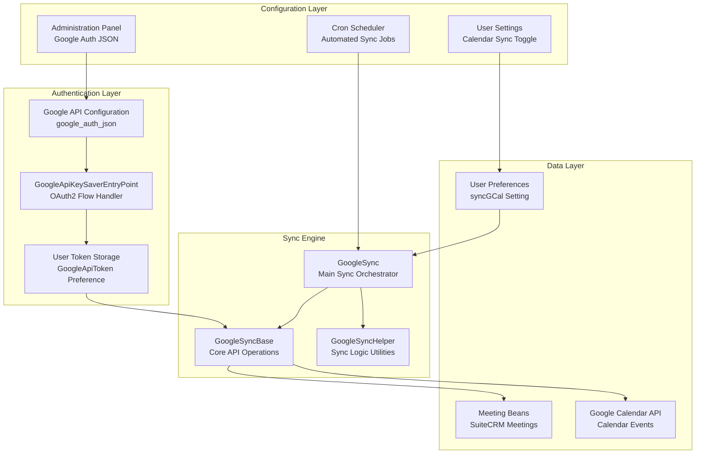
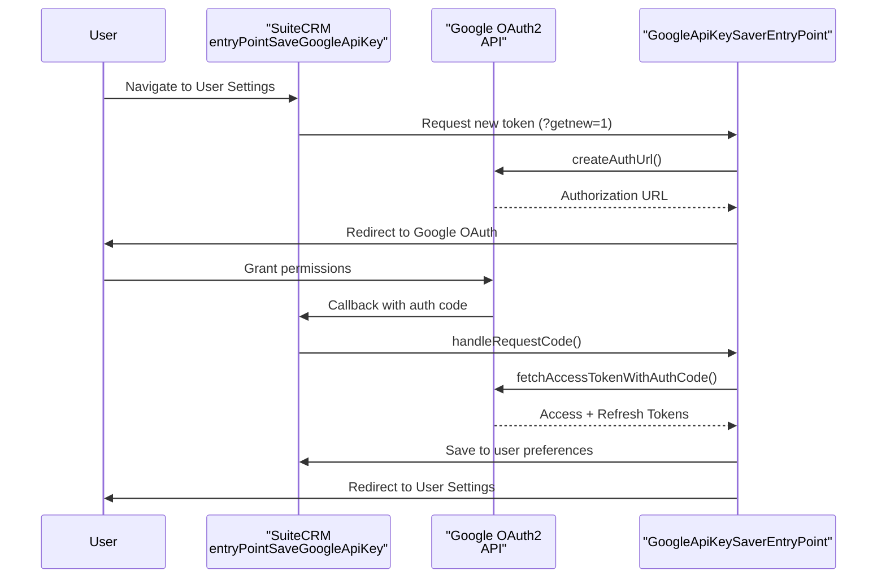
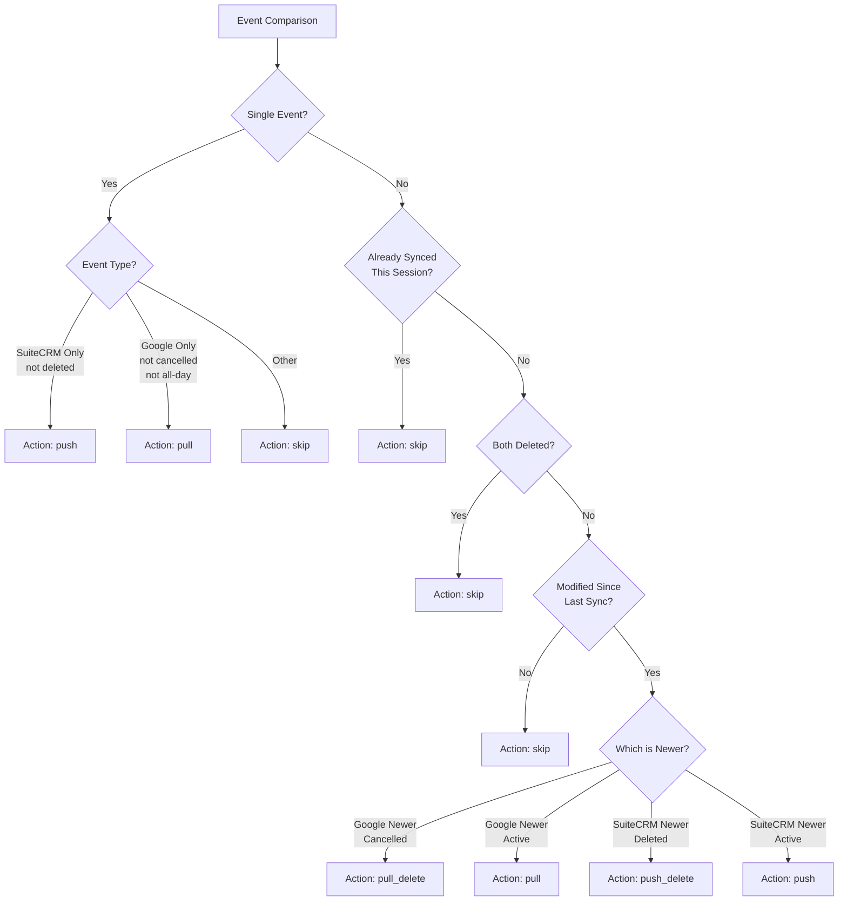
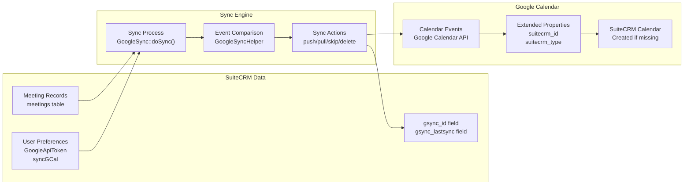
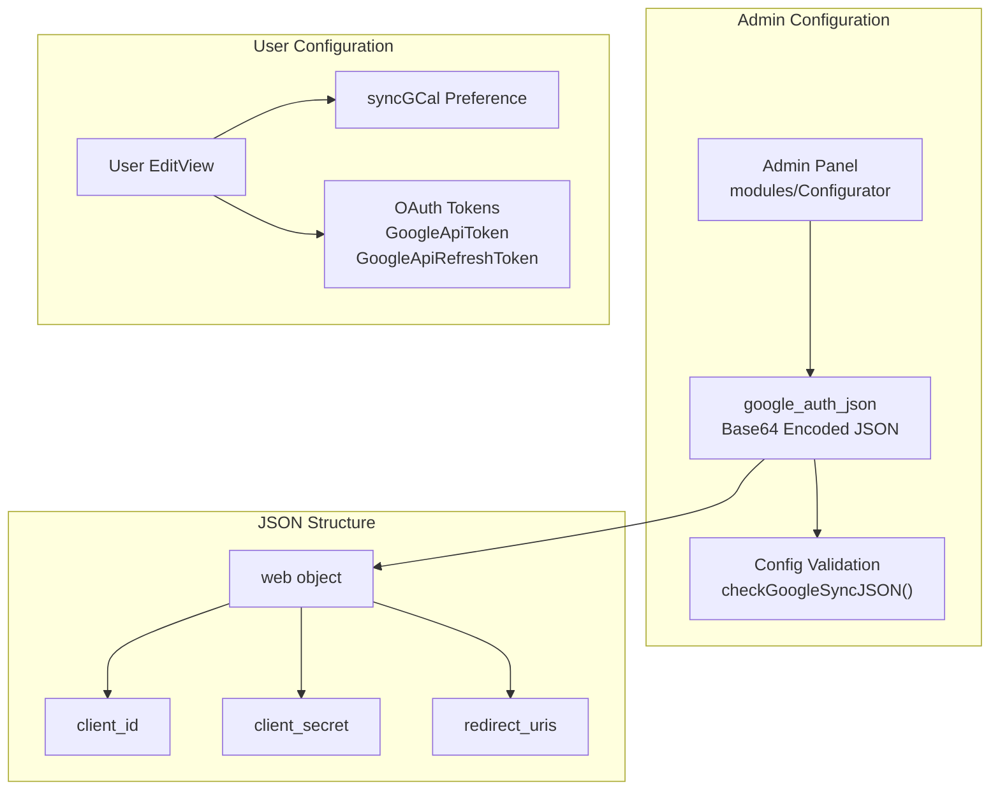
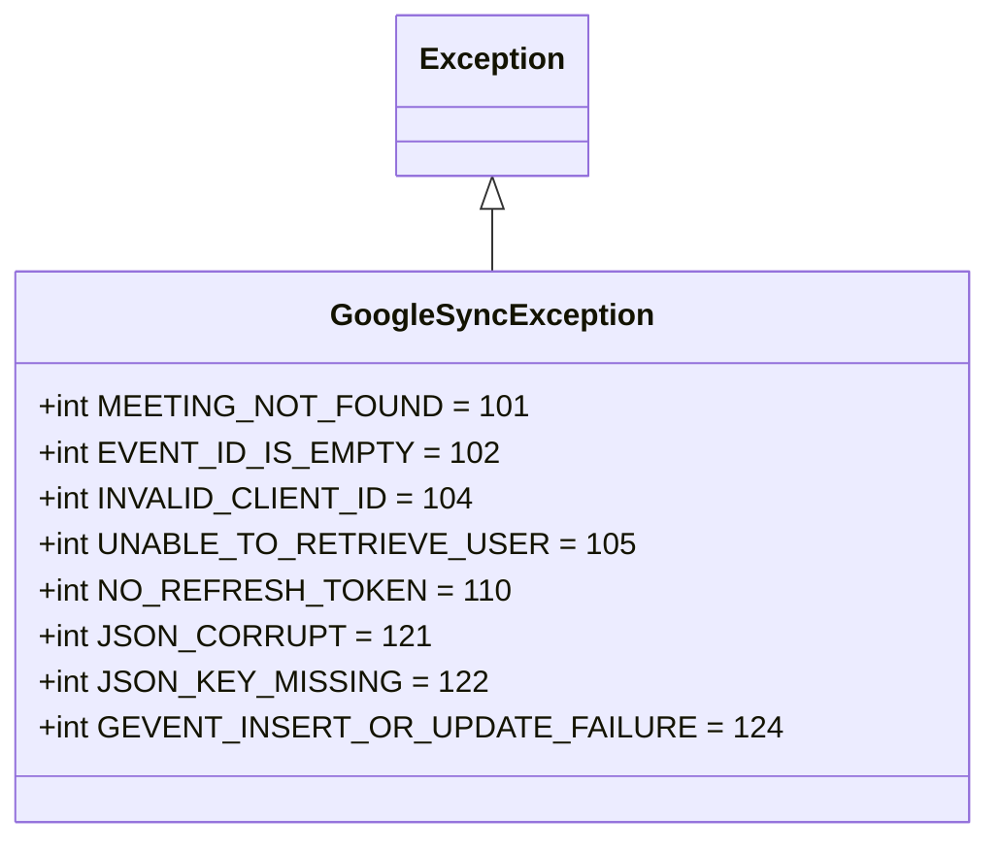
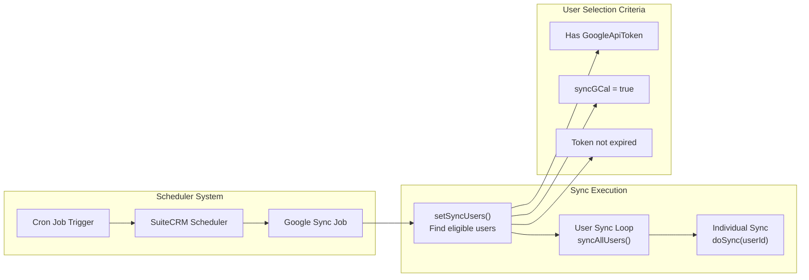

# Google Calendar Integration

Relevant source files

The following files were used as context for generating this wiki page:

- [include/GoogleSync/GoogleSync.php](include/GoogleSync/GoogleSync.php)
- [include/GoogleSync/GoogleSyncBase.php](include/GoogleSync/GoogleSyncBase.php)
- [include/GoogleSync/GoogleSyncExceptions.php](include/GoogleSync/GoogleSyncExceptions.php)
- [include/GoogleSync/GoogleSyncHelper.php](include/GoogleSync/GoogleSyncHelper.php)
- [modules/Configurator/language/en_us.lang.php](modules/Configurator/language/en_us.lang.php)
- [modules/Configurator/tpls/EditView.tpl](modules/Configurator/tpls/EditView.tpl)
- [modules/Configurator/views/view.edit.php](modules/Configurator/views/view.edit.php)
- [modules/Users/GoogleApiKeySaverEntryPoint.php](modules/Users/GoogleApiKeySaverEntryPoint.php)
- [modules/Users/entryPointSaveGoogleApiKey.php](modules/Users/entryPointSaveGoogleApiKey.php)
- [modules/Users/googleApiKeySaverEntryPointError.tpl](modules/Users/googleApiKeySaverEntryPointError.tpl)
- [tests/unit/phpunit/lib/Search/UI/SearchResultsControllerTest.php](tests/unit/phpunit/lib/Search/UI/SearchResultsControllerTest.php)
- [tests/unit/phpunit/lib/SuiteCRM/Log/CliLoggerHandlerTest.php](tests/unit/phpunit/lib/SuiteCRM/Log/CliLoggerHandlerTest.php)
- [tests/unit/phpunit/lib/SuiteCRM/Search/AbstractDocumentifierTest.php](tests/unit/phpunit/lib/SuiteCRM/Search/AbstractDocumentifierTest.php)
- [tests/unit/phpunit/lib/SuiteCRM/Search/ElasticSearch/ElasticSearchClientBuilderTest.php](tests/unit/phpunit/lib/SuiteCRM/Search/ElasticSearch/ElasticSearchClientBuilderTest.php)
- [tests/unit/phpunit/lib/SuiteCRM/Search/ElasticSearch/ElasticSearchEngineTest.php](tests/unit/phpunit/lib/SuiteCRM/Search/ElasticSearch/ElasticSearchEngineTest.php)
- [tests/unit/phpunit/lib/SuiteCRM/Search/ElasticSearch/ElasticSearchIndexerTest.php](tests/unit/phpunit/lib/SuiteCRM/Search/ElasticSearch/ElasticSearchIndexerTest.php)
- [tests/unit/phpunit/lib/SuiteCRM/Search/SearchTestAbstract.php](tests/unit/phpunit/lib/SuiteCRM/Search/SearchTestAbstract.php)
- [tests/unit/phpunit/lib/SuiteCRM/Search/SearchWrapperTest.php](tests/unit/phpunit/lib/SuiteCRM/Search/SearchWrapperTest.php)
- [tests/unit/phpunit/lib/SuiteCRM/Utility/ArrayMapperTest.php](tests/unit/phpunit/lib/SuiteCRM/Utility/ArrayMapperTest.php)
- [tests/unit/phpunit/lib/SuiteCRM/Utility/BeanJsonSerializerTest.php](tests/unit/phpunit/lib/SuiteCRM/Utility/BeanJsonSerializerTest.php)
- [tests/unit/phpunit/modules/Administration/BaseHandlerTest.php](tests/unit/phpunit/modules/Administration/BaseHandlerTest.php)
- [tests/unit/phpunit/modules/Users/GoogleApiKeySaverEntryPointMock.php](tests/unit/phpunit/modules/Users/GoogleApiKeySaverEntryPointMock.php)
- [tests/unit/phpunit/modules/Users/GoogleApiKeySaverEntryPointTest.php](tests/unit/phpunit/modules/Users/GoogleApiKeySaverEntryPointTest.php)

## Purpose and Scope

This document covers SuiteCRM's Google Calendar Integration system, which provides bidirectional synchronization between SuiteCRM Meetings and Google Calendar events. The integration supports OAuth2 authentication, user-level sync preferences, and automated scheduling via cron jobs. For information about other external integrations, see [External Integrations](#7). For ElasticSearch integration details, see [ElasticSearch Integration](#7.2).

## Architecture Overview

The Google Calendar Integration consists of several interconnected components that handle authentication, synchronization logic, and configuration management.

### System Component Architecture

**Sources:** [include/GoogleSync/GoogleSync.php:57-313](), [include/GoogleSync/GoogleSyncBase.php:60-285](), [modules/Users/GoogleApiKeySaverEntryPoint.php:58-264]()

### OAuth2 Authentication Flow

**Sources:** [modules/Users/GoogleApiKeySaverEntryPoint.php:106-198](), [modules/Users/entryPointSaveGoogleApiKey.php:55-57]()

## Core Classes and Responsibilities

### GoogleSync Class

The `GoogleSync` class serves as the main orchestrator for synchronization operations.

| Method | Purpose | Line Reference |
|--------|---------|---------------|
| `doSync()` | Performs sync for a single user | [include/GoogleSync/GoogleSync.php:144-169]() |
| `syncAllUsers()` | Orchestrates sync for all configured users | [include/GoogleSync/GoogleSync.php:281-312]() |
| `pushPullSkip()` | Determines sync action for event pairs | [include/GoogleSync/GoogleSync.php:204-228]() |
| `doAction()` | Executes the determined sync action | [include/GoogleSync/GoogleSync.php:100-135]() |

### GoogleSyncBase Class

The `GoogleSyncBase` class provides core functionality for Google API interactions and data management.

| Method | Purpose | Line Reference |
|--------|---------|---------------|
| `initUserService()` | Initializes Google services for a user | [include/GoogleSync/GoogleSyncBase.php:257-285]() |
| `pushEvent()` | Syncs SuiteCRM meeting to Google | [include/GoogleSync/GoogleSyncBase.php:556-586]() |
| `pullEvent()` | Syncs Google event to SuiteCRM | [include/GoogleSync/GoogleSyncBase.php:631-662]() |
| `getUserMeetings()` | Retrieves user's SuiteCRM meetings | [include/GoogleSync/GoogleSyncBase.php:295-318]() |
| `getUserGoogleEvents()` | Retrieves user's Google calendar events | [include/GoogleSync/GoogleSyncBase.php:397-427]() |

**Sources:** [include/GoogleSync/GoogleSync.php:48-313](), [include/GoogleSync/GoogleSyncBase.php:51-285]()

## Synchronization Logic

### Sync Decision Matrix

The system uses sophisticated logic to determine the appropriate action when synchronizing events between SuiteCRM and Google Calendar.

**Sources:** [include/GoogleSync/GoogleSyncHelper.php:69-170](), [include/GoogleSync/GoogleSync.php:204-228]()

### Data Flow Architecture

**Sources:** [include/GoogleSync/GoogleSyncBase.php:295-427](), [include/GoogleSync/GoogleSyncHelper.php:92-170]()

## Configuration Management

### System-Level Configuration

The Google Calendar integration requires system-wide configuration of Google API credentials stored in the `google_auth_json` configuration variable.

**Sources:** [modules/Configurator/views/view.edit.php:176-209](), [modules/Users/GoogleApiKeySaverEntryPoint.php:106-142]()

### User Preferences Schema

| Preference Key | Category | Purpose | Format |
|---------------|----------|---------|---------|
| `GoogleApiToken` | `GoogleSync` | OAuth access token | Base64 encoded JSON |
| `GoogleApiRefreshToken` | `GoogleSync` | OAuth refresh token | Base64 encoded string |
| `syncGCal` | `GoogleSync` | Enable/disable sync | Boolean |

**Sources:** [include/GoogleSync/GoogleSyncBase.php:186-195](), [modules/Users/GoogleApiKeySaverEntryPoint.php:190-194]()

## Error Handling and Exceptions

### Exception Hierarchy

The system defines a comprehensive set of custom exceptions for different failure scenarios.

### Common Error Scenarios

| Error Code | Constant | Typical Cause | Recovery Action |
|------------|----------|---------------|-----------------|
| 101 | `MEETING_NOT_FOUND` | Database query failure | Retry or skip record |
| 110 | `NO_REFRESH_TOKEN` | Missing refresh token | Re-authenticate user |
| 121 | `JSON_CORRUPT` | Invalid Google auth JSON | Reconfigure admin settings |
| 124 | `GEVENT_INSERT_OR_UPDATE_FAILURE` | Google API error | Retry with backoff |

**Sources:** [include/GoogleSync/GoogleSyncExceptions.php:51-84]()

## Scheduling and Automation

### Cron Job Integration

The system supports automated synchronization through SuiteCRM's scheduler system, allowing administrators to configure regular sync intervals.

**Sources:** [include/GoogleSync/GoogleSync.php:239-312](), [include/GoogleSync/GoogleSync.php:281-312]()

## Integration Points

### Meeting Module Integration

The Google Calendar integration extends the SuiteCRM Meeting module with additional fields for tracking synchronization state.

| Field | Purpose | Type |
|-------|---------|------|
| `gsync_id` | Google Calendar event ID | VARCHAR |
| `gsync_lastsync` | Last synchronization timestamp | TIMESTAMP |

### Google Calendar API Integration

The system interacts with the Google Calendar API through the official Google Client Library, specifically using:

- `\Google\Client` for authentication
- `\Google\Service\Calendar` for calendar operations  
- `\Google\Service\Calendar\Event` for event manipulation

**Sources:** [include/GoogleSync/GoogleSyncBase.php:65-78](), [include/GoogleSync/GoogleSyncBase.php:221-242]()