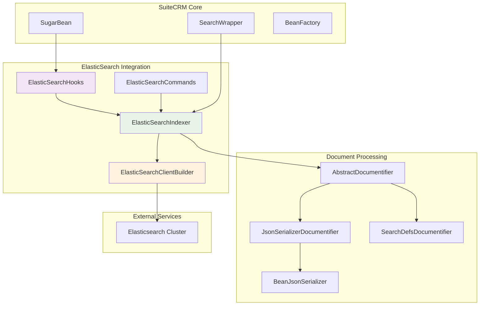
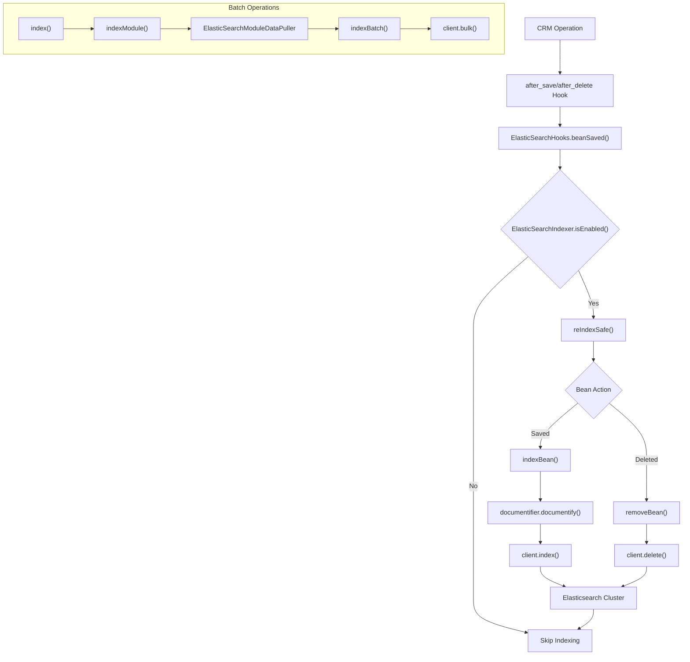
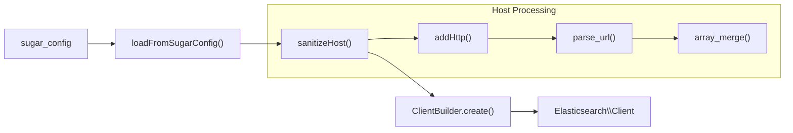
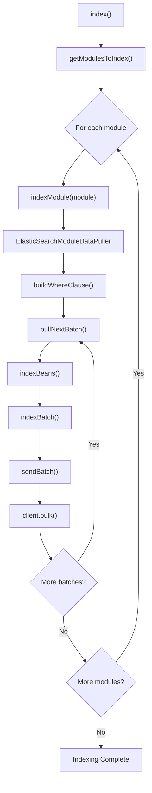
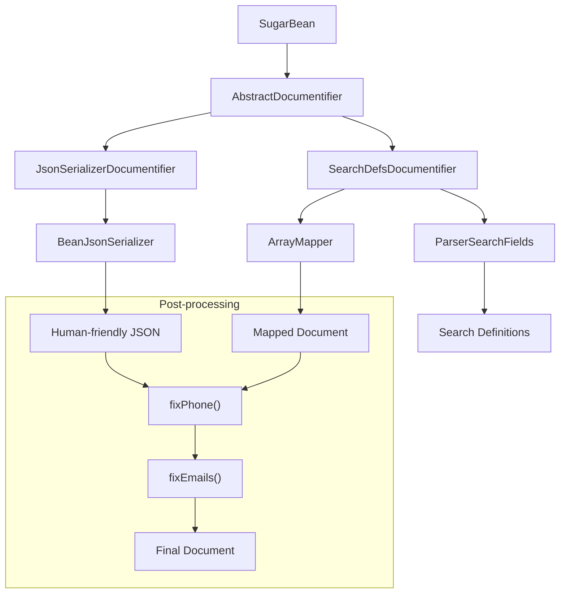
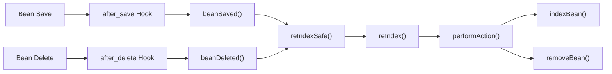
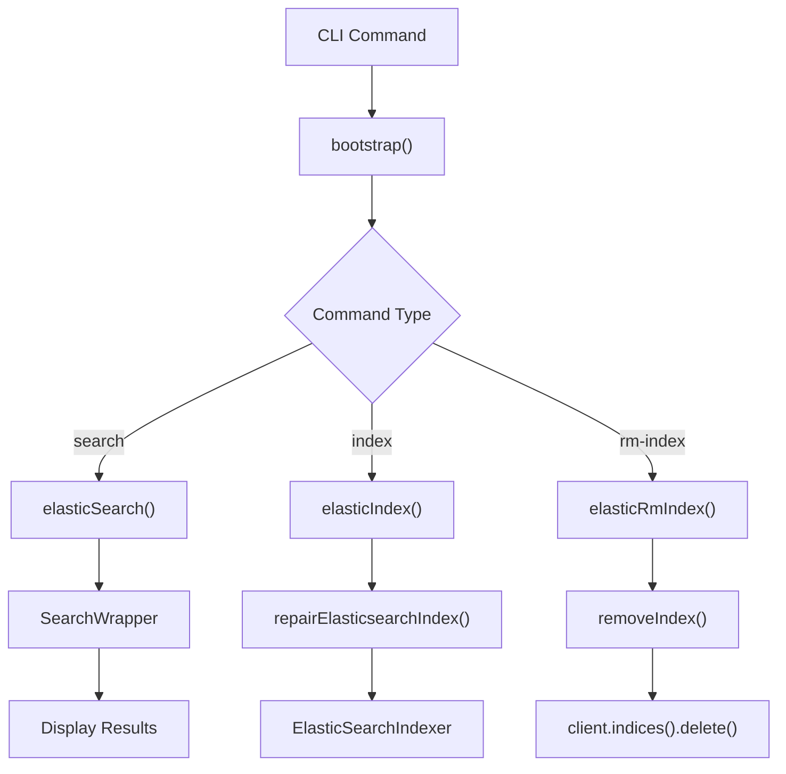

# ElasticSearch Integration

Relevant source files

The following files were used as context for generating this wiki page:

- [lib/Robo/Plugin/Commands/ElasticSearchCommands.php](lib/Robo/Plugin/Commands/ElasticSearchCommands.php)
- [lib/Search/ElasticSearch/ElasticSearchClientBuilder.php](lib/Search/ElasticSearch/ElasticSearchClientBuilder.php)
- [lib/Search/ElasticSearch/ElasticSearchHooks.php](lib/Search/ElasticSearch/ElasticSearchHooks.php)
- [lib/Search/ElasticSearch/ElasticSearchIndexer.php](lib/Search/ElasticSearch/ElasticSearchIndexer.php)
- [lib/Search/Index/AbstractIndexer.php](lib/Search/Index/AbstractIndexer.php)
- [lib/Search/Index/Documentify/AbstractDocumentifier.php](lib/Search/Index/Documentify/AbstractDocumentifier.php)
- [lib/Search/Index/Documentify/JsonSerializerDocumentifier.php](lib/Search/Index/Documentify/JsonSerializerDocumentifier.php)
- [lib/Search/Index/Documentify/SearchDefsDocumentifier.php](lib/Search/Index/Documentify/SearchDefsDocumentifier.php)
- [lib/Search/Index/Documentify/SearchDefsDocumentifier.yml](lib/Search/Index/Documentify/SearchDefsDocumentifier.yml)
- [lib/Utility/BeanJsonSerializer.php](lib/Utility/BeanJsonSerializer.php)

This document covers SuiteCRM's integration with Elasticsearch, which provides advanced full-text search capabilities across CRM data. The integration includes indexing of SugarBean entities, real-time synchronization through hooks, and a comprehensive search interface.

For information about the broader search framework and ListView search functionality, see [Search System](#5.3).

## Architecture Overview

The ElasticSearch integration consists of several interconnected components that handle indexing, synchronization, and search operations.

### Core Component Architecture

Sources: [lib/Search/ElasticSearch/ElasticSearchIndexer.php:65](), [lib/Search/ElasticSearch/ElasticSearchClientBuilder.php:52](), [lib/Search/ElasticSearch/ElasticSearchHooks.php:57](), [lib/Robo/Plugin/Commands/ElasticSearchCommands.php:60]()

### Indexing and Search Flow

Sources: [lib/Search/ElasticSearch/ElasticSearchHooks.php:73-96](), [lib/Search/ElasticSearch/ElasticSearchIndexer.php:112-164](), [lib/Search/ElasticSearch/ElasticSearchIndexer.php:288-305]()

## Configuration System

ElasticSearch integration is configured through the global `$sugar_config` array and managed by the `ElasticSearchClientBuilder` class.

### Configuration Structure

The configuration is stored in `$sugar_config['search']['ElasticSearch']` and includes:

| Configuration Key | Purpose | Default |
|------------------|---------|---------|
| `enabled` | Enable/disable ElasticSearch | `false` |
| `host` | ElasticSearch server host | `127.0.0.1` |
| `user` | Authentication username | Empty |
| `pass` | Authentication password | Empty |

### Client Configuration

The `ElasticSearchClientBuilder` class handles client instantiation and host configuration:

Sources: [lib/Search/ElasticSearch/ElasticSearchClientBuilder.php:61-70](), [lib/Search/ElasticSearch/ElasticSearchClientBuilder.php:166-188](), [lib/Search/ElasticSearch/ElasticSearchClientBuilder.php:83-116]()

## Indexing System

The indexing system is built around the `ElasticSearchIndexer` class, which extends `AbstractIndexer` and implements comprehensive indexing capabilities.

### Indexer Lifecycle

The `ElasticSearchIndexer` supports both full and differential indexing modes:

| Indexing Mode | Description | Performance |
|---------------|-------------|-------------|
| Full Indexing | Re-indexes all records | Slower, complete rebuild |
| Differential Indexing | Only changed records since last run | Faster, incremental updates |

The indexer uses traits for modular functionality:

- `IndexingStatisticsTrait` - Tracks indexing statistics
- `IndexingLockFileTrait` - Manages lock files for differential indexing
- `IndexingSchedulerTrait` - Handles scheduled indexing operations

### Module Processing

Sources: [lib/Search/ElasticSearch/ElasticSearchIndexer.php:112-164](), [lib/Search/ElasticSearch/ElasticSearchIndexer.php:201-239](), [lib/Search/ElasticSearch/ElasticSearchIndexer.php:433-461]()

### Batch Processing

The indexer processes records in configurable batches (default: 1000 records) to optimize performance:

- Batch size is configurable via `setBatchSize()`
- Deleted beans are handled as delete operations in the same batch
- Error handling tracks failed operations and adjusts statistics

Sources: [lib/Search/ElasticSearch/ElasticSearchIndexer.php:76](), [lib/Search/ElasticSearch/ElasticSearchIndexer.php:391-402](), [lib/Search/ElasticSearch/ElasticSearchIndexer.php:495-525]()

## Document Transformation

The system uses documentifiers to convert `SugarBean` objects into searchable documents. Two main implementations are available:

### Documentifier Architecture

Sources: [lib/Search/Index/Documentify/AbstractDocumentifier.php:56](), [lib/Search/Index/Documentify/JsonSerializerDocumentifier.php:56](), [lib/Search/Index/Documentify/SearchDefsDocumentifier.php:61]()

### JsonSerializerDocumentifier

This documentifier creates human-friendly documents using the `BeanJsonSerializer`:

- Provides nested structure for complex relationships
- Includes all bean fields with standardized formatting
- Suitable for advanced search queries
- Does not use search definitions (non-customizable)

### SearchDefsDocumentifier

This documentifier uses module-specific search definitions:

- Customizable via search definition files
- Module-specific field mapping
- Uses `ParserSearchFields` to read configuration
- Supports field mapping through YAML configuration

Sources: [lib/Search/Index/Documentify/JsonSerializerDocumentifier.php:70-77](), [lib/Search/Index/Documentify/SearchDefsDocumentifier.php:90-104](), [lib/Search/Index/Documentify/SearchDefsDocumentifier.yml:1-21]()

## Real-time Synchronization

The `ElasticSearchHooks` class provides real-time index synchronization through SuiteCRM's logic hook system.

### Hook Integration

Sources: [lib/Search/ElasticSearch/ElasticSearchHooks.php:73-80](), [lib/Search/ElasticSearch/ElasticSearchHooks.php:89-96](), [lib/Search/ElasticSearch/ElasticSearchHooks.php:105-145]()

### Error Handling

The hooks implement comprehensive error handling to prevent CRM operations from failing due to search indexing issues:

- `reIndexSafe()` wraps operations in try-catch blocks
- Errors are logged but do not interrupt normal CRM workflow
- Module blacklisting prevents indexing of unsupported modules

Sources: [lib/Search/ElasticSearch/ElasticSearchHooks.php:105-116](), [lib/Search/ElasticSearch/ElasticSearchHooks.php:163-166](), [lib/Search/ElasticSearch/ElasticSearchHooks.php:194-208]()

## Command Line Interface

The `ElasticSearchCommands` class provides Robo-based CLI commands for ElasticSearch management.

### Available Commands

| Command | Method | Purpose |
|---------|--------|---------|
| `elastic:search` | `elasticSearch()` | Perform search queries |
| `elastic:index` | `elasticIndex()` | Build or rebuild index |
| `elastic:rm-index` | `elasticRmIndex()` | Remove index |

### Command Implementation

Sources: [lib/Robo/Plugin/Commands/ElasticSearchCommands.php:76-97](), [lib/Robo/Plugin/Commands/ElasticSearchCommands.php:117-122](), [lib/Robo/Plugin/Commands/ElasticSearchCommands.php:127-133]()

### Search Command Features

The search command supports:
- Full Elasticsearch query string syntax
- Configurable result size
- JSON output format for detailed results
- Performance timing display

Sources: [lib/Robo/Plugin/Commands/ElasticSearchCommands.php:72-75](), [lib/Robo/Plugin/Commands/ElasticSearchCommands.php:142-159](), [lib/Robo/Plugin/Commands/ElasticSearchCommands.php:166-170]()

## Integration Points

The ElasticSearch integration connects with several core SuiteCRM systems:

### SearchWrapper Integration

The `SearchWrapper` class provides the primary interface for search operations, supporting multiple search engines including ElasticSearch.

### Administrative Interface

ElasticSearch configuration is accessible through the SuiteCRM administration panel, allowing administrators to:
- Enable/disable ElasticSearch
- Configure connection settings
- Monitor indexing status
- Trigger manual re-indexing

### Module Compatibility

The system automatically determines which modules to index based on:
- `SearchWrapper::getModules()` configuration
- Module blacklisting capabilities
- Search definition availability

Sources: [lib/Search/Index/AbstractIndexer.php:83](), [lib/Search/ElasticSearch/ElasticSearchHooks.php:163-166](), [lib/Search/ElasticSearch/ElasticSearchIndexer.php:97-109]()