# Core Architecture

Relevant source files

The following files were used as context for generating this wiki page:

- [data/SugarBean.php](data/SugarBean.php)
- [include/EditView/SugarVCR.php](include/EditView/SugarVCR.php)
- [include/HTTP_WebDAV_Server/Server.php](include/HTTP_WebDAV_Server/Server.php)
- [include/MVC/SugarApplication.php](include/MVC/SugarApplication.php)
- [include/MVC/View/SugarView.php](include/MVC/View/SugarView.php)
- [include/MVC/View/tpls/displayLoginJS.tpl](include/MVC/View/tpls/displayLoginJS.tpl)
- [include/SugarTheme/SugarTheme.php](include/SugarTheme/SugarTheme.php)
- [include/Sugar_Smarty.php](include/Sugar_Smarty.php)
- [include/social/facebook/facebook_sdk/src/base_facebook.php](include/social/facebook/facebook_sdk/src/base_facebook.php)
- [include/social/facebook/facebook_sdk/src/facebook.php](include/social/facebook/facebook_sdk/src/facebook.php)
- [modules/ModuleBuilder/tpls/MBModule/dropdown.tpl](modules/ModuleBuilder/tpls/MBModule/dropdown.tpl)
- [modules/ModuleBuilder/views/view.dropdown.php](modules/ModuleBuilder/views/view.dropdown.php)
- [modules/UserPreferences/UserPreference.php](modules/UserPreferences/UserPreference.php)
- [modules/Users/Logout.php](modules/Users/Logout.php)
- [themes/SuiteP/images/edit_inline.gif](themes/SuiteP/images/edit_inline.gif)

## Purpose and Scope

This document covers the foundational architectural patterns and systems that underpin SuiteCRM's operation. It focuses on the Model-View-Controller (MVC) framework, the SugarBean ORM system, view rendering with templates, theme management, and configuration systems that form the technical foundation for all CRM functionality.

For information about specific business modules like email management or campaign systems, see [Core Business Modules](#4). For user interface components and theming details, see [User Interface System](#3). For administration and system configuration, see [Administration & Configuration](#5).

## MVC Request Flow Architecture

SuiteCRM implements a traditional MVC pattern where `SugarApplication` orchestrates the request lifecycle, delegating to controllers and views for processing.

### Application Bootstrap and Request Processing

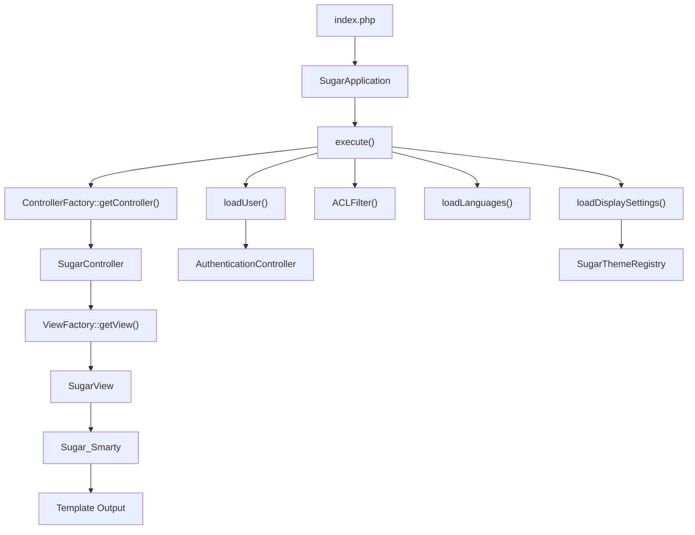

The `SugarApplication::execute()` method manages the complete request lifecycle:

1. **Module Resolution**: Determines target module from `$_REQUEST['module']` or defaults to configured home module
2. **Authentication**: Validates user session through `AuthenticationController` 
3. **Controller Instantiation**: `ControllerFactory` creates module-specific controllers
4. **View Processing**: Controllers delegate to `SugarView` subclasses for output generation

**Sources:** [include/MVC/SugarApplication.php:74-103]()

### Controller and View Interaction

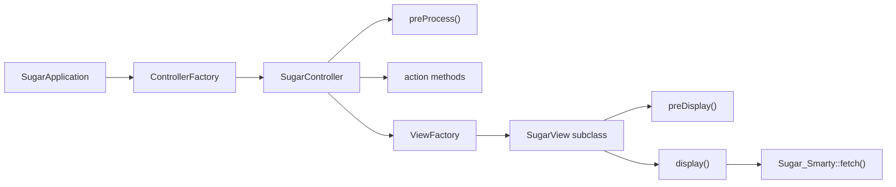

Controllers handle business logic and data preparation, while views manage presentation logic and template rendering. The `SugarView::process()` method coordinates header display, content rendering, and footer output.

**Sources:** [include/MVC/View/SugarView.php:185-281](), [include/MVC/SugarApplication.php:86-101]()

## Data Layer Architecture (SugarBean)

`SugarBean` serves as SuiteCRM's primary ORM and base class for all business objects, providing CRUD operations, relationship management, and data validation.

### SugarBean Core Structure

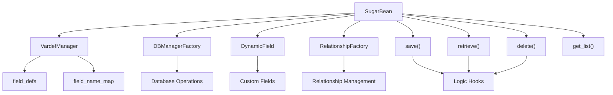

### Database Operations and Field Management

The `SugarBean` constructor initializes field definitions through `VardefManager::loadVardef()` and establishes database connections via `DBManagerFactory::getInstance()`. Field definitions stored in `field_defs` array control data types, validation rules, and relationship mappings.

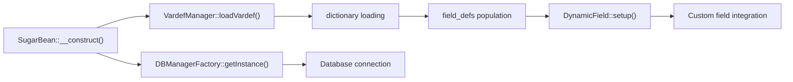

Key data operations include:
- **CRUD Methods**: `save()`, `retrieve()`, `delete()` handle persistence
- **List Operations**: `get_list()` and `get_union_related_list()` for queries
- **Relationship Management**: Link and unlink related records through relationship definitions
- **Field Processing**: Date/time conversion, number formatting, and custom field handling

**Sources:** [data/SugarBean.php:445-517](), [data/SugarBean.php:458-499]()

### Bean Lifecycle and Hooks

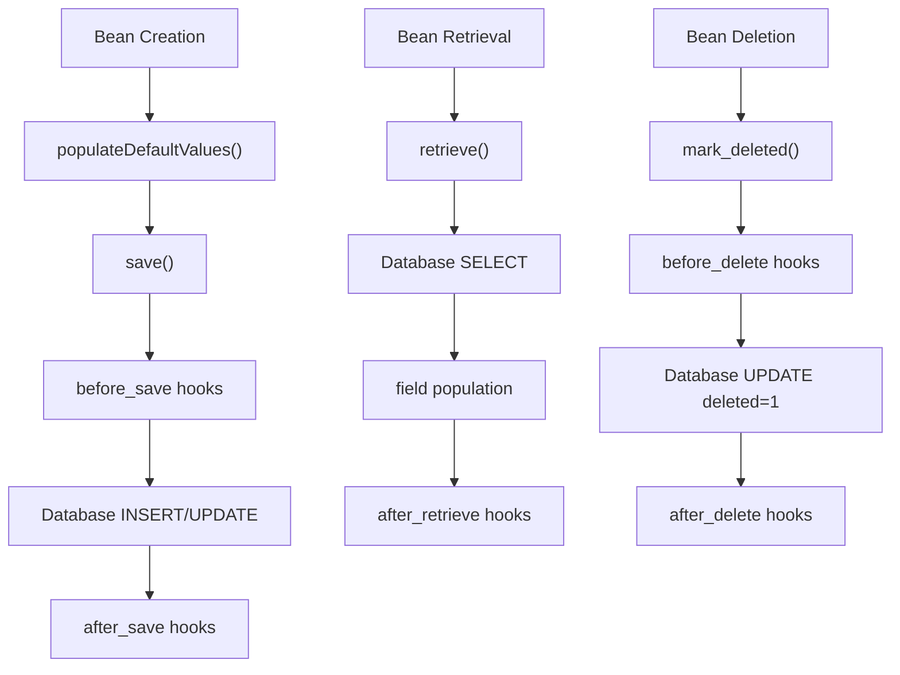

**Sources:** [data/SugarBean.php:544-595](), [data/SugarBean.php:809-964]()

## View and Template System

SuiteCRM uses `Sugar_Smarty` (a Smarty wrapper) for template processing, integrated with the `SugarView` hierarchy for presentation logic.

### Template Processing Flow

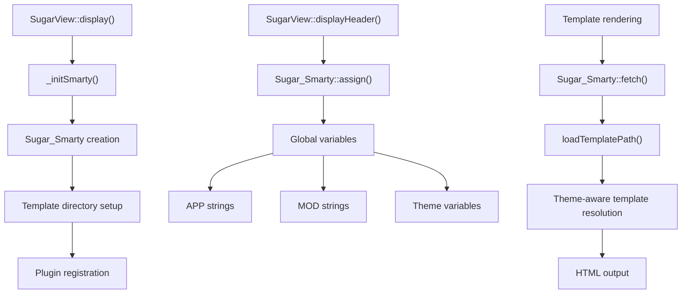

### Template Resolution and Theming

The `Sugar_Smarty::loadTemplatePath()` method implements theme-aware template resolution:

1. **Theme Template Check**: Look for template in current theme directory
2. **Custom Template Check**: Check for customized versions
3. **Default Fallback**: Use base template if theme-specific version not found

**Sources:** [include/Sugar_Smarty.php:341-353](), [include/MVC/View/SugarView.php:167-180]()

### View Hierarchy and Specialization

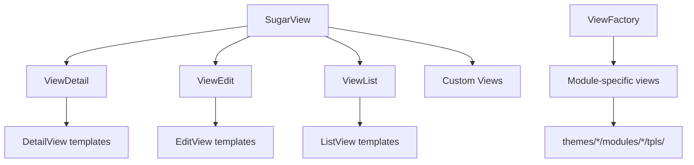

**Sources:** [include/MVC/View/SugarView.php:49-148]()

## Theme Management System

`SugarTheme` provides comprehensive theming capabilities including CSS compilation, image management, JavaScript processing, and template resolution.

### Theme Architecture and Resource Management

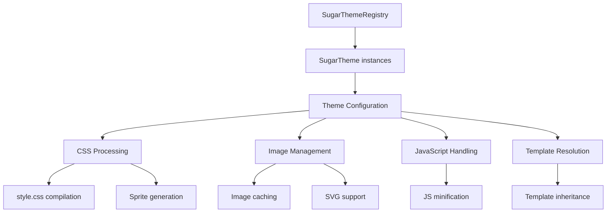

### Theme Resource Resolution

The theme system implements a hierarchical resource resolution pattern:

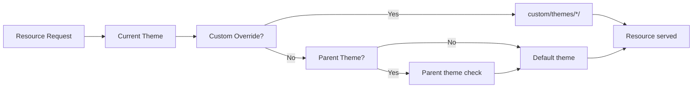

Key theme methods:
- **`getCSS()`**: Compiles CSS with sprite support and color/font variants
- **`getTemplate()`**: Resolves template files with inheritance
- **`getImage()`**: Handles image serving with SVG preference and sprite optimization
- **`getJS()`**: Manages JavaScript compilation and minification

**Sources:** [include/SugarTheme/SugarTheme.php:618-677](), [include/SugarTheme/SugarTheme.php:699-727](), [include/SugarTheme/SugarTheme.php:742-781]()

## Configuration Management

The configuration system centers on `UserPreference` for user-specific settings and global `$sugar_config` for system-wide configuration.

### User Preference Architecture

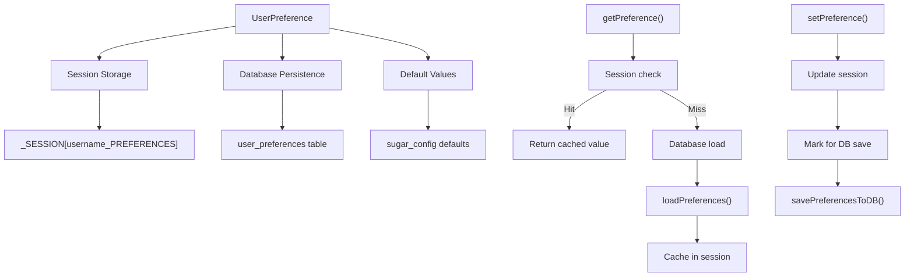

### Configuration Data Flow

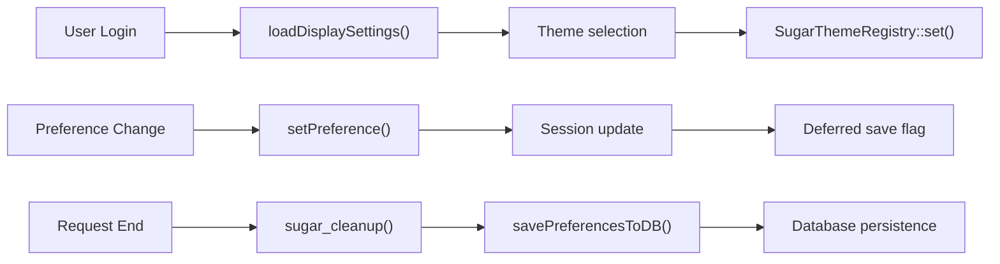

The preference system uses lazy loading and deferred saving for performance:
- **Lazy Loading**: Categories loaded on first access via `loadPreferences()`
- **Session Caching**: Preferences cached in `$_SESSION` to avoid repeated DB queries  
- **Deferred Persistence**: Changes batched and saved during `sugar_cleanup()`

**Sources:** [modules/UserPreferences/UserPreference.php:97-125](), [modules/UserPreferences/UserPreference.php:172-200](), [modules/UserPreferences/UserPreference.php:336-377]()

## Component Integration Patterns

### Request Processing Integration

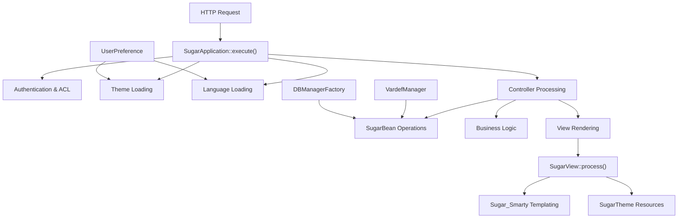

### Cross-Component Dependencies

The architecture maintains loose coupling through factory patterns and registry systems:

- **`DBManagerFactory`**: Provides database abstraction for all data operations
- **`SugarThemeRegistry`**: Manages theme instances and switching
- **`VardefManager`**: Centralizes field definition loading and caching
- **`ViewFactory`** and **`ControllerFactory`**: Enable modular MVC component loading

**Sources:** [include/MVC/SugarApplication.php:96-101](), [include/MVC/View/SugarView.php:207-216](), [data/SugarBean.php:449-456]()