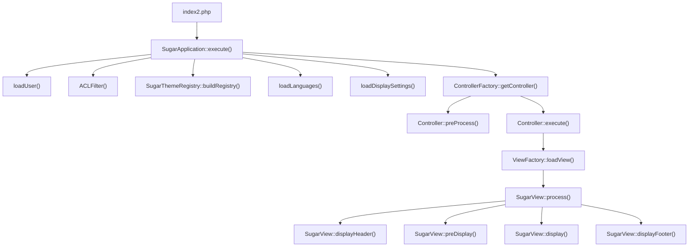
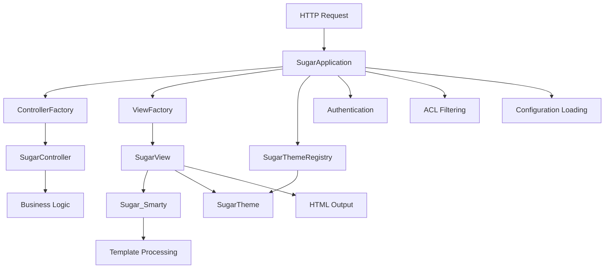
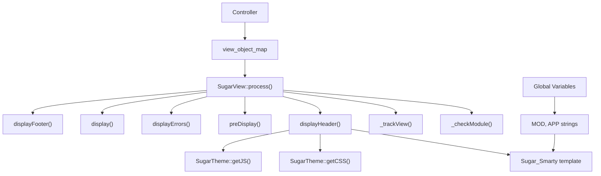
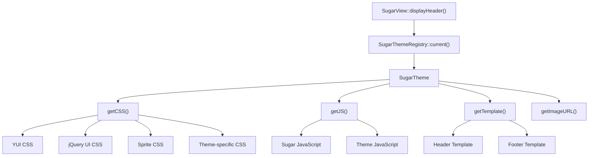
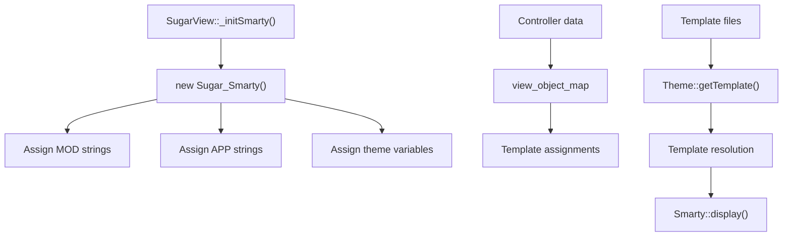
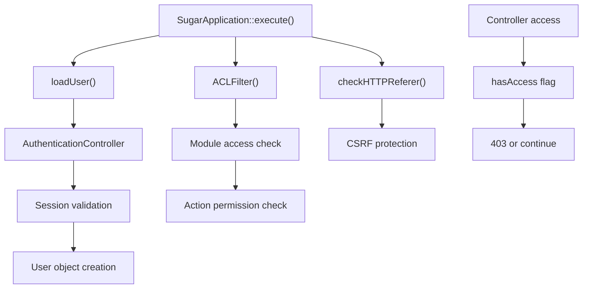
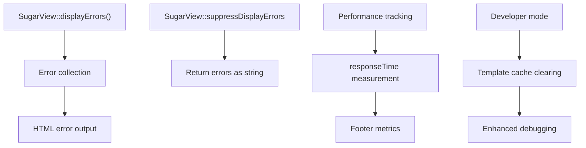

# MVC Framework

<details>
<summary>Relevant source files</summary>

The following files were used as context for generating this wiki page:

- [include/EditView/SugarVCR.php](include/EditView/SugarVCR.php)
- [include/HTTP_WebDAV_Server/Server.php](include/HTTP_WebDAV_Server/Server.php)
- [include/MVC/SugarApplication.php](include/MVC/SugarApplication.php)
- [include/MVC/View/SugarView.php](include/MVC/View/SugarView.php)
- [include/MVC/View/tpls/displayLoginJS.tpl](include/MVC/View/tpls/displayLoginJS.tpl)
- [include/SugarTheme/SugarTheme.php](include/SugarTheme/SugarTheme.php)
- [include/social/facebook/facebook_sdk/src/base_facebook.php](include/social/facebook/facebook_sdk/src/base_facebook.php)
- [include/social/facebook/facebook_sdk/src/facebook.php](include/social/facebook/facebook_sdk/src/facebook.php)
- [modules/ModuleBuilder/tpls/MBModule/dropdown.tpl](modules/ModuleBuilder/tpls/MBModule/dropdown.tpl)
- [modules/ModuleBuilder/views/view.dropdown.php](modules/ModuleBuilder/views/view.dropdown.php)
- [modules/UserPreferences/UserPreference.php](modules/UserPreferences/UserPreference.php)
- [modules/Users/Logout.php](modules/Users/Logout.php)
- [themes/SuiteP/images/edit_inline.gif](themes/SuiteP/images/edit_inline.gif)

</details>


This document covers SuiteCRM's Model-View-Controller (MVC) architectural framework, which provides the foundational structure for request handling, view rendering, and application lifecycle management. For information about the data layer and business objects, see [Data Layer (SugarBean)](#2.2). For configuration management details, see [Configuration System](#2.3).

## Overview

The SuiteCRM MVC Framework is built around three core components: the `SugarApplication` class that manages the request lifecycle, the `SugarView` hierarchy that handles presentation logic, and a controller system that processes business logic. The framework integrates tightly with the theme system and uses Sugar_Smarty for templating.

## Request Lifecycle Architecture

The MVC framework follows a structured request processing flow managed by `SugarApplication`:



**SugarApplication Request Processing Flow**

Sources: [include/MVC/SugarApplication.php:74-103]()

## Core MVC Components

The framework consists of several key classes that work together to process requests:



**Core MVC Component Relationships**

Sources: [include/MVC/SugarApplication.php:1-103](), [include/MVC/View/SugarView.php:49-184]()

## SugarView Architecture

The view system is centered around the `SugarView` base class, which provides a standardized approach to rendering output:

### View Component Structure

| Component | Purpose | Key Methods |
|-----------|---------|-------------|
| `SugarView` | Base view class | `process()`, `display()`, `preDisplay()` |
| `Sugar_Smarty` | Template engine | Template assignment and rendering |
| `SugarTheme` | Theme management | CSS/JS inclusion, asset management |
| `view_object_map` | Data passing | Controller to view data transfer |

### View Processing Pipeline



**SugarView Processing Pipeline**

Sources: [include/MVC/View/SugarView.php:185-281](), [include/MVC/View/SugarView.php:370-802]()

## View Configuration and Options

The `SugarView` class provides extensive configuration options through the `$options` array:

```php
public $options = array(
    'show_header' => true,
    'show_title' => true,
    'show_subpanels' => false,
    'show_search' => true,
    'show_footer' => true,
    'show_javascript' => true,
    'view_print' => false,
);
```

These options control which UI elements are rendered and can be modified by specific view implementations.

Sources: [include/MVC/View/SugarView.php:106-114]()

## Theme Integration

The MVC framework integrates closely with the theme system through `SugarTheme`:



**Theme System Integration with Views**

Sources: [include/MVC/View/SugarView.php:402-417](), [include/SugarTheme/SugarTheme.php:618-677]()

## Sugar_Smarty Templating

The framework uses Sugar_Smarty as its templating engine, initialized in each view:

### Template Variable Assignment

| Variable Type | Assignment Method | Purpose |
|---------------|-------------------|---------|
| `MOD` | `$this->ss->assign('MOD', $GLOBALS['mod_strings'])` | Module-specific language strings |
| `APP` | `$this->ss->assign('APP', $GLOBALS['app_strings'])` | Application-wide language strings |
| `THEME` | Theme-specific variables | Theme configuration and assets |
| Custom Data | `view_object_map` | Controller-provided data |

### Template Processing Flow



**Sugar_Smarty Template Processing**

Sources: [include/MVC/View/SugarView.php:167-180](), [include/SugarTheme/SugarTheme.php:699-727]()

## Authentication and Security Integration

The MVC framework includes built-in authentication and security checks:

### Security Flow



**Security and Authentication Flow**

Sources: [include/MVC/SugarApplication.php:108-190](), [include/MVC/SugarApplication.php:192-331]()

## View Factory and Dynamic Loading

Views are dynamically loaded based on module and action parameters:

### View Resolution Process

| Step | Process | File Pattern |
|------|---------|--------------|
| 1 | Custom view check | `custom/modules/{module}/views/view.{action}.php` |
| 2 | Module view check | `modules/{module}/views/view.{action}.php` |
| 3 | Custom include check | `custom/include/MVC/View/views/view.{action}.php` |
| 4 | Default view check | `include/MVC/View/views/view.{action}.php` |
| 5 | Fallback | `SugarView` base class |

This resolution allows for extensive customization at multiple levels while maintaining backward compatibility.

Sources: Referenced through view factory pattern implementation

## Error Handling and Debugging

The MVC framework includes comprehensive error handling:



**Error Handling and Debug Features**

Sources: [include/MVC/View/SugarView.php:286-301](), [include/MVC/View/SugarView.php:123-133]()

## Integration with Other Systems

The MVC framework serves as the foundation that connects to other major SuiteCRM systems:

- **Data Layer**: Views receive `SugarBean` objects through the `$bean` property
- **Configuration**: System configuration is loaded during application initialization
- **Theme System**: Tight integration for CSS, JavaScript, and template resolution
- **Language System**: Automatic loading and assignment of language strings
- **Security**: Built-in authentication and ACL integration

This architecture provides a flexible, extensible foundation for SuiteCRM's web interface while maintaining clean separation of concerns between presentation, business logic, and data access layers.