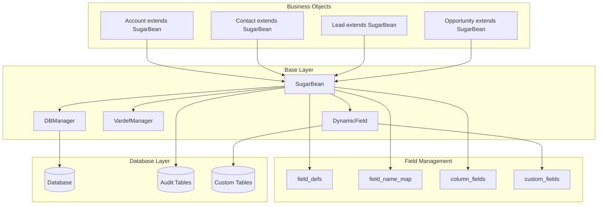
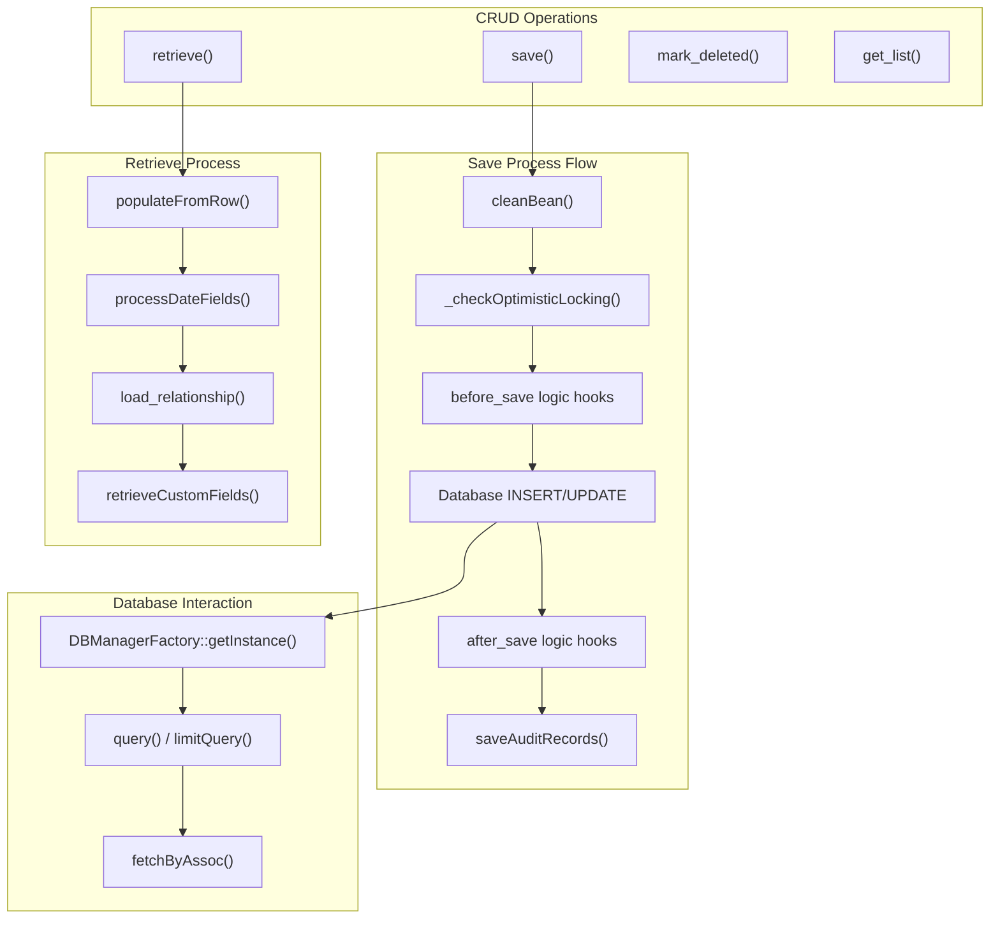
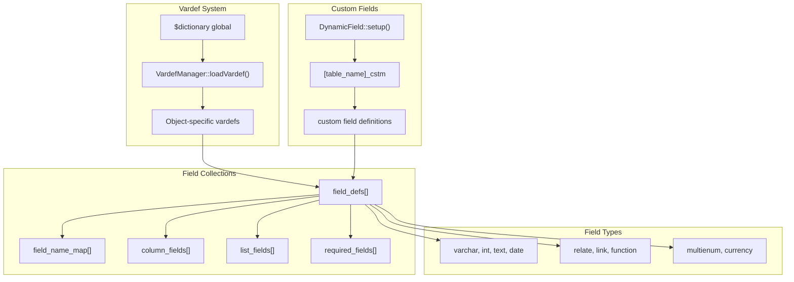
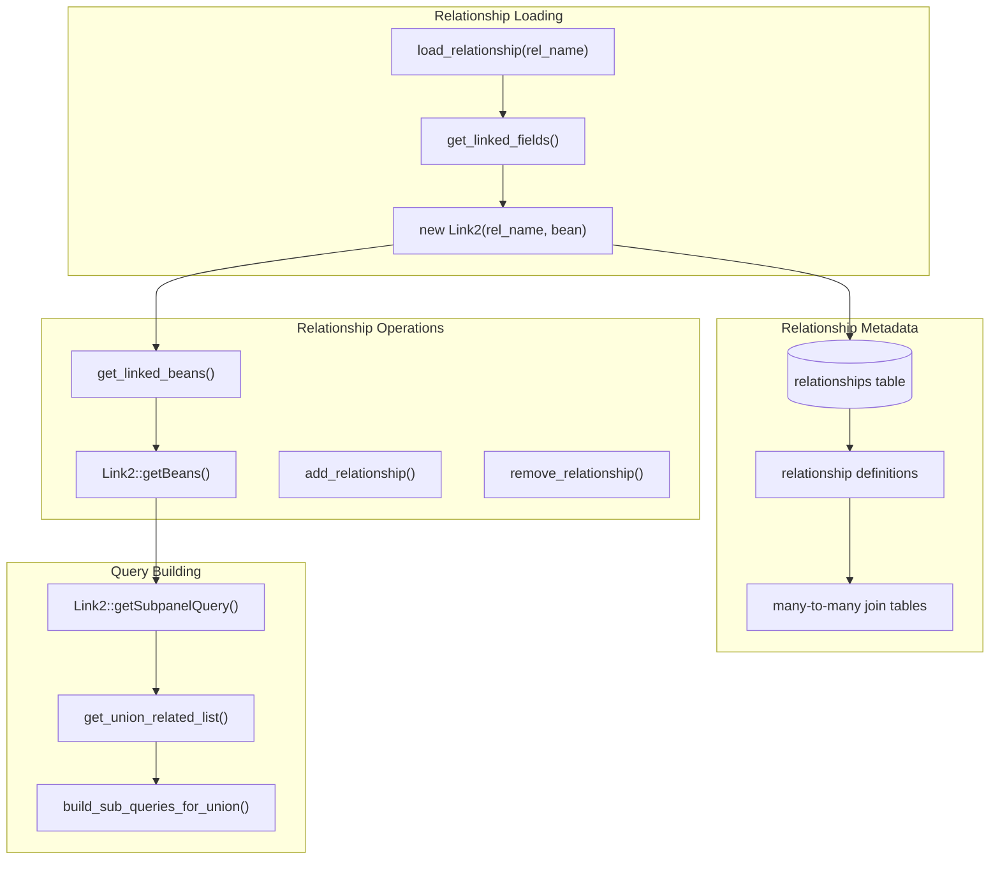
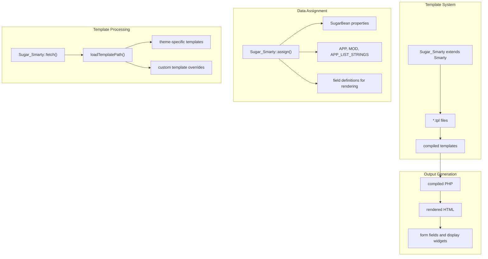

# Data Layer (SugarBean)

Relevant source files

The following files were used as context for generating this wiki page:

- [data/SugarBean.php](data/SugarBean.php)
- [include/Sugar_Smarty.php](include/Sugar_Smarty.php)

## Purpose and Scope

The Data Layer in SuiteCRM is built around the `SugarBean` class, which serves as the foundational Object-Relational Mapping (ORM) system for all business entities. This layer provides comprehensive database abstraction, field management, relationship handling, and business object lifecycle management. The SugarBean system integrates with the templating engine to enable dynamic content rendering and supports extensibility through custom fields and business logic hooks.

For information about the MVC framework that utilizes this data layer, see [MVC Framework](#2.1). For configuration management that works with the data layer, see [Configuration System](#2.3).

## Core Architecture

The SugarBean data layer follows a pattern where each business module extends the base `SugarBean` class to inherit common functionality while implementing module-specific behavior. The system manages object persistence, field definitions, relationships, and business rules through a unified interface.

**Sources:** [data/SugarBean.php:49-517]()

The `SugarBean` constructor initializes the data layer by loading field definitions from vardefs, setting up custom fields, and establishing database connections. Each bean maintains its own field definitions and database metadata.

## Database Operations and CRUD Lifecycle

The SugarBean implements a comprehensive CRUD (Create, Read, Update, Delete) system with built-in support for auditing, optimistic locking, and business logic hooks. The `save()` method serves as the primary entry point for data persistence.

**Sources:** [data/SugarBean.php:2309-2575](), [data/SugarBean.php:449](), [data/SugarBean.php:3143-3352]()

The save process includes data sanitization through `cleanBean()`, optimistic locking checks, and automatic audit trail generation. The system supports both insert and update operations based on the presence of an ID field.

## Field Definition and Metadata System

SugarBean uses a sophisticated field definition system (vardefs) to manage field metadata, validation rules, and database schema information. The system supports both standard and custom fields through the `DynamicField` component.

**Sources:** [data/SugarBean.php:453-516](), [data/SugarBean.php:525-529](), [modules/DynamicFields/DynamicField.php]()

Field definitions control data validation, database schema generation, and UI rendering. The system automatically merges standard and custom field definitions during bean initialization.

## Relationship Management

SugarBean provides a comprehensive relationship management system that handles one-to-one, one-to-many, and many-to-many relationships between modules. Relationships are defined in vardefs and instantiated as `Link2` objects.

**Sources:** [data/SugarBean.php:1972-2024](), [data/SugarBean.php:2044-2083](), [data/SugarBean.php:809-1021]()

The relationship system supports lazy loading, where relationships are only instantiated when accessed. Complex queries for subpanels and related lists use union queries to combine data from multiple related modules.

## Template Integration with Sugar_Smarty

The data layer integrates with the `Sugar_Smarty` templating system to provide dynamic content rendering. SugarBean objects are passed to templates where their properties can be accessed and displayed.

**Sources:** [include/Sugar_Smarty.php:152-179](), [include/Sugar_Smarty.php:341-353]()

The templating system automatically assigns global variables like `$APP`, `$MOD`, and `$APP_LIST_STRINGS` for use in templates. Template path resolution supports theme customization and custom overrides.

## Business Logic Hooks and Extensibility

SugarBean provides an extensible architecture through logic hooks that allow custom code to execute at specific points in the bean lifecycle. The system also supports custom fields and business object extensions.

| Hook Point | Method | Purpose |
|------------|--------|---------|
| `before_save` | Before database operation | Validation, data transformation |
| `after_save` | After database operation | Notifications, related data updates |
| `before_retrieve` | Before data loading | Access control, query modification |
| `after_retrieve` | After data loading | Computed fields, related data loading |
| `before_delete` | Before deletion | Validation, dependency checks |
| `after_delete` | After deletion | Cleanup, cascade operations |

**Sources:** [data/SugarBean.php:2350-2575](), [data/SugarBean.php:388-409]()

The bean lifecycle includes automatic audit trail generation for fields marked as audited, optimistic locking for concurrent access control, and support for custom field definitions through the `DynamicField` system.

## Performance and Caching Features

The SugarBean system includes several performance optimization features:

- **Definition Caching**: Field definitions are cached in static variables to avoid repeated loading
- **Relationship Lazy Loading**: Relationships are only loaded when accessed
- **Query Optimization**: Support for eager loading and optimized union queries for subpanels
- **Template Compilation**: Smarty templates are compiled to PHP for faster execution

**Sources:** [data/SugarBean.php:448-517](), [data/SugarBean.php:1911-1946](), [include/Sugar_Smarty.php:206-236]()

The system maintains loaded relationship tracking to optimize memory usage and provides configurable query optimization features for large datasets.