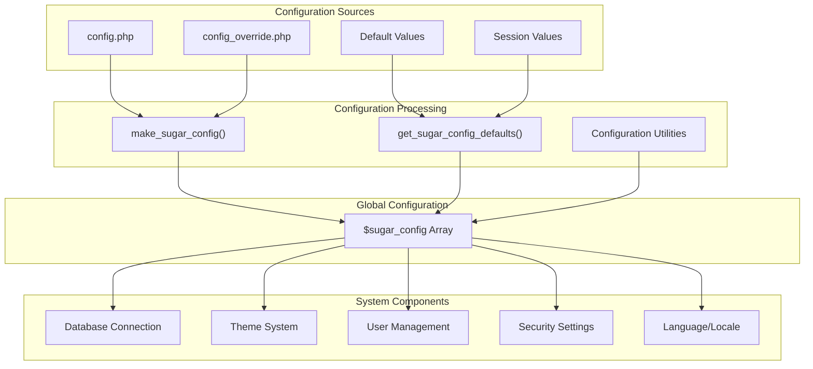
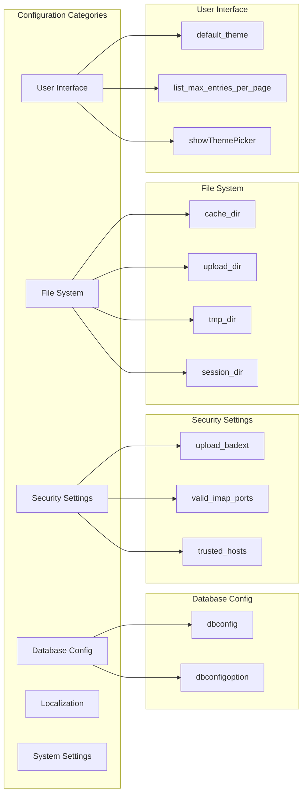
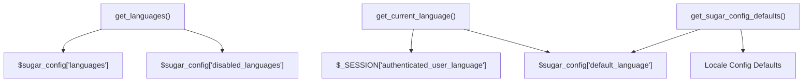
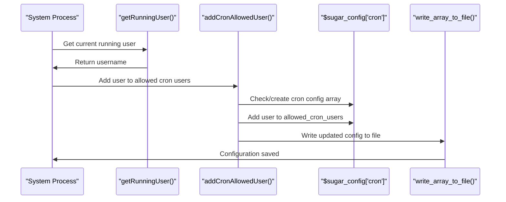
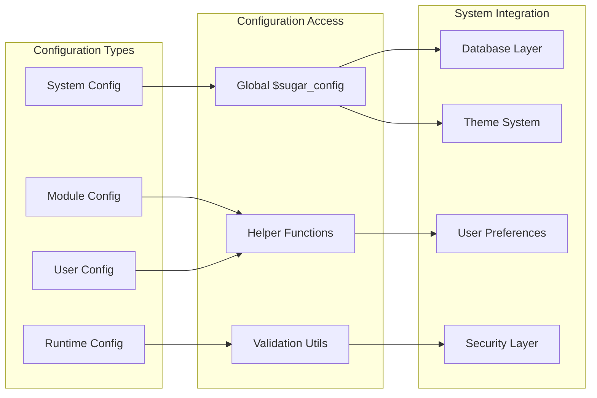
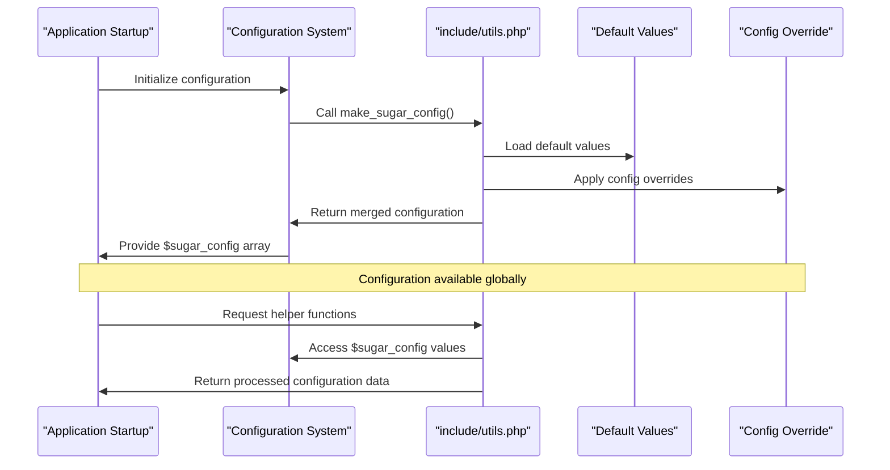

# Configuration System

Relevant source files

The following files were used as context for generating this wiki page:

- [README.md](README.md)
- [composer.json](composer.json)
- [composer.lock](composer.lock)
- [files.md5](files.md5)
- [include/utils.php](include/utils.php)
- [modules/Import/tpls/last.tpl](modules/Import/tpls/last.tpl)
- [modules/Import/tpls/listview.tpl](modules/Import/tpls/listview.tpl)
- [suitecrm_version.php](suitecrm_version.php)
- [themes/SuiteP/css/Dawn/style.css](themes/SuiteP/css/Dawn/style.css)
- [themes/SuiteP/css/Dawn/variables.scss](themes/SuiteP/css/Dawn/variables.scss)
- [themes/SuiteP/css/Day/style.css](themes/SuiteP/css/Day/style.css)
- [themes/SuiteP/css/Day/variables.scss](themes/SuiteP/css/Day/variables.scss)
- [themes/SuiteP/css/Dusk/style.css](themes/SuiteP/css/Dusk/style.css)
- [themes/SuiteP/css/Dusk/variables.scss](themes/SuiteP/css/Dusk/variables.scss)
- [themes/SuiteP/css/Night/style.css](themes/SuiteP/css/Night/style.css)
- [themes/SuiteP/css/Night/variables.scss](themes/SuiteP/css/Night/variables.scss)
- [themes/SuiteP/css/suitep-base/editview.scss](themes/SuiteP/css/suitep-base/editview.scss)
- [themes/SuiteP/css/suitep-base/listview.scss](themes/SuiteP/css/suitep-base/listview.scss)
- [themes/SuiteP/css/suitep-base/navbar.scss](themes/SuiteP/css/suitep-base/navbar.scss)

The Configuration System manages core application settings, default values, and system utilities that control SuiteCRM's behavior across all modules and components. This system provides centralized configuration management through the global `$sugar_config` array and associated utility functions.

For user-specific settings and preferences, see [User Management](#4.1). For theme-specific configuration, see [Theme Management](#3.1).

## Purpose and Scope

The Configuration System handles:
- Core application settings and parameters
- Default value definitions and validation
- System utility functions for configuration management
- Database and file system configuration
- Security and permission settings
- Language and localization configuration
- Integration points with other system components

## Core Configuration Architecture

The configuration system centers around the global `$sugar_config` array, which serves as the primary configuration store for the entire application.

Sources: [include/utils.php:54-290](), [include/utils.php:297-594]()

## Configuration File Structure

### Primary Configuration Functions

The system uses two main functions to initialize and manage configuration:

| Function | Purpose | Location |
|----------|---------|----------|
| `make_sugar_config()` | Converts legacy config.php format to array | [include/utils.php:54-290]() |
| `get_sugar_config_defaults()` | Provides default configuration values | [include/utils.php:297-594]() |

### Core Configuration Categories

Sources: [include/utils.php:110-289](), [include/utils.php:301-584]()

## Configuration Utilities

### Language and Locale Management

The configuration system provides utilities for managing language and locale settings:

Sources: [include/utils.php:800-847](), [include/utils.php:587-593]()

### User and System Utilities

Key utility functions support user management and system operations:

| Function | Purpose | Line Reference |
|----------|---------|----------------|
| `get_user_name()` | Retrieves username by ID | [include/utils.php:871-885]() |
| `get_authenticated_user()` | Gets current authenticated user | [include/utils.php:891-906]() |
| `get_user_array()` | Returns array of users with filtering | [include/utils.php:909-1021]() |
| `getRunningUser()` | Gets system user running PHP | [include/utils.php:603-618]() |

### Cron Configuration Management

The system includes specialized functions for managing cron job configurations:

Sources: [include/utils.php:629-658]()

## Default Configuration Values

### Core System Defaults

The `get_sugar_config_defaults()` function provides comprehensive default values:

```mermaid
graph TB
    subgraph "Default Categories"
        BASIC["Basic Settings"]
        DB["Database Defaults"]
        SECURITY_DEF["Security Defaults"]
        LOCALE_DEF["Locale Defaults"]
        FEATURE["Feature Toggles"]
    end
    
    subgraph "Basic Settings"
        DEFAULT_THEME_VAL["'SuiteP'"]
        DEFAULT_LANG_VAL["'en_us'"]
        DEFAULT_MODULE_VAL["'Home'"]
        CACHE_DIR_VAL["'cache/'"]
    end
    
    subgraph "Database Defaults"
        DB_PERSISTENT["persistent: true"]
        DB_AUTOFREE["autofree: false"]
        DB_DEBUG["debug: 0"]
        DB_SSL["ssl: false"]
    end
    
    subgraph "Security Defaults"
        UPLOAD_BADEXT_ARR["PHP/Script Extensions"]
        VALID_IMG_EXT["Image Extensions"]
        UPLOAD_MAXSIZE["30000000 bytes"]
    end
    
    BASIC --> DEFAULT_THEME_VAL
    BASIC --> DEFAULT_LANG_VAL
    BASIC --> DEFAULT_MODULE_VAL
    BASIC --> CACHE_DIR_VAL
    
    DB --> DB_PERSISTENT
    DB --> DB_AUTOFREE
    DB --> DB_DEBUG
    DB --> DB_SSL
    
    SECURITY_DEF --> UPLOAD_BADEXT_ARR
    SECURITY_DEF --> VALID_IMG_EXT
    SECURITY_DEF --> UPLOAD_MAXSIZE
```

Sources: [include/utils.php:301-584](), [include/utils.php:350-355](), [include/utils.php:476-510]()

## Integration with System Components

### Configuration Access Patterns

The configuration system integrates with other components through standardized access patterns:

Sources: [include/utils.php:54-594](), [include/SugarObjects/SugarConfig.php]()

### Configuration Validation and Security

The system implements validation for configuration values, particularly for security-sensitive settings:

| Setting Category | Validation Function | Security Features |
|------------------|---------------------|-------------------|
| File Extensions | `upload_badext` array | Prevents dangerous file uploads |
| Image Extensions | `valid_image_ext` array | Validates image file types |
| IMAP Ports | `valid_imap_ports` array | Restricts allowed IMAP connections |
| Trusted Hosts | `trusted_hosts` array | Controls allowed external hosts |

Sources: [include/utils.php:476-495](), [include/utils.php:580-584]()

## Configuration Management Workflow

Sources: [include/utils.php:54-290](), [include/utils.php:297-594]()