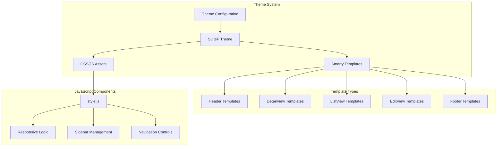
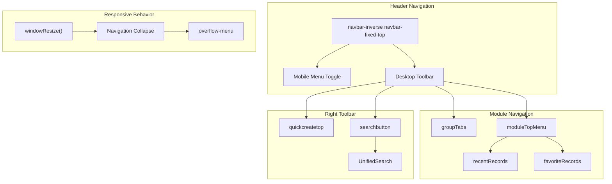
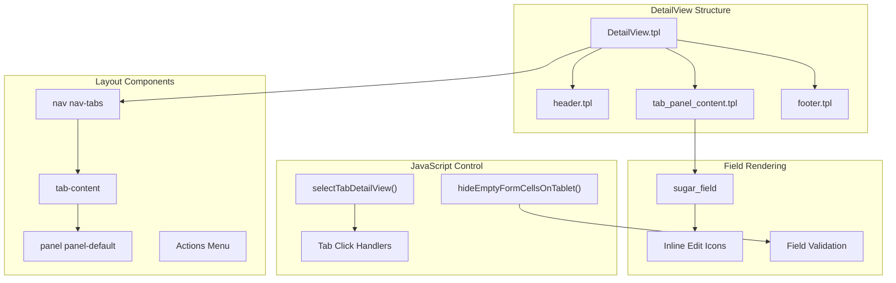
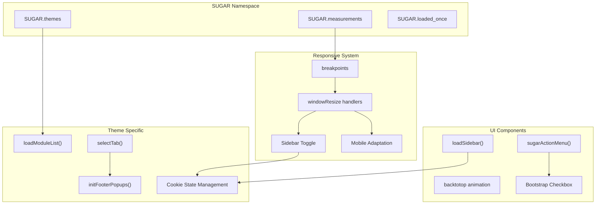
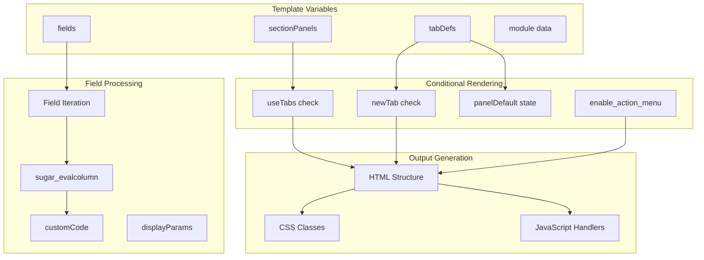
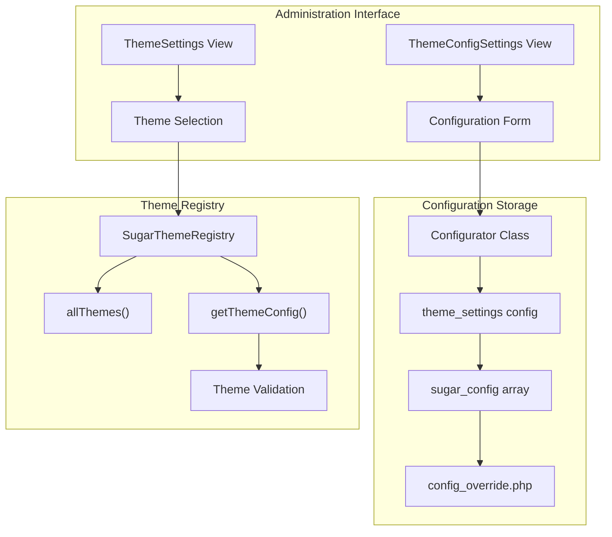

# User Interface System

Relevant source files

The following files were used as context for generating this wiki page:

- [include/javascript/tiny_mce/plugins/style/readme.txt](include/javascript/tiny_mce/plugins/style/readme.txt)
- [modules/Administration/action_view_map.php](modules/Administration/action_view_map.php)
- [modules/Administration/templates/themeConfigSettings.tpl](modules/Administration/templates/themeConfigSettings.tpl)
- [modules/Administration/templates/themeSettings.tpl](modules/Administration/templates/themeSettings.tpl)
- [modules/Administration/views/view.themeconfigsettings.php](modules/Administration/views/view.themeconfigsettings.php)
- [themes/SuiteP/include/DetailView/DetailView.tpl](themes/SuiteP/include/DetailView/DetailView.tpl)
- [themes/SuiteP/include/DetailView/footer.tpl](themes/SuiteP/include/DetailView/footer.tpl)
- [themes/SuiteP/include/DetailView/header.tpl](themes/SuiteP/include/DetailView/header.tpl)
- [themes/SuiteP/include/DetailView/tab_panel_content.tpl](themes/SuiteP/include/DetailView/tab_panel_content.tpl)
- [themes/SuiteP/include/DetailView/test.tpl](themes/SuiteP/include/DetailView/test.tpl)
- [themes/SuiteP/include/EditView/QuickCreate.tpl](themes/SuiteP/include/EditView/QuickCreate.tpl)
- [themes/SuiteP/js/style.js](themes/SuiteP/js/style.js)
- [themes/SuiteP/modules/Studio/TabGroups/EditViewTabs.tpl](themes/SuiteP/modules/Studio/TabGroups/EditViewTabs.tpl)
- [themes/SuiteP/tpls/_headerModuleList.tpl](themes/SuiteP/tpls/_headerModuleList.tpl)
- [themes/SuiteP/tpls/footer.tpl](themes/SuiteP/tpls/footer.tpl)

The User Interface System encompasses SuiteCRM's presentation layer, providing the visual and interactive components that users interact with. This system includes the SuiteP theme framework, navigation components, view templates, JavaScript interactions, and responsive design patterns. The system manages the rendering of all user-facing pages including detail views, list views, edit forms, and navigation elements.

For information about specific view types like inline editing, see [Inline Editing](#3.3). For theme management and configuration, see [Theme Management](#3.1). For JavaScript functionality, see [JavaScript Framework](#3.2).

## Theme Architecture

The UI system is built around the SuiteP theme, which serves as the primary presentation framework. The theme system uses Smarty templating for server-side rendering and Bootstrap-based CSS for styling.

**Sources:** [themes/SuiteP/tpls/_headerModuleList.tpl:1-570](), [themes/SuiteP/js/style.js:1-537](), [modules/Administration/templates/themeSettings.tpl:1-115]()

## Navigation System

The navigation system provides hierarchical module access through a responsive header with dropdown menus, search functionality, and quick-create options.

The header navigation is implemented in `_headerModuleList.tpl` with responsive JavaScript that automatically collapses menu items when the window becomes too small. The system uses Bootstrap classes for responsive behavior and includes both desktop and mobile-specific navigation patterns.

**Sources:** [themes/SuiteP/tpls/_headerModuleList.tpl:42-489](), [themes/SuiteP/js/style.js:292-350]()

## View Rendering System

The view rendering system uses a hierarchical template structure to generate detail views, edit views, and other page types. The system supports both tabbed and panel-based layouts.

The detail view system supports conditional tab rendering based on `useTabs` configuration and `tabDefs` metadata. Panels can be collapsed or expanded, and the system includes action menus when `enable_action_menu` is configured.

**Sources:** [themes/SuiteP/include/DetailView/DetailView.tpl:44-365](), [themes/SuiteP/include/DetailView/tab_panel_content.tpl:45-213](), [themes/SuiteP/include/DetailView/header.tpl:53-104]()

## JavaScript Framework

The JavaScript framework provides interactive behavior, responsive design logic, and UI component management through the `SUGAR` namespace and jQuery extensions.

The framework defines responsive breakpoints at x-small (750px), small (768px), medium (992px), large (1130px), and x-large (1250px). The sidebar toggle functionality uses cookies to persist state across sessions.

**Sources:** [themes/SuiteP/js/style.js:40-537](), [themes/SuiteP/tpls/footer.tpl:78-106]()

## Template Rendering Flow

The template system follows a hierarchical rendering pattern where main templates include sub-templates and apply conditional logic based on configuration and user preferences.

Templates use Smarty's `{counter}`, `{foreach}`, and `{capture}` directives extensively to manage complex rendering logic. The system supports inline editing through conditional class application and icon rendering.

**Sources:** [themes/SuiteP/include/DetailView/tab_panel_content.tpl:76-191](), [themes/SuiteP/include/DetailView/DetailView.tpl:177-317]()

## Responsive Design Implementation

The responsive system adapts the interface for different screen sizes using Bootstrap grid classes and JavaScript-based layout adjustments.

| Breakpoint | Width | Behavior |
|------------|--------|----------|
| x-small | ≤750px | Mobile menu, collapsed sidebar |
| small | 768px | Tablet layout, conditional sidebar |
| medium | 992px | Desktop layout, full sidebar |
| large | 1130px | Large desktop, expanded navigation |
| x-large | ≥1250px | Full-width layout |

The responsive system includes:
- **Mobile Navigation**: Dropdown menu with module shortcuts
- **Sidebar Management**: Collapsible with cookie persistence  
- **Field Hiding**: Empty form cells hidden on tablet
- **Navigation Overflow**: Menu items moved to overflow menu when space is limited

**Sources:** [themes/SuiteP/js/style.js:40-48](), [themes/SuiteP/js/style.js:442-486](), [themes/SuiteP/tpls/_headerModuleList.tpl:308-330]()

## Theme Configuration System

The theme configuration system allows administrators to customize theme settings through a dedicated interface that manages color schemes, layout options, and feature toggles.

Theme configuration supports both boolean and color field types, with validation to ensure theme compatibility and security. The system prevents unauthorized access through admin permission checks.

**Sources:** [modules/Administration/views/view.themeconfigsettings.php:67-119](), [modules/Administration/templates/themeConfigSettings.tpl:43-84](), [modules/Administration/templates/themeSettings.tpl:68-81]()