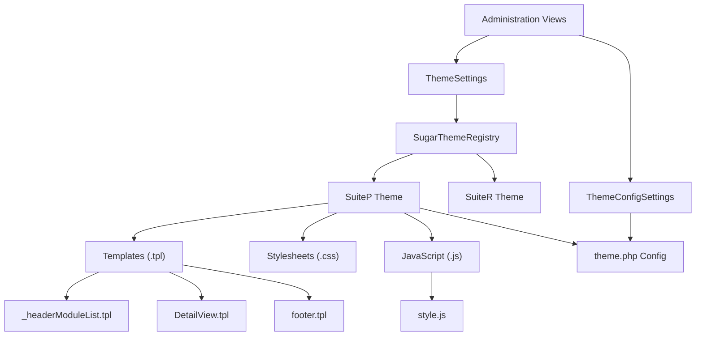
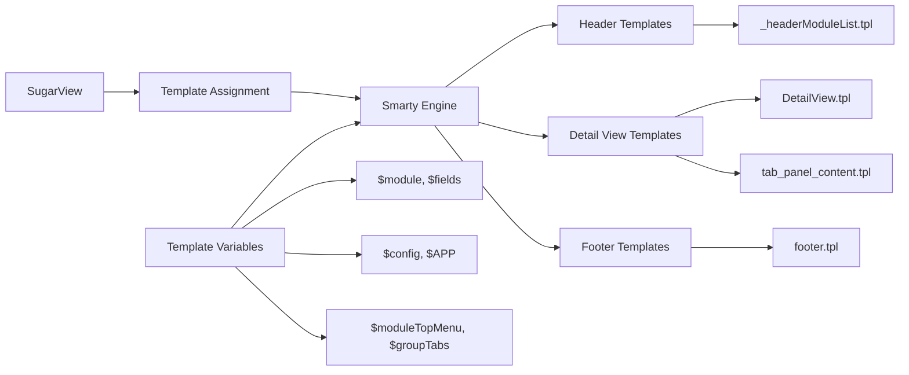
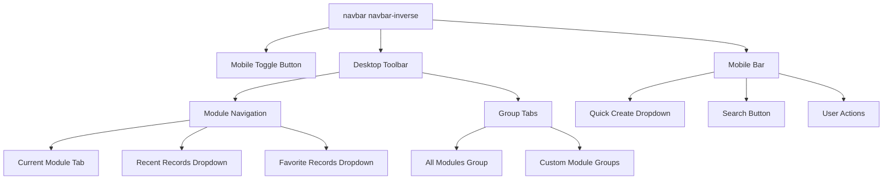
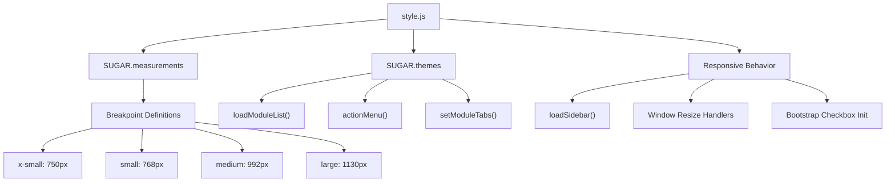
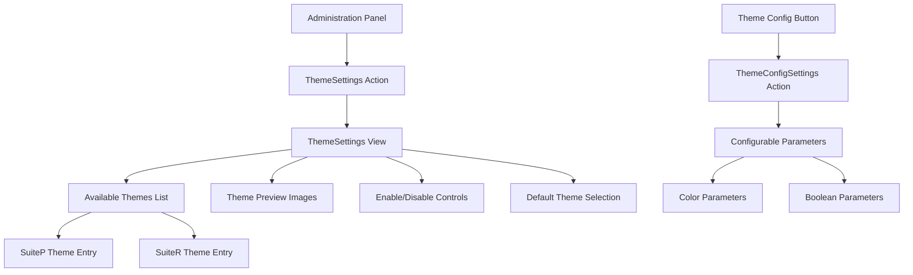
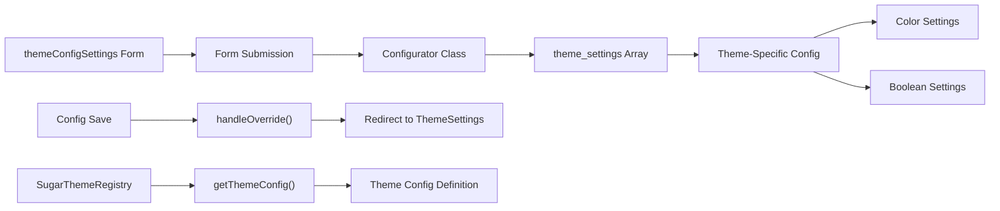
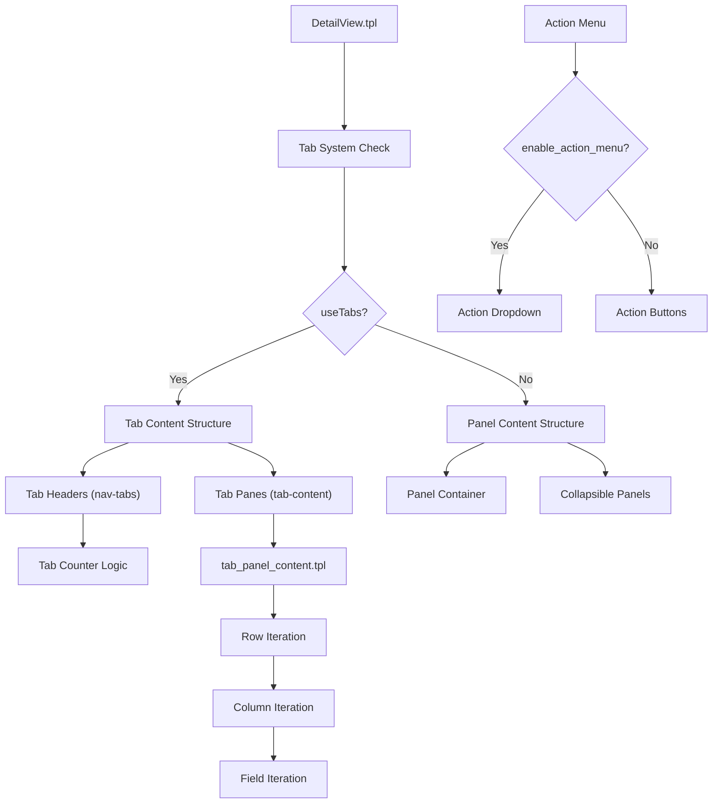
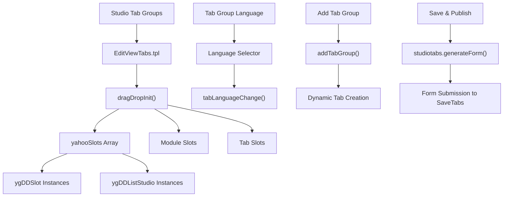
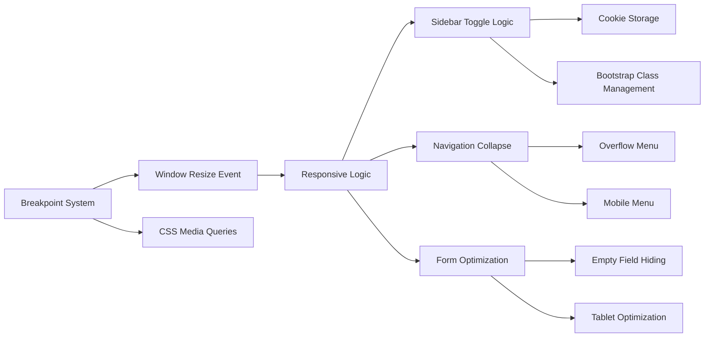

# Theme Management

Relevant source files

The following files were used as context for generating this wiki page:

- [include/javascript/tiny_mce/plugins/style/readme.txt](include/javascript/tiny_mce/plugins/style/readme.txt)
- [modules/Administration/action_view_map.php](modules/Administration/action_view_map.php)
- [modules/Administration/templates/themeConfigSettings.tpl](modules/Administration/templates/themeConfigSettings.tpl)
- [modules/Administration/templates/themeSettings.tpl](modules/Administration/templates/themeSettings.tpl)
- [modules/Administration/views/view.themeconfigsettings.php](modules/Administration/views/view.themeconfigsettings.php)
- [themes/SuiteP/include/DetailView/DetailView.tpl](themes/SuiteP/include/DetailView/DetailView.tpl)
- [themes/SuiteP/include/DetailView/footer.tpl](themes/SuiteP/include/DetailView/footer.tpl)
- [themes/SuiteP/include/DetailView/header.tpl](themes/SuiteP/include/DetailView/header.tpl)
- [themes/SuiteP/include/DetailView/tab_panel_content.tpl](themes/SuiteP/include/DetailView/tab_panel_content.tpl)
- [themes/SuiteP/include/DetailView/test.tpl](themes/SuiteP/include/DetailView/test.tpl)
- [themes/SuiteP/include/EditView/QuickCreate.tpl](themes/SuiteP/include/EditView/QuickCreate.tpl)
- [themes/SuiteP/js/style.js](themes/SuiteP/js/style.js)
- [themes/SuiteP/modules/Studio/TabGroups/EditViewTabs.tpl](themes/SuiteP/modules/Studio/TabGroups/EditViewTabs.tpl)
- [themes/SuiteP/tpls/_headerModuleList.tpl](themes/SuiteP/tpls/_headerModuleList.tpl)
- [themes/SuiteP/tpls/footer.tpl](themes/SuiteP/tpls/footer.tpl)

This document covers SuiteCRM's theme management system, which provides the presentation layer architecture for customizing the user interface. The theme system manages visual styling, layout templates, and responsive behavior across different devices and screen sizes.

For information about the underlying MVC framework that renders these themes, see [MVC Framework](#2.1). For configuration management that themes integrate with, see [Configuration System](#2.3).

## Overview

SuiteCRM's theme management system consists of theme directories containing Smarty templates, CSS stylesheets, JavaScript files, and configuration definitions. The system supports multiple themes with the primary themes being SuiteP (modern responsive theme) and SuiteR (legacy theme). Administrators can configure theme settings, enable/disable themes, and customize theme-specific parameters through the Administration panel.

## Theme Architecture

The theme system follows a structured architecture where themes are self-contained packages with their own templates, assets, and configuration.

Sources: [themes/SuiteP/tpls/_headerModuleList.tpl:1-600](), [themes/SuiteP/js/style.js:1-537](), [modules/Administration/templates/themeSettings.tpl:1-116](), [modules/Administration/views/view.themeconfigsettings.php:1-120]()

## Template System Integration

The theme system integrates with SuiteCRM's Smarty templating engine to render views. Each theme provides specific templates for different view types.

Sources: [themes/SuiteP/include/DetailView/DetailView.tpl:1-365](), [themes/SuiteP/include/DetailView/tab_panel_content.tpl:1-213](), [themes/SuiteP/include/DetailView/header.tpl:1-104]()

## SuiteP Theme Components

The SuiteP theme is the primary modern theme with responsive design capabilities and Bootstrap integration.

### Navigation System

The header navigation system provides the main user interface for module access and quick actions.

Sources: [themes/SuiteP/tpls/_headerModuleList.tpl:42-489]()

### JavaScript Framework

The SuiteP theme includes comprehensive JavaScript functionality for responsive behavior and user interactions.

Sources: [themes/SuiteP/js/style.js:40-537]()

## Administration Interface

The theme management system provides administrative interfaces for configuring themes and their settings.

### Theme Settings View

Sources: [modules/Administration/templates/themeSettings.tpl:43-116](), [modules/Administration/views/view.themeconfigsettings.php:49-119]()

### Configuration Management

The theme configuration system allows administrators to customize theme-specific parameters.

Sources: [modules/Administration/templates/themeConfigSettings.tpl:43-84](), [modules/Administration/views/view.themeconfigsettings.php:79-101]()

## Detail View System

The detail view template system provides structured layouts for displaying record information with tabs and panels.

### Tab and Panel Structure

Sources: [themes/SuiteP/include/DetailView/DetailView.tpl:44-365](), [themes/SuiteP/include/DetailView/tab_panel_content.tpl:45-213]()

## Studio Integration

The theme system integrates with Studio for customizing tab groups and module organization.

Sources: [themes/SuiteP/modules/Studio/TabGroups/EditViewTabs.tpl:47-300]()

## File Organization

The theme management system follows a structured file organization pattern for maintainability and extensibility.

| Component | Location | Purpose |
|-----------|----------|---------|
| Theme Templates | `themes/{theme}/tpls/` | Main template files |
| Detail View Templates | `themes/{theme}/include/DetailView/` | Record detail templates |
| Edit View Templates | `themes/{theme}/include/EditView/` | Record edit templates |
| JavaScript | `themes/{theme}/js/` | Theme-specific JavaScript |
| CSS | `themes/{theme}/css/` | Theme stylesheets |
| Images | `themes/{theme}/images/` | Theme image assets |
| Module Templates | `themes/{theme}/modules/{module}/` | Module-specific overrides |
| Admin Templates | `modules/Administration/templates/` | Theme administration |
| Admin Views | `modules/Administration/views/` | Theme management views |

Sources: [themes/SuiteP/tpls/_headerModuleList.tpl:1](), [themes/SuiteP/js/style.js:1](), [modules/Administration/templates/themeSettings.tpl:1](), [modules/Administration/action_view_map.php:42-43]()

## Responsive Design Implementation

The SuiteP theme implements responsive design through JavaScript breakpoint management and CSS media queries.

Sources: [themes/SuiteP/js/style.js:292-537]()