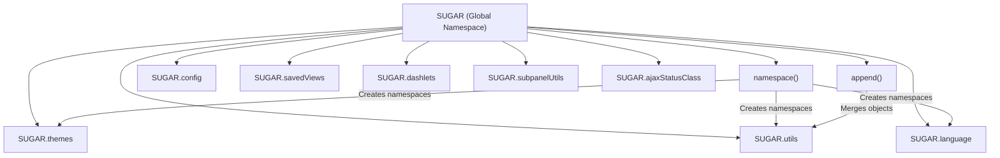
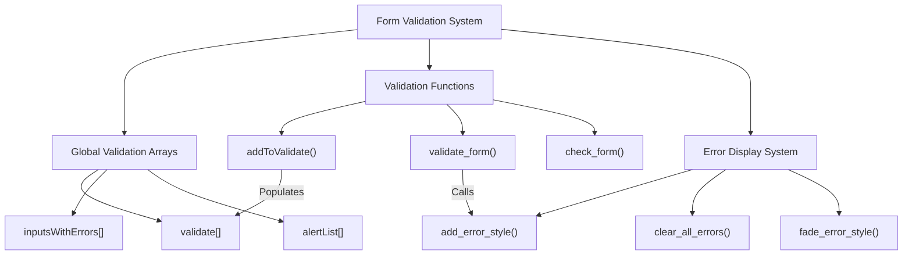
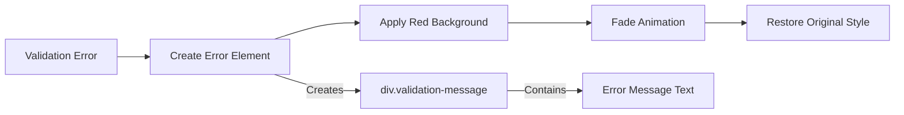
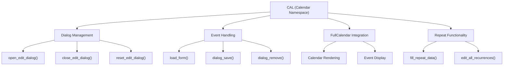
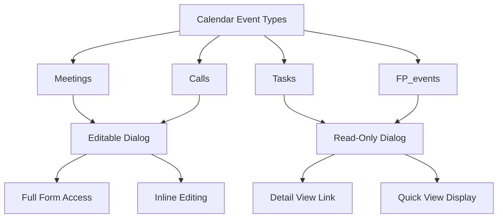
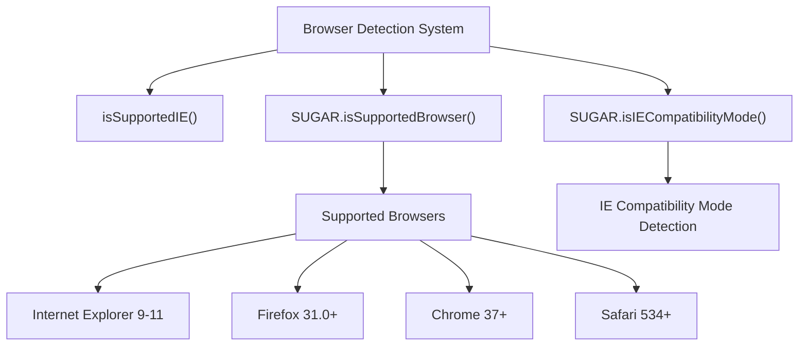
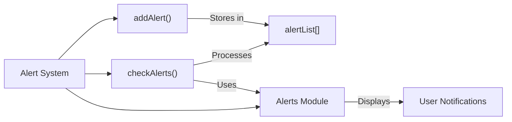

# JavaScript Framework

Relevant source files

The following files were used as context for generating this wiki page:

- [include/SugarObjects/templates/basic/language/en_us.lang.php](include/SugarObjects/templates/basic/language/en_us.lang.php)
- [include/javascript/sugar_3.js](include/javascript/sugar_3.js)
- [jssource/src_files/include/javascript/sugar_3.js](jssource/src_files/include/javascript/sugar_3.js)
- [jssource/src_files/modules/Calendar/Cal.js](jssource/src_files/modules/Calendar/Cal.js)
- [modules/Calendar/Cal.js](modules/Calendar/Cal.js)
- [modules/Calendar/tpls/main.tpl](modules/Calendar/tpls/main.tpl)
- [modules/Emails/javascript/email_popup_helper.js](modules/Emails/javascript/email_popup_helper.js)
- [themes/SuiteP/modules/SavedSearch/SavedSearchForm.tpl](themes/SuiteP/modules/SavedSearch/SavedSearchForm.tpl)

## Purpose and Scope

This document covers SuiteCRM's client-side JavaScript framework, which provides a structured foundation for browser-based functionality. The framework centers around the `SUGAR` global namespace and includes comprehensive form validation, browser compatibility detection, and specialized modules like the calendar system. 

For information about theme-specific JavaScript integration, see [Theme Management](#3.1). For details about inline editing JavaScript functionality, see [Inline Editing](#3.3).

## SUGAR Namespace Architecture

The JavaScript framework is built around a global `SUGAR` object that serves as the primary namespace for all client-side functionality. This namespace provides organizational structure and prevents naming conflicts with other JavaScript libraries.

The core namespace functionality is implemented through two primary methods:

**Namespace Creation**: The `namespace()` function creates and returns namespaces within the SUGAR object, ensuring they exist before use.

**Object Extension**: The `append()` function merges properties from one object into another, enabling modular functionality addition.

Sources: [jssource/src_files/include/javascript/sugar_3.js:46-75]()

### Namespace Declarations

The framework pre-declares multiple specialized namespaces for different functional areas:

| Namespace | Purpose |
|-----------|---------|
| `SUGAR.themes` | Theme-related functionality |
| `SUGAR.tour` | User interface tours and guidance |
| `SUGAR.sugarHome` | Homepage-specific features |
| `SUGAR.subpanelUtils` | Subpanel management utilities |
| `SUGAR.ajaxStatusClass` | AJAX request status handling |
| `SUGAR.utils` | General utility functions |
| `SUGAR.savedViews` | Saved view management |
| `SUGAR.dashlets` | Dashlet functionality |
| `SUGAR.language` | Internationalization support |
| `SUGAR.config` | Configuration management |

Sources: [jssource/src_files/include/javascript/sugar_3.js:77-117]()

## Form Validation System

The framework includes a comprehensive form validation system that manages client-side validation rules and error display. The system uses global arrays and functions to coordinate validation across forms.

### Validation Rule Management

The validation system uses indexed arrays to store validation rules for form fields:

- **nameIndex** (0): Field name
- **typeIndex** (1): Validation type (email, date, etc.)
- **requiredIndex** (2): Whether field is required
- **msgIndex** (3): Error message
- **jstypeIndex** (5): JavaScript-specific validation type

Sources: [jssource/src_files/include/javascript/sugar_3.js:119-131]()

### Validation Types

The system supports multiple validation types:

| Type | Purpose |
|------|---------|
| `email` | Email address format validation |
| `date` | Date format validation |
| `time` | Time format validation |
| `int` | Integer validation |
| `decimal` | Decimal number validation |
| `float` | Floating point validation |
| `range` | Numeric range validation |
| `callback` | Custom validation function |

Sources: [jssource/src_files/include/javascript/sugar_3.js:965-1025]()

### Error Display System

The validation system provides visual feedback through dynamic error styling:

The error display process creates visual indicators and manages their lifecycle, including fade animations back to normal styling.

Sources: [jssource/src_files/include/javascript/sugar_3.js:756-826]()

## Calendar Framework (CAL Namespace)

The calendar functionality is implemented through a separate `CAL` namespace that provides calendar-specific features including event management, dialog handling, and FullCalendar integration.

### Calendar Dialog System

The calendar uses Bootstrap modal dialogs for event creation and editing:

- **Modal Edit Dialog**: `.modal-cal-edit` for meetings and calls
- **Task Dialog**: `.modal-cal-tasks-edit` for task records  
- **Event Dialog**: `.modal-cal-events-edit` for FP_events

Sources: [modules/Calendar/Cal.js:93-96](), [modules/Calendar/tpls/main.tpl:193-258]()

### Calendar Event Management

The calendar system manages different types of events through specialized handling:

Sources: [jssource/src_files/modules/Calendar/Cal.js:296-347]()

## Browser Support and Compatibility

The framework includes comprehensive browser detection and compatibility checking to ensure consistent functionality across different browsers.

### Browser Detection

The system implements multiple browser detection mechanisms:

**Supported Browser Versions**:
- Internet Explorer: 9-11
- Firefox: 31.0+
- Chrome: 37+
- Safari: 534+

Sources: [jssource/src_files/include/javascript/sugar_3.js:189-218]()

### Compatibility Functions

The framework provides utility functions for handling browser-specific behaviors:

- **`checkMinSupported()`**: Validates minimum browser version requirements
- **`checkMaxSupported()`**: Validates maximum browser version compatibility
- **`RegExp.escape()`**: Escapes regular expression special characters

Sources: [jssource/src_files/include/javascript/sugar_3.js:169-187](), [jssource/src_files/include/javascript/sugar_3.js:237-243]()

## Utility Functions and Helpers

The framework provides numerous utility functions for common JavaScript operations and UI management.

### Core Utilities

| Function | Purpose |
|----------|---------|
| `toggleDisplay()` | Shows/hides elements with anchor text updates |
| `checkAll()` | Checks/unchecks all form elements with given name |
| `replaceAll()` | String replacement utility |
| `trim()` | String trimming (delegates to YAHOO.lang.trim) |
| `toDecimal()` | Number formatting with precision |

Sources: [jssource/src_files/include/javascript/sugar_3.js:302-335](), [jssource/src_files/include/javascript/sugar_3.js:489-498]()

### Alert and Notification System

The framework includes a time-based alert system for displaying notifications:

The alert system supports timed notifications with optional redirection and integrates with the modern Alerts module when available.

Sources: [jssource/src_files/include/javascript/sugar_3.js:245-300]()

### Integration Points

The JavaScript framework integrates with other SuiteCRM systems through:

- **YUI Library**: Uses YAHOO.util components for DOM manipulation and events
- **jQuery**: Leverages jQuery for modern DOM operations and AJAX
- **Template System**: Embedded in Smarty templates for dynamic initialization
- **PHP Backend**: Communicates via AJAX for form processing and data retrieval

Sources: [modules/Calendar/tpls/main.tpl:311-314](), [themes/SuiteP/modules/SavedSearch/SavedSearchForm.tpl:77-115]()