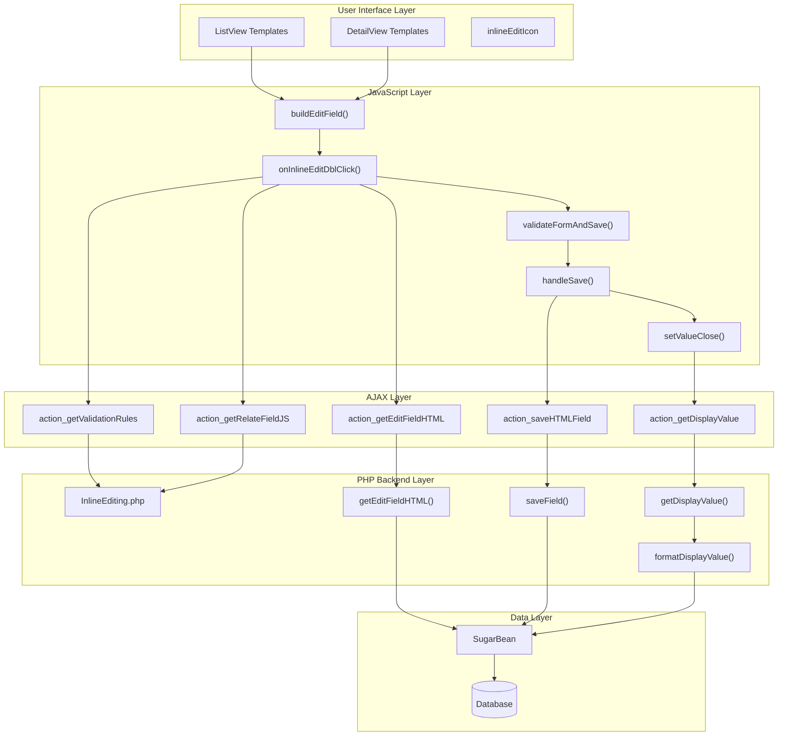
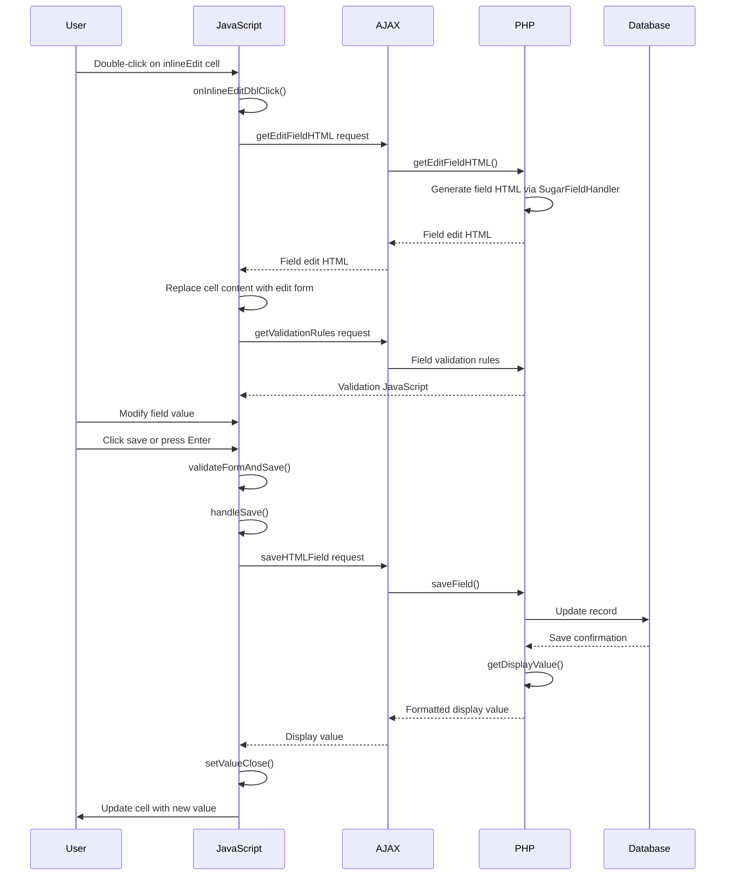
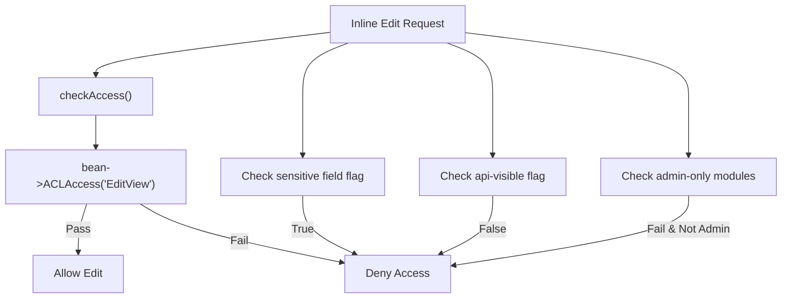
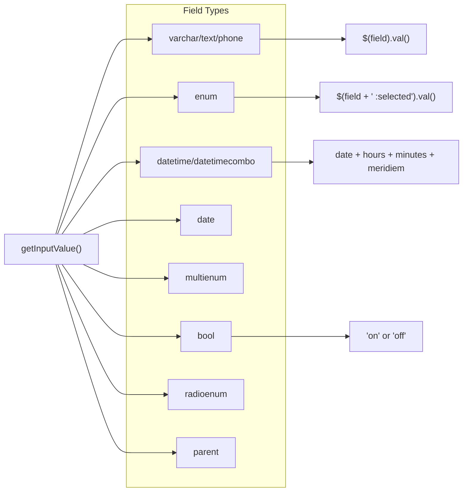

# Inline Editing

Relevant source files

The following files were used as context for generating this wiki page:

- [include/DetailView/DetailView.tpl](include/DetailView/DetailView.tpl)
- [include/InlineEditing/InlineEditing.php](include/InlineEditing/InlineEditing.php)
- [include/InlineEditing/inlineEditing.js](include/InlineEditing/inlineEditing.js)
- [include/ListView/ListViewButtons.tpl](include/ListView/ListViewButtons.tpl)
- [include/ListView/ListViewFacade.php](include/ListView/ListViewFacade.php)
- [include/ListView/ListViewGeneric.tpl](include/ListView/ListViewGeneric.tpl)
- [include/ListView/ListViewPagination.tpl](include/ListView/ListViewPagination.tpl)
- [include/MVC/Controller/SugarController.php](include/MVC/Controller/SugarController.php)
- [modules/DynamicFields/language/en_us.lang.php](modules/DynamicFields/language/en_us.lang.php)
- [modules/Emails/include/DetailView/ImportView.js](modules/Emails/include/DetailView/ImportView.js)
- [modules/Emails/include/DetailView/import.js](modules/Emails/include/DetailView/import.js)
- [modules/Emails/include/DetailView/quickCreateModal.js](modules/Emails/include/DetailView/quickCreateModal.js)
- [modules/Emails/metadata/detailviewdefs.php](modules/Emails/metadata/detailviewdefs.php)
- [modules/Emails/metadata/nonimporteddetailviewdefs.php](modules/Emails/metadata/nonimporteddetailviewdefs.php)
- [modules/Employees/Employee.php](modules/Employees/Employee.php)
- [modules/Home/controller.php](modules/Home/controller.php)
- [themes/SuiteP/include/ListView/ListViewGeneric.tpl](themes/SuiteP/include/ListView/ListViewGeneric.tpl)
- [themes/SuiteP/include/ListView/ListViewPagination.tpl](themes/SuiteP/include/ListView/ListViewPagination.tpl)
- [themes/SuiteP/include/ListView/ListViewPaginationBottom.tpl](themes/SuiteP/include/ListView/ListViewPaginationBottom.tpl)
- [themes/SuiteP/include/ListView/ListViewPaginationTop.tpl](themes/SuiteP/include/ListView/ListViewPaginationTop.tpl)

The Inline Editing system provides users with the ability to edit field values directly within list views and detail views without navigating to a separate edit page. Users can double-click on editable cells to activate an in-place editor, make changes, and save them via AJAX requests.

For information about the broader ListView system, see [Search System](#5.3). For details about the JavaScript Framework that supports inline editing, see [JavaScript Framework](#3.2).

## System Architecture

The inline editing system consists of three main layers: a JavaScript frontend that handles user interactions, a PHP backend that processes field editing logic, and AJAX endpoints that bridge the two layers.

Sources: [include/InlineEditing/InlineEditing.php:45-325](), [include/InlineEditing/inlineEditing.js:40-661](), [modules/Home/controller.php:50-143]()

## User Interaction Flow

The inline editing process follows a specific sequence of user actions and system responses, from initial activation through saving or cancellation.

Sources: [include/InlineEditing/inlineEditing.js:105-220](), [include/InlineEditing/inlineEditing.js:230-249](), [include/InlineEditing/inlineEditing.js:464-482]()

## Core PHP Functions

### Field HTML Generation

The `getEditFieldHTML()` function is the primary entry point for generating editable field HTML. It creates appropriate form controls based on field type and handles caching for performance.

| Function | Purpose | Key Parameters | Return Value |
|----------|---------|----------------|-------------|
| `getEditFieldHTML()` | Generate edit field HTML | `$module`, `$fieldname`, `$view`, `$id` | JSON-encoded HTML |
| `saveField()` | Save field value to database | `$field`, `$id`, `$module`, `$value` | Formatted display value |
| `getDisplayValue()` | Get formatted display value | `$bean`, `$field`, `$method` | Formatted field value |
| `formatDisplayValue()` | Format value for display | `$bean`, `$value`, `$vardef` | HTML-formatted value |

The system handles various field types including:
- Basic types: `varchar`, `text`, `enum`, `bool`
- Date types: `date`, `datetime`, `datetimecombo`
- Relationship types: `relate`, `parent`, `link`
- Special types: `currency`, `multienum`, `radioenum`

Sources: [include/InlineEditing/InlineEditing.php:45-325](), [include/InlineEditing/InlineEditing.php:327-398](), [include/InlineEditing/InlineEditing.php:400-433](), [include/InlineEditing/InlineEditing.php:435-567]()

### Security and Validation

The system implements several security measures to prevent unauthorized access and data corruption:

Sources: [include/InlineEditing/InlineEditing.php:593-599](), [include/InlineEditing/InlineEditing.php:63-65](), [include/InlineEditing/InlineEditing.php:376-382]()

## JavaScript Event Handling

### Activation and Interaction

The JavaScript layer manages user interactions through a series of event handlers that control the inline editing lifecycle.

| Event Handler | Trigger | Purpose |
|---------------|---------|---------|
| `buildEditField()` | Page load | Attach double-click handlers to `.inlineEdit` elements |
| `onInlineEditDblClick()` | Double-click on cell | Activate inline editing mode |
| `validateFormAndSave()` | Save button click | Validate form and trigger save |
| `clickedawayclose()` | Click outside editor | Handle editor close with change detection |

The system uses a click detection mechanism to differentiate between single clicks (navigation) and double clicks (editing):

Sources: [include/InlineEditing/inlineEditing.js:58-221](), [include/InlineEditing/inlineEditing.js:230-249](), [include/InlineEditing/inlineEditing.js:261-281]()

### Field Type Handling

Different field types require specialized JavaScript handling for value extraction and validation:

Sources: [include/InlineEditing/inlineEditing.js:380-451]()

## ListView Integration

### Template Structure

The ListView templates integrate inline editing by adding specific CSS classes and attributes to table cells that should be editable.

In `ListViewGeneric.tpl`, cells are marked as editable using:
- `inlineEdit` CSS class
- `type` attribute with field type
- `field` attribute with field name

The inline edit icon is conditionally displayed based on the `$inline_edit` template variable and field-specific settings.

Sources: [include/ListView/ListViewGeneric.tpl:256-257](), [themes/SuiteP/include/ListView/ListViewGeneric.tpl:291]()

### Field Configuration

Fields can be configured for inline editing through metadata definitions. The system checks for:
- `inline_edit` property in field definitions
- Default behavior (enabled unless explicitly disabled)
- Module-level inline editing settings

| Configuration | Location | Purpose |
|---------------|----------|---------|
| `$inline_edit` | Template variable | Global inline editing toggle |
| `inline_edit` | Field metadata | Per-field inline editing control |
| `inlineEdit` | CSS class | Visual indicator and JavaScript selector |

Sources: [include/ListView/ListViewGeneric.tpl:236](), [themes/SuiteP/include/ListView/ListViewGeneric.tpl:271]()

## AJAX Endpoints

### HomeController Actions

The `HomeController` provides AJAX endpoints that serve as the bridge between JavaScript requests and PHP backend functions:

| Action | Purpose | Request Parameters | Response |
|--------|---------|-------------------|----------|
| `action_getEditFieldHTML` | Get field edit HTML | `field`, `id`, `current_module` | JSON-encoded HTML |
| `action_saveHTMLField` | Save field value | `field`, `id`, `current_module`, `value` | Display value |
| `action_getDisplayValue` | Get display value | `field`, `id`, `current_module` | Formatted value |
| `action_getValidationRules` | Get validation rules | `field`, `id`, `current_module` | JSON validation config |
| `action_getRelateFieldJS` | Get relate field JS | `field`, `current_module` | JavaScript code |

These endpoints handle the communication between the frontend JavaScript and the backend PHP processing, ensuring that field editing operations are properly validated and executed.

Sources: [modules/Home/controller.php:50-143]()