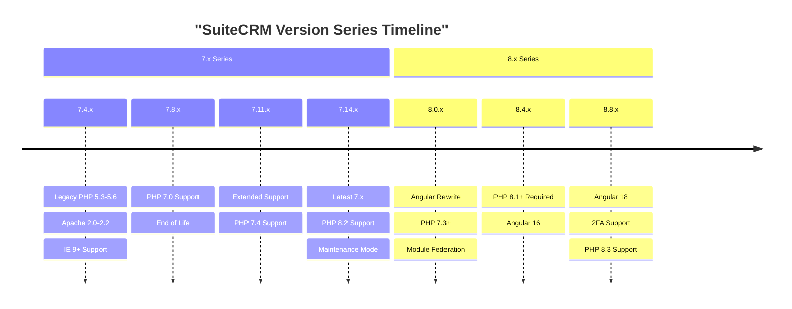
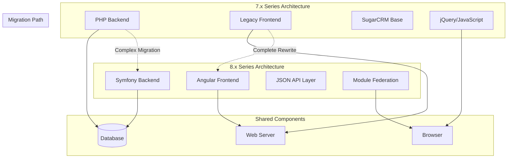
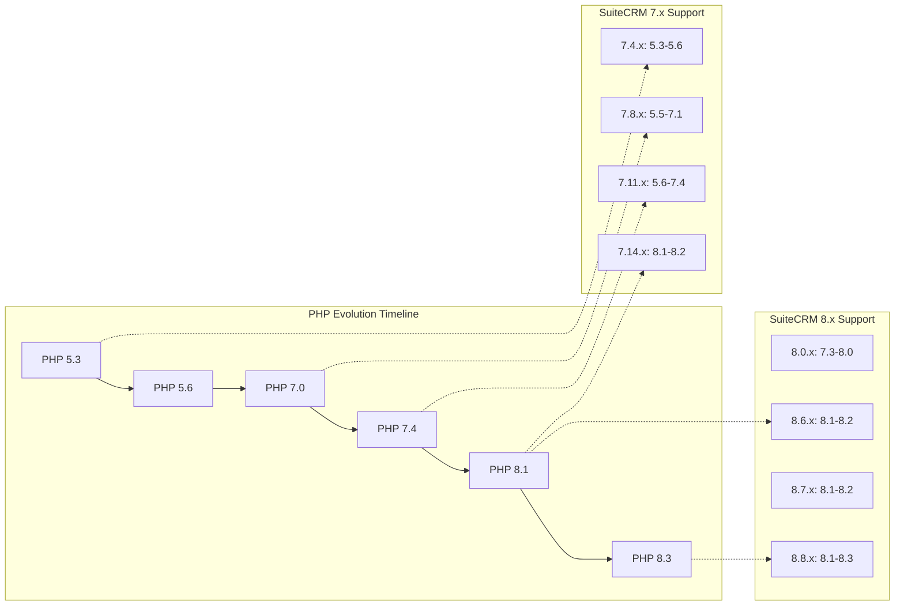
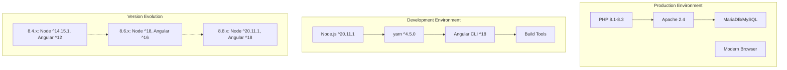

# Version Compatibility Matrix

Relevant source files

The following files were used as context for generating this wiki page:

- [.github/ISSUE_TEMPLATE.md](.github/ISSUE_TEMPLATE.md)
- [.github/ISSUE_TEMPLATE.md.NOT](.github/ISSUE_TEMPLATE.md.NOT)
- [content/8.x/admin/Compatibility Matrix.adoc](content/8.x/admin/Compatibility Matrix.adoc)
- [content/8.x/admin/Compatibility Matrix.ru.adoc](content/8.x/admin/Compatibility Matrix.ru.adoc)
- [content/8.x/developer/developer-getting-started.adoc](content/8.x/developer/developer-getting-started.adoc)
- [content/8.x/developer/extensions/backend/record-mappers/_index.en.adoc](content/8.x/developer/extensions/backend/record-mappers/_index.en.adoc)
- [content/8.x/developer/extensions/frontend/88x-fe-extensions-setup.adoc](content/8.x/developer/extensions/frontend/88x-fe-extensions-setup.adoc)
- [content/8.x/developer/extensions/frontend/examples/add-charts-extension.adoc](content/8.x/developer/extensions/frontend/examples/add-charts-extension.adoc)
- [content/8.x/developer/extensions/frontend/examples/add-sidebar-widget.adoc](content/8.x/developer/extensions/frontend/examples/add-sidebar-widget.adoc)
- [content/8.x/developer/extensions/frontend/migration/_index.en.adoc](content/8.x/developer/extensions/frontend/migration/_index.en.adoc)
- [content/8.x/developer/extensions/frontend/older/8x-fe-extensions-getting-started.adoc](content/8.x/developer/extensions/frontend/older/8x-fe-extensions-getting-started.adoc)
- [content/8.x/developer/extensions/frontend/older/8x-fe-extensions-setup.adoc](content/8.x/developer/extensions/frontend/older/8x-fe-extensions-setup.adoc)
- [content/8.x/developer/extensions/frontend/older/_index.en.adoc](content/8.x/developer/extensions/frontend/older/_index.en.adoc)
- [content/8.x/developer/installation-guide/backend-end-installation-guide.adoc](content/8.x/developer/installation-guide/backend-end-installation-guide.adoc)
- [content/_index.en.md](content/_index.en.md)
- [content/admin/Compatibility Matrix.adoc](content/admin/Compatibility Matrix.adoc)
- [content/admin/Compatibility Matrix.ru.adoc](content/admin/Compatibility Matrix.ru.adoc)
- [content/admin/Licensing.ru.adoc](content/admin/Licensing.ru.adoc)
- [content/admin/_index.ru.adoc](content/admin/_index.ru.adoc)
- [content/admin/administration-panel/search/elasticsearch/Introduction.ru.adoc](content/admin/administration-panel/search/elasticsearch/Introduction.ru.adoc)
- [content/admin/administration-panel/search/elasticsearch/Set up Elasticsearch.ru.adoc](content/admin/administration-panel/search/elasticsearch/Set up Elasticsearch.ru.adoc)
- [content/user/_index.ru.adoc](content/user/_index.ru.adoc)
- [static/images/ru/admin/System/image6.png](static/images/ru/admin/System/image6.png)

This document provides comprehensive compatibility information for all supported SuiteCRM versions, including system requirements, supported technologies, and version-specific constraints. The compatibility matrix serves as a reference for system administrators planning installations, upgrades, and development environments.

For installation procedures, see [Installation Process](#5.1). For upgrade guidance, see [Upgrade Procedures](#5.2).

## Overview

SuiteCRM maintains compatibility matrices across two major version series: the legacy 7.x series and the modern 8.x series. Each series has distinct architectural requirements and technology dependencies that evolved significantly over time.

**Sources:** [content/8.x/admin/Compatibility Matrix.adoc:10-52](), [content/admin/Compatibility Matrix.adoc:8-47]()

## Version Series Architecture

The compatibility matrix reflects fundamental architectural differences between the 7.x and 8.x series:

**Sources:** [content/8.x/admin/Compatibility Matrix.adoc:46-51](), [content/admin/Compatibility Matrix.adoc:14-47]()

## Technology Stack Requirements

### Platform and Operating System Support

SuiteCRM supports multiple operating systems with version-specific variations:

| Component | 7.x Series | 8.x Series |
|-----------|------------|------------|
| **Linux/Unix/macOS** | Any version supporting PHP | Any version supporting PHP |
| **Windows** | Windows Server 2008+ (7.4.x+: 2012+, 7.14.x: 2019+) | Not officially supported |
| **Web Server** | Apache 2.0-2.4, IIS 7.0-10 | Apache 2.4 only |

**Sources:** [content/admin/Compatibility Matrix.adoc:16-26](), [content/8.x/admin/Compatibility Matrix.adoc:20-26]()

### PHP Version Evolution

PHP support has evolved significantly across versions, with breaking changes in the 8.x series:

**Sources:** [content/8.x/admin/Compatibility Matrix.adoc:22](), [content/8.x/admin/Compatibility Matrix.adoc:57-58](), [content/admin/Compatibility Matrix.adoc:20]()

### Database Compatibility Matrix

Database support varies between version series:

| Database | 7.x Series Versions | 8.x Series Versions |
|----------|---------------------|---------------------|
| **MySQL** | 5.1-8.0 (version dependent) | 5.7, 8.0 |
| **MariaDB** | 5.5-10.11 (version dependent) | 10.4-10.11 |
| **SQL Server** | 2008+ (7.x only) | Not supported |

**Sources:** [content/admin/Compatibility Matrix.adoc:30-34](), [content/8.x/admin/Compatibility Matrix.adoc:30-32]()

## Browser Compatibility Requirements

Browser support has modernized significantly in recent versions:

### Legacy 7.x Browser Support
- **Internet Explorer**: 9+ (7.4.x), 11 only (7.8.x+)
- **Chrome**: 38+ (7.4.x) to 109+ (7.13.x+)
- **Firefox**: 32+ (7.4.x) to 109+ (7.13.x+)
- **Safari**: 6+ (most versions) to 16+ (7.13.x+)

### Modern 8.x Browser Support
- **Internet Explorer**: 11 (compatibility mode not supported)
- **Chrome**: 90+ (8.0.x-8.1.x) to 109+ (8.4.x+)
- **Firefox**: 90+ (8.0.x-8.1.x) to 109+ (8.4.x+)
- **Edge**: 89+ (8.0.x-8.1.x) to 109+ (8.4.x+)
- **Safari**: 14+ (8.0.x-8.1.x) to 16+ (8.4.x+)

**Sources:** [content/admin/Compatibility Matrix.adoc:36-46](), [content/8.x/admin/Compatibility Matrix.adoc:34-44]()

## Development Environment Requirements

SuiteCRM 8.x introduces additional requirements for frontend development that are not needed in production environments:

**Sources:** [content/8.x/admin/Compatibility Matrix.adoc:46-51](), [content/8.x/admin/Compatibility Matrix.adoc:94-96](), [content/8.x/admin/Compatibility Matrix.adoc:140-142]()

## Critical Compatibility Warnings

### PHP Version Breaking Changes

Several versions introduce breaking changes that affect upgrade paths:

1. **SuiteCRM 8.6.x**: Last version supporting PHP 7.4
2. **SuiteCRM 8.7.x**: PHP 7.4 support discontinued
3. **SuiteCRM 8.4.x+**: PHP 8.1+ required

**Sources:** [content/8.x/admin/Compatibility Matrix.adoc:57-58](), [content/8.x/admin/Compatibility Matrix.adoc:102-104]()

### Angular Framework Evolution

Frontend development requirements evolve with Angular versions:

| SuiteCRM Version | Angular CLI | Node.js | yarn |
|------------------|-------------|---------|------|
| 8.0.x - 8.4.x | ^12 | ^14.15.1 | ^1.22.10 |
| 8.5.x - 8.6.x | ^16 | ^18 | ^1.22.10 |
| 8.7.x | ^16 | ^18.10 | ^1.22.10 |
| 8.8.x | ^18 | ^20.11.1 | ^4.5.0 |

**Sources:** [content/8.x/admin/Compatibility Matrix.adoc:48-50](), [content/8.x/admin/Compatibility Matrix.adoc:94-96]()

## Version-Specific Compatibility Details

### SuiteCRM 8.x Series Compatibility

The complete compatibility matrices for each 8.x version are defined in `content/8.x/admin/Compatibility Matrix.adoc`, covering versions 8.0.x through 8.8.x with detailed platform, PHP, web server, database, and browser requirements.

### SuiteCRM 7.x Series Compatibility 

The complete compatibility matrices for each 7.x version are defined in `content/admin/Compatibility Matrix.adoc`, covering versions 7.4.x through 7.14.x with detailed platform, PHP, web server, database, and browser requirements, including Windows and SQL Server support not available in 8.x.

## Migration Considerations

When planning migrations between versions, consider these compatibility factors:

1. **PHP Version Compatibility**: Ensure target version supports current PHP installation
2. **Database Compatibility**: Verify database version support in target SuiteCRM version  
3. **Browser Requirements**: Update minimum browser requirements for end users
4. **Development Tools**: Install required Node.js, Angular CLI, and yarn versions for 8.x development
5. **Operating System**: Windows Server support varies by version and is discontinued in 8.x

**Sources:** [content/8.x/admin/Compatibility Matrix.adoc:1-381](), [content/admin/Compatibility Matrix.adoc:1-462]()