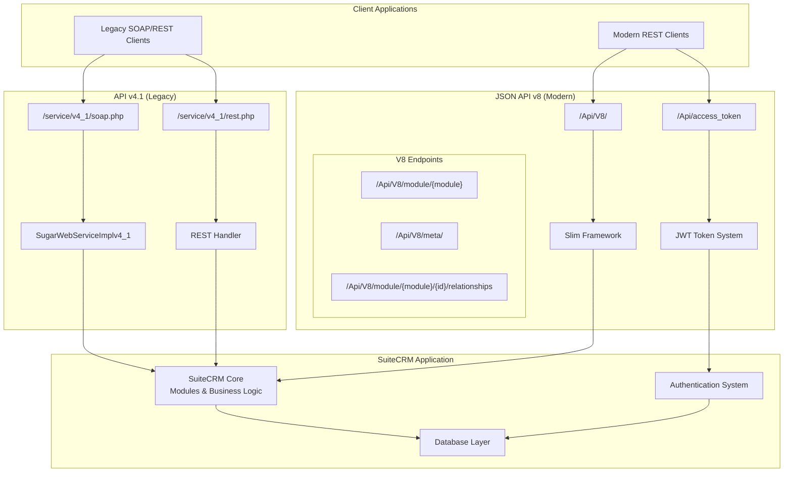
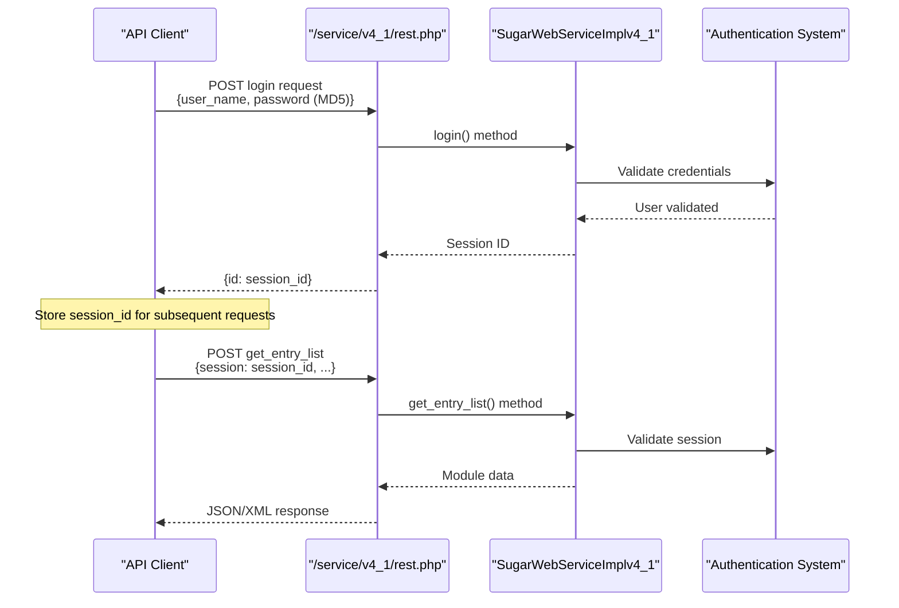
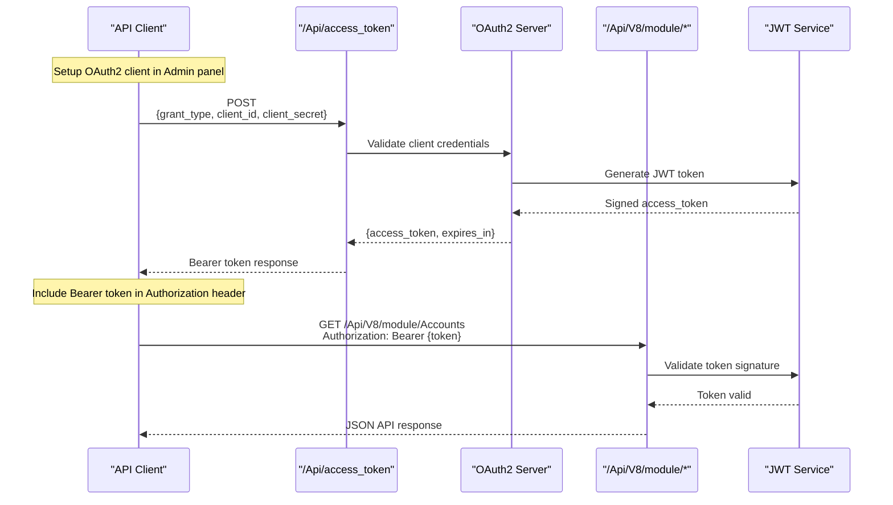
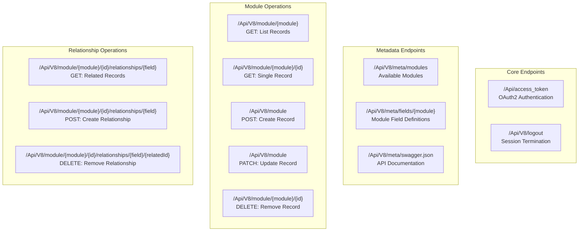

# API Documentation

<details>
<summary>Relevant source files</summary>

The following files were used as context for generating this wiki page:

- [.htmltest.yml](.htmltest.yml)
- [content/8.x/admin/releases/8.0/_index.en.adoc](content/8.x/admin/releases/8.0/_index.en.adoc)
- [content/admin/Advanced Configuration Options.adoc](content/admin/Advanced Configuration Options.adoc)
- [content/admin/administration-panel/System.adoc](content/admin/administration-panel/System.adoc)
- [content/admin/releases/7.10.x/_index.en.adoc](content/admin/releases/7.10.x/_index.en.adoc)
- [content/admin/releases/7.11.x/_index.en.adoc](content/admin/releases/7.11.x/_index.en.adoc)
- [content/admin/releases/7.12.x/_index.en.adoc](content/admin/releases/7.12.x/_index.en.adoc)
- [content/admin/releases/7.8.x/_index.en.adoc](content/admin/releases/7.8.x/_index.en.adoc)
- [content/blog/_index.es.md](content/blog/_index.es.md)
- [content/developer/api/API-4_1.adoc](content/developer/api/API-4_1.adoc)
- [content/developer/api/Developer-setup-guide/Configure Authentication.adoc](content/developer/api/Developer-setup-guide/Configure Authentication.adoc)
- [content/developer/api/Developer-setup-guide/Customization.adoc](content/developer/api/Developer-setup-guide/Customization.adoc)
- [content/developer/api/Developer-setup-guide/Getting Available Resources.adoc](content/developer/api/Developer-setup-guide/Getting Available Resources.adoc)
- [content/developer/api/Developer-setup-guide/Introduction.adoc](content/developer/api/Developer-setup-guide/Introduction.adoc)
- [content/developer/api/Developer-setup-guide/JSON-API.adoc](content/developer/api/Developer-setup-guide/JSON-API.adoc)
- [content/developer/api/Developer-setup-guide/Managing Tokens.adoc](content/developer/api/Developer-setup-guide/Managing Tokens.adoc)
- [content/developer/api/Developer-setup-guide/Requirements.adoc](content/developer/api/Developer-setup-guide/Requirements.adoc)
- [content/developer/api/Developer-setup-guide/SuiteCRM_V8_API_Set_Up_For_Postman.adoc](content/developer/api/Developer-setup-guide/SuiteCRM_V8_API_Set_Up_For_Postman.adoc)
- [content/developer/api/Developer-setup-guide/_index.en.adoc](content/developer/api/Developer-setup-guide/_index.en.adoc)
- [layouts/shortcodes/contribs.html](layouts/shortcodes/contribs.html)
- [layouts/shortcodes/dumpJSON.html](layouts/shortcodes/dumpJSON.html)
- [layouts/shortcodes/ghcontributors.html](layouts/shortcodes/ghcontributors.html)
- [static/images/en/8.x/user/features/subpanels/Filter-Expanded.png](static/images/en/8.x/user/features/subpanels/Filter-Expanded.png)
- [static/images/en/8.x/user/features/subpanels/Filter-Full-Panel.png](static/images/en/8.x/user/features/subpanels/Filter-Full-Panel.png)
- [static/images/en/8.x/user/features/subpanels/Filter-Searched.png](static/images/en/8.x/user/features/subpanels/Filter-Searched.png)

</details>


This document provides an overview of the APIs available in SuiteCRM for third-party integration and programmatic access to CRM data and functionality. SuiteCRM offers two distinct API systems that serve different use cases and support different SuiteCRM versions.

For detailed implementation guides on specific API versions, see [API v4.1 (SOAP & REST)](#4.1) and [JSON API (v8)](#4.2).

## API Overview

SuiteCRM provides two major API systems that have evolved to meet different integration needs:

### API Architecture Overview



Sources: [content/developer/api/API-4_1.adoc:23-102](), [content/developer/api/Developer-setup-guide/JSON-API.adoc:1-389]()

## API Version Compatibility

| SuiteCRM Version | API v4.1 Support | JSON API v8 Support | Primary Recommendation |
|------------------|-------------------|---------------------|------------------------|
| 7.8.x and earlier | ✓ | ✗ | API v4.1 only |
| 7.10.x - 7.14.x | ✓ | ✓ | JSON API v8 preferred |
| 8.0.x+ | ✓ | ✓ | JSON API v8 strongly recommended |

Sources: [content/developer/api/API-4_1.adoc:6-9](), [content/admin/releases/7.10.x/_index.en.adoc:167]()

## API v4.1 (SOAP & REST)

The legacy API system supporting both SOAP and REST protocols, available in all SuiteCRM versions.

### Key Characteristics

- **Protocols**: SOAP and REST (pseudo-REST using POST only)
- **Authentication**: Username/password with MD5 hashing
- **Endpoints**: 
  - SOAP: `/service/v4_1/soap.php?wsdl`
  - REST: `/service/v4_1/rest.php`
- **Data Format**: XML (SOAP) or JSON/Serialized (REST)

### Authentication Flow



Sources: [content/developer/api/API-4_1.adoc:47-88](), [content/developer/api/API-4_1.adoc:155-201]()

## JSON API v8 (Modern REST API)

The modern REST API following JSON API 1.0 specification, available from SuiteCRM 7.10+.

### Key Characteristics

- **Protocol**: True REST API
- **Authentication**: OAuth2 with JWT tokens
- **Standard**: JSON API 1.0 specification compliance
- **Base URL**: `/Api/V8/`
- **Framework**: Built on Slim Framework

### OAuth2 Authentication Flow



Sources: [content/developer/api/Developer-setup-guide/JSON-API.adoc:68-96](), [content/developer/api/Developer-setup-guide/Configure Authentication.adoc:8-284]()

## API Endpoints and Capabilities

### API v4.1 Method Categories

| Category | Example Methods | Description |
|----------|----------------|-------------|
| Authentication | `login`, `logout` | Session management |
| Data Retrieval | `get_entry_list`, `get_entry` | Fetch records and lists |
| Data Modification | `set_entry`, `set_entries` | Create and update records |
| Relationships | `get_relationships`, `set_relationship` | Manage record relationships |

### JSON API v8 Endpoint Structure



Sources: [content/developer/api/Developer-setup-guide/JSON-API.adoc:269-388](), [content/developer/api/Developer-setup-guide/Getting Available Resources.adoc:14-21]()

## API Configuration and Setup

### API v4.1 Configuration

API v4.1 requires minimal configuration as it uses SuiteCRM's standard authentication system:

- **Location**: Standard SuiteCRM user credentials
- **Access Control**: Role-based permissions apply
- **Custom Methods**: Extensible via `custom/service/v4_1_custom/`

### JSON API v8 Configuration Requirements

The JSON API v8 requires specific setup steps:

#### OAuth2 Key Generation
```bash
# Navigate to OAuth2 directory
cd {{suitecrm.root}}/Api/V8/OAuth2

# Generate private key
openssl genrsa -out private.key 2048

# Generate public key
openssl rsa -in private.key -pubout -out public.key

# Set permissions
chmod 600 private.key public.key
chown www-data:www-data *.key
```

#### Required Configuration Files

| File Path | Purpose |
|-----------|---------|
| `/Api/V8/OAuth2/private.key` | OAuth2 token signing |
| `/Api/V8/OAuth2/public.key` | OAuth2 token verification |
| `config.php: oauth2_encryption_key` | OAuth2 encryption |
| `/Api/.htaccess` | URL rewriting for endpoints |

Sources: [content/developer/api/Developer-setup-guide/JSON-API.adoc:17-66](), [content/developer/api/Developer-setup-guide/Requirements.adoc:21-29]()

## API Integration Patterns

### Choosing Between APIs

**Use API v4.1 when:**
- Integrating with SuiteCRM 7.9.x or earlier
- Working with existing SOAP-based integrations
- Simple CRUD operations without complex filtering

**Use JSON API v8 when:**
- SuiteCRM 7.10+ or 8.x deployment
- Building modern web or mobile applications
- Requiring advanced filtering, pagination, or field selection
- Implementing OAuth2-based security

### API Extension and Customization

Both APIs support customization through different mechanisms:

- **API v4.1**: Custom methods via `SugarWebServiceImplv4_1_custom` class extension
- **JSON API v8**: Slim framework middleware and custom routes in `custom/application/Ext/Api/V8/`

Sources: [content/developer/api/API-4_1.adoc:230-296](), [content/developer/api/Developer-setup-guide/Customization.adoc:11-119]()

## Security Considerations

### API v4.1 Security

- Username/password authentication with MD5 hashing
- Session-based access control
- Standard SuiteCRM role permissions apply
- Custom authentication via logic hooks possible

### JSON API v8 Security

- OAuth2 with JWT token-based authentication
- HTTPS/TLS required for production deployments
- Configurable token expiration
- Client credentials and password grant types supported

Sources: [content/developer/api/Developer-setup-guide/Requirements.adoc:8-26](), [content/developer/api/Developer-setup-guide/Configure Authentication.adoc:22-284]()