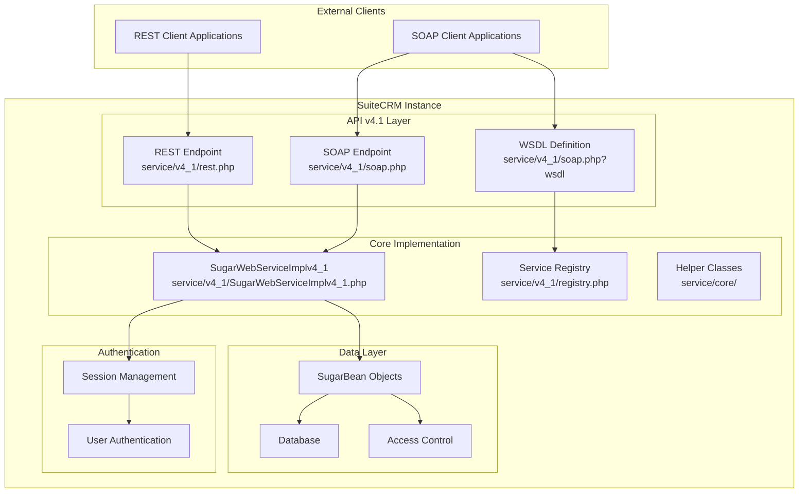
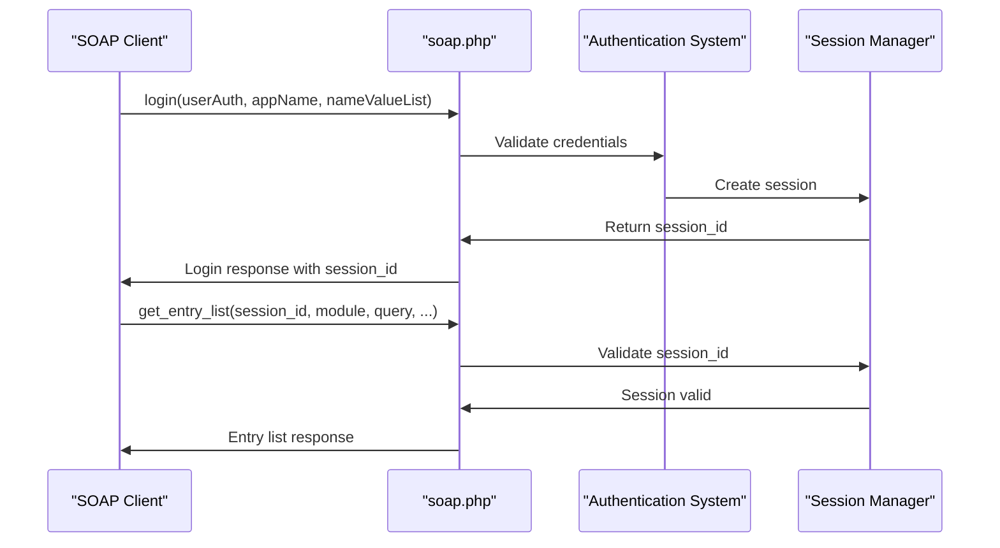
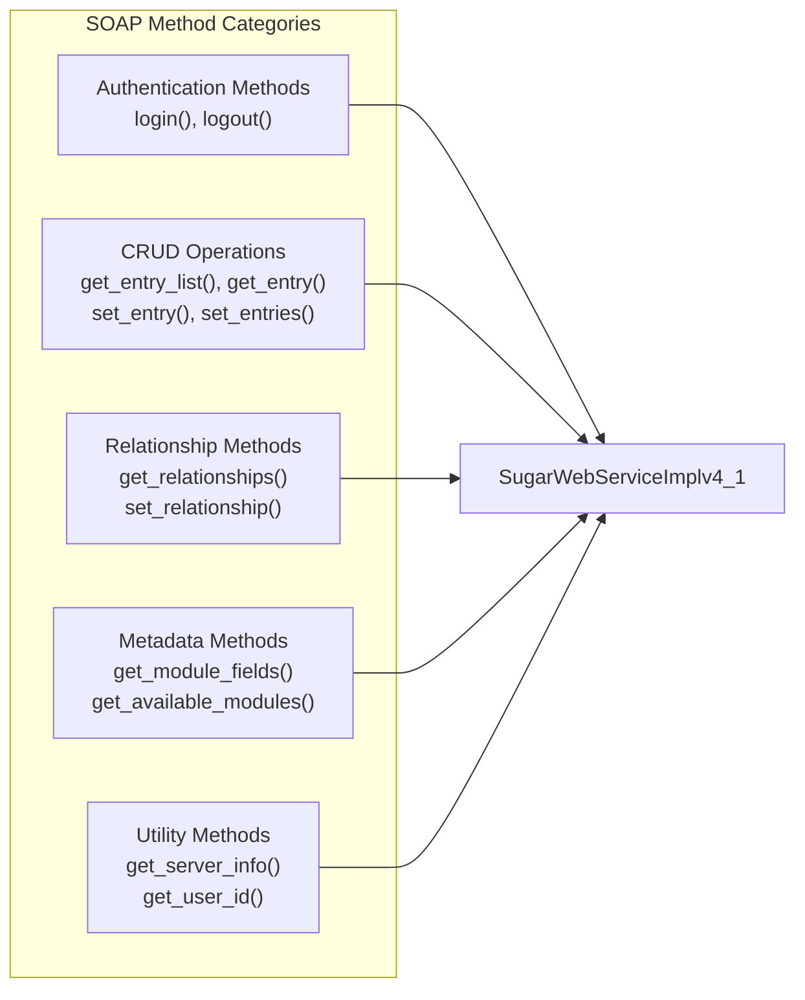
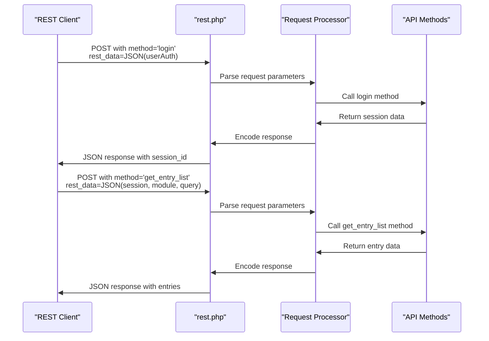
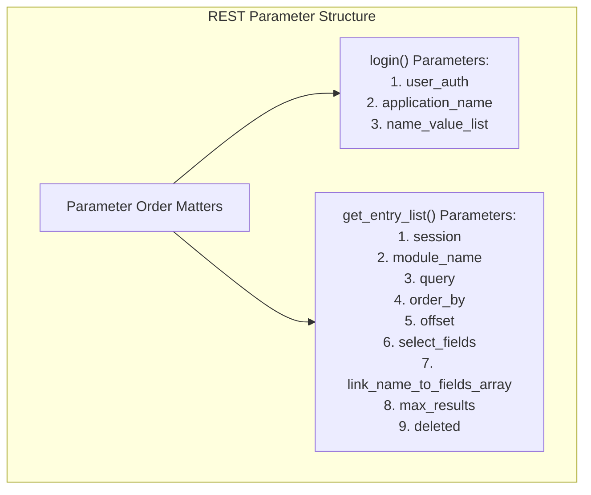
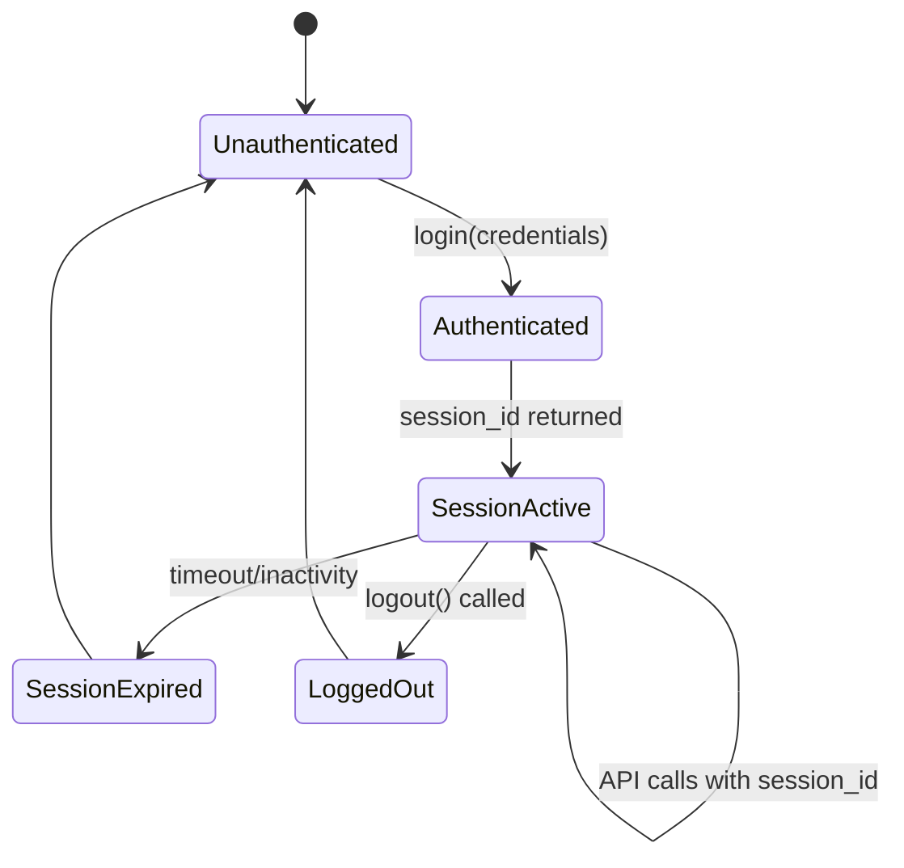
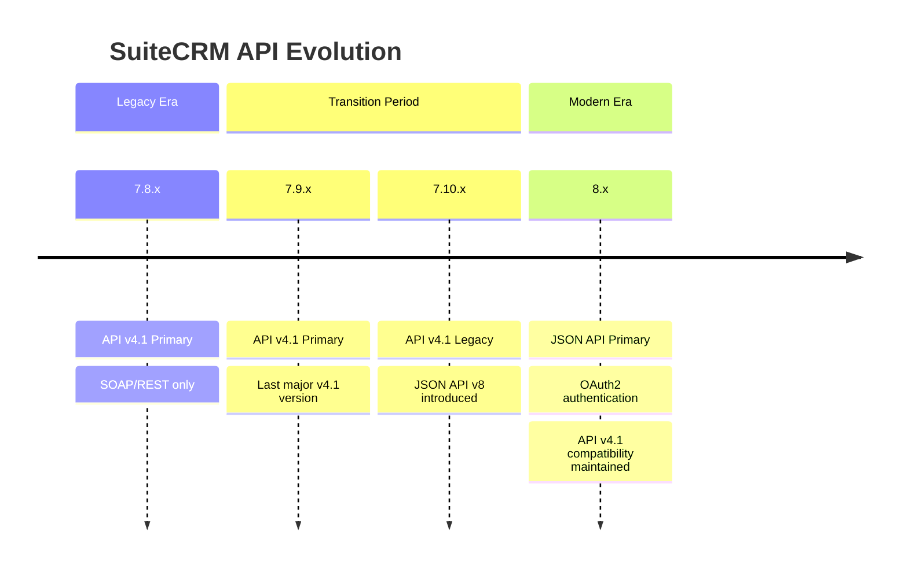
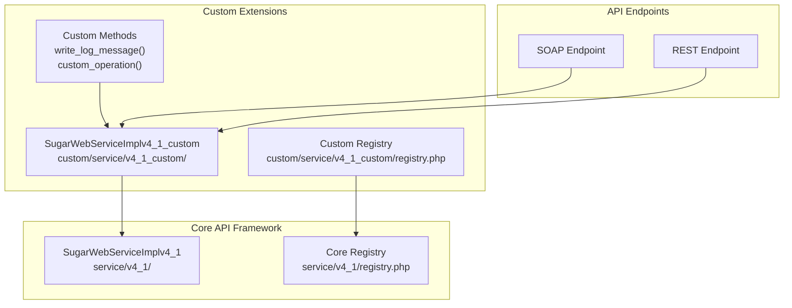

# API v4.1 (SOAP & REST)

Relevant source files

The following files were used as context for generating this wiki page:

- [.htmltest.yml](.htmltest.yml)
- [content/8.x/admin/releases/8.0/_index.en.adoc](content/8.x/admin/releases/8.0/_index.en.adoc)
- [content/admin/Advanced Configuration Options.adoc](content/admin/Advanced Configuration Options.adoc)
- [content/admin/administration-panel/System.adoc](content/admin/administration-panel/System.adoc)
- [content/admin/releases/7.10.x/_index.en.adoc](content/admin/releases/7.10.x/_index.en.adoc)
- [content/admin/releases/7.11.x/_index.en.adoc](content/admin/releases/7.11.x/_index.en.adoc)
- [content/admin/releases/7.12.x/_index.en.adoc](content/admin/releases/7.12.x/_index.en.adoc)
- [content/admin/releases/7.8.x/_index.en.adoc](content/admin/releases/7.8.x/_index.en.adoc)
- [content/blog/_index.es.md](content/blog/_index.es.md)
- [content/developer/api/API-4_1.adoc](content/developer/api/API-4_1.adoc)
- [content/developer/api/Developer-setup-guide/Configure Authentication.adoc](content/developer/api/Developer-setup-guide/Configure Authentication.adoc)
- [content/developer/api/Developer-setup-guide/Customization.adoc](content/developer/api/Developer-setup-guide/Customization.adoc)
- [content/developer/api/Developer-setup-guide/Getting Available Resources.adoc](content/developer/api/Developer-setup-guide/Getting Available Resources.adoc)
- [content/developer/api/Developer-setup-guide/Introduction.adoc](content/developer/api/Developer-setup-guide/Introduction.adoc)
- [content/developer/api/Developer-setup-guide/JSON-API.adoc](content/developer/api/Developer-setup-guide/JSON-API.adoc)
- [content/developer/api/Developer-setup-guide/Managing Tokens.adoc](content/developer/api/Developer-setup-guide/Managing Tokens.adoc)
- [content/developer/api/Developer-setup-guide/Requirements.adoc](content/developer/api/Developer-setup-guide/Requirements.adoc)
- [content/developer/api/Developer-setup-guide/SuiteCRM_V8_API_Set_Up_For_Postman.adoc](content/developer/api/Developer-setup-guide/SuiteCRM_V8_API_Set_Up_For_Postman.adoc)
- [content/developer/api/Developer-setup-guide/_index.en.adoc](content/developer/api/Developer-setup-guide/_index.en.adoc)
- [layouts/shortcodes/contribs.html](layouts/shortcodes/contribs.html)
- [layouts/shortcodes/dumpJSON.html](layouts/shortcodes/dumpJSON.html)
- [layouts/shortcodes/ghcontributors.html](layouts/shortcodes/ghcontributors.html)
- [static/images/en/8.x/user/features/subpanels/Filter-Expanded.png](static/images/en/8.x/user/features/subpanels/Filter-Expanded.png)
- [static/images/en/8.x/user/features/subpanels/Filter-Full-Panel.png](static/images/en/8.x/user/features/subpanels/Filter-Full-Panel.png)
- [static/images/en/8.x/user/features/subpanels/Filter-Searched.png](static/images/en/8.x/user/features/subpanels/Filter-Searched.png)

This document covers the SuiteCRM API version 4.1, which provides both SOAP and REST interfaces for external applications to interact with SuiteCRM data and functionality. API v4.1 was the primary API interface for SuiteCRM versions up to 7.9.x and remains available in later versions for backward compatibility.

For information about the modern JSON API available in SuiteCRM 8.x and later, see [JSON API (v8)](#4.2). For general API setup and authentication concepts, see [API Documentation](#4).

## API v4.1 Architecture Overview

API v4.1 provides dual protocol support through separate SOAP and REST endpoints, both sharing common authentication mechanisms and underlying service implementations.

**Sources:** [content/developer/api/API-4_1.adoc:1-50](), [content/developer/api/API-4_1.adoc:230-290]()

## SOAP API Implementation

The SOAP API provides a standards-compliant web service interface with full WSDL definition support.

### SOAP Endpoint Configuration

| Component | Location | Description |
|-----------|----------|-------------|
| **SOAP Service** | `service/v4_1/soap.php` | Main SOAP endpoint processor |
| **WSDL Definition** | `service/v4_1/soap.php?wsdl` | Web Service Description Language file |
| **Implementation Class** | `SugarWebServiceImplv4_1` | Core SOAP method implementations |

### SOAP Authentication Flow

**Sources:** [content/developer/api/API-4_1.adoc:35-88]()

### SOAP Method Structure

The SOAP API methods follow a consistent pattern using the `SugarWebServiceImplv4_1` class:

**Sources:** [content/developer/api/API-4_1.adoc:40-88]()

## REST API Implementation

The REST API provides a simplified HTTP-based interface, though it deviates from true REST principles by using POST for all operations.

### REST Endpoint Structure

| Parameter | Description | Example |
|-----------|-------------|---------|
| **method** | API method name | `login`, `get_entry_list` |
| **input_type** | Request data format | `JSON`, `Serialize` |
| **response_type** | Response data format | `JSON`, `Serialize` |
| **rest_data** | Method arguments | Encoded parameter array |

### REST Request Flow

**Sources:** [content/developer/api/API-4_1.adoc:90-202]()

### REST Parameter Ordering

The REST API requires strict parameter ordering in the `rest_data` array:

**Sources:** [content/developer/api/API-4_1.adoc:120-130](), [content/developer/api/API-4_1.adoc:210-230]()

## Authentication and Session Management

Both SOAP and REST APIs share the same authentication mechanism using username/password credentials and session tokens.

### Authentication Parameters

| Parameter | Type | Description |
|-----------|------|-------------|
| **user_name** | string | SuiteCRM username |
| **password** | string | MD5 hash of user password |
| **application_name** | string | Client application identifier |
| **name_value_list** | array | Additional authentication parameters |

### Session Lifecycle

**Sources:** [content/developer/api/API-4_1.adoc:15-25](), [content/developer/api/API-4_1.adoc:45-55]()

## Version Compatibility and Lifecycle

API v4.1 maintains backward compatibility across multiple SuiteCRM versions with specific support windows:

### Version Support Matrix

| SuiteCRM Version | API v4.1 Status | Notes |
|------------------|-----------------|-------|
| **7.8.x and earlier** | Primary API | Full feature support |
| **7.9.x** | Primary API | Last version with v4.1 as main API |
| **7.10.x - 7.14.x** | Legacy Support | Maintained for compatibility |
| **8.x** | Legacy Support | JSON API v8 preferred |

### API Evolution Path

**Sources:** [content/developer/api/API-4_1.adoc:6-10](), [content/admin/releases/7.10.x/_index.en.adoc:1-50](), [content/admin/releases/7.11.x/_index.en.adoc:1-50]()

## Custom API Extensions

API v4.1 supports custom method extensions through the service framework:

### Custom Method Implementation

| Component | Location | Purpose |
|-----------|----------|---------|
| **Custom Service Class** | `custom/service/v4_1_custom/` | Extended service implementation |
| **Registry File** | `custom/service/v4_1_custom/registry.php` | Method registration |
| **Implementation Class** | `SugarWebServiceImplv4_1_custom` | Custom method definitions |

### Extension Architecture

**Sources:** [content/developer/api/API-4_1.adoc:230-290]()

## Security Considerations

API v4.1 implementations should address several security aspects documented in release notes:

### Common Security Issues

| Issue Type | Description | Mitigation |
|------------|-------------|------------|
| **SQL Injection** | Direct query parameter usage | Input validation and sanitization |
| **Access Control** | Insufficient permission checks | Session validation and ACL enforcement |
| **Authentication Bypass** | Session handling vulnerabilities | Proper session management |

### Security Updates Timeline

The release notes show ongoing security maintenance across versions, with CVE identifiers tracking specific vulnerabilities in API v4.1 implementations.

**Sources:** [content/admin/releases/7.10.x/_index.en.adoc:20-35](), [content/admin/releases/7.11.x/_index.en.adoc:20-35](), [content/admin/releases/7.12.x/_index.en.adoc:20-35]()