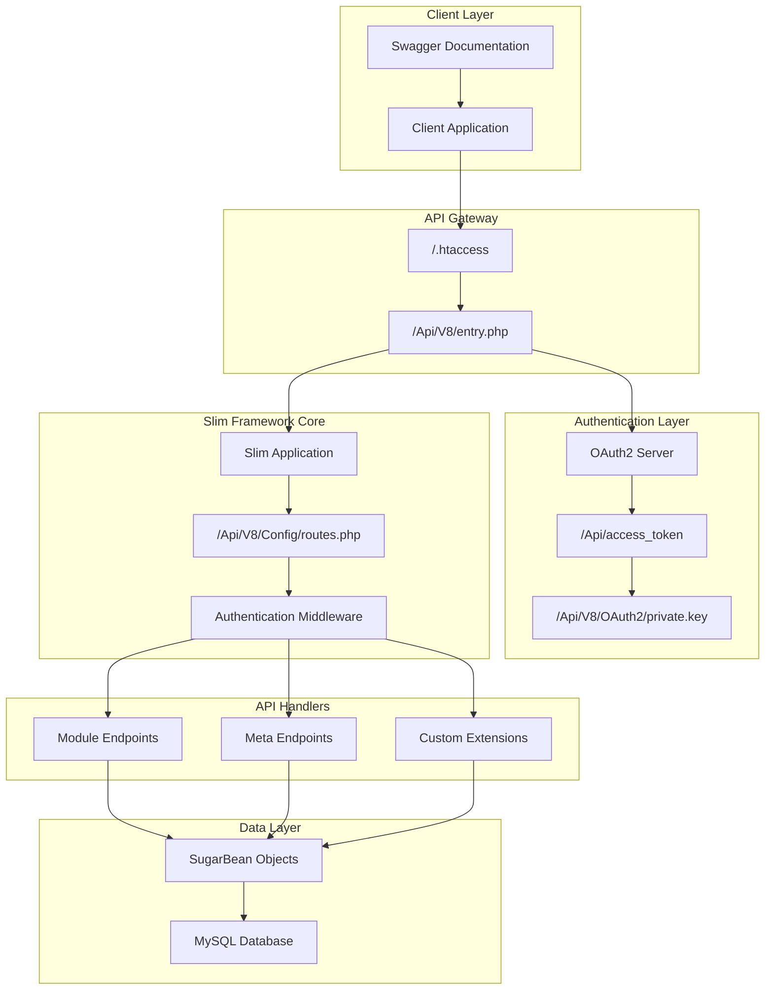
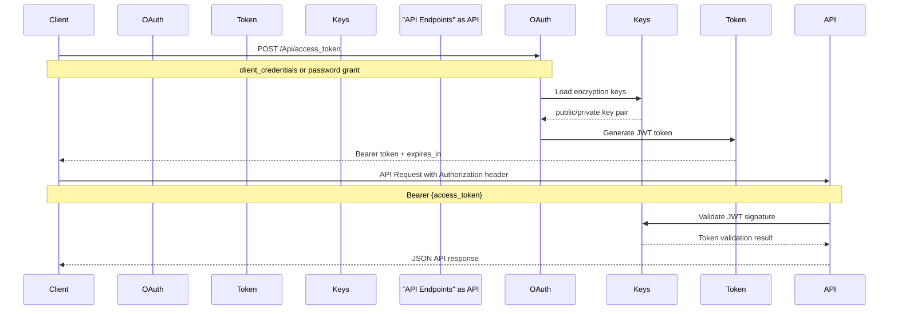
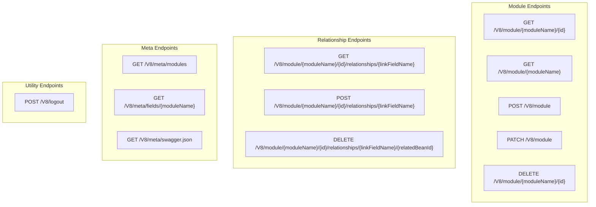
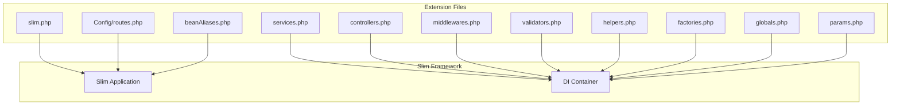

# JSON API (v8)

<details>
<summary>Relevant source files</summary>

The following files were used as context for generating this wiki page:

- [content/admin/administration-panel/System.adoc](content/admin/administration-panel/System.adoc)
- [content/blog/Customizing-Subthemes.adoc](content/blog/Customizing-Subthemes.adoc)
- [content/developer/api/Developer-setup-guide/Configure Authentication.adoc](content/developer/api/Developer-setup-guide/Configure Authentication.adoc)
- [content/developer/api/Developer-setup-guide/Customization.adoc](content/developer/api/Developer-setup-guide/Customization.adoc)
- [content/developer/api/Developer-setup-guide/Getting Available Resources.adoc](content/developer/api/Developer-setup-guide/Getting Available Resources.adoc)
- [content/developer/api/Developer-setup-guide/Introduction.adoc](content/developer/api/Developer-setup-guide/Introduction.adoc)
- [content/developer/api/Developer-setup-guide/JSON-API.adoc](content/developer/api/Developer-setup-guide/JSON-API.adoc)
- [content/developer/api/Developer-setup-guide/Managing Tokens.adoc](content/developer/api/Developer-setup-guide/Managing Tokens.adoc)
- [content/developer/api/Developer-setup-guide/Requirements.adoc](content/developer/api/Developer-setup-guide/Requirements.adoc)
- [content/developer/api/Developer-setup-guide/SuiteCRM_V8_API_Set_Up_For_Postman.adoc](content/developer/api/Developer-setup-guide/SuiteCRM_V8_API_Set_Up_For_Postman.adoc)
- [content/developer/api/Developer-setup-guide/_index.en.adoc](content/developer/api/Developer-setup-guide/_index.en.adoc)
- [static/images/en/developer/Admin-OAuth2Clients-2.png](static/images/en/developer/Admin-OAuth2Clients-2.png)
- [static/images/en/developer/Admin-OAuth2Clients-3.png](static/images/en/developer/Admin-OAuth2Clients-3.png)

</details>


## Purpose and Scope

The JSON API (v8) is SuiteCRM's modern REST API interface available exclusively in SuiteCRM 8.x series. It implements the JSON API 1.0 specification over HTTPS and provides OAuth2-secured access to CRM data and functionality. This API replaces the legacy SOAP and REST interfaces found in API v4.1.

For information about the legacy API system available in SuiteCRM 7.x and 8.x, see [API v4.1 (SOAP & REST)](#4.1). For broader API documentation context, see [API Documentation](#4).

## System Architecture

The JSON API v8 is built on the Slim framework and follows a modular architecture with clear separation between authentication, routing, and business logic components.

### Core Architecture Overview



Sources: [content/developer/api/Developer-setup-guide/JSON-API.adoc:1-389](), [content/developer/api/Developer-setup-guide/Getting Available Resources.adoc:1-115]()

### Authentication Flow



Sources: [content/developer/api/Developer-setup-guide/JSON-API.adoc:17-96](), [content/developer/api/Developer-setup-guide/Configure Authentication.adoc:8-307]()

## Authentication System

The JSON API v8 uses OAuth2 for authentication with JWT tokens. The system supports two grant types available through the SuiteCRM admin panel.

### OAuth2 Grant Types

| Grant Type | Purpose | Available Since |
|------------|---------|----------------|
| Client Credentials | Machine-to-machine authentication | SuiteCRM 7.10.2+ |
| Password | User authentication with username/password | SuiteCRM 7.10.0+ |
| Refresh Token | Token renewal | SuiteCRM 7.10.0+ |

### Setup Requirements

Before using the API, several setup steps are required:

1. **Composer Dependencies**: Install required packages via `composer install`
2. **OAuth2 Keys**: Generate RSA key pair in `/Api/V8/OAuth2/`
3. **Encryption Key**: Configure `oauth2_encryption_key` in `config.php`
4. **mod_rewrite**: Enable Apache mod_rewrite module

```bash
# Generate OAuth2 keys
openssl genrsa -out private.key 2048
openssl rsa -in private.key -pubout -out public.key
sudo chmod 600 private.key public.key
sudo chown www-data:www-data p*.key
```

Sources: [content/developer/api/Developer-setup-guide/JSON-API.adoc:10-67](), [content/developer/api/Developer-setup-guide/Requirements.adoc:21-29]()

### Token Endpoint

The authentication endpoint follows this pattern:

**POST** `/Api/access_token`

Request parameters vary by grant type:

```json
{
  "grant_type": "client_credentials",
  "client_id": "3D7f3fda97-d8e2-b9ad-eb89-5a2fe9b07650",
  "client_secret": "client_secret"
}
```

Response includes JWT bearer token:

```json
{
  "token_type": "Bearer",
  "expires_in": 3600,
  "access_token": "eyJ0eXAiOiJKV1QiLCJhbGciOiJSUzI1NiI..."
}
```

Sources: [content/developer/api/Developer-setup-guide/Configure Authentication.adoc:61-105]()

## Core Endpoints and Operations

The API provides a consistent interface for CRUD operations on SuiteCRM modules and their relationships.

### Module Operations



Sources: [content/developer/api/Developer-setup-guide/JSON-API.adoc:269-388]()

### Query Parameters

The API supports JSON API 1.0 compliant query parameters:

| Parameter | Purpose | Example |
|-----------|---------|---------|
| `fields[Module]` | Field filtering | `fields[Accounts]=name,account_type` |
| `page[number]` | Pagination | `page[number]=3&page[size]=10` |
| `page[size]` | Page size | `page[size]=25` |
| `sort` | Sorting | `sort=-name` (DESC) or `sort=name` (ASC) |
| `filter` | Record filtering | `filter[account_type][eq]=Customer` |

### Filter Operators

The API supports these comparison and logical operators:

**Comparison Operators:**
- `eq` (equals)
- `neq` (not equals) 
- `gt` (greater than)
- `gte` (greater than or equal)
- `lt` (less than)
- `lte` (less than or equal)

**Logical Operators:**
- `AND`
- `OR`

Sources: [content/developer/api/Developer-setup-guide/JSON-API.adoc:98-268]()

## Request and Response Structure

### JSON API Compliance

All requests and responses follow the JSON API 1.0 specification with SuiteCRM-specific extensions in meta objects.

### Sample Request Structure

```json
{
  "data": {
    "type": "Accounts",
    "attributes": {
      "name": "Test Account",
      "account_type": "Customer"
    }
  }
}
```

### Sample Response Structure

```json
{
  "data": {
    "type": "Account",
    "id": "11a71596-83e7-624d-c792-5ab9006dd493",
    "attributes": {
      "name": "White Cross Co",
      "account_type": "Customer"
    },
    "relationships": {
      "AOS_Contracts": {
        "links": {
          "related": "/V8/module/Accounts/11a71596-83e7-624d-c792-5ab9006dd493/relationships/aos_contracts"
        }
      }
    }
  },
  "meta": {
    "total-pages": 54
  },
  "links": {
    "first": "/V8/module/Accounts?page[number]=1&page[size]=1",
    "next": "/V8/module/Accounts?page[number]=2&page[size]=1"
  }
}
```

Sources: [content/developer/api/Developer-setup-guide/JSON-API.adoc:113-174]()

## API Documentation and Discovery

### Swagger Documentation

The API provides machine-readable documentation via Swagger/OpenAPI specification:

- **Static file**: `/Api/docs/swagger/swagger.json`
- **API endpoint**: `GET /Api/V8/meta/swagger.json`

The Swagger documentation includes:
- Available endpoints and HTTP methods
- Request/response schemas
- Parameter descriptions
- Authentication requirements
- Example values

Sources: [content/developer/api/Developer-setup-guide/Getting Available Resources.adoc:8-115]()

## Customization and Extensions

### Extension Architecture

The API provides a comprehensive extension system located in `/custom/application/Ext/Api/V8/`:



### Custom Route Example

```php
// custom/application/Ext/Api/V8/Config/routes.php
$app->get('/hello', function() {
    return 'Hello World!';
});

$app->post('/my-route/{myParam}', 'MyCustomController:myCustomAction');
```

### Service Extension Example

```php
// custom/application/Ext/Api/V8/services.php
return ['myCustomService' => function() {
    return new MyCustomService();
}];
```

Sources: [content/developer/api/Developer-setup-guide/Customization.adoc:9-118]()

## Integration Considerations

### HTTPS Requirement

The API requires HTTPS/SSL for all communications to prevent man-in-the-middle attacks, as mandated by OAuth2 security standards.

### PHP Version Compatibility

- **Minimum**: PHP 5.5.9
- **Recommended**: PHP 7.0+
- **SuiteCRM 8.4+**: PHP 8.1+ required

### Performance Considerations

- Implement proper pagination using `page[size]` and `page[number]`
- Use field filtering with `fields[Module]` to reduce payload size
- Cache bearer tokens until expiration (default 3600 seconds)
- Implement refresh token flow for long-running applications

Sources: [content/developer/api/Developer-setup-guide/Requirements.adoc:8-29](), [content/developer/api/Developer-setup-guide/JSON-API.adoc:132-174]()