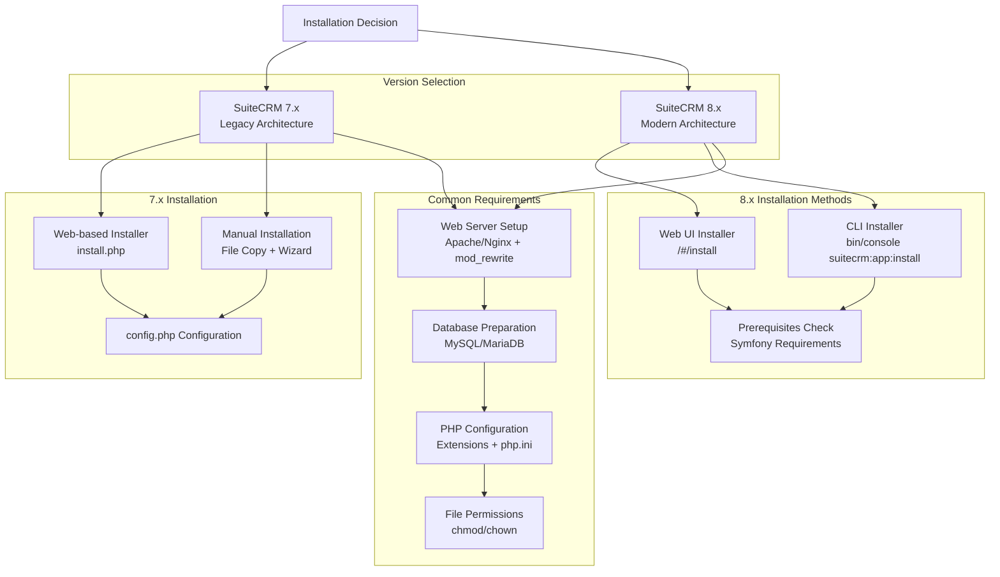
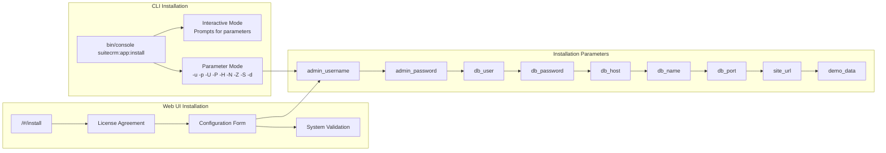
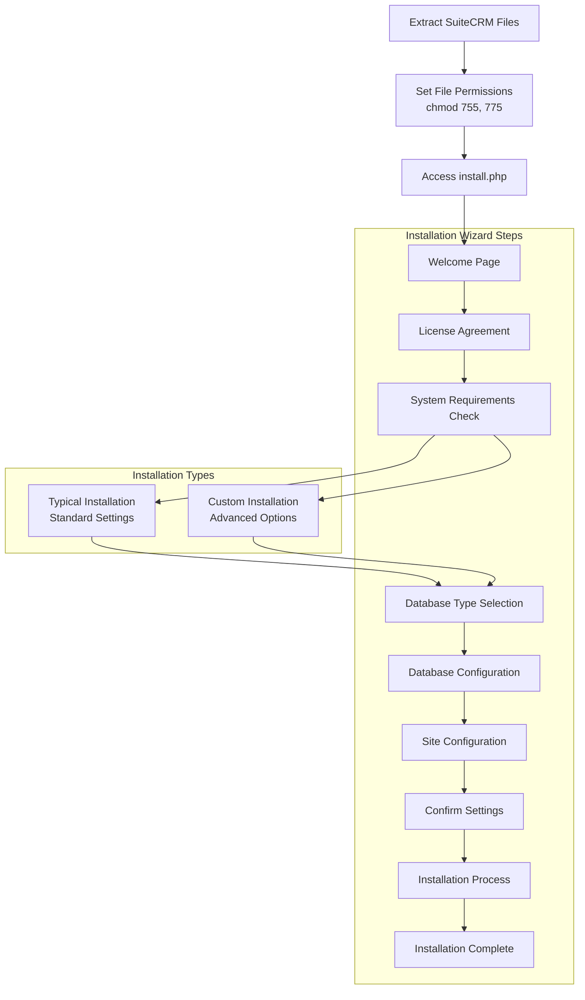
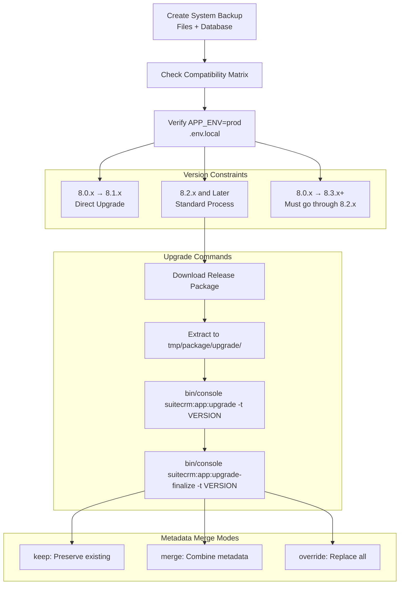
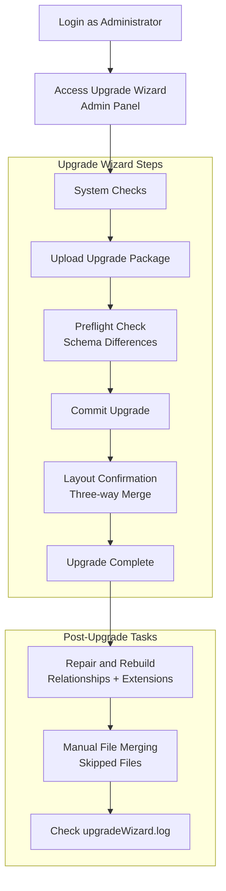
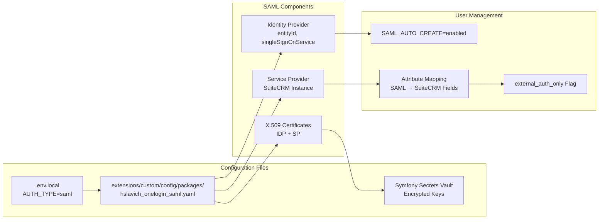
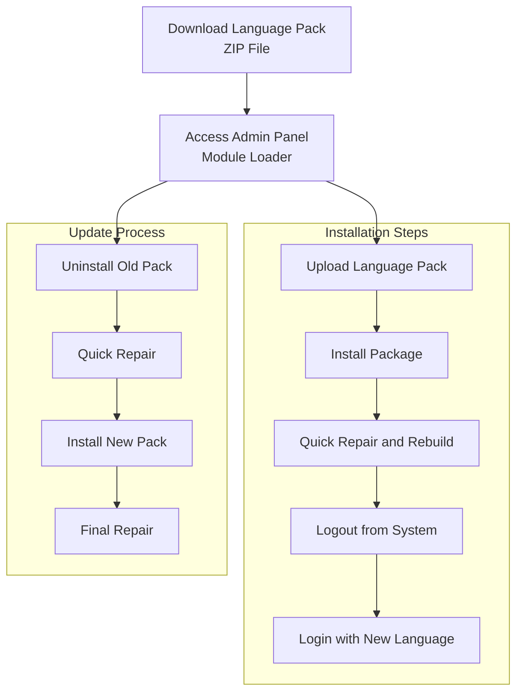
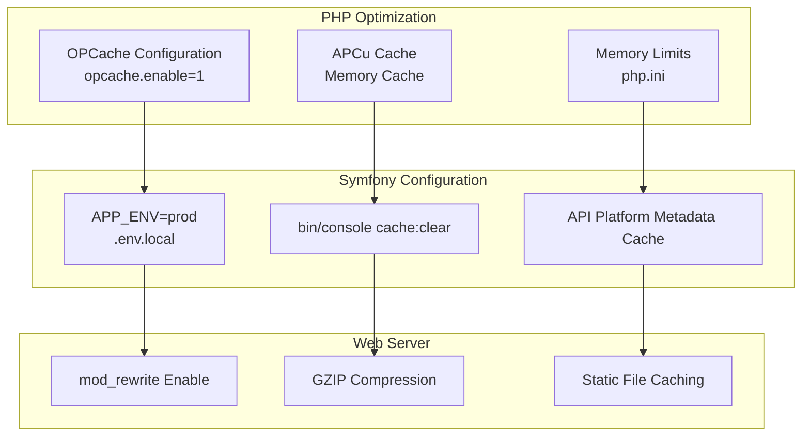

# Installation and Upgrade Guides

<details>
<summary>Relevant source files</summary>

The following files were used as context for generating this wiki page:

- [.gitignore](.gitignore)
- [content/8.x/_index.en.adoc](content/8.x/_index.en.adoc)
- [content/8.x/admin/Licensing.adoc](content/8.x/admin/Licensing.adoc)
- [content/8.x/admin/_index.en.adoc](content/8.x/admin/_index.en.adoc)
- [content/8.x/admin/_index.ru.adoc](content/8.x/admin/_index.ru.adoc)
- [content/8.x/admin/configuration/LDAP-Configuration.ru.adoc](content/8.x/admin/configuration/LDAP-Configuration.ru.adoc)
- [content/8.x/admin/configuration/Login-Throttling-Configuration.ru.adoc](content/8.x/admin/configuration/Login-Throttling-Configuration.ru.adoc)
- [content/8.x/admin/configuration/SAML-Configuration.ru.adoc](content/8.x/admin/configuration/SAML-Configuration.ru.adoc)
- [content/8.x/admin/configuration/_index.ru.adoc](content/8.x/admin/configuration/_index.ru.adoc)
- [content/8.x/admin/installation-guide/Downloading & Installing.adoc](content/8.x/admin/installation-guide/Downloading & Installing.adoc)
- [content/8.x/admin/installation-guide/Downloading & Installing.ru.adoc](content/8.x/admin/installation-guide/Downloading & Installing.ru.adoc)
- [content/8.x/admin/installation-guide/Languages/install-a-new-language.adoc](content/8.x/admin/installation-guide/Languages/install-a-new-language.adoc)
- [content/8.x/admin/installation-guide/Languages/install-a-new-language.ru.adoc](content/8.x/admin/installation-guide/Languages/install-a-new-language.ru.adoc)
- [content/8.x/admin/installation-guide/Languages/update-a-language-pack.adoc](content/8.x/admin/installation-guide/Languages/update-a-language-pack.adoc)
- [content/8.x/admin/installation-guide/Languages/update-a-language-pack.ru.adoc](content/8.x/admin/installation-guide/Languages/update-a-language-pack.ru.adoc)
- [content/8.x/admin/installation-guide/Performance.en.adoc](content/8.x/admin/installation-guide/Performance.en.adoc)
- [content/8.x/admin/installation-guide/Uninstalling.adoc](content/8.x/admin/installation-guide/Uninstalling.adoc)
- [content/8.x/admin/installation-guide/Uninstalling.ru.adoc](content/8.x/admin/installation-guide/Uninstalling.ru.adoc)
- [content/8.x/admin/installation-guide/Upgrading.ru.adoc](content/8.x/admin/installation-guide/Upgrading.ru.adoc)
- [content/8.x/admin/installation-guide/running-the-cli-installer.ru.adoc](content/8.x/admin/installation-guide/running-the-cli-installer.ru.adoc)
- [content/8.x/admin/installation-guide/running-the-ui-installer.ru.adoc](content/8.x/admin/installation-guide/running-the-ui-installer.ru.adoc)
- [content/8.x/admin/installation-guide/webserver-setup-guide.ru.adoc](content/8.x/admin/installation-guide/webserver-setup-guide.ru.adoc)
- [content/admin/installation-guide/Downloading & Installing.adoc](content/admin/installation-guide/Downloading & Installing.adoc)
- [content/admin/installation-guide/Using the Upgrade Wizard.adoc](content/admin/installation-guide/Using the Upgrade Wizard.adoc)
- [static/images/en/8.x/admin/install-guide/suite-cli-install-options.png](static/images/en/8.x/admin/install-guide/suite-cli-install-options.png)

</details>


This document provides comprehensive installation and upgrade procedures for SuiteCRM, covering both the legacy 7.x series and the modern 8.x architecture. It includes detailed instructions for fresh installations, version upgrades, and post-installation configuration including authentication setup and performance optimization.

For detailed API documentation, see [API Documentation](#4). For customization and development guidance, see [Customization and Development](#6). For system administration tasks, see [Administration](#7).

## Installation Architecture Overview

SuiteCRM supports multiple installation methods depending on the version and deployment requirements:

**SuiteCRM Installation Methods Flow**


Sources: [content/8.x/admin/installation-guide/Downloading & Installing.adoc:83-88](), [content/admin/installation-guide/Downloading & Installing.adoc:95-107](), [content/8.x/admin/installation-guide/running-the-ui-installer.ru.adoc:36-38]()

## SuiteCRM 8.x Installation Process

### Prerequisites and Web Server Setup

SuiteCRM 8.x requires specific server configuration before installation:

| Component | Requirement | Configuration File |
|-----------|-------------|-------------------|
| PHP Extensions | `cli`, `curl`, `intl`, `json`, `gd`, `mbstring`, `mysqli`, `pdo_mysql`, `openssl`, `soap`, `xml`, `zip` | `php.ini` |
| Apache Module | `mod_rewrite` enabled | `httpd.conf` or `.htaccess` |
| Error Reporting | `E_ALL & ~E_DEPRECATED & ~E_STRICT & ~E_NOTICE & ~E_WARNING` | `php.ini` |
| Document Root | Points to `public/` directory | `vhost` configuration |

The web server setup involves configuring the document root to point to the `public/` directory for security:

```apache
<VirtualHost *:80>
    DocumentRoot /<path-to-suite>/public
    <Directory /<path-to-suite>/public>
        AllowOverride All
        Order Allow,Deny
        Allow from All
    </Directory>
</VirtualHost>
```

Sources: [content/8.x/admin/installation-guide/webserver-setup-guide.ru.adoc:36-53](), [content/8.x/admin/installation-guide/webserver-setup-guide.ru.adoc:66-80]()

### File Permissions Setup

After extracting SuiteCRM files, specific permissions must be set:

```bash
find . -type d -not -perm 2755 -exec chmod 2755 {} \;
find . -type f -not -perm 0644 -exec chmod 0644 {} \;
find . ! -user www-data -exec chown www-data:www-data {} \;
chmod +x bin/console
```

Sources: [content/8.x/admin/installation-guide/Downloading & Installing.adoc:58-64](), [content/8.x/admin/installation-guide/running-the-cli-installer.ru.adoc:75-81]()

### Installation Methods

**SuiteCRM 8.x Installation Options**


Sources: [content/8.x/admin/installation-guide/running-the-cli-installer.ru.adoc:34-67](), [content/8.x/admin/installation-guide/running-the-ui-installer.ru.adoc:50-85]()

## SuiteCRM 7.x Installation Process

### Legacy Installation Wizard

SuiteCRM 7.x uses a traditional PHP-based installation wizard accessible at `install.php`:

**7.x Installation Flow**


Sources: [content/admin/installation-guide/Downloading & Installing.adoc:110-184](), [content/admin/installation-guide/Downloading & Installing.adoc:186-257]()

## Upgrade Procedures

### SuiteCRM 8.x Upgrade Process

SuiteCRM 8.x uses console commands for upgrades without requiring special upgrade packages:

**8.x Upgrade Workflow**


Example upgrade commands:
```bash
./bin/console suitecrm:app:upgrade -t SuiteCRM-8.3.0
./bin/console suitecrm:app:upgrade-finalize -t SuiteCRM-8.3.0 -m merge
```

Sources: [content/8.x/admin/installation-guide/Upgrading.ru.adoc:78-89](), [content/8.x/admin/installation-guide/Upgrading.ru.adoc:139-195]()

### SuiteCRM 7.x Upgrade Wizard

The 7.x series uses a web-based Upgrade Wizard for version transitions:

**7.x Upgrade Process**


Sources: [content/admin/installation-guide/Using the Upgrade Wizard.adoc:16-98]()

## Authentication Configuration

### SAML Configuration

SuiteCRM 8.x supports SAML authentication using OneloginSamlBundle:

**SAML Authentication Flow**


Key configuration parameters:
- `SAML_USERNAME_ATTRIBUTE`: Maps SAML attribute to SuiteCRM username
- `SAML_USE_ATTRIBUTE_FRIENDLY_NAME`: Uses friendly names from SAML request

Sources: [content/8.x/admin/configuration/SAML-Configuration.ru.adoc:45-50](), [content/8.x/admin/configuration/SAML-Configuration.ru.adoc:90-191]()

### LDAP Configuration

LDAP authentication integrates with Symfony Security components:

| Parameter | Description | Example |
|-----------|-------------|---------|
| `LDAP_HOST` | LDAP server hostname | `ldap.company.com` |
| `LDAP_PORT` | Server port | `389` (standard) |
| `LDAP_ENCRYPTION` | Connection security | `tls`, `ssl`, `none` |
| `LDAP_DN_STRING` | Distinguished Name pattern | `cn={username},dc=example,dc=org` |
| `LDAP_QUERY_STRING` | User search query | Custom search filter |

Sources: [content/8.x/admin/configuration/LDAP-Configuration.ru.adoc:44-98](), [content/8.x/admin/configuration/LDAP-Configuration.ru.adoc:120-206]()

## Language Pack Installation

### Language Pack Management

SuiteCRM supports multiple languages through installable language packs:

**Language Pack Installation Process**


Sources: [content/8.x/admin/installation-guide/Languages/install-a-new-language.ru.adoc:42-54](), [content/8.x/admin/installation-guide/Languages/update-a-language-pack.ru.adoc:10-17]()

## Performance Configuration

### Production Optimization

For production deployments, SuiteCRM 8.x supports several performance enhancements:

**Performance Configuration Stack**


Example OPCache configuration for `php.ini`:
```ini
[opcache]
zend_extension=opcache.so
opcache.enable=1
opcache.memory_consumption=256
opcache.max_accelerated_files=20000
opcache.validate_timestamps=0
```

Sources: [content/8.x/admin/installation-guide/Performance.en.adoc:6-32](), [content/8.x/admin/installation-guide/Performance.en.adoc:42-60]()

## Troubleshooting and Log Files

### Common Installation Issues

| Issue | Location | Solution |
|-------|----------|----------|
| Permission errors | File system | Re-run `chmod`/`chown` commands |
| Database connection | `.env.local` | Verify credentials and host |
| Session ID conflicts | `php.ini` | Set `session.name=PHPSESSID` |
| Cache issues | `cache/` directory | Run `bin/console cache:clear` |

### Log File Locations

SuiteCRM 8.x maintains several log files for troubleshooting:

- `logs/upgrade.log`: Upgrade process logs
- `public/legacy/upgradeWizard.log`: Legacy upgrade logs  
- `logs/<app-env>/<app-env>.log`: Main application logs
- `public/legacy/suitecrm.log`: Legacy application logs
- `logs/auth.log`: Authentication process logs

Sources: [content/8.x/admin/installation-guide/Upgrading.ru.adoc:291-314](), [content/8.x/admin/configuration/SAML-Configuration.ru.adoc:422-436]()