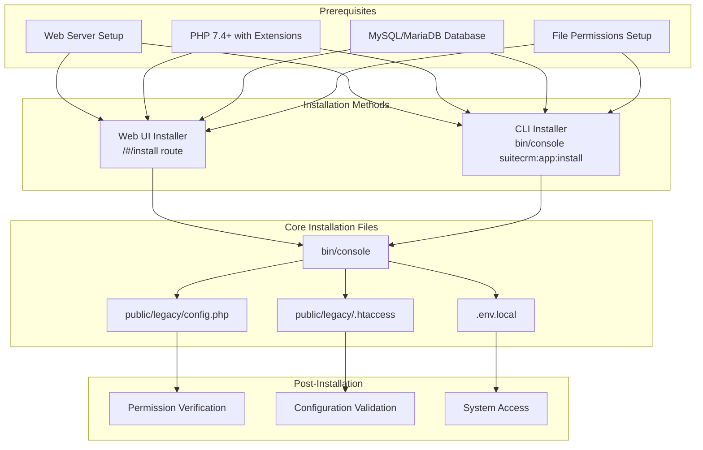
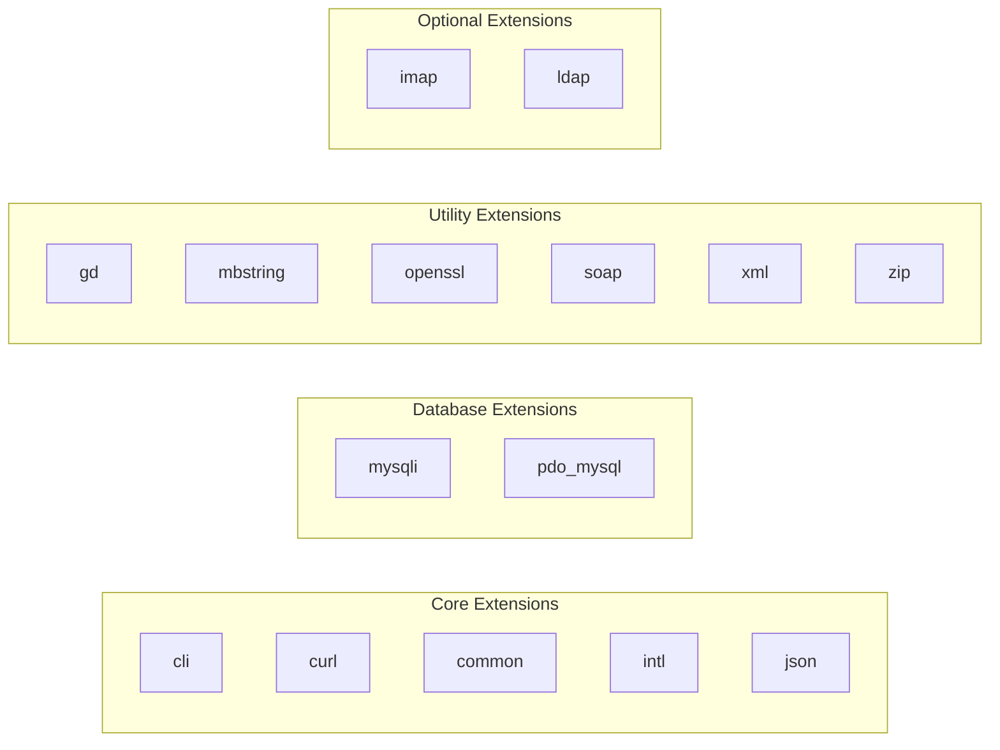
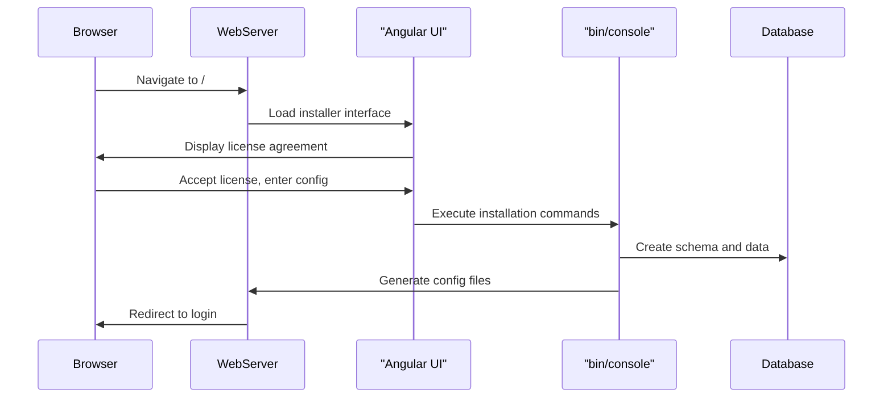
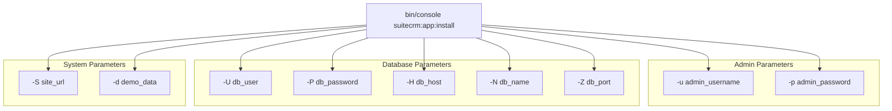
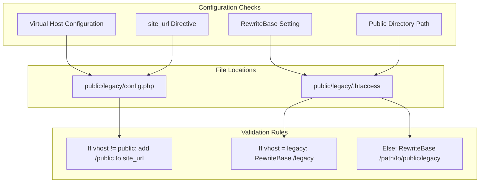
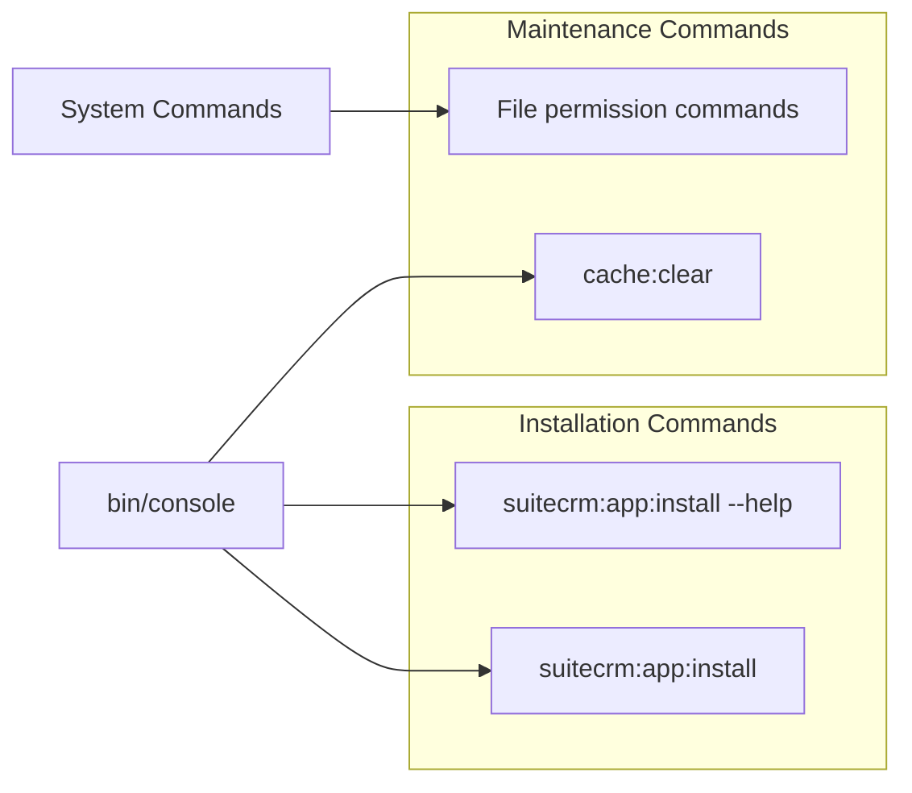

# Installation Process

<details>
<summary>Relevant source files</summary>

The following files were used as context for generating this wiki page:

- [.gitignore](.gitignore)
- [content/8.x/_index.en.adoc](content/8.x/_index.en.adoc)
- [content/8.x/admin/Licensing.adoc](content/8.x/admin/Licensing.adoc)
- [content/8.x/admin/_index.en.adoc](content/8.x/admin/_index.en.adoc)
- [content/8.x/admin/_index.ru.adoc](content/8.x/admin/_index.ru.adoc)
- [content/8.x/admin/configuration/LDAP-Configuration.ru.adoc](content/8.x/admin/configuration/LDAP-Configuration.ru.adoc)
- [content/8.x/admin/configuration/Login-Throttling-Configuration.ru.adoc](content/8.x/admin/configuration/Login-Throttling-Configuration.ru.adoc)
- [content/8.x/admin/configuration/SAML-Configuration.ru.adoc](content/8.x/admin/configuration/SAML-Configuration.ru.adoc)
- [content/8.x/admin/configuration/_index.ru.adoc](content/8.x/admin/configuration/_index.ru.adoc)
- [content/8.x/admin/installation-guide/Downloading & Installing.adoc](content/8.x/admin/installation-guide/Downloading & Installing.adoc)
- [content/8.x/admin/installation-guide/Downloading & Installing.ru.adoc](content/8.x/admin/installation-guide/Downloading & Installing.ru.adoc)
- [content/8.x/admin/installation-guide/Languages/install-a-new-language.adoc](content/8.x/admin/installation-guide/Languages/install-a-new-language.adoc)
- [content/8.x/admin/installation-guide/Languages/install-a-new-language.ru.adoc](content/8.x/admin/installation-guide/Languages/install-a-new-language.ru.adoc)
- [content/8.x/admin/installation-guide/Languages/update-a-language-pack.adoc](content/8.x/admin/installation-guide/Languages/update-a-language-pack.adoc)
- [content/8.x/admin/installation-guide/Languages/update-a-language-pack.ru.adoc](content/8.x/admin/installation-guide/Languages/update-a-language-pack.ru.adoc)
- [content/8.x/admin/installation-guide/Performance.en.adoc](content/8.x/admin/installation-guide/Performance.en.adoc)
- [content/8.x/admin/installation-guide/Uninstalling.adoc](content/8.x/admin/installation-guide/Uninstalling.adoc)
- [content/8.x/admin/installation-guide/Uninstalling.ru.adoc](content/8.x/admin/installation-guide/Uninstalling.ru.adoc)
- [content/8.x/admin/installation-guide/Upgrading.ru.adoc](content/8.x/admin/installation-guide/Upgrading.ru.adoc)
- [content/8.x/admin/installation-guide/running-the-cli-installer.ru.adoc](content/8.x/admin/installation-guide/running-the-cli-installer.ru.adoc)
- [content/8.x/admin/installation-guide/running-the-ui-installer.ru.adoc](content/8.x/admin/installation-guide/running-the-ui-installer.ru.adoc)
- [content/8.x/admin/installation-guide/webserver-setup-guide.ru.adoc](content/8.x/admin/installation-guide/webserver-setup-guide.ru.adoc)
- [content/admin/installation-guide/Downloading & Installing.adoc](content/admin/installation-guide/Downloading & Installing.adoc)
- [content/admin/installation-guide/Using the Upgrade Wizard.adoc](content/admin/installation-guide/Using the Upgrade Wizard.adoc)
- [static/images/en/8.x/admin/install-guide/suite-cli-install-options.png](static/images/en/8.x/admin/install-guide/suite-cli-install-options.png)

</details>


This document covers the step-by-step installation process for SuiteCRM 8.x, including prerequisites, installation methods, and post-installation configuration. For upgrade procedures between versions, see [Upgrade Procedures](#5.2). For authentication setup after installation, see [Authentication Configuration](#5.3).

## Overview

The SuiteCRM 8.x installation process involves setting up the web server environment, downloading and extracting files, configuring permissions, and running either a web-based or command-line installer. The system uses Symfony's console application for CLI operations and provides a modern Angular-based web installer interface.

## Installation Architecture



Sources: [content/8.x/admin/installation-guide/Downloading & Installing.adoc:15-89](), [content/8.x/admin/installation-guide/webserver-setup-guide.ru.adoc:23-100]()

## Prerequisites and System Preparation

### Web Server Requirements

The installation requires proper web server configuration with the document root pointing to the `public` directory. The system uses Apache's `mod_rewrite` for URL routing and API calls.

| Component | Requirement | Configuration File |
|-----------|------------|-------------------|
| Web Server | Apache with `mod_rewrite` | Virtual host config |
| PHP | 7.4+ with required extensions | `php.ini` |
| Database | MySQL/MariaDB | Database server |
| File System | Proper permissions | Directory structure |

### Required PHP Extensions



Sources: [content/8.x/admin/installation-guide/webserver-setup-guide.ru.adoc:34-53]()

### File Permission Setup

The system requires specific permissions for proper operation:

```bash
find . -type d -not -perm 2755 -exec chmod 2755 {} \;
find . -type f -not -perm 0644 -exec chmod 0644 {} \;
find . ! -user www-data -exec chown www-data:www-data {} \;
chmod +x bin/console
```

Sources: [content/8.x/admin/installation-guide/Downloading & Installing.adoc:58-64](), [content/8.x/admin/installation-guide/running-the-cli-installer.ru.adoc:75-81]()

## Installation Methods

### Web UI Installer

The web-based installer provides a guided installation process accessible through the browser at `/#/install` route when SuiteCRM is not yet configured.



#### Configuration Parameters

| Parameter | Description | Example |
|-----------|-------------|---------|
| URL | SuiteCRM instance location | `https://example-domain.com` |
| Database Name | Target database name | `suitecrm` |
| Database Host | Database server host | `localhost` or `127.0.0.1` |
| Database User | Database admin user | Database administrator |
| Database Password | Database admin password | Secure password |
| Admin Username | System admin username | `admin` |
| Admin Password | System admin password | Secure password |

Sources: [content/8.x/admin/installation-guide/running-the-ui-installer.ru.adoc:50-83]()

### CLI Installer

The command-line installer uses Symfony's console component for automated installations:

```bash
./bin/console suitecrm:app:install -u "admin_username" -p "admin_password" -U "db_user" -P "db_password" -H "db_host" -N "db_name" -Z "db_port" -S "site_url" -d "demo_data"
```

#### CLI Parameters



Sources: [content/8.x/admin/installation-guide/running-the-cli-installer.ru.adoc:39-68]()

## Configuration File Generation

### Core Configuration Files

The installation process generates several critical configuration files:

| File | Purpose | Key Directives |
|------|---------|---------------|
| `public/legacy/config.php` | Legacy system config | `site_url`, database settings |
| `public/legacy/.htaccess` | URL rewriting rules | `RewriteBase`, routing rules |
| `.env.local` | Environment variables | `APP_ENV`, `DATABASE_URL` |

### Configuration Validation



Sources: [content/8.x/admin/installation-guide/running-the-ui-installer.ru.adoc:94-103](), [content/8.x/admin/installation-guide/running-the-cli-installer.ru.adoc:94-103]()

## Post-Installation Steps

### Permission Verification

After installation, verify that file permissions are correctly set, especially for:

- `bin/console` - Must be executable
- Cache directories - Must be writable by web server
- Configuration files - Must be readable by web server

### System Access Validation

The completed installation should be accessible at the configured URL with the admin credentials provided during installation.

### Session Configuration

SuiteCRM requires the PHP session identifier to be set to `PHPSESSID`. If experiencing 403 errors on `/api/graphql` calls, verify the `session.name` setting in `php.ini`.

Sources: [content/8.x/admin/installation-guide/Downloading & Installing.adoc:67-69]()

## Installation Command Reference

### Key Console Commands



### Interactive vs Non-Interactive Installation

The CLI installer supports both interactive mode (prompts for input) and non-interactive mode (all parameters provided via command line arguments).

Sources: [content/8.x/admin/installation-guide/running-the-cli-installer.ru.adoc:34-37](), [content/8.x/admin/installation-guide/running-the-cli-installer.ru.adoc:69-71]()