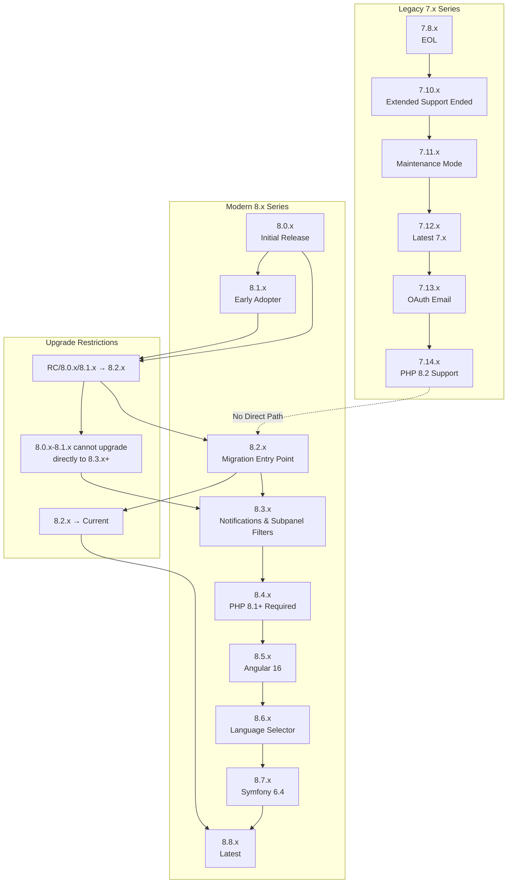
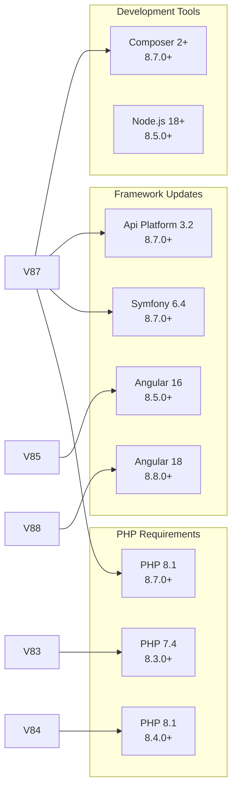
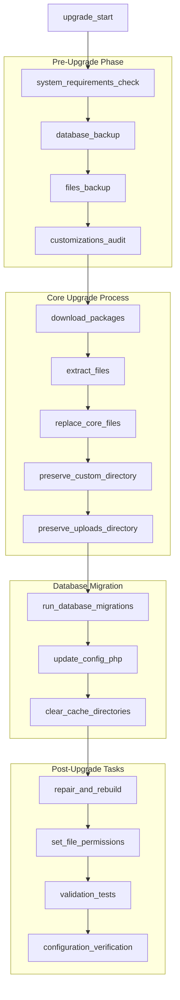
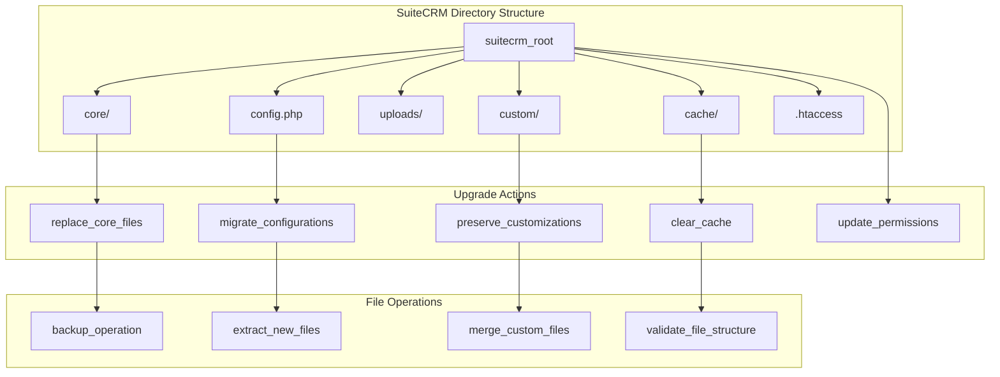
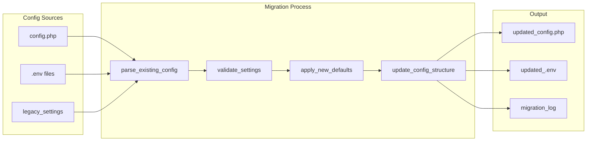

# Upgrade Procedures

Relevant source files

The following files were used as context for generating this wiki page:

- [content/8.x/_index.en.adoc](content/8.x/_index.en.adoc)
- [content/8.x/admin/Licensing.adoc](content/8.x/admin/Licensing.adoc)
- [content/8.x/admin/_index.en.adoc](content/8.x/admin/_index.en.adoc)
- [content/8.x/admin/_index.ru.adoc](content/8.x/admin/_index.ru.adoc)
- [content/8.x/admin/installation-guide/Downloading & Installing.adoc](content/8.x/admin/installation-guide/Downloading & Installing.adoc)
- [content/8.x/admin/installation-guide/Languages/install-a-new-language.adoc](content/8.x/admin/installation-guide/Languages/install-a-new-language.adoc)
- [content/8.x/admin/installation-guide/Languages/update-a-language-pack.adoc](content/8.x/admin/installation-guide/Languages/update-a-language-pack.adoc)
- [content/8.x/admin/installation-guide/Performance.en.adoc](content/8.x/admin/installation-guide/Performance.en.adoc)
- [content/8.x/admin/installation-guide/Uninstalling.adoc](content/8.x/admin/installation-guide/Uninstalling.adoc)
- [content/8.x/admin/releases/8.1/_index.en.adoc](content/8.x/admin/releases/8.1/_index.en.adoc)
- [content/8.x/admin/releases/8.2/_index.en.adoc](content/8.x/admin/releases/8.2/_index.en.adoc)
- [content/8.x/admin/releases/8.3/_index.en.adoc](content/8.x/admin/releases/8.3/_index.en.adoc)
- [content/8.x/admin/releases/8.4/_index.en.adoc](content/8.x/admin/releases/8.4/_index.en.adoc)
- [content/8.x/admin/releases/8.5/_index.en.adoc](content/8.x/admin/releases/8.5/_index.en.adoc)
- [content/8.x/admin/releases/8.6/_index.en.adoc](content/8.x/admin/releases/8.6/_index.en.adoc)
- [content/8.x/admin/releases/8.7/_index.en.adoc](content/8.x/admin/releases/8.7/_index.en.adoc)
- [content/8.x/admin/upgrading/general-info.adoc](content/8.x/admin/upgrading/general-info.adoc)
- [content/blog/larger-upgrades.adoc](content/blog/larger-upgrades.adoc)
- [i18n/es.toml](i18n/es.toml)
- [layouts/partials/home-cta1.html](layouts/partials/home-cta1.html)
- [layouts/partials/home-cta2.html](layouts/partials/home-cta2.html)
- [layouts/partials/home-cta3.html](layouts/partials/home-cta3.html)
- [layouts/partials/home-cta4.html](layouts/partials/home-cta4.html)
- [layouts/partials/last-blog-posts.html](layouts/partials/last-blog-posts.html)
- [layouts/partials/recently-edited-item.html](layouts/partials/recently-edited-item.html)
- [layouts/partials/recently-edited.html](layouts/partials/recently-edited.html)
- [layouts/partials/tags.html](layouts/partials/tags.html)
- [static/css/tags.css](static/css/tags.css)
- [static/images/en/8.x/admin/install-guide/suite-cli-install-options.png](static/images/en/8.x/admin/install-guide/suite-cli-install-options.png)
- [static/images/en/8.x/admin/release/portal-user-enable-buttons.gif](static/images/en/8.x/admin/release/portal-user-enable-buttons.gif)
- [static/images/en/8.x/admin/release/preinstall-page-re-styled.png](static/images/en/8.x/admin/release/preinstall-page-re-styled.png)
- [static/images/en/8.x/admin/release/release-notes-field-actions-example.gif](static/images/en/8.x/admin/release/release-notes-field-actions-example.gif)
- [themes/hugo-theme-learn/layouts/partials/summary-minus-toc.html](themes/hugo-theme-learn/layouts/partials/summary-minus-toc.html)
- [themes/hugo-theme-learn/layouts/partials/toc.html](themes/hugo-theme-learn/layouts/partials/toc.html)

This document covers the upgrade procedures for SuiteCRM installations, focusing on the technical processes, version compatibility requirements, and upgrade paths between different SuiteCRM versions. For initial installation procedures, see [Installation Process](#5.1). For post-upgrade authentication configuration, see [Authentication Configuration](#5.3).

## Purpose and Scope

The upgrade procedures encompass version-specific upgrade paths, system requirement changes, backward compatibility considerations, and the technical execution of upgrades for both SuiteCRM 7.x and 8.x series. This includes database migrations, file management, configuration updates, and validation processes.

## Version Compatibility and Upgrade Paths

### SuiteCRM Version Ecosystem

Sources: [content/8.x/admin/upgrading/general-info.adoc:30-79](), [content/8.x/admin/releases/8.4/_index.en.adoc:212-220](), [content/8.x/admin/releases/8.2/_index.en.adoc:326-348]()

### Upgrade Path Requirements

| Starting Version | Required Path | Documentation |
|------------------|---------------|---------------|
| RC/8.0.x/8.1.x → 8.3.x+ | Must upgrade to 8.2.x first | Mandatory step restriction |
| 8.2.x → Current | Direct upgrade supported | Standard procedure |
| Beta → Current | Beta → RC/8.0.x/8.1.x → 8.2.x → Current | Multi-step required |
| 7.12.x+ → 8.x | Migration procedure required | Uses migration tooling |

Sources: [content/8.x/admin/upgrading/general-info.adoc:40-44](), [content/8.x/admin/upgrading/general-info.adoc:68-78]()

## System Requirements and Breaking Changes

### Version-Specific System Requirements

Sources: [content/8.x/admin/releases/8.3/_index.en.adoc:105-111](), [content/8.x/admin/releases/8.4/_index.en.adoc:185-191](), [content/8.x/admin/releases/8.7/_index.en.adoc:96-105]()

### Critical Configuration Changes

| Version | Change Type | Impact | Required Action |
|---------|-------------|--------|-----------------|
| 8.4.0 | Extension Rename | `extensions/default` → `extensions/defaultExt` | Manual migration required |
| 8.4.0 | Display Logic | `displayType` → `displayLogic` | Update metadata |
| 8.7.0 | SAML Config | Configuration structure changed | Reconfigure SAML |
| 8.7.0 | APP_SECRET | Environment property required | Auto-generated on upgrade |

Sources: [content/8.x/admin/releases/8.4/_index.en.adoc:194-210](), [content/8.x/admin/releases/8.7/_index.en.adoc:106-161]()

## Upgrade Process Components

### Technical Upgrade Workflow

Sources: [content/blog/larger-upgrades.adoc:115-188](), [content/8.x/admin/installation-guide/Downloading & Installing.adoc:52-64]()

### File System Components in Upgrade

Sources: [content/blog/larger-upgrades.adoc:147-156](), [content/8.x/admin/installation-guide/Downloading & Installing.adoc:35-51]()

## Database Migration Procedures

### Database Upgrade Process

The database upgrade process involves schema updates, data migrations, and configuration changes. The core upgrade logic handles version-specific database modifications automatically.

**Key Database Operations:**
- Schema updates for new field types and table structures
- Data migration for configuration changes
- Index updates for performance improvements
- Foreign key constraint updates

**Critical Files:**
- Database upgrade scripts handle version-specific migrations
- Configuration updates modify `config.php` entries
- Cache clearing removes outdated metadata

Sources: [content/blog/larger-upgrades.adoc:133-145](), [content/8.x/admin/releases/8.2/_index.en.adoc:25-30]()

### Configuration Migration

Configuration changes between versions require specific migration steps:

Sources: [content/8.x/admin/releases/8.7/_index.en.adoc:106-161](), [content/8.x/admin/releases/8.1/_index.en.adoc:156-167]()

## Version-Specific Upgrade Considerations

### 8.4.x Upgrade Requirements

**Breaking Changes:**
- `extensions/default` package renamed to `extensions/defaultExt`
- `displayType` logic moved to `displayLogic` metadata entry
- PHP 8.1+ requirement

**Migration Steps:**
1. Manual migration of custom extensions from `default` to `defaultExt`
2. Update metadata configurations using new `displayLogic` structure
3. Verify PHP version compatibility

Sources: [content/8.x/admin/releases/8.4/_index.en.adoc:194-210]()

### 8.7.x Platform Upgrade

**Major Framework Changes:**
- Symfony 6.4 upgrade
- Api Platform 3.2 migration
- Composer 2+ requirement
- APP_SECRET environment property required

**SAML Configuration Update:**
- New configuration structure with environment-based settings
- Migration from `Hslavich` to `Nbgrp` SAML dependency
- Updated authentication handlers

Sources: [content/8.x/admin/releases/8.7/_index.en.adoc:92-161]()

## Security and Validation

### Post-Upgrade Validation

**Critical Validation Points:**
- Database integrity verification
- File permission validation
- Configuration syntax checking
- Custom code compatibility testing
- API endpoint functionality verification

**Security Considerations:**
- File permission reset using `chmod 2755` for directories and `chmod 0644` for files
- Web server user ownership verification (`www-data` or `apache`)
- `.htaccess` configuration validation

Sources: [content/8.x/admin/installation-guide/Downloading & Installing.adoc:52-74](), [content/blog/larger-upgrades.adoc:155-173]()

### Testing and Rollback Procedures

**Testing Strategy:**
- Clone system testing before production upgrade
- Customization functionality verification
- Email configuration testing
- Theme and UI validation
- Third-party integration testing

**Rollback Preparation:**
- Complete database backup before upgrade
- File system snapshot or backup
- Configuration backup
- Documentation of custom modifications

Sources: [content/blog/larger-upgrades.adoc:117-132](), [content/blog/larger-upgrades.adoc:155-164]()