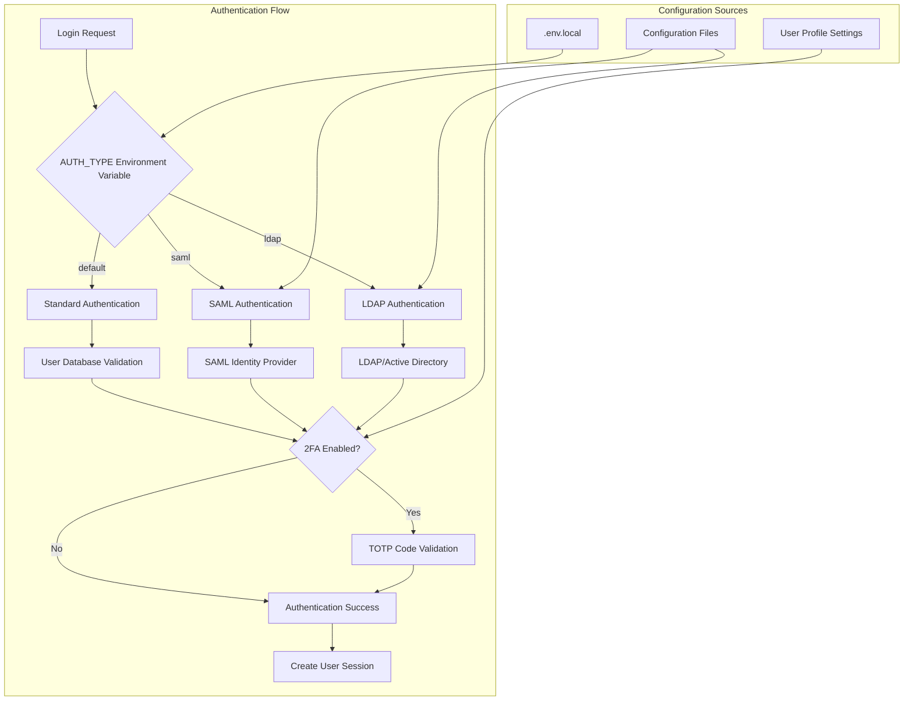
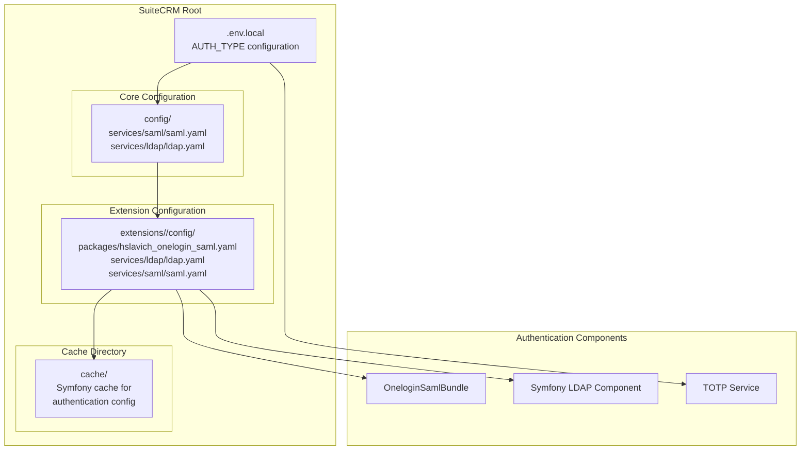

# Authentication Configuration

<details>
<summary>Relevant source files</summary>

The following files were used as context for generating this wiki page:

- [content/8.x/admin/configuration/LDAP-Configuration.ru.adoc](content/8.x/admin/configuration/LDAP-Configuration.ru.adoc)
- [content/8.x/admin/configuration/Login-Throttling-Configuration.ru.adoc](content/8.x/admin/configuration/Login-Throttling-Configuration.ru.adoc)
- [content/8.x/admin/configuration/SAML-Configuration.ru.adoc](content/8.x/admin/configuration/SAML-Configuration.ru.adoc)
- [content/8.x/admin/configuration/_index.ru.adoc](content/8.x/admin/configuration/_index.ru.adoc)
- [content/8.x/admin/installation-guide/Downloading & Installing.ru.adoc](content/8.x/admin/installation-guide/Downloading & Installing.ru.adoc)
- [content/8.x/admin/installation-guide/Languages/install-a-new-language.ru.adoc](content/8.x/admin/installation-guide/Languages/install-a-new-language.ru.adoc)
- [content/8.x/admin/installation-guide/Languages/update-a-language-pack.ru.adoc](content/8.x/admin/installation-guide/Languages/update-a-language-pack.ru.adoc)
- [content/8.x/admin/installation-guide/Uninstalling.ru.adoc](content/8.x/admin/installation-guide/Uninstalling.ru.adoc)
- [content/8.x/admin/installation-guide/Upgrading.ru.adoc](content/8.x/admin/installation-guide/Upgrading.ru.adoc)
- [content/8.x/admin/installation-guide/running-the-cli-installer.ru.adoc](content/8.x/admin/installation-guide/running-the-cli-installer.ru.adoc)
- [content/8.x/admin/installation-guide/running-the-ui-installer.ru.adoc](content/8.x/admin/installation-guide/running-the-ui-installer.ru.adoc)
- [content/8.x/admin/installation-guide/webserver-setup-guide.ru.adoc](content/8.x/admin/installation-guide/webserver-setup-guide.ru.adoc)
- [content/8.x/admin/releases/8.8/_index.en.adoc](content/8.x/admin/releases/8.8/_index.en.adoc)
- [content/8.x/developer/extensions/backend/save-handlers/_index.en.adoc](content/8.x/developer/extensions/backend/save-handlers/_index.en.adoc)
- [content/8.x/developer/extensions/frontend/migration/Migration-8.8.adoc](content/8.x/developer/extensions/frontend/migration/Migration-8.8.adoc)
- [content/8.x/developer/installation-guide/8.2.0-front-end-installation-guide.adoc](content/8.x/developer/installation-guide/8.2.0-front-end-installation-guide.adoc)
- [content/8.x/developer/installation-guide/8.8.0-front-end-installation-guide.adoc](content/8.x/developer/installation-guide/8.8.0-front-end-installation-guide.adoc)
- [content/8.x/features/two-factor/two-factor.en.adoc](content/8.x/features/two-factor/two-factor.en.adoc)
- [static/images/en/8.x/admin/release/Fav-Filter.gif](static/images/en/8.x/admin/release/Fav-Filter.gif)
- [static/images/en/8.x/admin/release/Qr-2FA.png](static/images/en/8.x/admin/release/Qr-2FA.png)
- [static/images/en/8.x/admin/release/new-record-view.png](static/images/en/8.x/admin/release/new-record-view.png)
- [static/images/en/8.x/user/features/2FA-Profile.png](static/images/en/8.x/user/features/2FA-Profile.png)
- [static/images/en/8.x/user/features/Disable-Two-Factor.gif](static/images/en/8.x/user/features/Disable-Two-Factor.gif)
- [static/images/en/8.x/user/features/Enable-2FA.png](static/images/en/8.x/user/features/Enable-2FA.png)
- [static/images/en/8.x/user/features/Enabled-2FA.png](static/images/en/8.x/user/features/Enabled-2FA.png)
- [static/images/en/8.x/user/features/Login-2FA.png](static/images/en/8.x/user/features/Login-2FA.png)
- [static/images/en/8.x/user/features/New-Disable-2FA.png](static/images/en/8.x/user/features/New-Disable-2FA.png)
- [static/images/en/8.x/user/features/QR-Code-Secret.png](static/images/en/8.x/user/features/QR-Code-Secret.png)
- [static/images/en/8.x/user/features/Qr-2FA.png](static/images/en/8.x/user/features/Qr-2FA.png)
- [static/images/en/8.x/user/features/Regenerate-Codes.gif](static/images/en/8.x/user/features/Regenerate-Codes.gif)

</details>


This page covers the configuration of authentication methods in SuiteCRM 8.x, including standard authentication, SAML SSO, LDAP integration, Two-Factor Authentication (2FA), and login security controls. For user management and role configuration, see [User Management](#7.2). For email authentication setup, see [Email Configuration](#7.3).

## Overview

SuiteCRM 8.x supports multiple authentication methods that can be configured through environment variables and configuration files. The authentication system is built on Symfony's Security component and supports modern authentication protocols.

### Supported Authentication Methods

| Method | Configuration | Use Case |
|--------|---------------|----------|
| Standard | Default | Username/password authentication |
| SAML SSO | `AUTH_TYPE=saml` | Single Sign-On with identity providers |
| LDAP | `AUTH_TYPE=ldap` | Active Directory/LDAP integration |
| Two-Factor (2FA) | User profile | Additional security layer with TOTP |

## Authentication Architecture



Sources: [content/8.x/admin/configuration/SAML-Configuration.ru.adoc:44-50](), [content/8.x/admin/configuration/LDAP-Configuration.ru.adoc:42-48](), [content/8.x/features/two-factor/two-factor.en.adoc:69-83]()

## Configuration File Structure



Sources: [content/8.x/admin/configuration/SAML-Configuration.ru.adoc:99-101](), [content/8.x/admin/configuration/LDAP-Configuration.ru.adoc:162-164]()

## Standard Authentication

Standard authentication uses SuiteCRM's built-in user database with username and password validation. This is the default method when no `AUTH_TYPE` is specified.

### Configuration

No additional configuration is required for standard authentication. It is active by default when:
- No `AUTH_TYPE` environment variable is set, or
- `AUTH_TYPE` is not set to `saml` or `ldap`

### User Database Integration

Standard authentication validates credentials against the `users` table in the SuiteCRM database, checking the `user_name` and `user_hash` fields.

Sources: [content/8.x/admin/configuration/SAML-Configuration.ru.adoc:360-367](), [content/8.x/admin/configuration/LDAP-Configuration.ru.adoc:100-106]()

## SAML Authentication

SAML (Security Assertion Markup Language) enables Single Sign-On integration with identity providers like Active Directory, Okta, or Keycloak.

### Enabling SAML

Configure SAML authentication in `.env.local`:

```bash
AUTH_TYPE=saml
```

### Basic SAML Configuration

Set SAML parameters in `.env.local`:

```bash
###> SAML CONFIG ###
SAML_USERNAME_ATTRIBUTE=uid
SAML_USE_ATTRIBUTE_FRIENDLY_NAME=true
###< SAML CONFIG ###
```

| Parameter | Description |
|-----------|-------------|
| `SAML_USERNAME_ATTRIBUTE` | SAML attribute used as SuiteCRM username |
| `SAML_USE_ATTRIBUTE_FRIENDLY_NAME` | Whether to use friendly names from SAML response |

### Advanced SAML Configuration

Create detailed SAML configuration in `extensions/<your-extension>/config/packages/hslavich_onelogin_saml.yaml`:

```yaml
hslavich_onelogin_saml:
  idp:
    entityId: '<idp-entity-id>'
    singleSignOnService:
      url: '<idp-sso-url>'
      binding: 'urn:oasis:names:tc:SAML:2.0:bindings:HTTP-Redirect'
    x509cert: '<idp-certificate-string>'
    
  sp:
    entityId: '<sp-entity-id-use-suitecrm-url>'
    assertionConsumerService:
      url: 'https://<your-suitecrm-instance>/saml/acs'
      binding: 'urn:oasis:names:tc:SAML:2.0:bindings:HTTP-POST'
    privateKey: '<sp-private-key>'
    x509cert: '<sp-cert>'
```

### SAML Auto-User Creation

Enable automatic user creation from SAML attributes:

```bash
SAML_AUTO_CREATE=enabled
```

Configure attribute mapping in `extensions/<your-package>/config/services/saml/saml.yaml`:

```yaml
parameters:
  saml.autocreate.attributes_map:
    email: email1
    'urn:oid:2.5.4.4': last_name
    'urn:oid:2.5.4.42': first_name
```

### SAML Fallback Authentication

Users can still use SuiteCRM credentials by accessing: `https://<your-suitecrm-instance>/auth`

The `external_auth_only` field in the `users` table controls this behavior:
- `1` (true): SAML only
- `0` (false): Allows SuiteCRM fallback

Sources: [content/8.x/admin/configuration/SAML-Configuration.ru.adoc:44-50](), [content/8.x/admin/configuration/SAML-Configuration.ru.adoc:109-191](), [content/8.x/admin/configuration/SAML-Configuration.ru.adoc:368-424]()

## LDAP Authentication

LDAP authentication integrates with Active Directory and other LDAP directory services using Symfony's LDAP Security component.

### Enabling LDAP

Configure LDAP authentication in `.env.local`:

```bash
AUTH_TYPE=ldap
```

### Basic LDAP Configuration

Set LDAP connection parameters in `.env.local`:

```bash
###> LDAP CONFIG ###
LDAP_HOST='ldap.example.com'
LDAP_PORT=389
LDAP_ENCRYPTION=tls
LDAP_PROTOCOL_VERSION=3
LDAP_REFERRALS=false
LDAP_DN_STRING='cn={username},dc=example,dc=org'
LDAP_QUERY_STRING=''
LDAP_SEARCH_DN=''
LDAP_SEARCH_PASSWORD=''
###< LDAP CONFIG ###
```

| Parameter | Description |
|-----------|-------------|
| `LDAP_HOST` | LDAP server hostname |
| `LDAP_PORT` | LDAP server port (usually 389 or 636) |
| `LDAP_ENCRYPTION` | Encryption type: `none`, `tls`, or `ssl` |
| `LDAP_DN_STRING` | DN template for user authentication |
| `LDAP_SEARCH_DN` | DN for search user account |
| `LDAP_SEARCH_PASSWORD` | Password for search user account |

### LDAP Auto-User Creation

Enable automatic user creation from LDAP:

```bash
###> LDAP AUTO CREATE CONFIG ###
LDAP_AUTO_CREATE=enabled
LDAP_PROVIDER_BASE_DN='dc=example,dc=org'
LDAP_PROVIDER_UID_KEY='cn'
LDAP_PROVIDER_SEARCH_DN='cn=admin,dc=example,dc=org'
LDAP_PROVIDER_SEARCH_PASSWORD='admin'
###< LDAP AUTO CREATE CONFIG ###
```

### LDAP Field Mapping

Configure LDAP attribute mapping in `extensions/<your-package>/config/services/ldap/ldap.yaml`:

```yaml
parameters:
  ldap.extra_fields: [ 'name', 'sn', 'email' ]
  ldap.autocreate.extra_fields_map:
    name: first_name
    sn: last_name
    email: email1
```

### LDAP Fallback Authentication

Similar to SAML, the `external_auth_only` field controls fallback behavior for LDAP users.

Sources: [content/8.x/admin/configuration/LDAP-Configuration.ru.adoc:42-98](), [content/8.x/admin/configuration/LDAP-Configuration.ru.adoc:108-206]()

## Two-Factor Authentication (2FA)

Two-Factor Authentication adds an additional security layer using Time-based One-Time Passwords (TOTP) compatible with apps like Google Authenticator.

### Availability

2FA is available starting from SuiteCRM 8.8.0 and uses TOTP implementation.

### Enabling 2FA for Users

1. Navigate to user profile
2. Access "Two-Factor Authentication" tab
3. Click "Two Factor Configuration" button
4. Scan QR code with authenticator app
5. Enter verification code to enable

### 2FA Configuration Details

- **Algorithm**: TOTP (Time-based One-Time Password)
- **Interval**: 30 seconds
- **Digits**: 6
- **Hash Algorithm**: SHA-1

### Backup Codes

When 2FA is enabled, users receive 10 one-time backup codes for emergency access. These codes:
- Can only be used once
- Are shown only during initial setup
- Can be regenerated through the configuration page

### Administrative Controls

Administrators can:
- View 2FA status in user profiles
- Disable 2FA for users via "Disable 2FA" action
- Cannot enable 2FA for other users (self-service only)

### Database Storage

2FA secrets and backup codes are stored encoded in the database starting from SuiteCRM 8.8.0.

Sources: [content/8.x/features/two-factor/two-factor.en.adoc:8-83](), [content/8.x/admin/releases/8.8/_index.en.adoc:98-105]()

## Login Security and Throttling

SuiteCRM includes built-in protection against brute force attacks through login attempt throttling.

### Default Throttling Settings

- **Maximum attempts**: 3 failed login attempts
- **Lockout duration**: Minimum 1 minute
- **Scope**: Per user account

### Configuring Throttling

Modify the maximum attempts in `.env.local`:

```bash
LOGIN_THROTTLING_MAX_ATTEMPTS=5
```

### Advanced Throttling Configuration

For detailed throttling configuration, refer to Symfony's security documentation for limiting login attempts.

When throttling is triggered, users see a message indicating maximum attempts reached and must wait before retrying.

Sources: [content/8.x/admin/configuration/Login-Throttling-Configuration.ru.adoc:9-25]()

## Environment and Cache Management

### Environment Configuration

Authentication settings require environment variables in `.env.local`. After making changes:

1. Clear Symfony cache:
```bash
bin/console cache:clear
```

2. Ensure proper file permissions for cache directory

### Symfony Secrets Integration

For production environments, sensitive values like certificates and passwords can be stored using Symfony's secrets management:

```bash
php bin/console secrets:set SAML_SP_PRIVATE_KEY
php bin/console secrets:set LDAP_SEARCH_PASSWORD
```

Reference secrets in configuration files:
```yaml
privateKey: '%env(SAML_SP_PRIVATE_KEY)%'
```

### Configuration File Precedence

Configuration files are processed in this order:
1. Core configuration in `config/`
2. Extension configuration in `extensions/<extension>/config/`
3. Environment variables from `.env.local`

Sources: [content/8.x/admin/configuration/SAML-Configuration.ru.adoc:438-454](), [content/8.x/admin/configuration/SAML-Configuration.ru.adoc:198-253](), [content/8.x/admin/configuration/LDAP-Configuration.ru.adoc:230-246]()