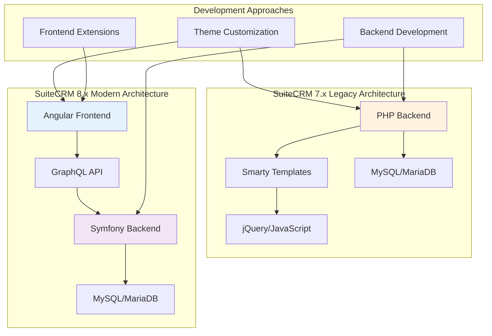
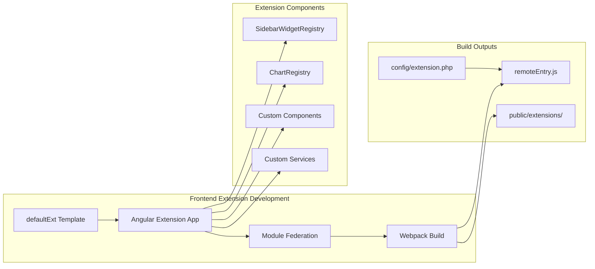
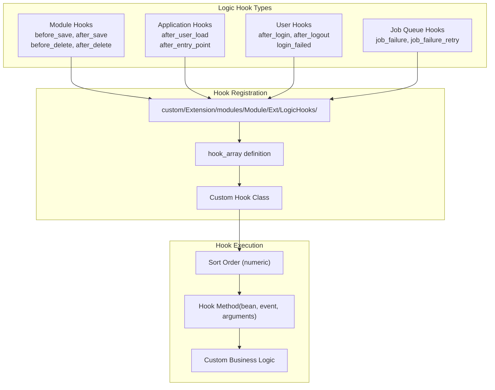
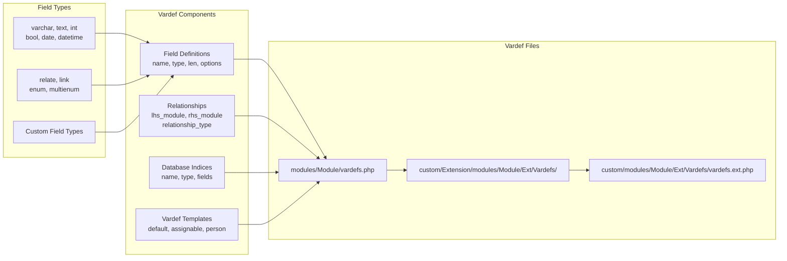

# Customization and Development

Relevant source files

The following files were used as context for generating this wiki page:

- [content/8.x/admin/Compatibility Matrix.adoc](content/8.x/admin/Compatibility Matrix.adoc)
- [content/8.x/developer/developer-getting-started.adoc](content/8.x/developer/developer-getting-started.adoc)
- [content/8.x/developer/extensions/backend/record-mappers/_index.en.adoc](content/8.x/developer/extensions/backend/record-mappers/_index.en.adoc)
- [content/8.x/developer/extensions/frontend/88x-fe-extensions-setup.adoc](content/8.x/developer/extensions/frontend/88x-fe-extensions-setup.adoc)
- [content/8.x/developer/extensions/frontend/examples/add-charts-extension.adoc](content/8.x/developer/extensions/frontend/examples/add-charts-extension.adoc)
- [content/8.x/developer/extensions/frontend/examples/add-sidebar-widget.adoc](content/8.x/developer/extensions/frontend/examples/add-sidebar-widget.adoc)
- [content/8.x/developer/extensions/frontend/migration/_index.en.adoc](content/8.x/developer/extensions/frontend/migration/_index.en.adoc)
- [content/8.x/developer/extensions/frontend/older/8x-fe-extensions-getting-started.adoc](content/8.x/developer/extensions/frontend/older/8x-fe-extensions-getting-started.adoc)
- [content/8.x/developer/extensions/frontend/older/8x-fe-extensions-setup.adoc](content/8.x/developer/extensions/frontend/older/8x-fe-extensions-setup.adoc)
- [content/8.x/developer/extensions/frontend/older/_index.en.adoc](content/8.x/developer/extensions/frontend/older/_index.en.adoc)
- [content/8.x/developer/installation-guide/backend-end-installation-guide.adoc](content/8.x/developer/installation-guide/backend-end-installation-guide.adoc)
- [content/blog/Customizing-Subthemes.adoc](content/blog/Customizing-Subthemes.adoc)
- [content/blog/ListView-conditional-formatting.adoc](content/blog/ListView-conditional-formatting.adoc)
- [content/community/contributing-to-docs/guidelines.adoc](content/community/contributing-to-docs/guidelines.adoc)
- [content/community/contributing-to-docs/translate.adoc](content/community/contributing-to-docs/translate.adoc)
- [content/developer/Best Practices.adoc](content/developer/Best Practices.adoc)
- [content/developer/Config.adoc](content/developer/Config.adoc)
- [content/developer/Controllers.adoc](content/developer/Controllers.adoc)
- [content/developer/Entry Points.adoc](content/developer/Entry Points.adoc)
- [content/developer/Extension Framework.adoc](content/developer/Extension Framework.adoc)
- [content/developer/Language Strings.adoc](content/developer/Language Strings.adoc)
- [content/developer/Logging.adoc](content/developer/Logging.adoc)
- [content/developer/Logic Hooks.adoc](content/developer/Logic Hooks.adoc)
- [content/developer/Metadata.adoc](content/developer/Metadata.adoc)
- [content/developer/Module Installer.adoc](content/developer/Module Installer.adoc)
- [content/developer/Scheduled Tasks.adoc](content/developer/Scheduled Tasks.adoc)
- [content/developer/Vardefs.adoc](content/developer/Vardefs.adoc)
- [static/images/en/developer/Admin-OAuth2Clients-2.png](static/images/en/developer/Admin-OAuth2Clients-2.png)
- [static/images/en/developer/Admin-OAuth2Clients-3.png](static/images/en/developer/Admin-OAuth2Clients-3.png)
- [static/images/en/developer/developerData.png](static/images/en/developer/developerData.png)
- [static/images/en/developer/vardefs.png](static/images/en/developer/vardefs.png)

This page provides an overview of the customization and development options available in SuiteCRM, covering both the legacy 7.x series and the modern 8.x architecture. It explains the different approaches for extending SuiteCRM functionality, from simple theme modifications to complex backend and frontend extensions.

For specific guidance on installation and upgrade procedures, see [Installation and Upgrade Guides](#5). For administration and configuration topics, see [Administration](#7).

## Development Environment Requirements

SuiteCRM development requires different tools depending on the version and type of customization:

| SuiteCRM Version | PHP | Node.js | Angular CLI | yarn | Purpose |
|------------------|-----|---------|-------------|------|---------|
| 8.8.x | 8.1, 8.2, 8.3 | ^20.11.1 | ^18 | ^4.5.0 | Frontend development |
| 8.7.x | 8.1, 8.2 | ^18.10 | ^16 | ^1.22.10 | Frontend development |
| 8.4.x-8.6.x | 8.1, 8.2 | ^14.15.1 | ^12 | ^1.22.10 | Frontend development |
| 7.14.x | 7.4, 8.0, 8.1, 8.2 | - | - | - | Backend only |

**Sources:** [content/8.x/admin/Compatibility Matrix.adoc:1-381]()

## Architecture Overview

SuiteCRM offers two distinct development paradigms depending on the version:

**Sources:** [content/8.x/developer/developer-getting-started.adoc:1-42](), [content/8.x/developer/installation-guide/backend-end-installation-guide.adoc:1-113]()

## Customization Framework Architecture

The SuiteCRM customization system uses an extension framework that allows modular modifications:

```mermaid
graph TD
    subgraph "Extension Framework Core"
        EXTDIR["custom/Extension/"]
        COMPILE["Quick Repair & Rebuild"]
        EXTFILES["Compiled Extension Files"]
    end
    
    subgraph "Extension Types"
        VARDEFS["Vardefs Extensions<br/>custom/Extension/modules/Module/Ext/Vardefs/"]
        LOGICHOOKS["Logic Hooks<br/>custom/Extension/modules/Module/Ext/LogicHooks/"]
        LANGUAGE["Language Strings<br/>custom/Extension/modules/Module/Ext/Language/"]
        LAYOUTS["Layout Definitions<br/>custom/Extension/modules/Module/Ext/Layoutdefs/"]
        SCHEDULED["Scheduled Tasks<br/>custom/Extension/modules/Schedulers/Ext/ScheduledTasks/"]
        ENTRYPOINTS["Entry Points<br/>custom/Extension/application/Ext/EntryPointRegistry/"]
    end
    
    subgraph "Compilation Targets"
        VARDEFS_EXT["vardefs.ext.php"]
        HOOKS_EXT["logichooks.ext.php"] 
        LANG_EXT["Language Files"]
        LAYOUT_EXT["layoutdefs.ext.php"]
        SCHED_EXT["scheduledtasks.ext.php"]
        ENTRY_EXT["entry_point_registry.ext.php"]
    end
    
    VARDEFS --> COMPILE
    LOGICHOOKS --> COMPILE
    LANGUAGE --> COMPILE
    LAYOUTS --> COMPILE
    SCHEDULED --> COMPILE
    ENTRYPOINTS --> COMPILE
    
    COMPILE --> VARDEFS_EXT
    COMPILE --> HOOKS_EXT
    COMPILE --> LANG_EXT
    COMPILE --> LAYOUT_EXT
    COMPILE --> SCHED_EXT
    COMPILE --> ENTRY_EXT
    
    EXTDIR --> EXTFILES
```

**Sources:** [content/developer/Extension Framework.adoc:1-163](), [content/developer/Vardefs.adoc:318-334](), [content/developer/Logic Hooks.adoc:270-282]()

## Theme Customization

Theme customization in SuiteCRM involves modifying the visual appearance and user interface elements. The approach differs significantly between versions:

### SuiteCRM 7.x Theme System
- **SuiteP Theme**: Primary theme with sub-themes (Dawn, Day, Dusk, Night)
- **SCSS Compilation**: Uses `leafo/scssphp` for stylesheet compilation
- **File Structure**: `themes/SuiteP/css/SubThemeName/`
- **Build Command**: `./vendor/bin/pscss -f compressed themes/SuiteP/css/Noon/style.scss > themes/SuiteP/css/Noon/style.css`

### SuiteCRM 8.x Theme System
- **Angular Material**: Built on Angular Material components
- **CSS Custom Properties**: Modern CSS variable system
- **Component-Based**: Styling tied to Angular components

**Sources:** [content/blog/Customizing-Subthemes.adoc:1-191]()

## Frontend Extensions

Frontend extensions allow adding new user interface components and functionality to SuiteCRM 8.x:

### Key Extension Registries
- **SidebarWidgetRegistry**: `sidebarWidgetRegistry.register('default', 'widget-name', ComponentClass)`
- **ChartRegistry**: `chartRegistry.register('default', 'chart-type', ChartComponent)`

### Build Commands
- Development: `yarn run build-dev:extensionName --watch`
- Production: `yarn run build:extensionName`

**Sources:** [content/8.x/developer/extensions/frontend/older/8x-fe-extensions-getting-started.adoc:1-185](), [content/8.x/developer/extensions/frontend/examples/add-sidebar-widget.adoc:1-881](), [content/8.x/developer/extensions/frontend/examples/add-charts-extension.adoc:1-392]()

## Backend Development

Backend development encompasses server-side customizations including business logic, data processing, and API extensions:

### Logic Hooks System
Logic hooks allow injecting custom code at specific points in the application lifecycle:

### Vardefs and Field Definitions
Vardefs define the structure and behavior of module fields:

### Scheduled Tasks and Job Queue
Custom scheduled tasks for background processing:

- **Scheduler Definition**: `custom/Extension/modules/Schedulers/Ext/ScheduledTasks/TaskName.php`
- **Job Queue**: `SugarJobQueue` and `SchedulersJob` classes
- **Task Method**: Function added to `$job_strings` array

**Sources:** [content/developer/Logic Hooks.adoc:1-356](), [content/developer/Vardefs.adoc:1-404](), [content/developer/Scheduled Tasks.adoc:1-376]()

## Record Mappers (SuiteCRM 8.x)

Record mappers provide flexible data transformation between internal and external formats:

### Mapper Architecture
- **API Level**: Execute before/after API operations
- **Entity Level**: Execute during entity operations (save, retrieve)
- **Types**: Field Mapper, Field Type Mapper, Record Mapper
- **Modes**: retrieve, list, save

**Sources:** [content/8.x/developer/extensions/backend/record-mappers/_index.en.adoc:1-115]()

## Development Workflow

### Version 7.x Development
1. **Setup**: Install SuiteCRM 7.x package
2. **Customize**: Use Studio, custom directory, or extension framework
3. **Deploy**: Copy custom files, run Quick Repair & Rebuild

### Version 8.x Development  
1. **Setup**: Install dev package or build from source
2. **Install Dependencies**: `yarn install`
3. **Enable Extension**: Modify `extensions/defaultExt/config/extension.php`
4. **Develop**: Build extensions with `yarn run build-dev:extensionName --watch`
5. **Deploy**: Build production with `yarn run build:extensionName`

### Migration Considerations
- **No Direct Migration Path**: 7.x to 8.x requires complete redevelopment
- **Architecture Change**: Move from PHP/Smarty to Angular/Symfony
- **API Evolution**: v4.1 (SOAP/REST) to v8 (JSON API/OAuth2)

**Sources:** [content/8.x/developer/developer-getting-started.adoc:1-42](), [content/8.x/developer/extensions/frontend/older/8x-fe-extensions-getting-started.adoc:1-185]()