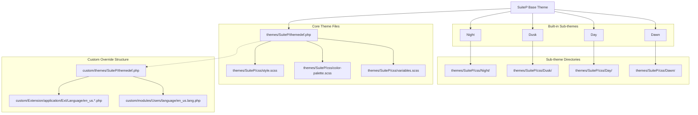
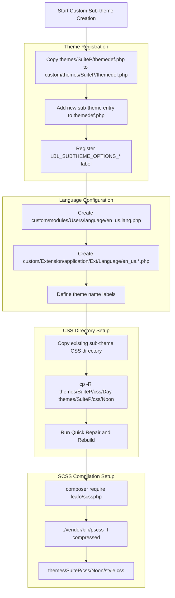
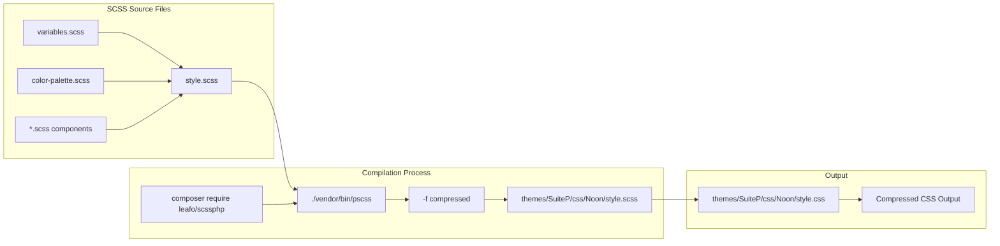
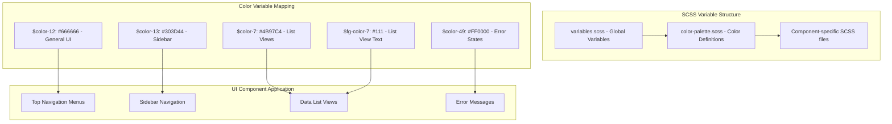
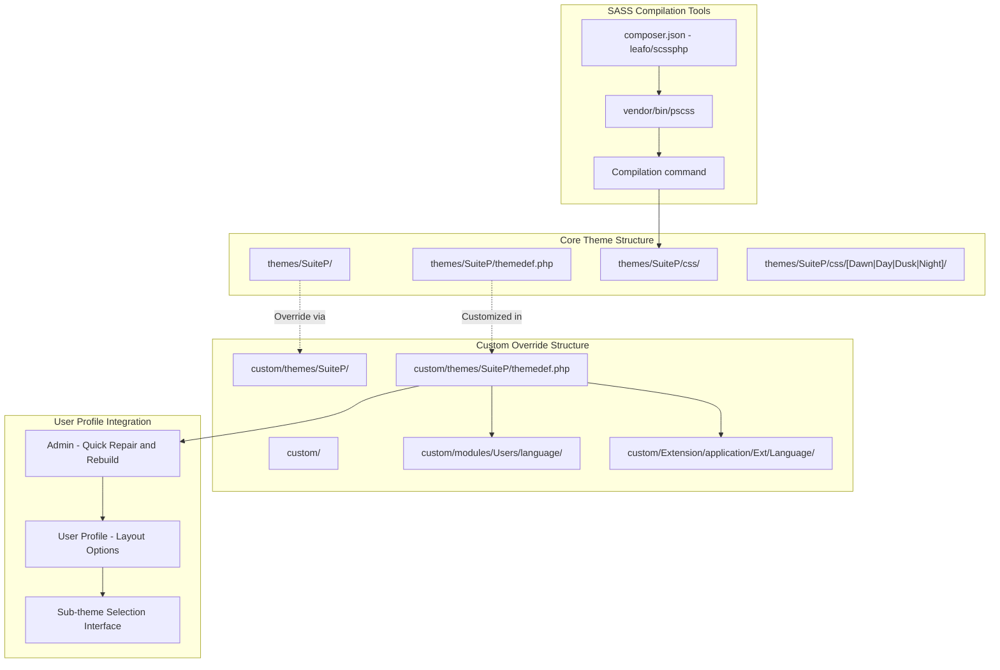

# Theme Customization

<details>
<summary>Relevant source files</summary>

The following files were used as context for generating this wiki page:

- [content/blog/Customizing-Subthemes.adoc](content/blog/Customizing-Subthemes.adoc)
- [layouts/partials/custom-footer.html](layouts/partials/custom-footer.html)
- [layouts/partials/custom-header.html](layouts/partials/custom-header.html)
- [layouts/partials/menu-footer.html](layouts/partials/menu-footer.html)
- [layouts/partials/suitecrm.com-menu.html](layouts/partials/suitecrm.com-menu.html)
- [static/images/en/developer/Admin-OAuth2Clients-2.png](static/images/en/developer/Admin-OAuth2Clients-2.png)
- [static/images/en/developer/Admin-OAuth2Clients-3.png](static/images/en/developer/Admin-OAuth2Clients-3.png)
- [static/images/repo-forked.svg](static/images/repo-forked.svg)
- [static/images/star.svg](static/images/star.svg)

</details>


This document covers the customization of SuiteCRM themes, specifically focusing on the SuiteP theme system and its sub-themes. It provides guidance on creating custom sub-themes, modifying styles through SCSS, and organizing theme files in an upgrade-safe manner.

For information about frontend extensions and Angular development, see [Frontend Extensions](#6.2). For backend development including custom modules, see [Backend Development](#6.3).

## SuiteP Theme Architecture

SuiteCRM 7.10+ uses the SuiteP theme system with four built-in sub-themes: Dawn, Day, Dusk, and Night. The theme architecture follows a hierarchical structure where custom modifications are placed in the `custom/` directory to ensure upgrade safety.



**Theme Component Overview**

| Component | Purpose | File Location |
|-----------|---------|---------------|
| `themedef.php` | Theme definition and sub-theme registration | `themes/SuiteP/themedef.php` |
| `variables.scss` | SCSS variables and configuration | `themes/SuiteP/css/variables.scss` |
| `color-palette.scss` | Color definitions for themes | `themes/SuiteP/css/color-palette.scss` |
| `style.scss` | Main stylesheet compilation entry point | `themes/SuiteP/css/style.scss` |

Sources: [content/blog/Customizing-Subthemes.adoc:22-31](), [content/blog/Customizing-Subthemes.adoc:78-82]()

## Creating Custom Sub-themes

Custom sub-themes are created by copying existing sub-theme directories and registering them through the custom theme definition system. This process involves modifying theme definitions, language files, and CSS directories.



**Required File Modifications**

The custom sub-theme registration requires specific file modifications:

1. **Theme Definition**: Add sub-theme entry in `custom/themes/SuiteP/themedef.php`
2. **Module Language**: Define labels in `custom/modules/Users/language/en_us.lang.php`  
3. **Application Language**: Create extension file in `custom/Extension/application/Ext/Language/`

Sources: [content/blog/Customizing-Subthemes.adoc:22-42](), [content/blog/Customizing-Subthemes.adoc:53-59]()

## SCSS Compilation Process

The SuiteP theme system uses SCSS for stylesheet compilation. The compilation process transforms SCSS source files into optimized CSS output using the `leafo/scssphp` compiler.



**SCSS Compilation Command Structure**

The compilation command follows this pattern:
```bash
./vendor/bin/pscss -f compressed themes/SuiteP/css/[SubTheme]/style.scss > themes/SuiteP/css/[SubTheme]/style.css
```

This command processes the main `style.scss` file which imports all other SCSS dependencies, regardless of which specific SCSS file was modified.

Sources: [content/blog/Customizing-Subthemes.adoc:61-74](), [content/blog/Customizing-Subthemes.adoc:77-82]()

## Style Customization Framework

SuiteCRM's theming system provides multiple levels of customization through SCSS variables and color palette modifications. The framework supports targeted changes to specific UI components while maintaining overall design consistency.

**Key SCSS Files for Customization**

| File | Purpose | Customization Level |
|------|---------|-------------------|
| `variables.scss` | Global SCSS variables and mixins | System-wide settings |
| `color-palette.scss` | Color definitions with variable mapping | Color scheme control |
| `style.scss` | Main import file and component organization | Structural modifications |

**Color Palette Variable System**

The color palette uses a numbered variable system (`$color-1` through `$color-82`) with semantic mappings. Each color variable serves specific UI components:

- `$color-7`: List view elements with foreground color `$fg-color-7`
- `$color-12`: Sidebar elements  
- `$color-44`, `$color-50`, `$color-80`, `$color-82`: White variants for backgrounds
- `$color-49`: Red for error states



**Example Color Customization Workflow**

For increased contrast modifications, specific color values can be updated in `color-palette.scss`:

- Top menus: `#C2C3C4` → `#555555` (darker background)
- Text lettering: `#817C8D` → `#111` (darker text)  
- Sidebar elements: `#929798` → `#626768`, `#707d84` → `#303d44` (increased contrast)

Sources: [content/blog/Customizing-Subthemes.adoc:83-97](), [content/blog/Customizing-Subthemes.adoc:99-188]()

## File Organization and Upgrade Safety

SuiteCRM's customization system follows the custom directory pattern to ensure modifications survive system upgrades. All theme customizations should be placed within the `custom/` directory structure to maintain upgrade compatibility.



**Upgrade-Safe Customization Checklist**

1. **Theme Definition**: Use `custom/themes/SuiteP/themedef.php` instead of modifying core files
2. **Language Files**: Place labels in `custom/modules/Users/language/` and `custom/Extension/application/Ext/Language/`
3. **CSS Compilation**: Compile directly to core CSS directories (acceptable as they regenerate)
4. **Version Control**: Track custom SCSS source files, not compiled CSS output
5. **Documentation**: Maintain compilation commands and color change documentation

**Required System Operations**

After theme modifications, specific system operations ensure proper integration:

- **Quick Repair and Rebuild**: Required after theme definition changes
- **Cache Clear**: May be needed for language file updates
- **User Profile Update**: Users can select new themes from Layout Options

Sources: [content/blog/Customizing-Subthemes.adoc:22-59](), [content/blog/Customizing-Subthemes.adoc:190-191]()