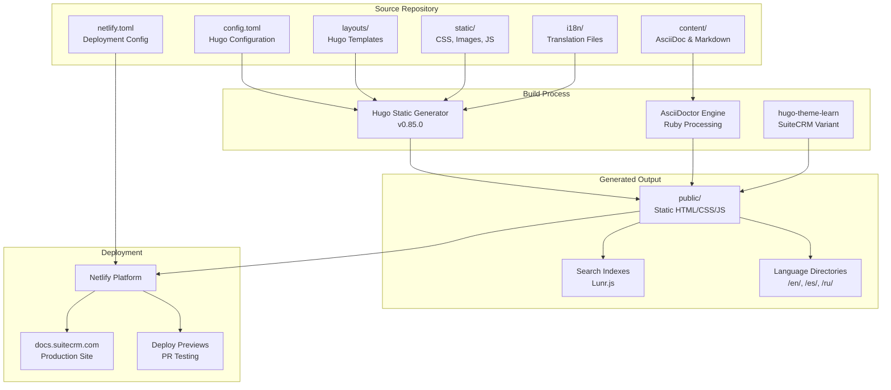
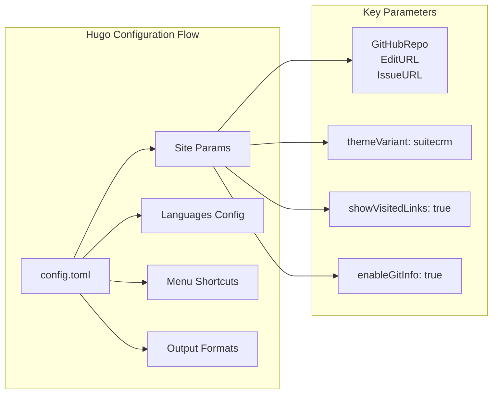
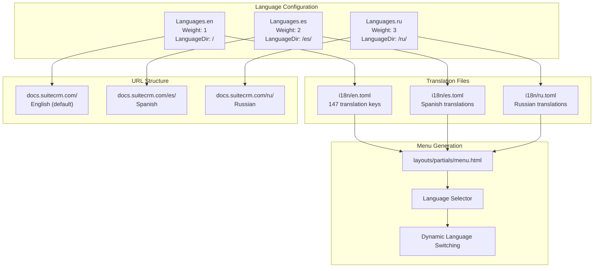
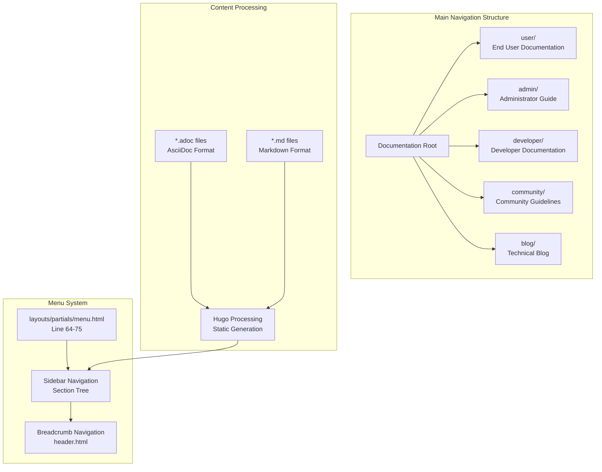
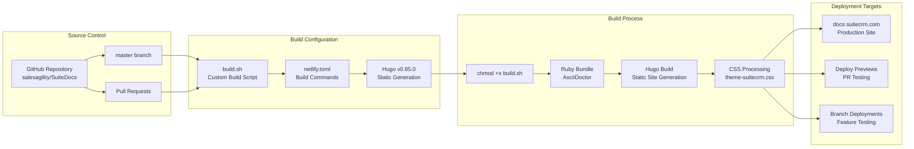
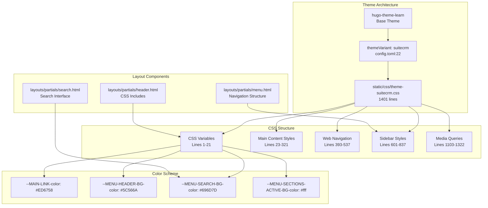
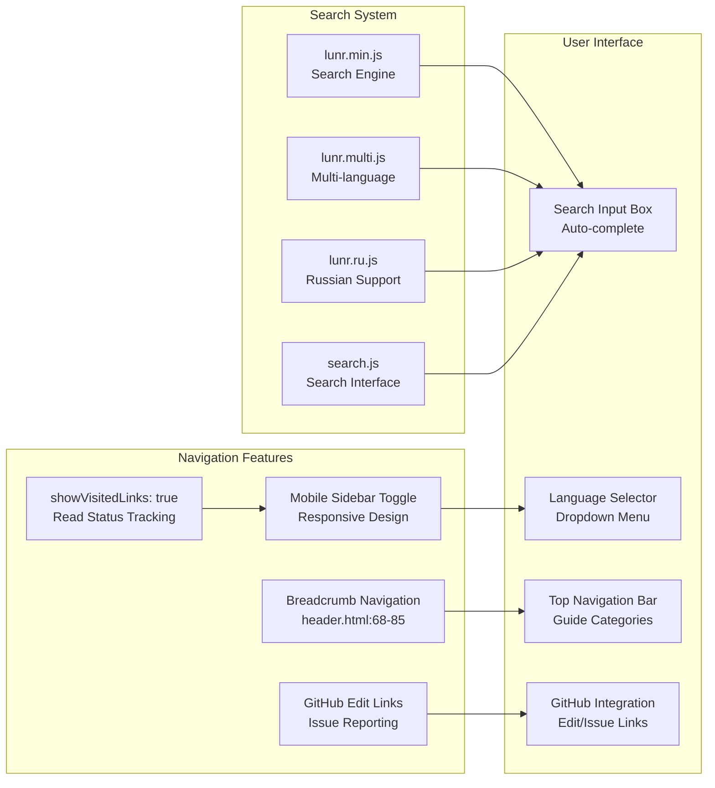

# SuiteDocs Overview

Relevant source files

The following files were used as context for generating this wiki page:

- [LICENSE.md](LICENSE.md)
- [README.md](README.md)
- [archetypes/blog.md](archetypes/blog.md)
- [archetypes/default.md](archetypes/default.md)
- [config.toml](config.toml)
- [content/community/contributing-code/Forking.adoc](content/community/contributing-code/Forking.adoc)
- [i18n/en.toml](i18n/en.toml)
- [i18n/ru.toml](i18n/ru.toml)
- [layouts/index.html](layouts/index.html)
- [layouts/partials/header.html](layouts/partials/header.html)
- [layouts/partials/menu.html](layouts/partials/menu.html)
- [layouts/partials/search.html](layouts/partials/search.html)
- [netlify.toml](netlify.toml)
- [static/css/theme-suitecrm.css](static/css/theme-suitecrm.css)
- [static/css/theme.css](static/css/theme.css)
- [static/images/favicon.png](static/images/favicon.png)
- [themes/hugo-theme-learn/layouts/partials/menu.html](themes/hugo-theme-learn/layouts/partials/menu.html)

SuiteDocs is the comprehensive documentation system for SuiteCRM, serving as the primary source of technical documentation, user guides, and community resources for the SuiteCRM open-source CRM platform. This system generates and hosts the documentation website at https://docs.suitecrm.com, providing structured information for administrators, end users, developers, and community contributors.

The SuiteDocs repository contains the source content, build configuration, and deployment infrastructure for generating a multi-language static documentation site. It covers installation procedures, user interface guides, development APIs, customization techniques, and community contribution guidelines across multiple SuiteCRM versions (7.x and 8.x series).

For information about contributing code to SuiteCRM itself, see [Community Contribution](#8). For details about SuiteCRM version compatibility, see [Version Compatibility Matrix](#3.3).

## Documentation System Architecture

**Sources:** [config.toml:1-118](), [netlify.toml:1-32](), [README.md:12-17](), [layouts/partials/header.html:1-118]()

## Hugo Configuration System

The documentation system uses Hugo with specific configuration parameters that define the site structure, language support, and build behavior:

| Configuration Area | File | Key Settings |
|-------------------|------|-------------|
| Base Configuration | `config.toml` | `baseURL`, `title`, `theme`, `timeout` |
| Build Settings | `config.toml` | `enableGitInfo`, `metaDataFormat: "yaml"` |
| Language Configuration | `config.toml` | `defaultContentLanguage: "en"` |
| Theme Variant | `config.toml` | `themeVariant = "suitecrm"` |
| Deployment | `netlify.toml` | `HUGO_VERSION = "0.85.0"` |

**Sources:** [config.toml:13-23](), [config.toml:34-40](), [netlify.toml:10-13]()

## Multi-Language Support Architecture

SuiteDocs implements comprehensive internationalization through Hugo's built-in multi-language features, supporting English, Spanish, and Russian translations:

**Sources:** [config.toml:28-118](), [i18n/en.toml:1-147](), [i18n/ru.toml:1-142](), [layouts/partials/menu.html:92-131]()

## Content Organization and Navigation

The documentation content follows a hierarchical structure with specialized sections for different user types and use cases:

**Sources:** [layouts/partials/menu.html:64-75](), [layouts/partials/header.html:68-85](), [content/community/contributing-code/Forking.adoc:1-57]()

## Build and Deployment Pipeline

**Sources:** [netlify.toml:3-6](), [netlify.toml:15-21](), [netlify.toml:22-27](), [README.md:21-29]()

## Theme and Styling System

The documentation uses a customized version of the Hugo Learn theme with SuiteCRM-specific styling and branding:

**Sources:** [static/css/theme-suitecrm.css:1-21](), [static/css/theme-suitecrm.css:393-537](), [layouts/partials/header.html:13-25](), [layouts/partials/search.html:1-20]()

## Search and Navigation Features

**Sources:** [layouts/partials/search.html:7-19](), [layouts/partials/header.html:49-66](), [config.toml:21](), [layouts/partials/menu.html:190-196]()