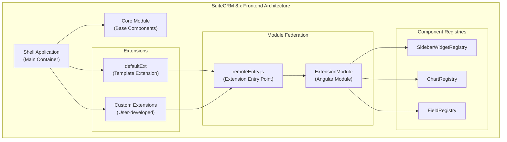
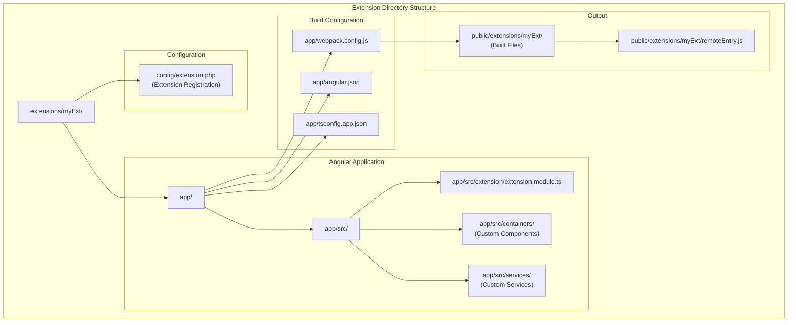
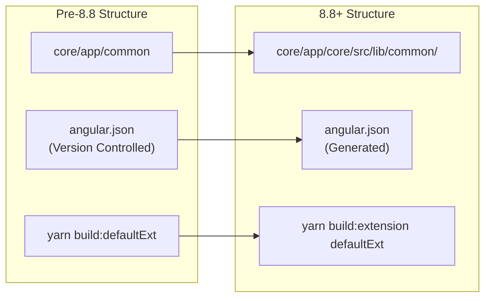
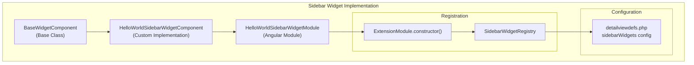
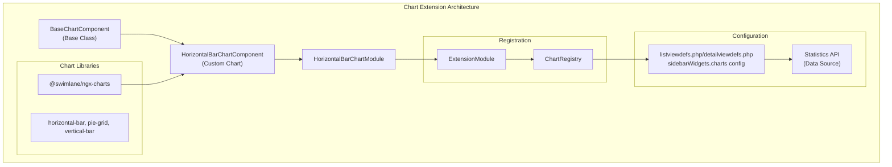
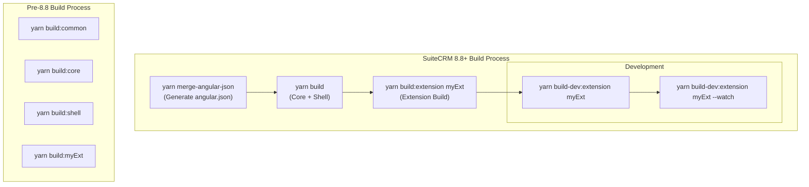
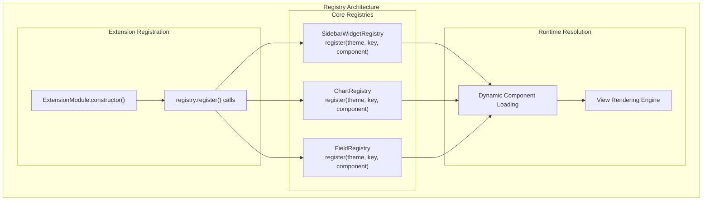
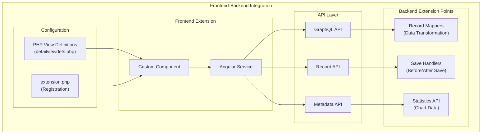

# Frontend Extensions

<details>
<summary>Relevant source files</summary>

The following files were used as context for generating this wiki page:

- [content/8.x/admin/Compatibility Matrix.adoc](content/8.x/admin/Compatibility Matrix.adoc)
- [content/8.x/admin/releases/8.8/_index.en.adoc](content/8.x/admin/releases/8.8/_index.en.adoc)
- [content/8.x/developer/developer-getting-started.adoc](content/8.x/developer/developer-getting-started.adoc)
- [content/8.x/developer/extensions/backend/record-mappers/_index.en.adoc](content/8.x/developer/extensions/backend/record-mappers/_index.en.adoc)
- [content/8.x/developer/extensions/backend/save-handlers/_index.en.adoc](content/8.x/developer/extensions/backend/save-handlers/_index.en.adoc)
- [content/8.x/developer/extensions/frontend/88x-fe-extensions-setup.adoc](content/8.x/developer/extensions/frontend/88x-fe-extensions-setup.adoc)
- [content/8.x/developer/extensions/frontend/examples/add-charts-extension.adoc](content/8.x/developer/extensions/frontend/examples/add-charts-extension.adoc)
- [content/8.x/developer/extensions/frontend/examples/add-sidebar-widget.adoc](content/8.x/developer/extensions/frontend/examples/add-sidebar-widget.adoc)
- [content/8.x/developer/extensions/frontend/migration/Migration-8.8.adoc](content/8.x/developer/extensions/frontend/migration/Migration-8.8.adoc)
- [content/8.x/developer/extensions/frontend/migration/_index.en.adoc](content/8.x/developer/extensions/frontend/migration/_index.en.adoc)
- [content/8.x/developer/extensions/frontend/older/8x-fe-extensions-getting-started.adoc](content/8.x/developer/extensions/frontend/older/8x-fe-extensions-getting-started.adoc)
- [content/8.x/developer/extensions/frontend/older/8x-fe-extensions-setup.adoc](content/8.x/developer/extensions/frontend/older/8x-fe-extensions-setup.adoc)
- [content/8.x/developer/extensions/frontend/older/_index.en.adoc](content/8.x/developer/extensions/frontend/older/_index.en.adoc)
- [content/8.x/developer/installation-guide/8.2.0-front-end-installation-guide.adoc](content/8.x/developer/installation-guide/8.2.0-front-end-installation-guide.adoc)
- [content/8.x/developer/installation-guide/8.8.0-front-end-installation-guide.adoc](content/8.x/developer/installation-guide/8.8.0-front-end-installation-guide.adoc)
- [content/8.x/developer/installation-guide/backend-end-installation-guide.adoc](content/8.x/developer/installation-guide/backend-end-installation-guide.adoc)
- [content/8.x/features/two-factor/two-factor.en.adoc](content/8.x/features/two-factor/two-factor.en.adoc)
- [static/images/en/8.x/admin/release/Fav-Filter.gif](static/images/en/8.x/admin/release/Fav-Filter.gif)
- [static/images/en/8.x/admin/release/Qr-2FA.png](static/images/en/8.x/admin/release/Qr-2FA.png)
- [static/images/en/8.x/admin/release/new-record-view.png](static/images/en/8.x/admin/release/new-record-view.png)
- [static/images/en/8.x/user/features/2FA-Profile.png](static/images/en/8.x/user/features/2FA-Profile.png)
- [static/images/en/8.x/user/features/Disable-Two-Factor.gif](static/images/en/8.x/user/features/Disable-Two-Factor.gif)
- [static/images/en/8.x/user/features/Enable-2FA.png](static/images/en/8.x/user/features/Enable-2FA.png)
- [static/images/en/8.x/user/features/Enabled-2FA.png](static/images/en/8.x/user/features/Enabled-2FA.png)
- [static/images/en/8.x/user/features/Login-2FA.png](static/images/en/8.x/user/features/Login-2FA.png)
- [static/images/en/8.x/user/features/New-Disable-2FA.png](static/images/en/8.x/user/features/New-Disable-2FA.png)
- [static/images/en/8.x/user/features/QR-Code-Secret.png](static/images/en/8.x/user/features/QR-Code-Secret.png)
- [static/images/en/8.x/user/features/Qr-2FA.png](static/images/en/8.x/user/features/Qr-2FA.png)
- [static/images/en/8.x/user/features/Regenerate-Codes.gif](static/images/en/8.x/user/features/Regenerate-Codes.gif)

</details>


This document covers the development of frontend extensions for SuiteCRM 8.x using Angular and Module Federation. Frontend extensions allow developers to add custom user interface components, override existing functionality, and integrate new features into the SuiteCRM frontend application.

For backend extension development including Save Handlers and Record Mappers, see [Backend Development](#6.3). For theme customization, see [Theme Customization](#6.1).

## Overview

SuiteCRM 8.x uses a micro-frontend architecture built on Angular with Module Federation to enable dynamic loading of extensions at runtime. This allows developers to create isolated, independent frontend modules that integrate seamlessly with the core application.



**Extension Runtime Loading Process**

Sources: [content/8.x/developer/extensions/frontend/older/8x-fe-extensions-setup.adoc:531-533](), [content/8.x/developer/extensions/frontend/88x-fe-extensions-setup.adoc:136-137]()

## Development Requirements

### System Requirements by Version

The frontend development requirements vary by SuiteCRM version:

| SuiteCRM Version | Angular CLI | Node.js | yarn | PHP |
|------------------|-------------|---------|------|-----|
| 8.8.x | ^18 | ^20.11.1 | ^4.5.0 | 8.1, 8.2, 8.3 |
| 8.7.x | ^16 | ^18.10 | ^1.22.10 | 8.1, 8.2 |
| 8.6.x | ^16 | ^18 | ^1.22.10 | 8.1, 8.2 |
| 8.4.x - 8.5.x | ^12 | ^14.15.1 | ^1.22.10 | 8.1, 8.2 |

Sources: [content/8.x/admin/Compatibility Matrix.adoc:48-51](), [content/8.x/admin/Compatibility Matrix.adoc:94-97]()

### Extension Structure



Sources: [content/8.x/developer/extensions/frontend/88x-fe-extensions-setup.adoc:17-61](), [content/8.x/developer/extensions/frontend/older/8x-fe-extensions-setup.adoc:406-417]()

## Setting Up Frontend Extensions

### For SuiteCRM 8.8+

The setup process for SuiteCRM 8.8+ includes significant changes to the build system:

1. **Copy and Configure Extension Template**
   ```bash
   # Copy defaultExt as template
   cp -r extensions/defaultExt extensions/myExt
   ```

2. **Update Configuration Files**
   - [extensions/myExt/app/webpack.config.js]()
   - [extensions/myExt/app/angular.json]()
   - [extensions/myExt/config/extension.php]()

3. **Build Process (8.8+)**
   ```bash
   # Generate angular.json from base and extensions
   yarn merge-angular-json
   
   # Build extension
   yarn build:extension myExt
   
   # Development build with watch
   yarn build-dev:extension myExt
   ```

Sources: [content/8.x/developer/extensions/frontend/88x-fe-extensions-setup.adoc:90-115](), [content/8.x/developer/extensions/frontend/migration/Migration-8.8.adoc:57-67]()

### Migration from Pre-8.8 Versions

SuiteCRM 8.8 introduced breaking changes requiring migration:



**Key Migration Steps:**
1. Update import statements from `'common'` to `'core'`
2. Update `remoteEntry` path in `extension.php`
3. Use new build commands
4. Run `yarn merge-angular-json` before building

Sources: [content/8.x/developer/extensions/frontend/migration/Migration-8.8.adoc:23-67]()

## Extension Components

### Sidebar Widgets

Sidebar widgets are custom components that appear in the record view sidebar:



**Basic Sidebar Widget Example:**

```typescript
// HelloWorldSidebarWidgetComponent
@Component({
    selector: 'scrm-hello-world-sidebar-widget',
    templateUrl: './hello-world-sidebar-widget.component.html'
})
export class HelloWorldSidebarWidgetComponent extends BaseWidgetComponent {
    constructor() {
        super();
    }
}
```

**Registration in ExtensionModule:**
```typescript
constructor(protected sidebarWidgetRegistry: SidebarWidgetRegistry) {
    sidebarWidgetRegistry.register('default', 'hello-world', HelloWorldSidebarWidgetComponent);
}
```

Sources: [content/8.x/developer/extensions/frontend/examples/add-sidebar-widget.adoc:120-152](), [content/8.x/developer/extensions/frontend/examples/add-sidebar-widget.adoc:74-91]()

### Charts

Custom chart components extend the charting capabilities:



**Chart Registration:**
```typescript
constructor(protected chartRegistry: ChartRegistry) {
    chartRegistry.register('default', 'horizontal-bar', HorizontalBarChartComponent);
}
```

Sources: [content/8.x/developer/extensions/frontend/examples/add-charts-extension.adoc:288-317](), [content/8.x/developer/extensions/frontend/examples/add-charts-extension.adoc:169-176]()

## Build and Deployment Process

### Build Commands Evolution



### Extension Configuration

**extension.php Structure:**
```php
$extensions['myExt'] = [
    'remoteEntry' => '../extensions/myExt/remoteEntry.js',
    'remoteName' => 'myExt',
    'enabled' => true,
    'extension_name' => 'My Extension',
    'description' => 'Custom extension description',
    'version' => '1.0.0'
];
```

Sources: [content/8.x/developer/extensions/frontend/migration/Migration-8.8.adoc:97-101](), [content/8.x/developer/extensions/frontend/older/8x-fe-extensions-setup.adoc:559-567]()

## Component Registry System

The registry system enables dynamic component registration and loading:



**Registration Pattern:**
```typescript
export class ExtensionModule {
    constructor(
        protected sidebarWidgetRegistry: SidebarWidgetRegistry,
        protected chartRegistry: ChartRegistry
    ) {
        // Register components with theme, key, and component class
        sidebarWidgetRegistry.register('default', 'custom-widget', CustomWidgetComponent);
        chartRegistry.register('default', 'custom-chart', CustomChartComponent);
    }
}
```

Sources: [content/8.x/developer/extensions/frontend/examples/add-sidebar-widget.adoc:143-149](), [content/8.x/developer/extensions/frontend/examples/add-charts-extension.adoc:311-317]()

## Integration with Backend

Frontend extensions integrate with SuiteCRM's backend through several mechanisms:



Frontend extensions can:
- Fetch and display data through the GraphQL API
- Trigger backend save operations with custom Save Handlers
- Transform data presentation using Record Mappers
- Display statistical data through the Statistics API

Sources: [content/8.x/developer/extensions/backend/record-mappers/_index.en.adoc:7-15](), [content/8.x/developer/extensions/backend/save-handlers/_index.en.adoc:7-12](), [content/8.x/developer/extensions/frontend/examples/add-charts-extension.adoc:99-102]()