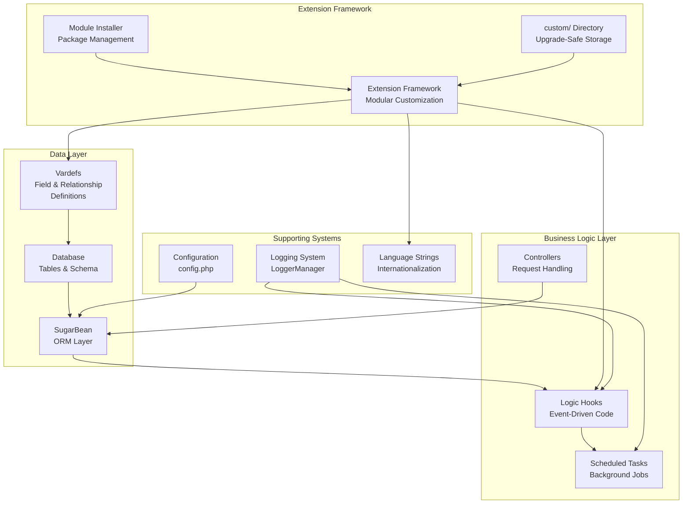
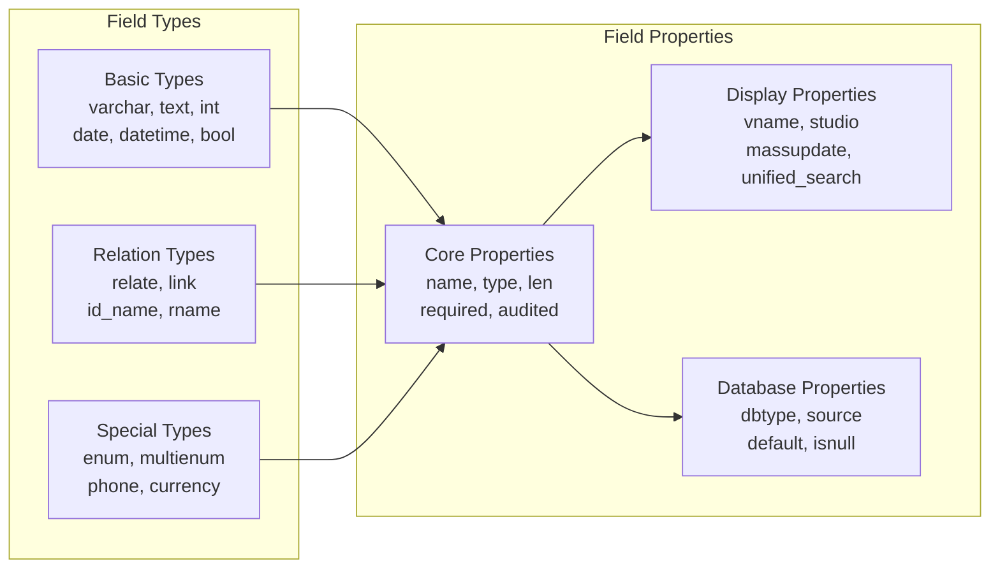
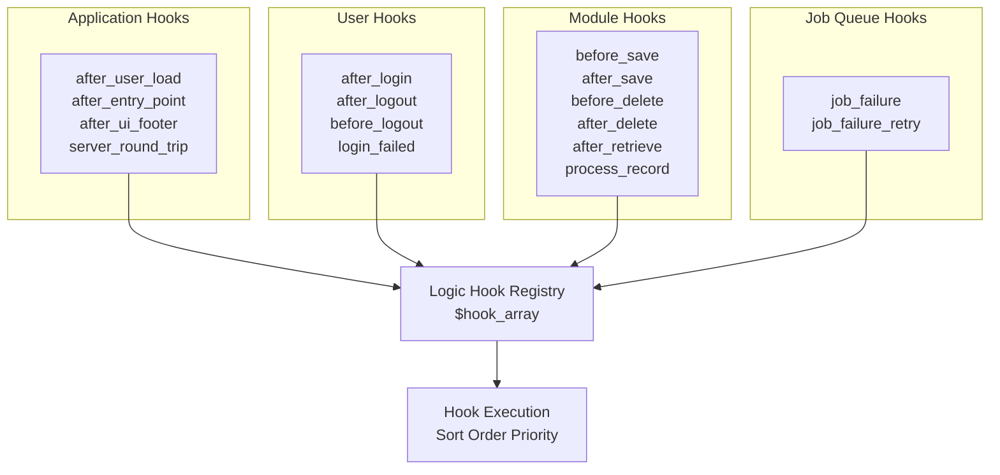
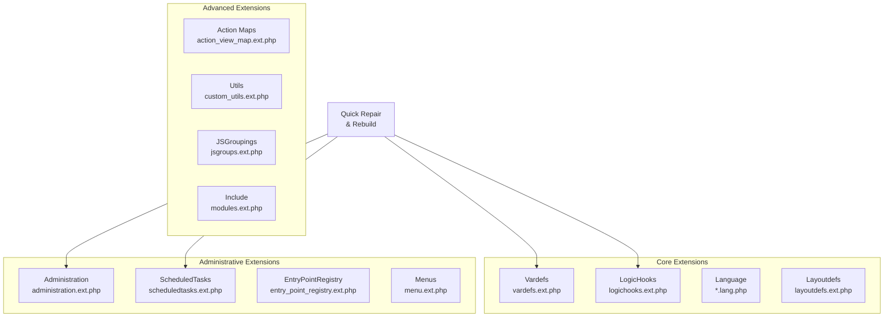
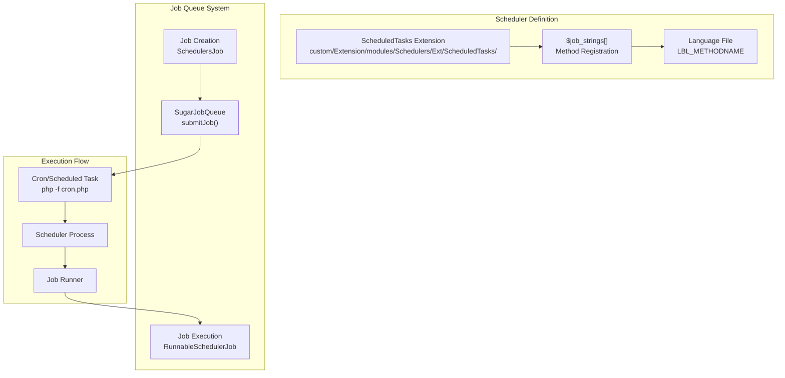
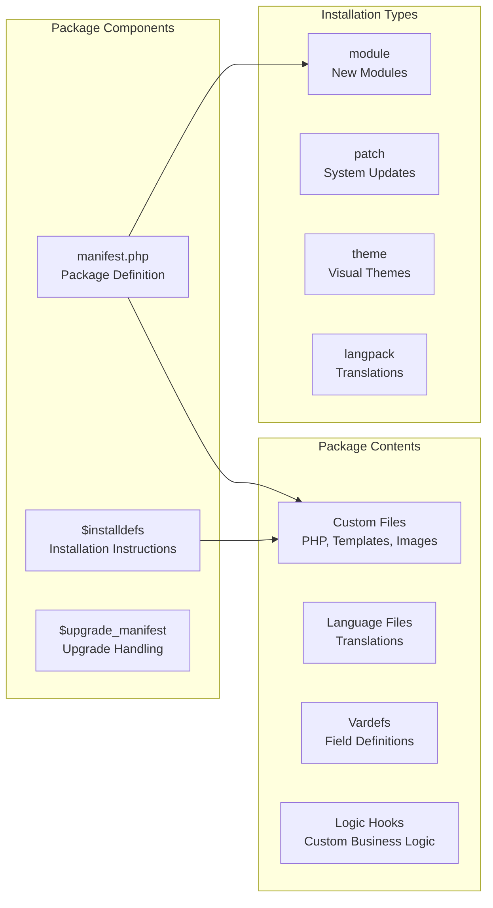
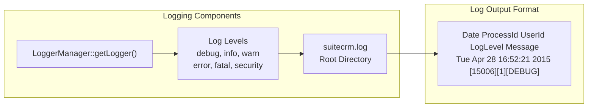

# Backend Development

<details>
<summary>Relevant source files</summary>

The following files were used as context for generating this wiki page:

- [content/admin/Troubleshooting and Support.adoc](content/admin/Troubleshooting and Support.adoc)
- [content/admin/Troubleshooting and Support.ru.adoc](content/admin/Troubleshooting and Support.ru.adoc)
- [content/admin/releases/7.9.x/_index.en.adoc](content/admin/releases/7.9.x/_index.en.adoc)
- [content/admin/releases/_index.ru.adoc](content/admin/releases/_index.ru.adoc)
- [content/blog/ListView-conditional-formatting.adoc](content/blog/ListView-conditional-formatting.adoc)
- [content/blog/larger-upgrades.ru.adoc](content/blog/larger-upgrades.ru.adoc)
- [content/community/contributing-to-docs/guidelines.adoc](content/community/contributing-to-docs/guidelines.adoc)
- [content/community/contributing-to-docs/simple-issue.es.adoc](content/community/contributing-to-docs/simple-issue.es.adoc)
- [content/community/contributing-to-docs/translate.adoc](content/community/contributing-to-docs/translate.adoc)
- [content/developer/Best Practices.adoc](content/developer/Best Practices.adoc)
- [content/developer/Config.adoc](content/developer/Config.adoc)
- [content/developer/Controllers.adoc](content/developer/Controllers.adoc)
- [content/developer/Entry Points.adoc](content/developer/Entry Points.adoc)
- [content/developer/Extension Framework.adoc](content/developer/Extension Framework.adoc)
- [content/developer/Further Resources.adoc](content/developer/Further Resources.adoc)
- [content/developer/Language Strings.adoc](content/developer/Language Strings.adoc)
- [content/developer/Logging.adoc](content/developer/Logging.adoc)
- [content/developer/Logic Hooks.adoc](content/developer/Logic Hooks.adoc)
- [content/developer/Metadata.adoc](content/developer/Metadata.adoc)
- [content/developer/Module Installer.adoc](content/developer/Module Installer.adoc)
- [content/developer/Scheduled Tasks.adoc](content/developer/Scheduled Tasks.adoc)
- [content/developer/Translate strings.adoc](content/developer/Translate strings.adoc)
- [content/developer/Vardefs.adoc](content/developer/Vardefs.adoc)
- [content/developer/_index.es.adoc](content/developer/_index.es.adoc)
- [content/developer/scripts/codecept.bat](content/developer/scripts/codecept.bat)
- [content/developer/scripts/codecept.sh](content/developer/scripts/codecept.sh)
- [static/images/en/developer/developerData.png](static/images/en/developer/developerData.png)
- [static/images/en/developer/vardefs.png](static/images/en/developer/vardefs.png)
- [static/images/ru/blog/upgrading-strategies.png](static/images/ru/blog/upgrading-strategies.png)

</details>


This page covers the core backend development concepts and systems in SuiteCRM, including data definition, custom business logic, background processing, and extensibility frameworks. This documentation focuses on server-side PHP development and database customization.

For frontend customization using Angular, see [Frontend Extensions](#6.2). For visual theme modifications, see [Theme Customization](#6.1).

## Backend Architecture Overview

SuiteCRM's backend architecture provides several key systems for customization and extension:



Sources: [content/developer/Vardefs.adoc:1-404](), [content/developer/Logic Hooks.adoc:1-356](), [content/developer/Extension Framework.adoc:1-163]()

## Vardefs System

Vardefs (Variable Definitions) are the foundation of SuiteCRM's data layer, defining fields, relationships, and database structure for modules.

### Core Vardefs Structure

Vardefs are defined in `$dictionary` arrays and specify module metadata:

| Component | Purpose | Location |
|-----------|---------|----------|
| **Fields** | Define field properties and types | `modules/<Module>/vardefs.php` |
| **Relationships** | Define inter-module connections | `$dictionary['Module']['relationships']` |
| **Indices** | Define database indexes | `$dictionary['Module']['indices']` |
| **Templates** | Apply common field sets | `VardefManager::createVardef()` |

### Field Types and Properties



### Customizing Vardefs

Custom vardefs are placed in the Extension Framework:

```
custom/Extension/modules/<TheModule>/Ext/Vardefs/
```

Sources: [content/developer/Vardefs.adoc:10-404](), [content/developer/Extension Framework.adoc:94-96]()

## Logic Hooks System

Logic Hooks provide event-driven customization points throughout SuiteCRM's execution flow.

### Hook Types and Execution Points



### Hook Definition Structure

Logic hooks are defined in `$hook_array` with five components:

1. **Sort Order** - Execution priority (lower numbers execute first)
2. **Hook Label** - Descriptive name for the hook
3. **File Path** - Location of the hook class
4. **Class Name** - PHP class containing the hook method
5. **Method Name** - Function to execute

### Implementation Locations

| Hook Type | Definition Location |
|-----------|-------------------|
| **Application** | `custom/Extension/application/Ext/LogicHooks/` |
| **Module** | `custom/Extension/modules/<Module>/Ext/LogicHooks/` |
| **User** | `custom/Extension/application/Ext/LogicHooks/` |

Sources: [content/developer/Logic Hooks.adoc:9-356](), [content/developer/Extension Framework.adoc:75-78]()

## Extension Framework

The Extension Framework provides a modular system for customizations that consolidates files during Quick Repair and Rebuild.

### Standard Extensions



### Extension Framework Workflow

The Extension Framework follows this process:

1. **File Placement** - Custom files placed in `custom/Extension/` structure
2. **Consolidation** - Quick Repair scans extension directories
3. **Compilation** - Files merged into single `.ext.php` files
4. **Loading** - Compiled extensions loaded by SuiteCRM

### Override Mechanism

Files prefixed with `_override` are processed after standard extensions, ensuring precedence:

```
custom/Extension/modules/Accounts/Ext/Vardefs/_override_my_field_change.php
```

Sources: [content/developer/Extension Framework.adoc:8-163]()

## Scheduled Tasks System

SuiteCRM's scheduler handles both recurring tasks and one-time job queue processing.

### Scheduler Architecture



### Scheduled Task Implementation

Scheduled tasks require three components:

1. **Method Definition** - Function added to `$job_strings` array
2. **Function Implementation** - Actual task logic
3. **Language Label** - User-friendly name with key `LBL_UPPERMETHODNAME`

### Job Queue for Asynchronous Processing

The job queue allows deferring long-running tasks:

```php
// Job creation pattern
$scheduledJob = new SchedulersJob();
$scheduledJob->name = "Background Task";
$scheduledJob->assigned_user_id = '1';
$scheduledJob->data = json_encode($taskData);
$scheduledJob->target = "class::TaskClass";
$queue = new SugarJobQueue();
$queue->submitJob($scheduledJob);
```

Sources: [content/developer/Scheduled Tasks.adoc:10-376]()

## Module Installer

The Module Installer packages customizations for distribution and installation across SuiteCRM instances.

### Package Structure



### Key Manifest Components

| Component | Purpose | Key Properties |
|-----------|---------|----------------|
| **$manifest** | Package metadata | `name`, `version`, `type`, `dependencies` |
| **$installdefs** | Installation rules | `copy`, `vardefs`, `logic_hooks`, `custom_fields` |
| **$upgrade_manifest** | Upgrade handling | Version-specific `installdefs` |

### Installation Definition Types

The `$installdefs` array supports various installation components:

- **copy** - File and directory copying
- **vardefs** - Field and relationship definitions  
- **logic_hooks** - Event-driven custom code
- **custom_fields** - New field creation
- **language** - Translation files
- **administration** - Admin panel additions

Sources: [content/developer/Module Installer.adoc:9-524]()

## Configuration and Logging

### Configuration System

SuiteCRM uses two main configuration files:

| File | Purpose | Modification |
|------|---------|--------------|
| **config.php** | Core settings, database config, site URL | Manual editing for migrations |
| **config_override.php** | Admin-configurable overrides | Modified through Admin interface |

### Logging System



The logging system provides debug capabilities with configurable verbosity levels. Production instances typically use `error` or `fatal` levels, while development uses `debug`.

Sources: [content/developer/Config.adoc:9-123](), [content/developer/Logging.adoc:9-91]()

## Best Practices

### Development Environment

- **Use development instances** - Never develop directly on production
- **Version control** - Track customizations with Git or similar systems
- **Regular backups** - Maintain file and database backups before changes

### Customization Guidelines

- **Extension Framework** - Use extension directories for upgrade-safe customizations
- **Custom directory** - Place customizations in `custom/` structure
- **Logic hooks over core modifications** - Prefer event-driven customization
- **Proper testing** - Test in development before deploying to production

### Performance Considerations

- **Job queue for heavy tasks** - Use scheduled jobs for long-running operations
- **Efficient database queries** - Optimize custom database operations
- **Appropriate log levels** - Use less verbose logging in production

Sources: [content/developer/Best Practices.adoc:7-76]()