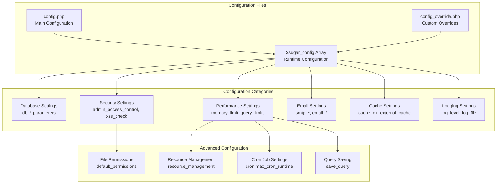
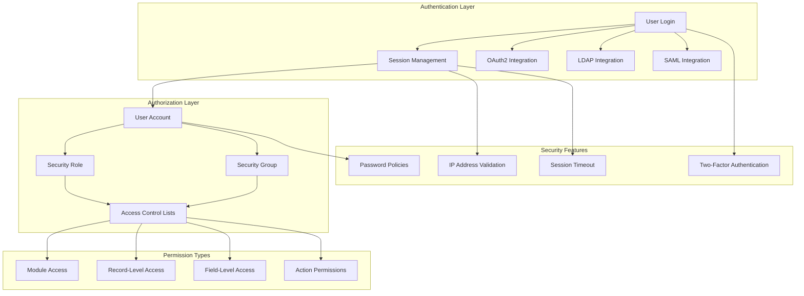
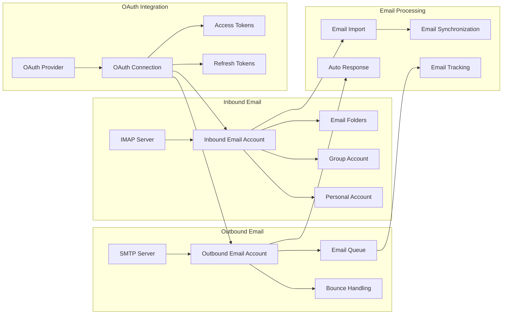

# Administration

<details>
<summary>Relevant source files</summary>

The following files were used as context for generating this wiki page:

- [content/8.x/admin/administration-panel/Administration-Panel.ru.adoc](content/8.x/admin/administration-panel/Administration-Panel.ru.adoc)
- [content/admin/Advanced Configuration Options.ru.adoc](content/admin/Advanced Configuration Options.ru.adoc)
- [content/admin/administration-panel/Advanced OpenAdmin.ru.adoc](content/admin/administration-panel/Advanced OpenAdmin.ru.adoc)
- [content/admin/administration-panel/Developer Tools.ru.adoc](content/admin/administration-panel/Developer Tools.ru.adoc)
- [content/admin/administration-panel/Google Sync.ru.adoc](content/admin/administration-panel/Google Sync.ru.adoc)
- [content/admin/administration-panel/System.ru.adoc](content/admin/administration-panel/System.ru.adoc)
- [content/admin/administration-panel/Users.ru.adoc](content/admin/administration-panel/Users.ru.adoc)
- [content/admin/installation-guide/Downloading & Installing.ru.adoc](content/admin/installation-guide/Downloading & Installing.ru.adoc)
- [content/admin/installation-guide/Upgrading.ru.adoc](content/admin/installation-guide/Upgrading.ru.adoc)
- [content/admin/installation-guide/Using the Upgrade Wizard.ru.adoc](content/admin/installation-guide/Using the Upgrade Wizard.ru.adoc)
- [content/user/advanced-modules/Cases with Portal.ru.adoc](content/user/advanced-modules/Cases with Portal.ru.adoc)
- [content/user/advanced-modules/Reschedule.ru.adoc](content/user/advanced-modules/Reschedule.ru.adoc)
- [content/user/advanced-modules/Workflow.ru.adoc](content/user/advanced-modules/Workflow.ru.adoc)
- [content/user/core-modules/Campaigns.ru.adoc](content/user/core-modules/Campaigns.ru.adoc)
- [content/user/core-modules/Cases.ru.adoc](content/user/core-modules/Cases.ru.adoc)
- [content/user/core-modules/Emails.ru.adoc](content/user/core-modules/Emails.ru.adoc)
- [content/user/core-modules/Opportunities.ru.adoc](content/user/core-modules/Opportunities.ru.adoc)
- [content/user/introduction/User Interface/Record Management.ru.adoc](content/user/introduction/User Interface/Record Management.ru.adoc)
- [content/user/introduction/User Interface/Views.ru.adoc](content/user/introduction/User Interface/Views.ru.adoc)
- [content/user/modules/Confirmed-Opt-In-Settings.ru.adoc](content/user/modules/Confirmed-Opt-In-Settings.ru.adoc)
- [content/user/modules/LawfulBasis.ru.adoc](content/user/modules/LawfulBasis.ru.adoc)
- [content/user/suitecrm-analytics/1.1/SCRM-Analytics-Getting-Started.ru.adoc](content/user/suitecrm-analytics/1.1/SCRM-Analytics-Getting-Started.ru.adoc)
- [static/images/en/admin/AdminAODSettings.png](static/images/en/admin/AdminAODSettings.png)
- [static/images/en/admin/AdminAOPSettings.png](static/images/en/admin/AdminAOPSettings.png)
- [static/images/en/admin/AdminAOSSettings.png](static/images/en/admin/AdminAOSSettings.png)
- [static/images/en/admin/AdminBusinessHours.png](static/images/en/admin/AdminBusinessHours.png)
- [static/images/en/admin/StudioExportCustomisations.png](static/images/en/admin/StudioExportCustomisations.png)
- [static/images/en/user/RolesCreateRole.png](static/images/en/user/RolesCreateRole.png)
- [static/images/en/user/RolesListByUser.png](static/images/en/user/RolesListByUser.png)
- [static/images/en/user/RolesListRoles.png](static/images/en/user/RolesListRoles.png)
- [static/images/ru/8.x/admin/administration-panel/image1.png](static/images/ru/8.x/admin/administration-panel/image1.png)
- [static/images/ru/8.x/admin/administration-panel/image2.png](static/images/ru/8.x/admin/administration-panel/image2.png)
- [static/images/ru/admin/AdvancedOpenAdmin/image3.png](static/images/ru/admin/AdvancedOpenAdmin/image3.png)
- [static/images/ru/user/UserInterface/image34.png](static/images/ru/user/UserInterface/image34.png)
- [static/images/ru/user/advanced-modules/Workflow/image2.png](static/images/ru/user/advanced-modules/Workflow/image2.png)
- [static/images/ru/user/core-modules/E-mail/image1.png](static/images/ru/user/core-modules/E-mail/image1.png)
- [static/images/ru/user/core-modules/E-mail/image2.png](static/images/ru/user/core-modules/E-mail/image2.png)

</details>


This document provides an overview of SuiteCRM administration functionality, including system configuration, user management, and administrative tools. Administration in SuiteCRM encompasses the core system settings, user access control, email configuration, and various maintenance utilities required to manage a SuiteCRM installation.

For detailed system configuration options, see [System Configuration](#7.1). For user and role management, see [User Management](#7.2). For email setup and OAuth configuration, see [Email Configuration](#7.3).

## Administration Panel Architecture

The SuiteCRM administration system is organized around a central administration panel that provides access to various configuration subsystems. The panel is accessible to users with administrator privileges and serves as the primary interface for system management.

```mermaid
graph TB
    subgraph "Administration Panel Access"
        AdminUser["Administrator User"]
        AdminPanel["Administration Panel"]
        AdminMenu["Admin Menu"]
    end
    
    subgraph "Core Administration Areas"
        SystemConfig["System Configuration"]
        UserMgmt["User Management"] 
        EmailConfig["Email Configuration"]
        DevTools["Developer Tools"]
        AdminTools["Administrative Tools"]
    end
    
    subgraph "System Configuration Components"
        UISettings["UI Settings"]
        ProxyConfig["Proxy Configuration"]
        LogSettings["Logging Configuration"]
        Scheduler["Scheduler/Cron Jobs"]
        CurrencyLocale["Currency & Locale"]
    end
    
    subgraph "User Management Components"
        Users["User Accounts"]
        Roles["Security Roles"]
        Groups["Security Groups"]
        PasswordMgmt["Password Management"]
        OAuth["OAuth Keys"]
    end
    
    subgraph "Email Configuration Components"
        InboundEmail["Inbound Email Accounts"]
        OutboundEmail["Outbound Email Settings"]
        EmailOAuth["Email OAuth Integration"]
        EmailQueue["Email Queue Management"]
    end
    
    AdminUser --> AdminPanel
    AdminPanel --> AdminMenu
    AdminMenu --> SystemConfig
    AdminMenu --> UserMgmt
    AdminMenu --> EmailConfig
    AdminMenu --> DevTools
    AdminMenu --> AdminTools
    
    SystemConfig --> UISettings
    SystemConfig --> ProxyConfig
    SystemConfig --> LogSettings
    SystemConfig --> Scheduler
    SystemConfig --> CurrencyLocale
    
    UserMgmt --> Users
    UserMgmt --> Roles
    UserMgmt --> Groups
    UserMgmt --> PasswordMgmt
    UserMgmt --> OAuth
    
    EmailConfig --> InboundEmail
    EmailConfig --> OutboundEmail
    EmailConfig --> EmailOAuth
    EmailConfig --> EmailQueue
```



Sources: `content/admin/administration-panel/System.ru.adoc:24-70`, `content/8.x/admin/administration-panel/Administration-Panel.ru.adoc:32-38`

## Configuration File Hierarchy

SuiteCRM administration relies on a hierarchical configuration system that allows for both default settings and custom overrides. Understanding this hierarchy is crucial for effective administration.



Sources: `content/admin/Advanced Configuration Options.ru.adoc:44-67`, `content/admin/Advanced Configuration Options.ru.adoc:75-93`, `content/admin/Advanced Configuration Options.ru.adoc:124-145`

## Administrative Tools and Utilities

The administration system includes various tools for system maintenance, diagnostics, and data management. These tools are accessible through the administration panel and provide essential functionality for system upkeep.

| Tool Category | Purpose | Key Functions |
|---------------|---------|---------------|
| **System Repair** | Database and file maintenance | Quick repair, rebuild relationships, rebuild extensions |
| **Diagnostics** | System health checking | Configuration analysis, file integrity checks, database structure validation |
| **Backup & Restore** | Data protection | File backups, database export, system restoration |
| **Import/Export** | Data migration | CSV import, module data export, upgrade wizards |
| **Developer Tools** | Customization support | Studio, Module Builder, field editor |
| **Scheduler Management** | Automated task control | Cron job configuration, scheduled task monitoring |

Sources: `content/admin/administration-panel/System.ru.adoc:498-635`, `content/admin/administration-panel/System.ru.adoc:177-204`, `content/admin/administration-panel/Developer Tools.ru.adoc:25-29`

## User Access Control Architecture

SuiteCRM implements a comprehensive access control system that governs user permissions, role-based security, and authentication mechanisms.



Sources: `content/admin/administration-panel/Users.ru.adoc:27-50`, `content/admin/administration-panel/System.ru.adoc:91-95`, `content/admin/administration-panel/System.ru.adoc:419-426`

## Email System Configuration

Email functionality in SuiteCRM requires proper configuration of both inbound and outbound email systems, along with OAuth integration for modern email providers.



Sources: `content/user/core-modules/Emails.ru.adoc:99-164`, `content/admin/administration-panel/System.ru.adoc:419-426`

## Scheduler and Background Tasks

The SuiteCRM scheduler system manages automated background tasks essential for system operation, including email processing, data cleanup, and report generation.

| Scheduled Task | Purpose | Frequency | Configuration |
|----------------|---------|-----------|---------------|
| **Check Inbound Mailboxes** | Process incoming emails | Every minute | `cron.php` execution |
| **Bounce Handling** | Process returned emails | Nightly | Bounce account configuration |
| **Mass Email Campaigns** | Send bulk email campaigns | Nightly | Campaign queue processing |
| **Tracker Cleanup** | Clean tracking tables | Every 30 days | Automatic cleanup |
| **Database Cleanup** | Remove deleted records | Monthly | Physical record deletion |
| **Email Reminders** | Send event reminders | Variable | Based on event schedules |
| **Workflow Processing** | Execute workflow rules | Every minute | Workflow engine |

The scheduler requires proper cron configuration on the server:

```bash
* * * * * cd /path/to/suitecrm; php -f cron.php > /dev/null 2>&1
```

Sources: `content/admin/administration-panel/System.ru.adoc:177-204`, `content/admin/administration-panel/System.ru.adoc:208-308`

## Security and Access Control

SuiteCRM provides multiple layers of security configuration to protect system integrity and user data. These security measures are configurable through the administration panel and configuration files.

```mermaid
graph TB
    subgraph "File-Level Security"
        FilePermissions["File Permissions<br/>2770 directories, 660 files"]
        HtaccessRules[".htaccess Rules<br/>Directory access restrictions"]
        ApacheUser["Apache User/Group<br/>www-data, apache"]
    end
    
    subgraph "Application Security"
        XSSProtection["XSS Protection<br/>Input sanitization"]
        CSRFProtection["CSRF Protection<br/>Referer validation"]
        IPValidation["IP Address Validation<br/>Session binding"]
        InputValidation["Input Validation<br/>Data type checking"]
    end
    
    subgraph "Authentication Security"
        PasswordPolicies["Password Policies<br/>Complexity requirements"]
        SessionTimeout["Session Timeout<br/>Automatic logout"]
        LoginAttempts["Login Attempt Limits<br/>Brute force protection"]
        TwoFactorAuth["Two-Factor Authentication<br/>Additional verification"]
    end
    
    subgraph "Data Security"
        DatabaseEncryption["Database Encryption<br/>Sensitive data protection"]
        EmailEncryption["Email Password Encryption<br/>Stored credentials"]
        SSLRequirements["SSL/TLS Requirements<br/>Secure connections"]
        DataAuditing["Data Auditing<br/>Change tracking"]
    end
    
    FilePermissions --> HtaccessRules
    HtaccessRules --> ApacheUser
    
    XSSProtection --> CSRFProtection
    CSRFProtection --> IPValidation
    IPValidation --> InputValidation
    
    PasswordPolicies --> SessionTimeout
    SessionTimeout --> LoginAttempts
    LoginAttempts --> TwoFactorAuth
    
    DatabaseEncryption --> EmailEncryption
    EmailEncryption --> SSLRequirements
    SSLRequirements --> DataAuditing
```



Sources: `content/admin/Advanced Configuration Options.ru.adoc:20-67`, `content/admin/Advanced Configuration Options.ru.adoc:94-102`, `content/admin/administration-panel/System.ru.adoc:91-95`

## Performance and Resource Management

Administrative control over system performance involves multiple configuration areas that affect memory usage, database query limits, and caching behavior.

| Configuration Area | Parameters | Default Values | Tuning Considerations |
|-------------------|------------|----------------|----------------------|
| **Memory Management** | `memory_limit` | 512M | Increase for large imports |
| **Query Limits** | `default_limit` | 1000 queries | Adjust for module size |
| **Special Query Modules** | `special_query_limit` | 50000 queries | For admin operations |
| **Cron Job Timing** | `max_cron_runtime` | 30 minutes | Job execution limits |
| **Cache Settings** | `cache_dir` | `./cache/` | Can be moved for performance |
| **Upload Directory** | `upload_dir` | `./upload/` | Can be relocated |

Performance optimization through `config_override.php`:

```php
// Increase query limits for specific modules
$sugar_config['resource_management']['special_query_modules'][] = 'Contacts';
$sugar_config['resource_management']['special_query_limit'] = 0;

// Optimize cron job performance
$sugar_config['cron']['max_cron_runtime'] = 50;
$sugar_config['cron']['max_cron_jobs'] = 10;

// Disable automatic query saving for performance
$sugar_config['save_query'] = 'no';
```

Sources: `content/admin/Advanced Configuration Options.ru.adoc:104-192`, `content/admin/Advanced Configuration Options.ru.adoc:147-192`