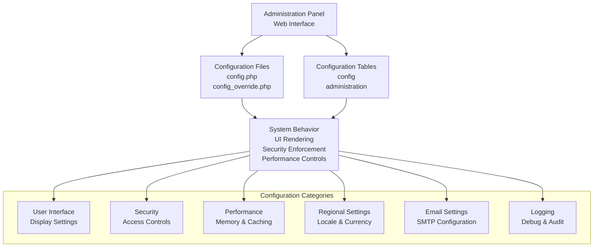
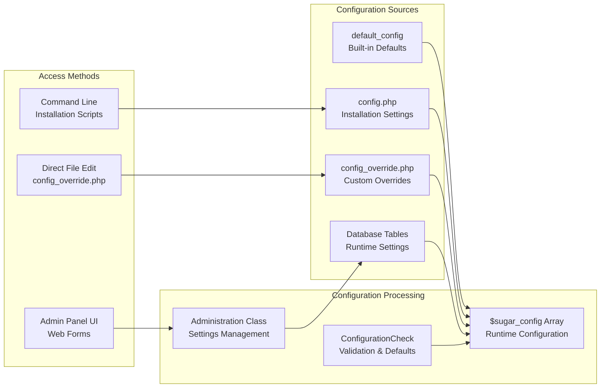
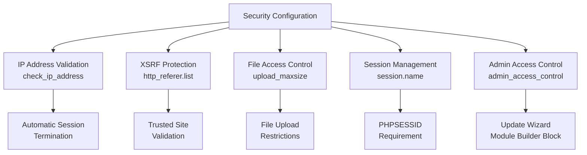
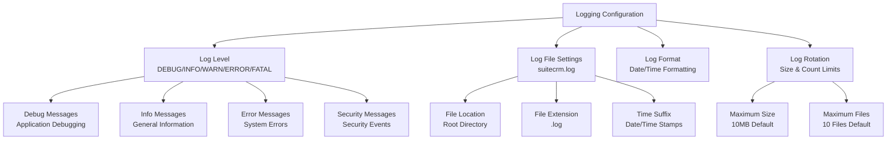
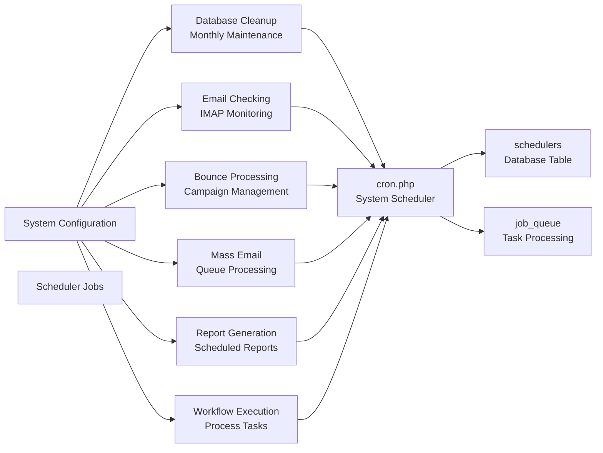

# System Configuration

Relevant source files

The following files were used as context for generating this wiki page:

- [.htmltest.yml](.htmltest.yml)
- [content/8.x/admin/administration-panel/Administration-Panel.ru.adoc](content/8.x/admin/administration-panel/Administration-Panel.ru.adoc)
- [content/8.x/admin/releases/8.0/_index.en.adoc](content/8.x/admin/releases/8.0/_index.en.adoc)
- [content/admin/Advanced Configuration Options.adoc](content/admin/Advanced Configuration Options.adoc)
- [content/admin/Advanced Configuration Options.ru.adoc](content/admin/Advanced Configuration Options.ru.adoc)
- [content/admin/administration-panel/Advanced OpenAdmin.ru.adoc](content/admin/administration-panel/Advanced OpenAdmin.ru.adoc)
- [content/admin/administration-panel/Developer Tools.ru.adoc](content/admin/administration-panel/Developer Tools.ru.adoc)
- [content/admin/administration-panel/Google Sync.ru.adoc](content/admin/administration-panel/Google Sync.ru.adoc)
- [content/admin/administration-panel/System.ru.adoc](content/admin/administration-panel/System.ru.adoc)
- [content/admin/administration-panel/Users.ru.adoc](content/admin/administration-panel/Users.ru.adoc)
- [content/admin/installation-guide/Downloading & Installing.ru.adoc](content/admin/installation-guide/Downloading & Installing.ru.adoc)
- [content/admin/installation-guide/Upgrading.ru.adoc](content/admin/installation-guide/Upgrading.ru.adoc)
- [content/admin/installation-guide/Using the Upgrade Wizard.ru.adoc](content/admin/installation-guide/Using the Upgrade Wizard.ru.adoc)
- [content/admin/releases/7.10.x/_index.en.adoc](content/admin/releases/7.10.x/_index.en.adoc)
- [content/admin/releases/7.11.x/_index.en.adoc](content/admin/releases/7.11.x/_index.en.adoc)
- [content/admin/releases/7.12.x/_index.en.adoc](content/admin/releases/7.12.x/_index.en.adoc)
- [content/admin/releases/7.8.x/_index.en.adoc](content/admin/releases/7.8.x/_index.en.adoc)
- [content/blog/_index.es.md](content/blog/_index.es.md)
- [content/developer/api/API-4_1.adoc](content/developer/api/API-4_1.adoc)
- [content/user/advanced-modules/Cases with Portal.ru.adoc](content/user/advanced-modules/Cases with Portal.ru.adoc)
- [content/user/advanced-modules/Reschedule.ru.adoc](content/user/advanced-modules/Reschedule.ru.adoc)
- [content/user/advanced-modules/Workflow.ru.adoc](content/user/advanced-modules/Workflow.ru.adoc)
- [content/user/core-modules/Campaigns.ru.adoc](content/user/core-modules/Campaigns.ru.adoc)
- [content/user/core-modules/Cases.ru.adoc](content/user/core-modules/Cases.ru.adoc)
- [content/user/core-modules/Emails.ru.adoc](content/user/core-modules/Emails.ru.adoc)
- [content/user/core-modules/Opportunities.ru.adoc](content/user/core-modules/Opportunities.ru.adoc)
- [content/user/introduction/User Interface/Record Management.ru.adoc](content/user/introduction/User Interface/Record Management.ru.adoc)
- [content/user/introduction/User Interface/Views.ru.adoc](content/user/introduction/User Interface/Views.ru.adoc)
- [content/user/modules/Confirmed-Opt-In-Settings.ru.adoc](content/user/modules/Confirmed-Opt-In-Settings.ru.adoc)
- [content/user/modules/LawfulBasis.ru.adoc](content/user/modules/LawfulBasis.ru.adoc)
- [content/user/suitecrm-analytics/1.1/SCRM-Analytics-Getting-Started.ru.adoc](content/user/suitecrm-analytics/1.1/SCRM-Analytics-Getting-Started.ru.adoc)
- [layouts/shortcodes/contribs.html](layouts/shortcodes/contribs.html)
- [layouts/shortcodes/dumpJSON.html](layouts/shortcodes/dumpJSON.html)
- [layouts/shortcodes/ghcontributors.html](layouts/shortcodes/ghcontributors.html)
- [static/images/en/8.x/user/features/subpanels/Filter-Expanded.png](static/images/en/8.x/user/features/subpanels/Filter-Expanded.png)
- [static/images/en/8.x/user/features/subpanels/Filter-Full-Panel.png](static/images/en/8.x/user/features/subpanels/Filter-Full-Panel.png)
- [static/images/en/8.x/user/features/subpanels/Filter-Searched.png](static/images/en/8.x/user/features/subpanels/Filter-Searched.png)
- [static/images/ru/8.x/admin/administration-panel/image1.png](static/images/ru/8.x/admin/administration-panel/image1.png)
- [static/images/ru/8.x/admin/administration-panel/image2.png](static/images/ru/8.x/admin/administration-panel/image2.png)
- [static/images/ru/admin/AdvancedOpenAdmin/image3.png](static/images/ru/admin/AdvancedOpenAdmin/image3.png)
- [static/images/ru/user/UserInterface/image34.png](static/images/ru/user/UserInterface/image34.png)
- [static/images/ru/user/advanced-modules/Workflow/image2.png](static/images/ru/user/advanced-modules/Workflow/image2.png)
- [static/images/ru/user/core-modules/E-mail/image1.png](static/images/ru/user/core-modules/E-mail/image1.png)
- [static/images/ru/user/core-modules/E-mail/image2.png](static/images/ru/user/core-modules/E-mail/image2.png)

This page covers SuiteCRM's system-wide configuration options available to administrators through the Administration Panel. These settings control core system behavior, user interface defaults, security policies, and performance parameters that affect all users of the SuiteCRM instance.

For information about individual user preferences and settings, see [User Management](#7.2). For email-specific configuration options, see [Email Configuration](#7.3).

## Configuration System Overview

SuiteCRM's configuration system operates on multiple levels, with system-wide settings taking precedence over user-specific preferences. Configuration data is stored in PHP configuration files and database tables, with changes typically made through the web-based Administration Panel.

Sources: [content/admin/administration-panel/System.ru.adoc:24-323](), [content/admin/Advanced Configuration Options.ru.adoc:16-114]()

## Configuration Storage and Access

The configuration system uses a hierarchical approach with multiple storage mechanisms working together to provide flexible system administration capabilities.

Sources: [content/admin/Advanced Configuration Options.ru.adoc:44-67](), [content/admin/administration-panel/System.ru.adoc:87-114]()

## Core Configuration Categories

### User Interface Configuration

The user interface configuration controls default display settings, navigation behavior, and user interaction patterns across the entire SuiteCRM instance.

| Configuration Option | Description | Default Value |
|---------------------|-------------|---------------|
| `listview_max_records` | Maximum records displayed per page in list views | 20 |
| `disable_user_home_page_customization` | Prevents users from customizing dashboard | false |
| `max_dashlets_homepage` | Maximum dashlets allowed on home page | 15 |
| `display_response_time` | Shows server response time in footer | true |
| `subpanel_max_records` | Maximum records in subpanels | 10 |
| `disable_subpanel_reordering` | Prevents subpanel drag-and-drop | false |

Sources: [content/admin/administration-panel/System.ru.adoc:38-66]()

### Security and Access Control

Security configuration options provide administrators with fine-grained control over system access, authentication, and data protection measures.

Sources: [content/admin/administration-panel/System.ru.adoc:91-96](), [content/admin/Advanced Configuration Options.ru.adoc:94-102](), [content/admin/installation-guide/Downloading & Installing.ru.adoc:95-97]()

### Performance and Resource Management

Performance configuration settings control memory usage, caching behavior, and system resource allocation to optimize SuiteCRM's operational efficiency.

| Setting | Purpose | Configuration Location |
|---------|---------|----------------------|
| `memory_limit` | PHP memory allocation | php.ini |
| `slow_query_log` | Database performance monitoring | System Configuration |
| `slow_query_threshold` | Query performance threshold (ms) | System Configuration |
| `log_memory_usage` | Memory usage tracking | System Configuration |
| `developer_mode` | Disables caching for development | System Configuration |
| `default_permissions` | File system permissions | config_override.php |

Sources: [content/admin/administration-panel/System.ru.adoc:97-108](), [content/admin/Advanced Configuration Options.ru.adoc:105-110]()

## Logging and Debugging Configuration

The logging system provides comprehensive audit trails and debugging capabilities through configurable log levels and output formats.

Sources: [content/admin/administration-panel/System.ru.adoc:115-176]()

## Scheduler Configuration Integration

The system configuration integrates with SuiteCRM's job scheduler to automate maintenance tasks and background processing operations.

Sources: [content/admin/administration-panel/System.ru.adoc:177-204]()

## Configuration File Structure

SuiteCRM's configuration architecture follows a layered approach where settings can be overridden at multiple levels without modifying core installation files.

The primary configuration files work together in this hierarchy:

1. **Default Configuration**: Built into the application code
2. **Installation Configuration** (`config.php`): Created during initial setup
3. **Custom Overrides** (`config_override.php`): Administrator customizations
4. **Database Configuration**: Runtime settings stored in database tables

Key configuration arrays and their purposes:

- `$sugar_config`: Main configuration array containing all system settings
- `$app_list_strings`: Dropdown options and display values  
- `$app_strings`: System-wide language strings
- `$default_permissions`: File system permission settings

Sources: [content/admin/Advanced Configuration Options.ru.adoc:44-67](), [content/admin/administration-panel/System.ru.adoc:87-114]()

## Regional and Localization Settings

System configuration includes comprehensive regional settings that affect date formats, currency display, time zones, and language preferences across the entire SuiteCRM instance.

These settings establish system-wide defaults while allowing individual users to override specific preferences in their personal profiles. The configuration includes support for multiple currencies, various date and time formats, and extensive localization options for international deployments.

Sources: [content/admin/administration-panel/System.ru.adoc:28-31](), [content/admin/installation-guide/Downloading & Installing.ru.adoc:204-205]()