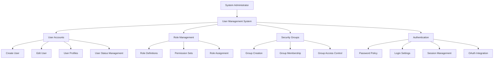
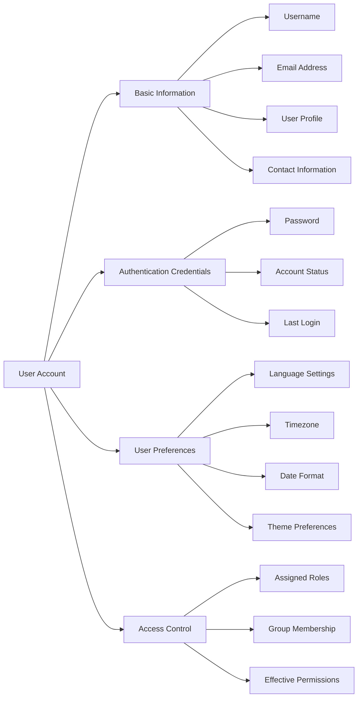
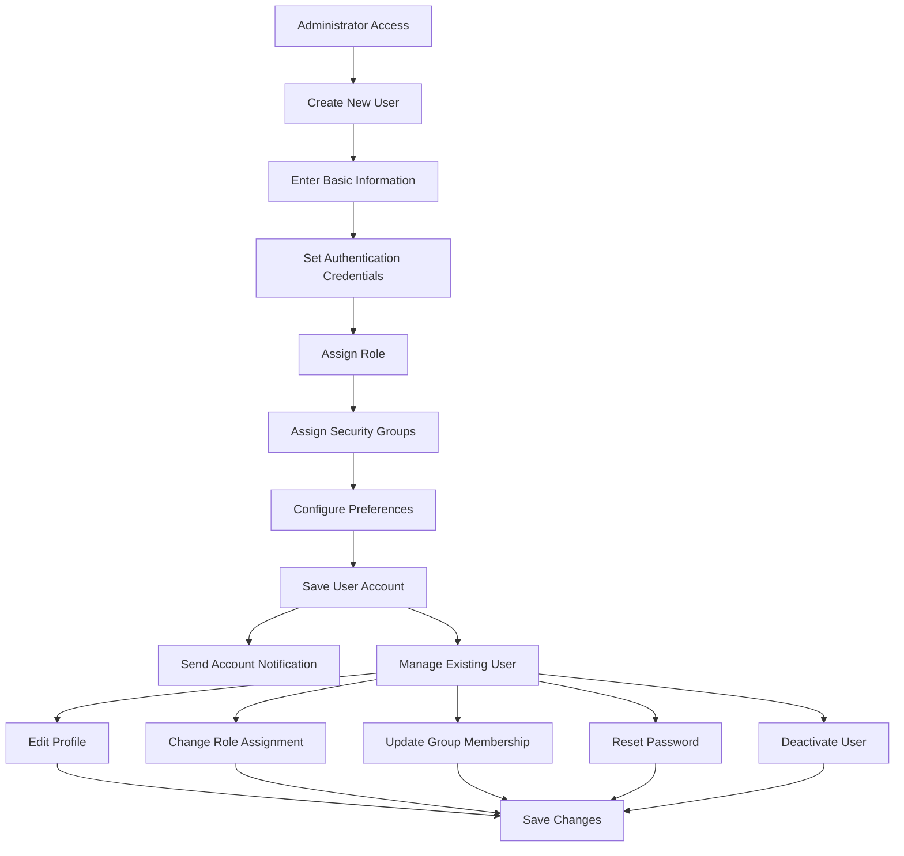
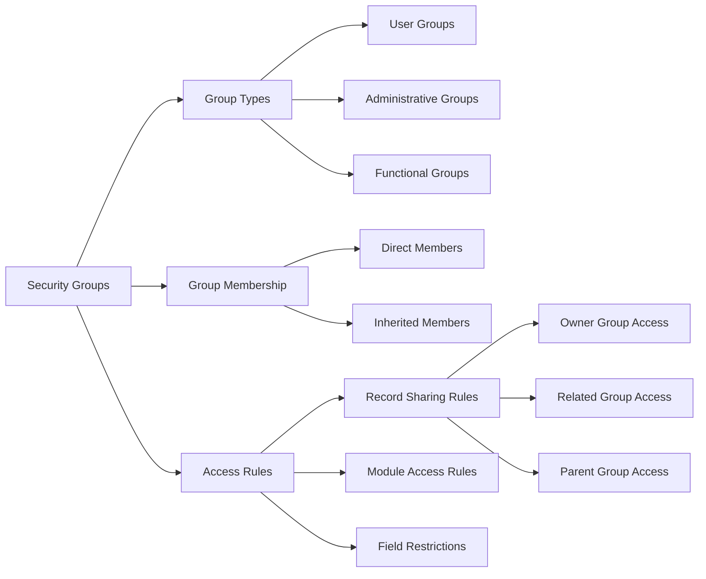
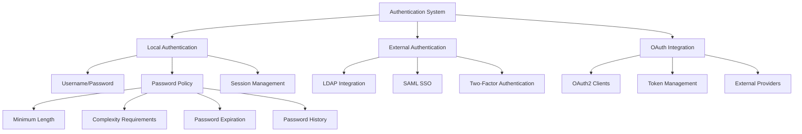
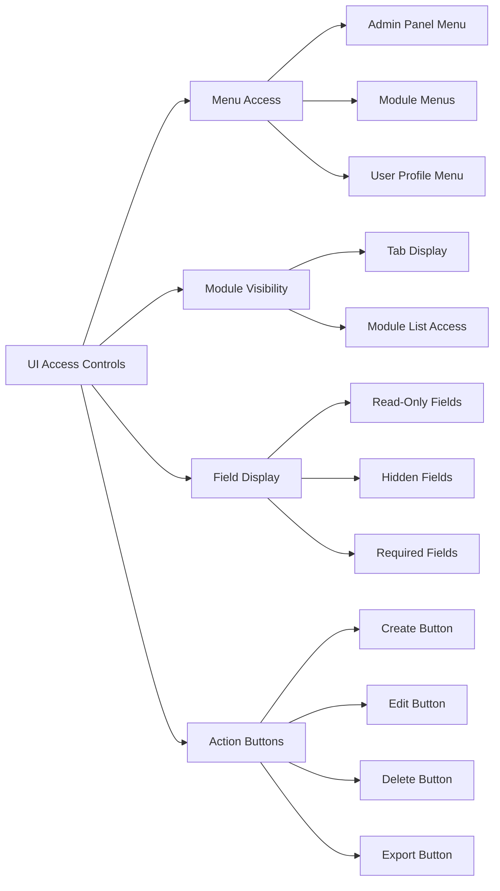
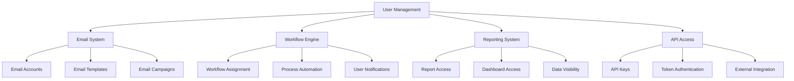

# User Management

Relevant source files

The following files were used as context for generating this wiki page:

- [content/8.x/admin/administration-panel/Administration-Panel.ru.adoc](content/8.x/admin/administration-panel/Administration-Panel.ru.adoc)
- [content/admin/Advanced Configuration Options.ru.adoc](content/admin/Advanced Configuration Options.ru.adoc)
- [content/admin/administration-panel/Advanced OpenAdmin.ru.adoc](content/admin/administration-panel/Advanced OpenAdmin.ru.adoc)
- [content/admin/administration-panel/Developer Tools.ru.adoc](content/admin/administration-panel/Developer Tools.ru.adoc)
- [content/admin/administration-panel/Google Sync.ru.adoc](content/admin/administration-panel/Google Sync.ru.adoc)
- [content/admin/administration-panel/System.ru.adoc](content/admin/administration-panel/System.ru.adoc)
- [content/admin/administration-panel/Users.ru.adoc](content/admin/administration-panel/Users.ru.adoc)
- [content/admin/installation-guide/Downloading & Installing.ru.adoc](content/admin/installation-guide/Downloading & Installing.ru.adoc)
- [content/admin/installation-guide/Upgrading.ru.adoc](content/admin/installation-guide/Upgrading.ru.adoc)
- [content/admin/installation-guide/Using the Upgrade Wizard.ru.adoc](content/admin/installation-guide/Using the Upgrade Wizard.ru.adoc)
- [content/user/advanced-modules/Cases with Portal.ru.adoc](content/user/advanced-modules/Cases with Portal.ru.adoc)
- [content/user/advanced-modules/Reschedule.ru.adoc](content/user/advanced-modules/Reschedule.ru.adoc)
- [content/user/advanced-modules/Workflow.ru.adoc](content/user/advanced-modules/Workflow.ru.adoc)
- [content/user/core-modules/Campaigns.ru.adoc](content/user/core-modules/Campaigns.ru.adoc)
- [content/user/core-modules/Cases.ru.adoc](content/user/core-modules/Cases.ru.adoc)
- [content/user/core-modules/Emails.ru.adoc](content/user/core-modules/Emails.ru.adoc)
- [content/user/core-modules/Opportunities.ru.adoc](content/user/core-modules/Opportunities.ru.adoc)
- [content/user/introduction/User Interface/Record Management.ru.adoc](content/user/introduction/User Interface/Record Management.ru.adoc)
- [content/user/introduction/User Interface/Views.ru.adoc](content/user/introduction/User Interface/Views.ru.adoc)
- [content/user/modules/Confirmed-Opt-In-Settings.ru.adoc](content/user/modules/Confirmed-Opt-In-Settings.ru.adoc)
- [content/user/modules/LawfulBasis.ru.adoc](content/user/modules/LawfulBasis.ru.adoc)
- [content/user/suitecrm-analytics/1.1/SCRM-Analytics-Getting-Started.ru.adoc](content/user/suitecrm-analytics/1.1/SCRM-Analytics-Getting-Started.ru.adoc)
- [static/images/en/admin/AdminAODSettings.png](static/images/en/admin/AdminAODSettings.png)
- [static/images/en/admin/AdminAOPSettings.png](static/images/en/admin/AdminAOPSettings.png)
- [static/images/en/admin/AdminAOSSettings.png](static/images/en/admin/AdminAOSSettings.png)
- [static/images/en/admin/AdminBusinessHours.png](static/images/en/admin/AdminBusinessHours.png)
- [static/images/en/admin/StudioExportCustomisations.png](static/images/en/admin/StudioExportCustomisations.png)
- [static/images/en/user/RolesCreateRole.png](static/images/en/user/RolesCreateRole.png)
- [static/images/en/user/RolesListByUser.png](static/images/en/user/RolesListByUser.png)
- [static/images/en/user/RolesListRoles.png](static/images/en/user/RolesListRoles.png)
- [static/images/ru/8.x/admin/administration-panel/image1.png](static/images/ru/8.x/admin/administration-panel/image1.png)
- [static/images/ru/8.x/admin/administration-panel/image2.png](static/images/ru/8.x/admin/administration-panel/image2.png)
- [static/images/ru/admin/AdvancedOpenAdmin/image3.png](static/images/ru/admin/AdvancedOpenAdmin/image3.png)
- [static/images/ru/user/UserInterface/image34.png](static/images/ru/user/UserInterface/image34.png)
- [static/images/ru/user/advanced-modules/Workflow/image2.png](static/images/ru/user/advanced-modules/Workflow/image2.png)
- [static/images/ru/user/core-modules/E-mail/image1.png](static/images/ru/user/core-modules/E-mail/image1.png)
- [static/images/ru/user/core-modules/E-mail/image2.png](static/images/ru/user/core-modules/E-mail/image2.png)

User Management in SuiteCRM encompasses the administration of user accounts, roles, permissions, and security groups that control access to the system and its data. This includes creating and managing user accounts, defining role-based permissions, configuring security groups, and managing authentication settings.

For email-specific user configuration, see [Email Configuration](#7.3). For overall system configuration that affects all users, see [System Configuration](#7.1).

## User Management Architecture

The SuiteCRM user management system operates on a multi-layered security model that combines user accounts, roles, and security groups to provide granular access control.

**User Management System Architecture**

Sources: [content/admin/administration-panel/Users.ru.adoc](), [content/8.x/admin/administration-panel/Administration-Panel.ru.adoc]()

## User Account Management

User accounts form the foundation of the SuiteCRM security model. Each user account contains authentication credentials, personal information, and system preferences.

### User Account Components

**User Account Structure and Components**

The user management interface provides administrative controls for:

- Creating new user accounts with required profile information
- Managing user status (Active, Inactive)
- Resetting passwords and managing authentication settings
- Configuring user preferences and regional settings
- Assigning roles and group memberships

Sources: [content/admin/administration-panel/Users.ru.adoc](), [content/admin/Advanced Configuration Options.ru.adoc]()

### User Creation and Management Workflow

**User Management Workflow Process**

Sources: [content/admin/administration-panel/Users.ru.adoc](), [content/admin/installation-guide/Downloading & Installing.ru.adoc]()

## Role-Based Access Control

SuiteCRM implements a comprehensive role-based access control (RBAC) system that defines what actions users can perform on different modules and records.

### Role Management Components

| Component | Description | Configuration |
|-----------|-------------|---------------|
| **Role Definition** | Named role with specific permissions | Created in Role Management interface |
| **Module Access** | Controls which modules users can access | Per-module enable/disable settings |
| **Action Permissions** | Defines CRUD operations allowed | Create, Read, Update, Delete, Import, Export |
| **Field-Level Security** | Controls access to specific fields | Field-by-field visibility settings |
| **Record-Level Security** | Limits access to specific records | Owner, Group, All records access |

### Permission Matrix Structure

```mermaid
graph TB
    Role["User Role"] --> ModuleAccess["Module Access Control"]
    Role --> ActionPerms["Action Permissions"]
    Role --> FieldSecurity["Field-Level Security"]
    Role --> RecordSecurity["Record-Level Security"]
    
    ModuleAccess --> EnabledModules["Enabled Modules"]
    ModuleAccess --> AdminAccess["Admin Panel Access"]
    
    ActionPerms --> CreatePerm["Create Permission"]
    ActionPerms --> ReadPerm["Read Permission"]
    ActionPerms --> UpdatePerm["Update Permission"]
    ActionPerms --> DeletePerm["Delete Permission"]
    ActionPerms --> ImportPerm["Import Permission"]
    ActionPerms --> ExportPerm["Export Permission"]
    
    FieldSecurity --> FieldAccess["Field Access Control"]
    FieldSecurity --> FieldVisibility["Field Visibility"]
    
    RecordSecurity --> OwnerAccess["Owner-Only Access"]
    RecordSecurity --> GroupAccess["Group Access"]
    RecordSecurity --> GlobalAccess["Global Access"]
```

**Role-Based Access Control Structure**

Sources: [content/admin/administration-panel/Users.ru.adoc](), [content/user/advanced-modules/Workflow.ru.adoc]()

## Security Groups

Security groups provide an additional layer of access control by organizing users into groups and controlling access to records based on group membership.

### Security Group Architecture

**Security Group Organization and Access Control**

### Group Management Operations

The security group system supports:

- **Group Creation**: Establishing new security groups with defined purposes
- **Member Management**: Adding and removing users from groups
- **Inheritance Rules**: Defining how group permissions cascade
- **Access Policies**: Setting record and module access rules per group
- **Group Hierarchies**: Creating parent-child group relationships

Sources: [content/admin/administration-panel/Users.ru.adoc](), [content/8.x/admin/administration-panel/Administration-Panel.ru.adoc]()

## Authentication and Password Management

SuiteCRM provides robust authentication mechanisms and password management features to ensure system security.

### Authentication Methods

**Authentication System Components**

### Password Management Features

| Feature | Description | Configuration Location |
|---------|-------------|----------------------|
| **Password Policy** | Enforces password complexity requirements | System Configuration |
| **Password Expiration** | Forces regular password changes | User Management settings |
| **Password History** | Prevents password reuse | Security settings |
| **Account Lockout** | Locks accounts after failed attempts | Authentication configuration |
| **Password Reset** | Allows administrative password resets | User management interface |

Sources: [content/admin/administration-panel/System.ru.adoc](), [content/admin/Advanced Configuration Options.ru.adoc]()

## User Interface Access Controls

The user management system controls various aspects of the user interface based on roles and permissions.

### Interface Control Mechanisms

**User Interface Access Control System**

### Administrative Interface Elements

The user management system controls access to:

- **Administration Panel**: Full admin access vs. limited administrative functions
- **Module Configuration**: Access to Studio, Module Builder, and other development tools
- **System Settings**: Currency, regional settings, email configuration
- **User Preferences**: Personal settings that individual users can modify
- **Reporting Tools**: Access to reports, dashboards, and analytics

Sources: [content/admin/administration-panel/Developer Tools.ru.adoc](), [content/user/introduction/User Interface/Views.ru.adoc]()

## Integration with System Components

User management integrates with various SuiteCRM system components to provide comprehensive access control.

### System Integration Points

**User Management System Integration Architecture**

The user management system coordinates with:

- **Email Configuration**: Personal email accounts and system-wide email settings
- **Workflow Processes**: User assignment and notification rules
- **Module Security**: Field-level and record-level access controls
- **API Authentication**: OAuth tokens and API key management
- **System Logging**: User activity tracking and audit trails

Sources: [content/user/core-modules/Emails.ru.adoc](), [content/user/advanced-modules/Workflow.ru.adoc](), [content/admin/administration-panel/System.ru.adoc]()