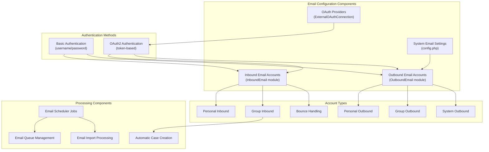
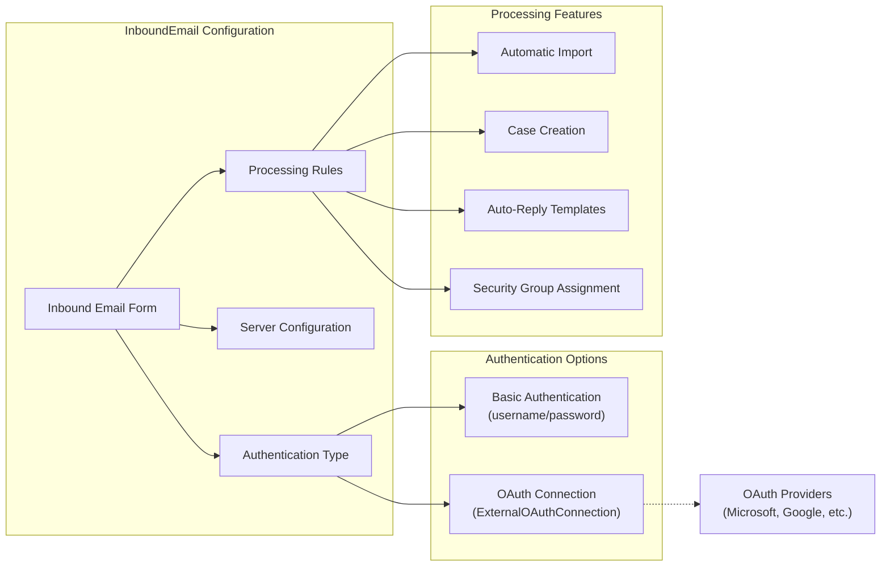
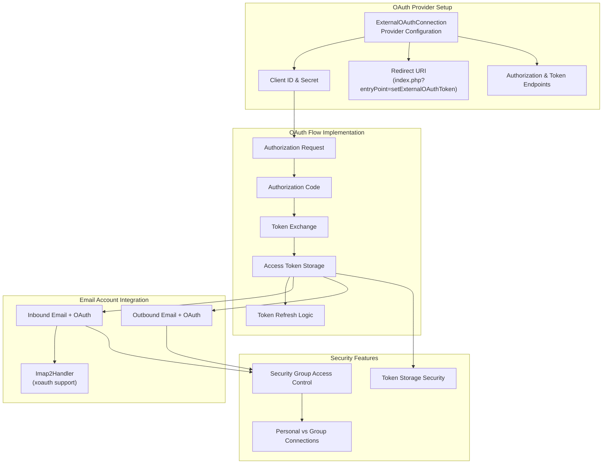
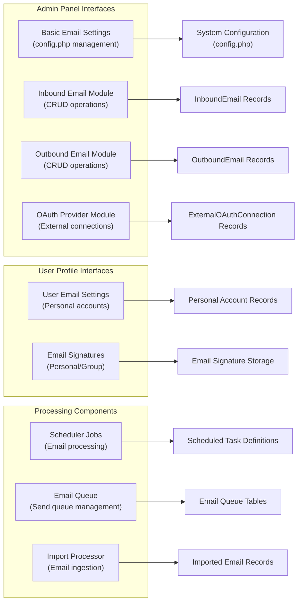
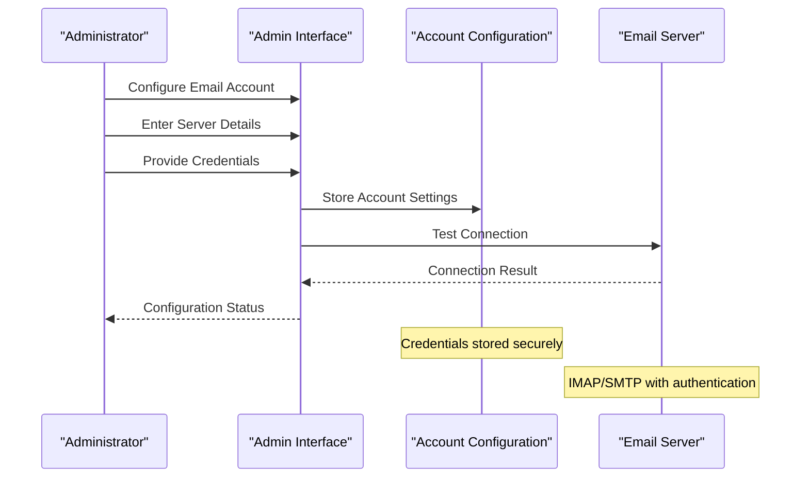
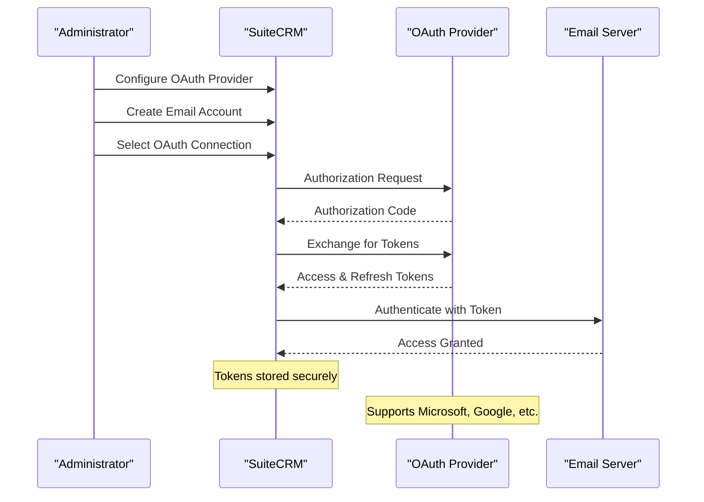
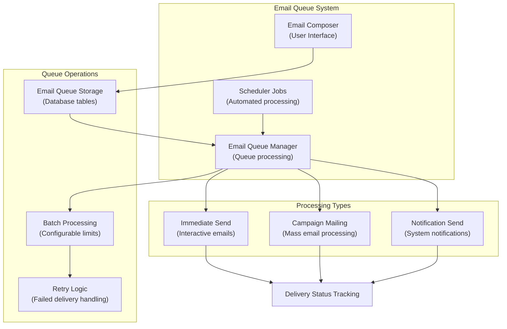

# Email Configuration

Relevant source files

The following files were used as context for generating this wiki page:

- [content/8.x/admin/Licensing.ru.adoc](content/8.x/admin/Licensing.ru.adoc)
- [content/8.x/features/_index.ru.adoc](content/8.x/features/_index.ru.adoc)
- [content/admin/administration-panel/Emails/Email-Compose-From-List.ru.adoc](content/admin/administration-panel/Emails/Email-Compose-From-List.ru.adoc)
- [content/admin/administration-panel/Emails/Email.ru.adoc](content/admin/administration-panel/Emails/Email.ru.adoc)
- [content/admin/administration-panel/Emails/Microsoft-OAuth-Provider-HowTo.ru.adoc](content/admin/administration-panel/Emails/Microsoft-OAuth-Provider-HowTo.ru.adoc)
- [content/admin/releases/7.13.x/_index.en.adoc](content/admin/releases/7.13.x/_index.en.adoc)
- [content/admin/releases/7.14.x/_index.en.adoc](content/admin/releases/7.14.x/_index.en.adoc)
- [static/images/en/admin/release/Externaloauth1.png](static/images/en/admin/release/Externaloauth1.png)
- [static/images/en/admin/release/Externaloauth2.png](static/images/en/admin/release/Externaloauth2.png)
- [static/images/en/admin/release/Externaloauth3.png](static/images/en/admin/release/Externaloauth3.png)
- [static/images/en/admin/release/InboundEmail1.png](static/images/en/admin/release/InboundEmail1.png)
- [static/images/en/admin/release/InboundEmail2.png](static/images/en/admin/release/InboundEmail2.png)
- [static/images/en/admin/release/InboundEmail3.png](static/images/en/admin/release/InboundEmail3.png)
- [static/images/en/admin/release/InboundEmail4.png](static/images/en/admin/release/InboundEmail4.png)
- [static/images/en/admin/release/InboundEmail5.png](static/images/en/admin/release/InboundEmail5.png)
- [static/images/en/admin/release/InboundOAuthConfiguration.png](static/images/en/admin/release/InboundOAuthConfiguration.png)
- [static/images/en/admin/release/OAuthMicrosoftConnection.png](static/images/en/admin/release/OAuthMicrosoftConnection.png)
- [static/images/en/admin/release/Outbound1.png](static/images/en/admin/release/Outbound1.png)
- [static/images/en/admin/release/Outbound2.png](static/images/en/admin/release/Outbound2.png)
- [static/images/ru/8.x/features/loadmore/image0.png](static/images/ru/8.x/features/loadmore/image0.png)
- [static/images/ru/8.x/features/loadmore/image1.png](static/images/ru/8.x/features/loadmore/image1.png)
- [static/images/ru/8.x/features/loadmore/image2.png](static/images/ru/8.x/features/loadmore/image2.png)
- [static/images/ru/8.x/features/loadmore/image3.png](static/images/ru/8.x/features/loadmore/image3.png)
- [static/images/ru/8.x/features/notifications/image1.png](static/images/ru/8.x/features/notifications/image1.png)
- [static/images/ru/8.x/features/notifications/image2.png](static/images/ru/8.x/features/notifications/image2.png)
- [static/images/ru/8.x/features/notifications/image3.png](static/images/ru/8.x/features/notifications/image3.png)
- [static/images/ru/admin/Email/image4.png](static/images/ru/admin/Email/image4.png)
- [static/images/ru/admin/Email/image6.png](static/images/ru/admin/Email/image6.png)

This document covers the configuration and administration of SuiteCRM's email system, including traditional SMTP/IMAP settings and modern OAuth2 authentication integration. Email configuration encompasses inbound email processing, outbound email delivery, OAuth provider setup, and email account management across personal, group, and system-level contexts.

For information about using the email interface as an end user, see [User Email Guide](#4.1). For API-level email integration, see [API Documentation](#4).

## Email System Architecture

SuiteCRM's email system consists of multiple interconnected components that handle different aspects of email processing, authentication, and delivery.

**Sources:** content/admin/releases/7.13.x/_index.en.adoc, content/admin/administration-panel/Emails/Email.ru.adoc

## Account Types and Configuration Entities

The email system supports different account types, each serving specific organizational needs and mapped to distinct code entities.

| Account Type | Module/Entity | Purpose | Configuration Location |
|-------------|---------------|---------|----------------------|
| Personal Inbound | `InboundEmail` | Individual user email access | User profile + Admin panel |
| Group Inbound | `InboundEmail` | Shared team email processing | Admin panel only |
| Bounce Handling | `InboundEmail` | Campaign bounce processing | Admin panel only |
| Personal Outbound | `OutboundEmail` | Individual sending accounts | User profile + Admin panel |
| Group Outbound | `OutboundEmail` | Shared sending accounts | Admin panel only |
| System Outbound | System settings | Default notification sender | Admin panel only |

### Inbound Email Account Configuration

Inbound email accounts handle email retrieval and processing through IMAP protocols with optional OAuth2 authentication.

**Sources:** content/admin/releases/7.13.x/_index.en.adoc, static/images/en/admin/release/InboundOAuthConfiguration.png

## OAuth Integration Architecture

OAuth2 integration provides secure, token-based authentication for modern email providers like Microsoft 365 and Google Workspace.

**Sources:** content/admin/releases/7.13.x/_index.en.adoc, content/admin/administration-panel/Emails/Microsoft-OAuth-Provider-HowTo.ru.adoc, static/images/en/admin/release/OAuthMicrosoftConnection.png

## Configuration Management Components

Email configuration involves multiple administrative interfaces and storage mechanisms across the SuiteCRM codebase.

### System-Level Configuration

The core email settings are managed through the admin panel and stored in `config.php`:

- **Default outbound mail server**: System-wide SMTP configuration
- **Assignment notifications**: User notification preferences  
- **Security settings**: Email content filtering and tag restrictions
- **Campaign settings**: Mass email processing parameters

### Module-Specific Configuration

Each email account type has dedicated configuration interfaces:

**Sources:** content/admin/administration-panel/Emails/Email.ru.adoc, content/admin/releases/7.14.x/_index.en.adoc

## Authentication Method Implementation

SuiteCRM supports both traditional and modern authentication methods for email connectivity.

### Basic Authentication Flow

Traditional username/password authentication for email servers:

### OAuth2 Authentication Flow

Modern token-based authentication with external providers:

**Sources:** content/admin/releases/7.13.x/_index.en.adoc, content/admin/releases/7.14.x/_index.en.adoc

## Email Processing and Automation

The email system includes automated processing capabilities for different organizational workflows.

### Group Email Processing Features

Group email accounts provide additional automation capabilities:

- **Automatic email import**: Configurable import of all incoming messages
- **Case creation**: Automatic generation of support cases from emails
- **Auto-reply templates**: Customizable automatic responses
- **Assignment distribution**: Round-robin or rule-based assignment methods
- **Security group integration**: Access control for team-based email accounts

### Processing Configuration Options

| Feature | Configuration Entity | Purpose |
|---------|---------------------|---------|
| Auto Import | `InboundEmail.auto_import` | Import emails into SuiteCRM |
| Case Creation | `InboundEmail.create_case` | Generate cases from emails |
| Auto Reply | `InboundEmail.template_id` | Automated response templates |
| Assignment Method | `InboundEmail.assignment_method` | User assignment strategy |
| Security Groups | `SecurityGroup` relationships | Access control |

**Sources:** content/admin/administration-panel/Emails/Email.ru.adoc

## Email Queue and Scheduling

SuiteCRM implements a robust email queue system for reliable message delivery and processing.

### Queue Configuration Parameters

The email queue system supports several configuration parameters for optimal performance:

- **Batch size**: Number of emails processed simultaneously
- **Campaign tracker location**: URL configuration for tracking links
- **Message storage**: Optional retention of sent message copies
- **Retry intervals**: Failed delivery retry scheduling

**Sources:** content/admin/administration-panel/Emails/Email.ru.adoc, content/admin/releases/7.14.x/_index.en.adoc