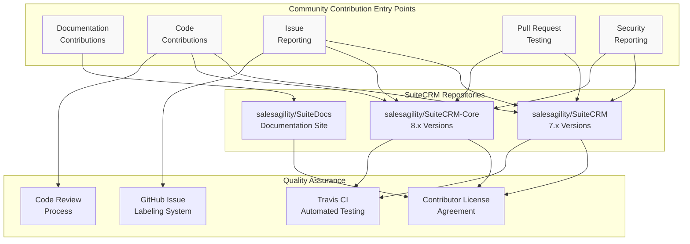
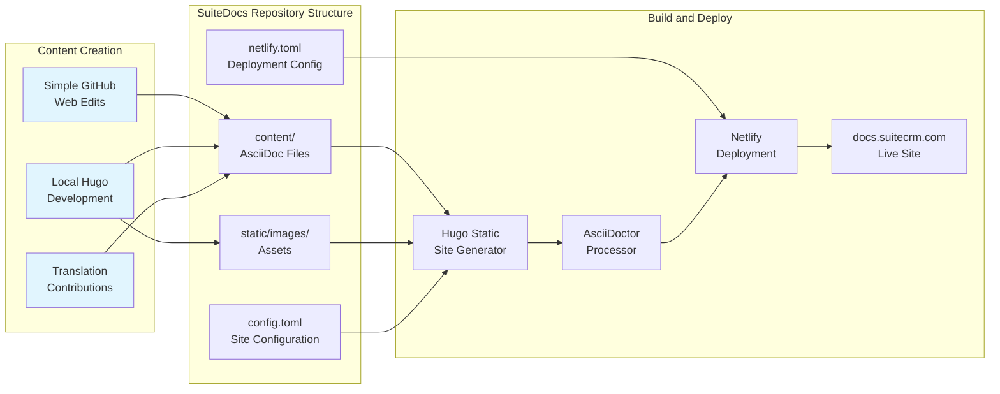
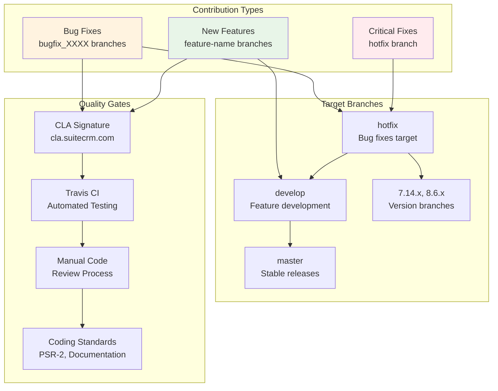
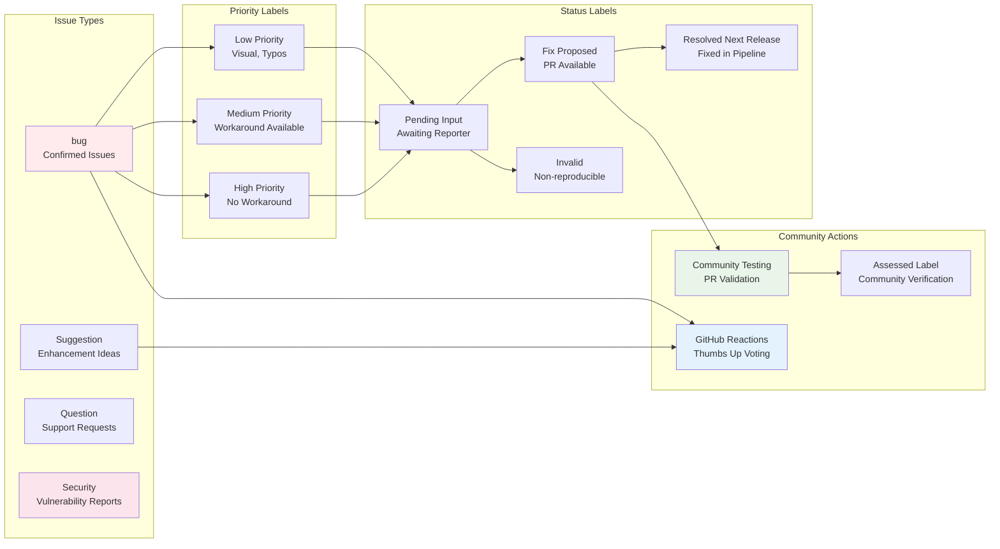
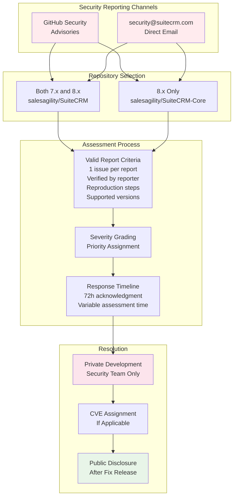
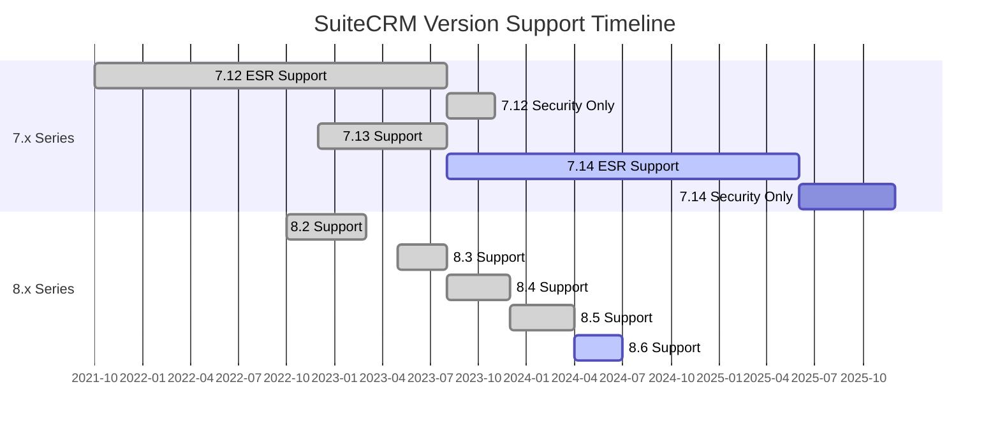

# Community Contribution

Relevant source files

The following files were used as context for generating this wiki page:

- [LICENSE.md](LICENSE.md)
- [README.md](README.md)
- [archetypes/blog.md](archetypes/blog.md)
- [archetypes/default.md](archetypes/default.md)
- [changes_sed.txt](changes_sed.txt)
- [content/community/contributing-code/Bugs.adoc](content/community/contributing-code/Bugs.adoc)
- [content/community/contributing-code/Coding Standards.adoc](content/community/contributing-code/Coding Standards.adoc)
- [content/community/contributing-code/Contributing.adoc.NOT](content/community/contributing-code/Contributing.adoc.NOT)
- [content/community/contributing-code/Features.adoc](content/community/contributing-code/Features.adoc)
- [content/community/contributing-code/Test Pull Requests.adoc](content/community/contributing-code/Test Pull Requests.adoc)
- [content/community/contributing-code/_index.es.adoc](content/community/contributing-code/_index.es.adoc)
- [content/community/contributing-to-docs/simple-edit.es.adoc](content/community/contributing-to-docs/simple-edit.es.adoc)
- [content/community/raising-issues/_index.en.adoc](content/community/raising-issues/_index.en.adoc)
- [content/community/raising-issues/issues-voting.adoc](content/community/raising-issues/issues-voting.adoc)
- [content/community/raising-issues/raising-issues.adoc](content/community/raising-issues/raising-issues.adoc)
- [content/community/security-policy.adoc](content/community/security-policy.adoc)
- [content/community/supported-versions.adoc](content/community/supported-versions.adoc)
- [static/images/en/community/32Issue-Voting.gif](static/images/en/community/32Issue-Voting.gif)
- [static/images/en/community/testingprs1.png](static/images/en/community/testingprs1.png)
- [static/images/en/community/testingprs2.png](static/images/en/community/testingprs2.png)
- [static/images/en/community/testingprs3.png](static/images/en/community/testingprs3.png)

## Purpose and Scope

This document provides a comprehensive guide to contributing to the SuiteCRM ecosystem, including both the main application and its documentation. It covers the processes, standards, and workflows that enable community members to participate in the development and improvement of SuiteCRM.

For specific information about installation and configuration, see [Installation and Upgrade Guides](#5). For details about API development, see [API Documentation](#4). For customization techniques, see [Customization and Development](#6).

## Community Contribution Framework

The SuiteCRM project operates as an open-source community initiative with multiple contribution pathways. Contributors can participate through documentation improvements, code contributions, issue reporting, testing, and community support activities.

**SuiteCRM Community Contribution Framework**

Sources: [README.md:1-43](), [content/community/contributing-code/Bugs.adoc:1-127](), [content/community/raising-issues/raising-issues.adoc:1-114](), [content/community/security-policy.adoc:1-56]()

## Documentation Contribution Workflow

The SuiteDocs repository uses Hugo static site generator with AsciiDoc content format to create the official documentation website. Contributors can make simple edits directly through GitHub's web interface or set up local development environments for more complex contributions.

**Documentation Contribution and Build Pipeline**

The documentation supports multiple languages with content organized in language-specific directories. The build process converts AsciiDoc files to HTML and deploys automatically via Netlify when changes are merged to the master branch.

| Contribution Type | Requirements | Target Files |
|------------------|--------------|--------------|
| Simple Text Edits | GitHub Account | `content/**/*.adoc` |
| Advanced Features | Hugo, AsciiDoctor | `content/`, `static/`, `config.toml` |
| Translations | Language Skills | `content/{lang}/`, `i18n/{lang}.toml` |
| Screenshots | Image Assets | `static/images/` |

Sources: [README.md:11-43](), [content/community/contributing-to-docs/simple-edit.es.adoc:1-66]()

## Code Contribution Process

Code contributions to SuiteCRM follow a structured branching strategy with different workflows for bug fixes and feature development. The process includes mandatory CLA signing, automated testing, and code review procedures.

**Code Contribution Branching and Quality Process**

### Branch Naming Conventions

- **Bug fixes**: `bugfix_XXXX` where XXXX is the issue number
- **Features**: Descriptive names like `campaign-wizard-ui`
- **Critical fixes**: Direct commits to `hotfix` branch

### Commit Message Format

Bug fixes should use the format: `Fix #XXXX - <issue description>`
Features should use descriptive commit messages following git best practices.

Sources: [content/community/contributing-code/Bugs.adoc:28-92](), [content/community/contributing-code/Features.adoc:10-48](), [content/community/contributing-code/Coding Standards.adoc:1-317]()

## Issue Management and Community Processes

The SuiteCRM project uses GitHub's issue tracking system with a comprehensive labeling scheme to categorize and prioritize community feedback. The system supports voting mechanisms and provides clear workflows for different types of issues.

**GitHub Issue Lifecycle and Community Interaction**

### Voting System

Community members can vote for issues using GitHub's reaction system. The thumbs-up count on the original issue description determines priority for future releases. Votes on comments are not counted.

### Pull Request Testing

Community members can test pull requests by:
1. Cloning the author's branch: `git pull https://github.com/{username}/SuiteCRM.git {branch-name}`
2. Testing the fix according to the issue description
3. Commenting "Assessed :+1:" if the fix works correctly

Sources: [content/community/raising-issues/raising-issues.adoc:34-114](), [content/community/raising-issues/issues-voting.adoc:1-36](), [content/community/contributing-code/Test Pull Requests.adoc:1-58]()

## Security Policy and Vulnerability Reporting

SuiteCRM maintains a dedicated security policy for responsible disclosure of vulnerabilities. Security issues follow a separate reporting process from regular bugs to ensure proper handling of sensitive information.

**Security Vulnerability Reporting and Resolution Process**

### Supported Versions for Security Reports

Only actively supported versions receive security updates. Current supported versions include SuiteCRM 7.14 ESR and 8.6, with specific support timelines documented in the version support matrix.

| Version | Type | Active Support Until | Security Support Until |
|---------|------|---------------------|----------------------|
| 7.14 ESR | Extended Support | June 2025 | December 2025 |
| 8.6 | Standard | July 2024 | - |

Sources: [content/community/security-policy.adoc:1-56](), [content/community/supported-versions.adoc:15-77]()

## Development Standards and Quality Assurance

The SuiteCRM project enforces coding standards based on PSR-2 guidelines with additional project-specific requirements. All contributions must include proper documentation, follow naming conventions, and maintain compatibility with supported platforms.

### Code Quality Requirements

| Standard | Requirement | Example |
|----------|-------------|---------|
| Indentation | 4 spaces (PHP), 2 spaces (JavaScript) | `if (condition) {` |
| Class Names | StudlyCaps | `class YoungInfant extends Person` |
| Function Names | camelCase with descriptive verbs | `function printLoginStatus($user, $time)` |
| Variables | camelCase, descriptive names | `$jobStrings`, `$disableRowLevelSecurity` |
| Comments | PHPDoc format required | `/** @param string $variable */` |

### File Structure Requirements

- **License headers**: All core files must include the SuiteCRM license header
- **Entry point validation**: PHP files must check `sugarEntry` constant
- **JavaScript minification**: Provide both minified and source versions in `jssource/`
- **CSS compilation**: SASS sources required for theme modifications

Sources: [content/community/contributing-code/Coding Standards.adoc:74-317]()

## Version Support and Compatibility

The SuiteCRM project maintains multiple concurrent versions with different support lifecycles. Contributors must target the appropriate version branch based on the issue scope and version compatibility requirements.

**SuiteCRM Version Support Timeline and Contribution Targets**

### Branch Targeting Guidelines

- **Bug fixes affecting all versions**: Target `hotfix` branch
- **Version-specific issues**: Target appropriate version branch (e.g., `7.14.x`)
- **New features**: Target `develop` branch for inclusion in next major release
- **Security fixes**: Follow security reporting process regardless of version

The Extended Support Release (ESR) model provides longer support cycles for enterprise deployments, while standard releases focus on rapid feature development and improvement cycles.

Sources: [content/community/supported-versions.adoc:1-77](), [content/community/contributing-code/Bugs.adoc:59-92]()