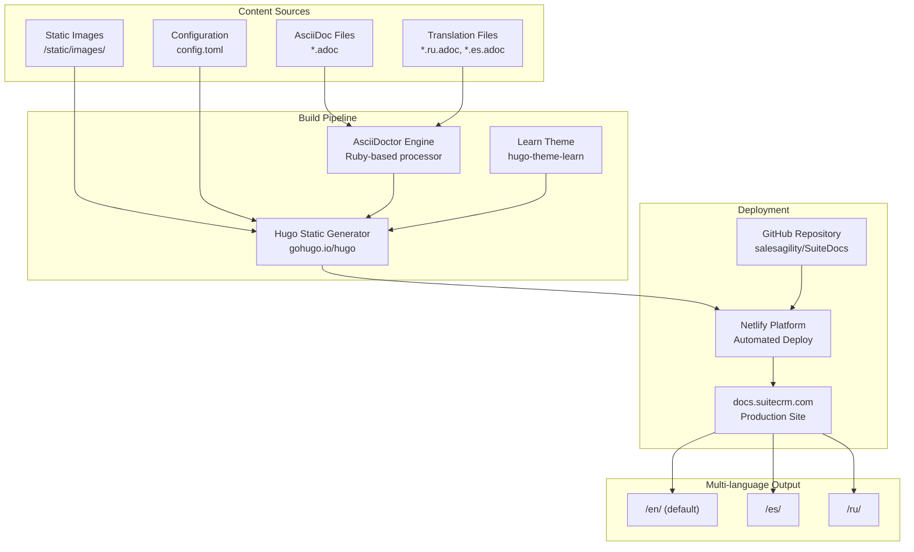
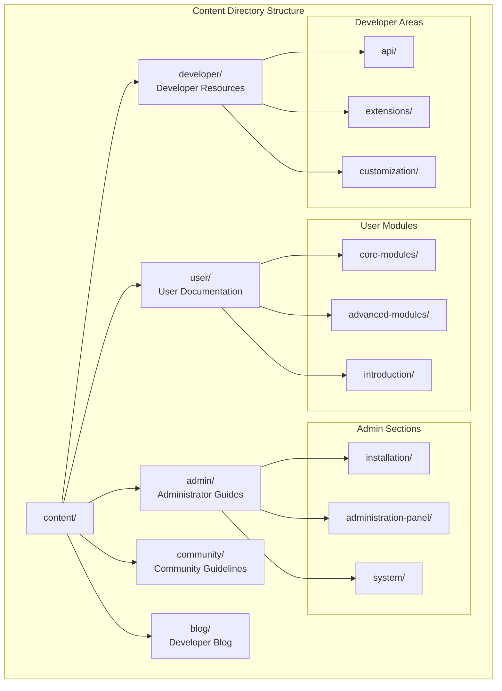
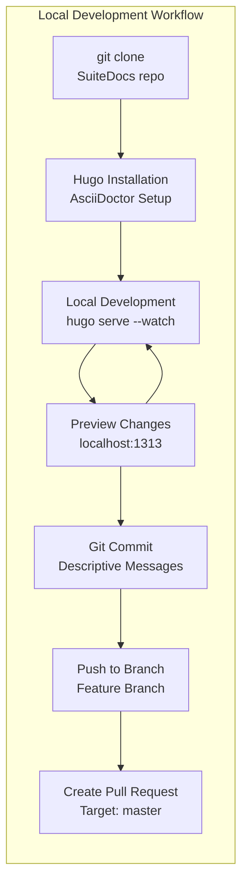
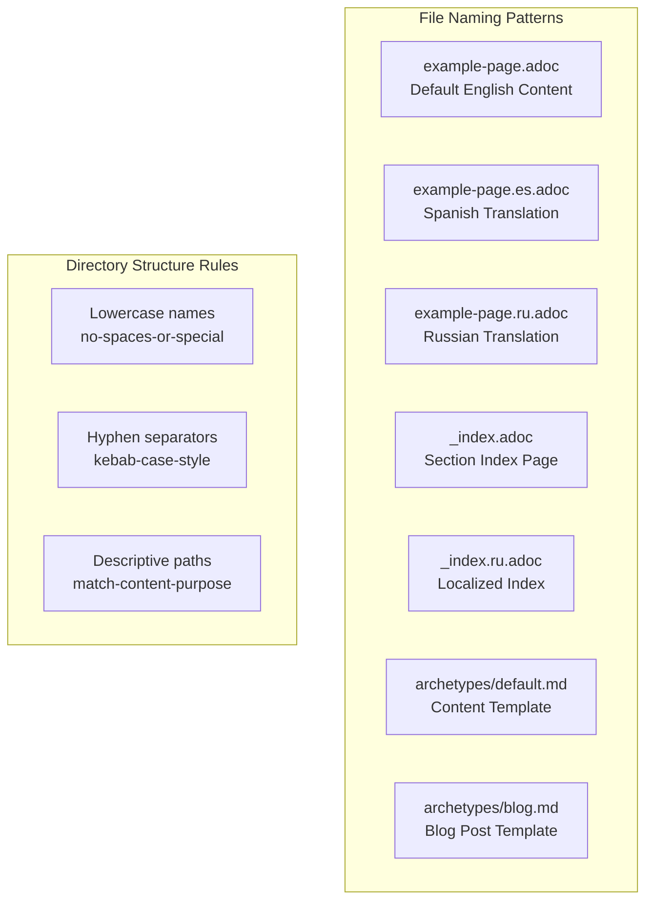
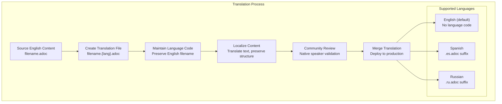
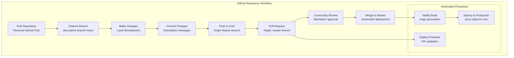

# Contributing to Documentation

<details>
<summary>Relevant source files</summary>

The following files were used as context for generating this wiki page:

- [LICENSE.md](LICENSE.md)
- [README.md](README.md)
- [archetypes/blog.md](archetypes/blog.md)
- [archetypes/default.md](archetypes/default.md)
- [content/admin/administration-panel/search/elasticsearch/Command Line Tools.ru.adoc](content/admin/administration-panel/search/elasticsearch/Command Line Tools.ru.adoc)
- [content/admin/administration-panel/search/elasticsearch/Set up SuiteCRM.ru.adoc](content/admin/administration-panel/search/elasticsearch/Set up SuiteCRM.ru.adoc)
- [content/community/_index.ru.adoc](content/community/_index.ru.adoc)
- [content/community/contributing-code/_index.ru.adoc](content/community/contributing-code/_index.ru.adoc)
- [content/community/contributing-to-docs/_index.ru.adoc](content/community/contributing-to-docs/_index.ru.adoc)
- [content/community/contributing-to-docs/guidelines.ru.adoc](content/community/contributing-to-docs/guidelines.ru.adoc)
- [content/community/contributing-to-docs/simple-edit.ru.adoc](content/community/contributing-to-docs/simple-edit.ru.adoc)
- [content/community/contributing-to-docs/simple-issue.ru.adoc](content/community/contributing-to-docs/simple-issue.ru.adoc)
- [content/community/contributing-to-docs/translate.ru.adoc](content/community/contributing-to-docs/translate.ru.adoc)
- [content/developer/_index.ru.adoc](content/developer/_index.ru.adoc)
- [content/user/advanced-modules/Workflow Calculated Fields.ru.adoc](content/user/advanced-modules/Workflow Calculated Fields.ru.adoc)
- [content/user/introduction/User Interface/Navigation Elements.ru.adoc](content/user/introduction/User Interface/Navigation Elements.ru.adoc)
- [content/user/introduction/User Interface/Search.ru.adoc](content/user/introduction/User Interface/Search.ru.adoc)

</details>


This document covers the processes, tools, and guidelines for contributing to the SuiteCRM documentation project. It explains how community members can help improve, translate, and maintain the comprehensive documentation hosted at docs.suitecrm.com.

For information about contributing code to SuiteCRM itself, see [Contributing Code](#8). For reporting security vulnerabilities, see [Security Policy](#8.3).

## Overview

SuiteDocs is a community-driven documentation project that provides comprehensive guides for SuiteCRM users, administrators, and developers. The documentation system uses modern static site generation tools and supports multiple languages with a collaborative workflow centered around GitHub.

The documentation covers all aspects of SuiteCRM from basic user guides to advanced development topics, spanning multiple SuiteCRM versions (7.x and 8.x series) and including API documentation for both legacy and modern implementations.

Sources: [README.md:1-43](), [content/community/contributing-to-docs/_index.ru.adoc:1-19]()

## Documentation System Architecture

The SuiteDocs project uses a modern static site generation pipeline that converts AsciiDoc content into a responsive website with multi-language support.



**SuiteDocs Technical Stack**

Sources: [README.md:11-17](), [content/community/contributing-to-docs/guidelines.ru.adoc:14-25]()

## Content Organization Structure

The documentation follows a hierarchical structure that mirrors SuiteCRM's functional areas and user roles.



**Documentation Content Hierarchy**

Sources: [content/community/contributing-to-docs/guidelines.ru.adoc:20-25](), [README.md:32-37]()

## Contribution Methods

Contributors can participate in documentation improvement through several pathways, each suited to different levels of technical expertise and contribution scope.

### Simple Web-Based Editing

For minor corrections and content updates, contributors can edit pages directly through the GitHub web interface without requiring local development setup.

| Method | Use Cases | Requirements |
|--------|-----------|---------------|
| GitHub Web Editor | Typo fixes, content updates, small additions | GitHub account |
| Issue Reporting | Bug reports, content requests, clarifications | GitHub account |
| Pull Requests | Direct changes via web interface | Basic Git knowledge |

**Web Editing Workflow:**
1. Navigate to target page on docs.suitecrm.com
2. Click "Edit this page" link (redirects to GitHub)
3. Make changes using GitHub's built-in editor
4. Submit pull request with descriptive commit message
5. Community review and merge process

Sources: [content/community/contributing-to-docs/simple-edit.ru.adoc:20-67](), [content/community/contributing-to-docs/simple-issue.ru.adoc:20-51]()

### Local Development Setup

For extensive contributions, translations, or structural changes, local development provides full control over the Hugo build environment.



**Local Development Requirements:**
- Git version control system
- Hugo static site generator
- Ruby with AsciiDoctor gem
- Text editor with AsciiDoc support

Sources: [README.md:19-29](), [content/community/contributing-to-docs/guidelines.ru.adoc:14-17]()

## File Naming and Structure Conventions

The documentation system follows specific naming patterns to support Hugo's content organization and multi-language features.

### Content File Naming



**File Naming Standards:**

| File Type | Pattern | Example |
|-----------|---------|---------|
| English Content | `filename.adoc` | `installation-guide.adoc` |
| Spanish Translation | `filename.es.adoc` | `installation-guide.es.adoc` |
| Russian Translation | `filename.ru.adoc` | `installation-guide.ru.adoc` |
| Section Index | `_index.adoc` | `_index.adoc` |
| Blog Posts | Uses archetype | Generated from `archetypes/blog.md` |

Sources: [content/community/contributing-to-docs/guidelines.ru.adoc:27-54](), [archetypes/default.md:1-6](), [archetypes/blog.md:1-15]()

## AsciiDoc Content Standards

Documentation content uses AsciiDoc markup with specific conventions for consistency and maintainability.

### Document Front Matter

Every AsciiDoc file begins with YAML front matter defining metadata:

```yaml
---
title: "Page Title"
weight: 50
---
```

### Required AsciiDoc Attributes

```asciidoc
:author: author-name
:email: author@example.com
:toc:
:toc-title: Table of Contents
:experimental:
:imagesdir: /images/en/section-name/
```

### Content Formatting Guidelines

| Element | AsciiDoc Syntax | Usage |
|---------|----------------|--------|
| Buttons | `btn:[Save]` | UI button references |
| Code paths | `\`/path/to/file\`` | File system paths |
| Inline code | `\`variable_name\`` | Code variables |
| External links | `link:url[text^]` | Opens in new tab |
| Internal links | `link:../page[text]` | Relative navigation |

**Hugo Shortcodes for Special Content:**

```asciidoc
{}
Information message content
{}

{}
Warning message content
{}

{}
```

Sources: [content/community/contributing-to-docs/guidelines.ru.adoc:55-132](), [content/user/advanced-modules/Workflow Calculated Fields.ru.adoc:1-30]()

## Translation Workflow

SuiteDocs supports multiple languages with a structured translation process that maintains consistency across language versions.



**Translation Guidelines:**
- Preserve original filename structure
- Add language code before file extension
- Maintain front matter structure
- Translate content while preserving AsciiDoc markup
- Keep image paths and links functional
- Update `:imagesdir:` attribute for localized images

**Language Code Mapping:**
- English: No suffix (default language)
- Spanish: `.es.adoc`
- Russian: `.ru.adoc`

Sources: [content/community/contributing-to-docs/translate.ru.adoc:9-17](), [content/community/contributing-to-docs/guidelines.ru.adoc:36-53]()

## GitHub Integration and Deployment

The documentation system uses GitHub as the central repository with automated deployment through Netlify.



**Repository Details:**
- Main repository: `salesagility/SuiteDocs`
- Default branch: `master`
- Deployment: Automatic via Netlify
- Preview deployments: Available for pull requests
- Build status: Monitored via Netlify badge

**Netlify Configuration:**
The deployment process uses [netlify.toml]() configuration for build settings and Hugo version specification.

Sources: [README.md:19-29](), [content/community/contributing-to-docs/simple-edit.ru.adoc:44-50]()

## Quality Assurance and Review Process

Documentation contributions undergo community review to ensure accuracy, consistency, and adherence to project standards.

### Review Criteria

| Aspect | Requirements |
|--------|-------------|
| Technical Accuracy | Information must be current and correct |
| Language Quality | Clear, grammatically correct writing |
| Structure Consistency | Follows established formatting guidelines |
| Link Functionality | All internal and external links work correctly |
| Image Quality | Screenshots current, properly sized |
| AsciiDoc Syntax | Valid markup, proper attributes |

### Contributor Guidelines

**Content Standards:**
- Maximum 80 characters per line for readability
- Use relative links for internal navigation
- Include alt text for all images
- Follow established terminology consistently
- Provide sources and references where applicable

**Code References:**
- Use inline code formatting for file paths: `config.toml`
- Reference specific line numbers: [filename:start-end]()
- Include context for code examples
- Verify code accuracy against current SuiteCRM versions

### Issue Tracking and Management

Community members can report documentation issues through GitHub's issue tracking system:

- **Bug Reports**: Incorrect information or broken functionality
- **Content Requests**: Missing documentation or feature coverage
- **Clarification Needs**: Unclear or confusing explanations
- **Translation Issues**: Language-specific problems

Sources: [content/community/contributing-to-docs/guidelines.ru.adoc:205-242](), [content/community/contributing-to-docs/simple-issue.ru.adoc:20-51]()

## Licensing and Legal Considerations

SuiteDocs content is licensed under the GNU Free Documentation License, ensuring open access and community ownership of documentation improvements.

**License Requirements:**
- All contributions become part of the GFDL-licensed documentation
- Contributors retain attribution for their work
- Content must be compatible with open documentation standards
- Commercial use permitted under license terms

**Copyright Attribution:**
Contributors are encouraged to include author attribution in AsciiDoc files:

```asciidoc
:author: Your Name
:email: your.email@example.com
```

Sources: [LICENSE.md:1-121](), [README.md:40-42]()