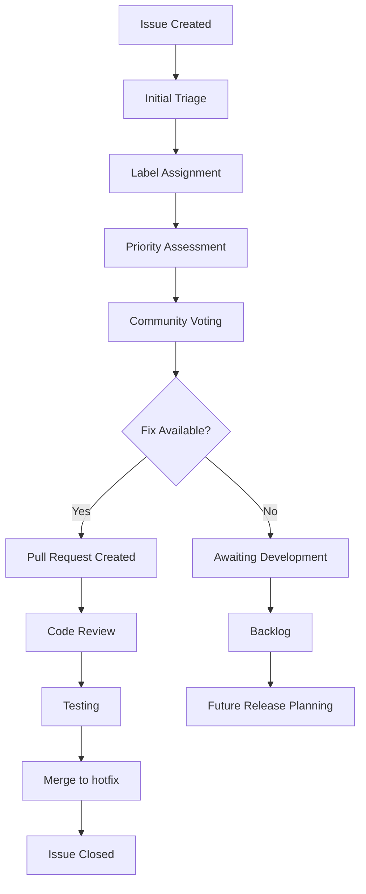
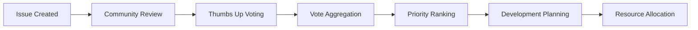
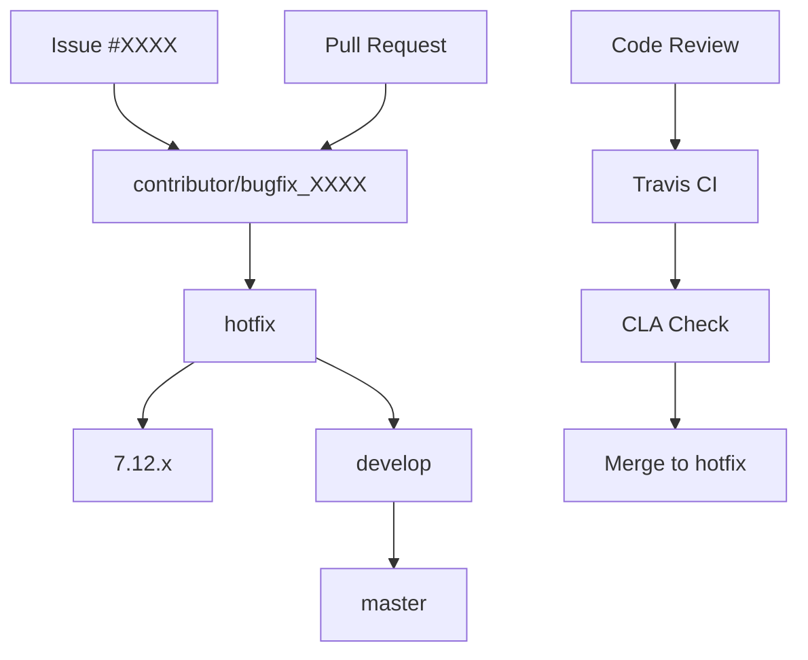
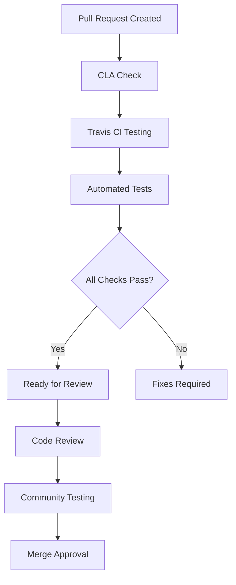
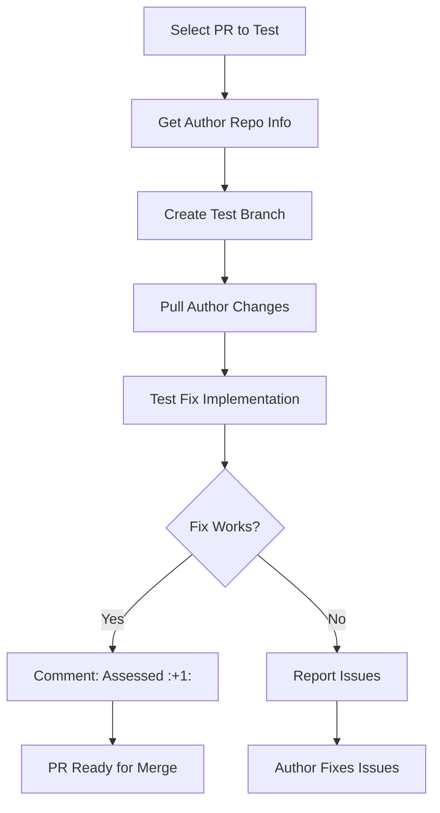

# Bug Reporting and Issue Management

<details>
<summary>Relevant source files</summary>

The following files were used as context for generating this wiki page:

- [changes_sed.txt](changes_sed.txt)
- [content/community/contributing-code/Bugs.adoc](content/community/contributing-code/Bugs.adoc)
- [content/community/contributing-code/Coding Standards.adoc](content/community/contributing-code/Coding Standards.adoc)
- [content/community/contributing-code/Contributing.adoc.NOT](content/community/contributing-code/Contributing.adoc.NOT)
- [content/community/contributing-code/Features.adoc](content/community/contributing-code/Features.adoc)
- [content/community/contributing-code/Test Pull Requests.adoc](content/community/contributing-code/Test Pull Requests.adoc)
- [content/community/contributing-code/_index.es.adoc](content/community/contributing-code/_index.es.adoc)
- [content/community/contributing-to-docs/simple-edit.es.adoc](content/community/contributing-to-docs/simple-edit.es.adoc)
- [content/community/raising-issues/_index.en.adoc](content/community/raising-issues/_index.en.adoc)
- [content/community/raising-issues/issues-voting.adoc](content/community/raising-issues/issues-voting.adoc)
- [content/community/raising-issues/raising-issues.adoc](content/community/raising-issues/raising-issues.adoc)
- [content/community/security-policy.adoc](content/community/security-policy.adoc)
- [content/community/supported-versions.adoc](content/community/supported-versions.adoc)
- [static/images/en/community/32Issue-Voting.gif](static/images/en/community/32Issue-Voting.gif)
- [static/images/en/community/testingprs1.png](static/images/en/community/testingprs1.png)
- [static/images/en/community/testingprs2.png](static/images/en/community/testingprs2.png)
- [static/images/en/community/testingprs3.png](static/images/en/community/testingprs3.png)

</details>


This document covers the processes and workflows for reporting bugs, managing issues, and contributing bug fixes to SuiteCRM. It includes GitHub-based issue tracking, community voting mechanisms, and the technical workflows for submitting and testing bug fixes.

For information about reporting security vulnerabilities, see [Security Policy](#8.3). For general documentation contributions, see [Contributing to Documentation](#8.1).

## Issue Reporting Process

The SuiteCRM project uses GitHub Issues as the primary mechanism for bug reporting and feature requests. Issues should be clearly documented with comprehensive details to enable effective reproduction and resolution.

### Issue Requirements

When reporting issues, contributors must provide:

- Clear description with steps to reproduce
- SuiteCRM version(s) where the issue occurs  
- Platform and environment details when relevant
- Screenshots or error logs when applicable

Issues that meet these criteria are more likely to be addressed promptly and accurately by the development team.

**Issue Lifecycle Workflow**


Sources: [content/community/raising-issues/raising-issues.adoc:8-33]()

## GitHub Labels and Issue Classification

The SuiteCRM project uses a comprehensive labeling system to categorize and prioritize issues effectively.

### Issue Type Labels

| Label | Purpose | GitHub Filter |
|-------|---------|---------------|
| `bug` | Confirmed or likely bugs | [Bug Issues](https://github.com/salesagility/SuiteCRM/labels/bug) |
| `suggestion` | Feature requests and improvements | [Suggestion Issues](https://github.com/salesagility/SuiteCRM/labels/Suggestion) |
| `question` | General questions (should use community forum) | [Question Issues](https://github.com/salesagility/SuiteCRM/labels/Question) |
| `invalid` | Invalid or non-reproducible issues | [Invalid Issues](https://github.com/salesagility/SuiteCRM/labels/invalid) |
| `duplicate` | Duplicate of existing issues | [Duplicate Issues](https://github.com/salesagility/SuiteCRM/labels/Duplicate) |

### Priority Classification

| Priority Level | Impact Description | GitHub Filter |
|----------------|-------------------|---------------|
| `Low Priority` | Visual issues, typos, minor alignments | [Low Priority](https://github.com/salesagility/SuiteCRM/labels/Low%20Priority) |
| `Medium Priority` | Medium impact blockers with workarounds | [Medium Priority](https://github.com/salesagility/SuiteCRM/labels/Medium%20Priority) |
| `High Priority` | High impact blockers without workarounds | [High Priority](https://github.com/salesagility/SuiteCRM/labels/High%20Priority) |

### Status and Action Labels

| Label | Description | GitHub Filter |
|-------|-------------|---------------|
| `Fix Proposed` | Issues with related pull requests | [Fix Proposed](https://github.com/salesagility/SuiteCRM/labels/Fix%20Proposed) |
| `Pending Input` | Awaiting response from issue reporter | [Pending Input](https://github.com/salesagility/SuiteCRM/labels/Pending%20Input) |
| `Resolved: Next Release` | Fixed issues pending next release | [Resolved: Next Release](https://github.com/salesagility/SuiteCRM/labels/Resolved%3A%20Next%20Release) |

Sources: [content/community/raising-issues/raising-issues.adoc:34-72]()

## Issue Voting and Community Prioritization

The project implements a voting mechanism using GitHub reactions to help prioritize issues based on community impact and demand.

### Voting Process

Contributors can vote on issues by:
1. Navigating to the issue page
2. Clicking the reaction button on the **original issue description**
3. Selecting the thumbs up (👍) reaction

**Important**: Only reactions on the original issue description are counted. Reactions on comments are disregarded.

### Sorting by Popularity

To view most popular issues, use the GitHub filter parameter:
```
sort:reactions-+1-desc
```

This sorting mechanism helps maintainers identify community priorities and allocate development resources effectively.

**Community Voting Workflow**


Sources: [content/community/raising-issues/issues-voting.adoc:8-35]()

## Bug Fix Contribution Workflow

Contributors can submit bug fixes through GitHub Pull Requests following established branch and commit conventions.

### Branch Strategy

Bug fixes must target the `hotfix` branch, which follows this merge pattern:

**SuiteCRM Branch Workflow**


### Branch Naming Convention

Create bug fix branches using the pattern:
- `bugfix_XXXX` (where XXXX is the issue ID)
- `issue-XXXX` (alternative format)

Example Git commands:
```bash
git checkout -b bugfix_3062 upstream/hotfix
```

For SuiteCRM 8, the same pattern applies:
```bash
git checkout -b bugfix_3062 upstream/hotfix
```

### Commit Message Format

Follow the standardized commit message format:
```
Fix #XXXX - <issue subject>
```

Example:
```bash
git commit -m "Fix #1436 - Reports with nested Parentheses are removing parameters"
```

This format enables automatic inclusion in release notes and links commits to issues.

Sources: [content/community/contributing-code/Bugs.adoc:6-57]()

## Pull Request Requirements and Validation

All pull requests undergo automated validation and manual review processes before acceptance.

### Repository Targets

| SuiteCRM Version | Repository | Base Branch |
|------------------|------------|-------------|
| SuiteCRM 7.x | `salesagility/SuiteCRM` | `hotfix` |
| SuiteCRM 8.x | `salesagility/SuiteCRM-Core` | `hotfix` |

### Automated Checks

**Pull Request Validation Pipeline**


#### Contributor License Agreement (CLA)

All contributors must sign the CLA at https://cla.suitecrm.com/salesagility/SuiteCRM. This is required only once per contributor.

#### Travis CI Integration

Travis CI automatically tests pull request mergeability. Contributors can run tests locally:
```bash
cd tests
sh runtests.sh
```

### Pull Request Labels

| Label | Description | Purpose |
|-------|-------------|---------|
| `Assessed` | Confirmed to fix the original issue | Ready for code review |
| `Ready to Merge` | Passed assessment and code review | Awaiting merge |
| `Requires Tests` | Needs additional test coverage | Testing required |
| `Community Contribution` | Created by community member | Attribution |
| `Enhancement` | Adds new functionality | Feature review needed |
| `In Review` | Currently under review | Work in progress |
| `Wrong Branch` | Targeting incorrect branch | Needs retargeting |

Sources: [content/community/contributing-code/Bugs.adoc:93-127](), [content/community/raising-issues/raising-issues.adoc:74-107]()

## Pull Request Testing Process

Community members can test pending pull requests to help validate fixes before they are merged.

### Testing Workflow

1. **Identify Pull Request**: Browse https://github.com/salesagility/SuiteCRM/pulls
2. **Extract Branch Information**: Get author's repository and branch name
3. **Create Test Branch**: 
   ```bash
   cd /path/to/your/fork
   git checkout -b testing6614 hotfix
   ```
4. **Pull Author's Changes**:
   ```bash
   git pull https://github.com/{author}/SuiteCRM.git {branch-name}
   ```
5. **Test the Fix**: Follow issue reproduction steps
6. **Report Results**: Comment "Assessed :+1:" if successful

**Pull Request Testing Workflow**


The "Assessed" comment provides clear indication to maintainers that community testing has been completed successfully.

Sources: [content/community/contributing-code/Test Pull Requests.adoc:9-57]()

## Version Support and Lifecycle Management

Understanding SuiteCRM's version support lifecycle is crucial for effective issue management and bug fix targeting.

### Currently Supported Versions

| Version | Initial Release | Active Support Until | Security Support Until |
|---------|----------------|---------------------|----------------------|
| 7.14 ESR | August 2023 | June 2025 | December 2025 |
| 8.6 | April 2024 | July 2024 | - |

### End of Life Versions

Recent EOL versions include 7.12 ESR, 7.13, and several 8.x releases (8.2 through 8.5). Issues affecting only EOL versions receive lower priority unless they also impact supported versions.

### Branch Migration Process

When versions reach EOL, pull requests may need retargeting. The process involves:

1. **Extract Commit Hashes**:
   ```bash
   git log -1 --format=format:"%H"
   ```
2. **Create New Branch from Current Target**:
   ```bash
   git checkout hotfix
   git checkout -b new-branch
   ```
3. **Cherry-pick Changes**:
   ```bash
   git cherry-pick commit1 commit2
   ```

Sources: [content/community/supported-versions.adoc:10-72](), [content/community/contributing-code/Bugs.adoc:59-92]()

## Integration with Security Policy

While this document covers general bug reporting, security vulnerabilities require special handling through the dedicated security policy framework.

Security issues should be reported through:
- GitHub Security Advisories for the appropriate repository
- Direct email to security@suitecrm.com

For complete security reporting procedures, see [Security Policy](#8.3).

Sources: [content/community/security-policy.adoc:10-28]()