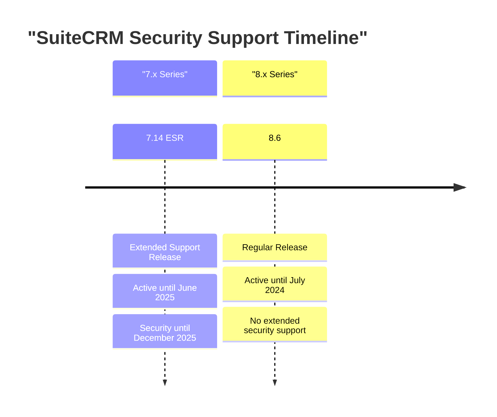
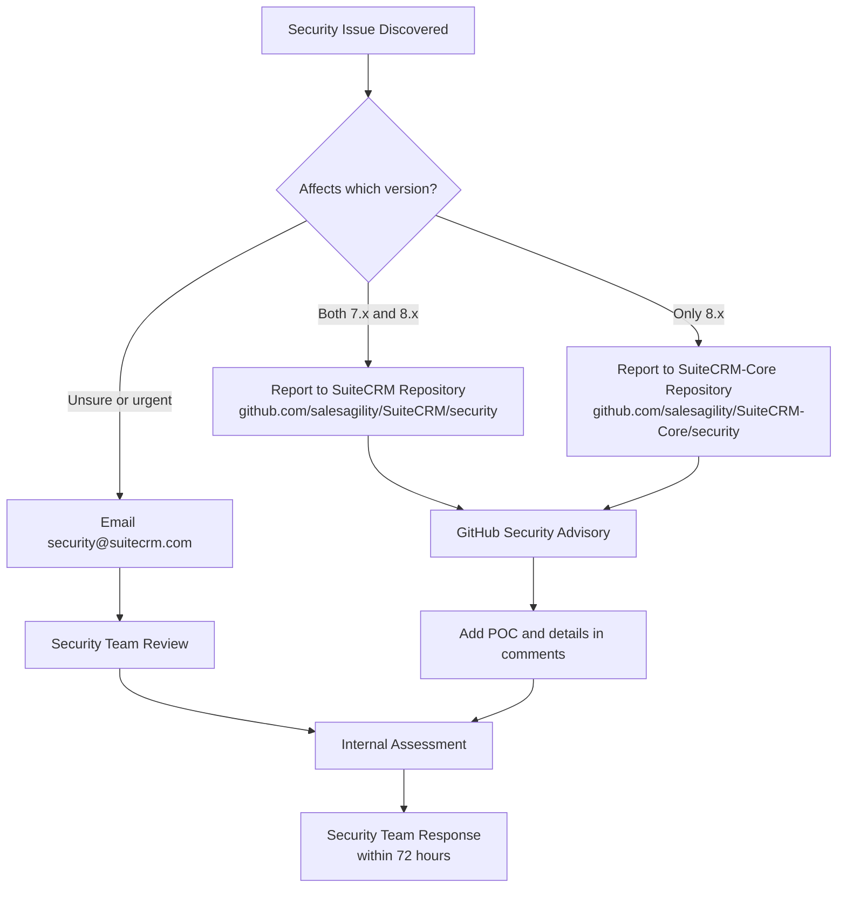
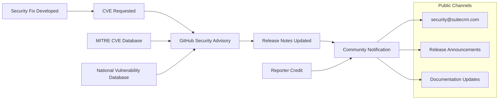
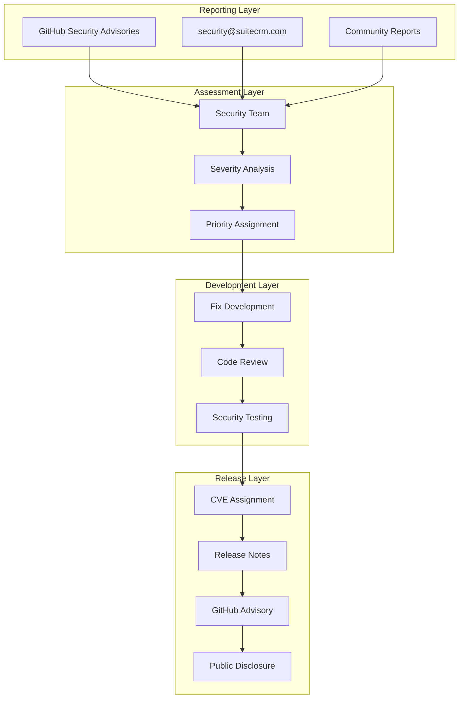

# Security Policy

Relevant source files

The following files were used as context for generating this wiki page:

- [content/admin/releases/7.13.x/_index.en.adoc](content/admin/releases/7.13.x/_index.en.adoc)
- [content/admin/releases/7.14.x/_index.en.adoc](content/admin/releases/7.14.x/_index.en.adoc)
- [content/community/raising-issues/_index.en.adoc](content/community/raising-issues/_index.en.adoc)
- [content/community/raising-issues/issues-voting.adoc](content/community/raising-issues/issues-voting.adoc)
- [content/community/raising-issues/raising-issues.adoc](content/community/raising-issues/raising-issues.adoc)
- [content/community/security-policy.adoc](content/community/security-policy.adoc)
- [content/community/supported-versions.adoc](content/community/supported-versions.adoc)
- [static/images/en/admin/release/Externaloauth1.png](static/images/en/admin/release/Externaloauth1.png)
- [static/images/en/admin/release/Externaloauth2.png](static/images/en/admin/release/Externaloauth2.png)
- [static/images/en/admin/release/Externaloauth3.png](static/images/en/admin/release/Externaloauth3.png)
- [static/images/en/admin/release/InboundEmail1.png](static/images/en/admin/release/InboundEmail1.png)
- [static/images/en/admin/release/InboundEmail2.png](static/images/en/admin/release/InboundEmail2.png)
- [static/images/en/admin/release/InboundEmail3.png](static/images/en/admin/release/InboundEmail3.png)
- [static/images/en/admin/release/InboundEmail4.png](static/images/en/admin/release/InboundEmail4.png)
- [static/images/en/admin/release/InboundEmail5.png](static/images/en/admin/release/InboundEmail5.png)
- [static/images/en/admin/release/InboundOAuthConfiguration.png](static/images/en/admin/release/InboundOAuthConfiguration.png)
- [static/images/en/admin/release/OAuthMicrosoftConnection.png](static/images/en/admin/release/OAuthMicrosoftConnection.png)
- [static/images/en/admin/release/Outbound1.png](static/images/en/admin/release/Outbound1.png)
- [static/images/en/admin/release/Outbound2.png](static/images/en/admin/release/Outbound2.png)
- [static/images/en/community/32Issue-Voting.gif](static/images/en/community/32Issue-Voting.gif)

This document outlines SuiteCRM's security policy, including how to report security vulnerabilities, response procedures, and supported version information. The policy applies to both SuiteCRM 7.x and 8.x series and covers the entire vulnerability disclosure lifecycle from initial reporting through resolution and public disclosure.

For information about contributing code fixes or general bug reports, see [Contributing to Documentation](#8.1) and [Bug Reporting and Issue Management](#8.2).

## Supported Versions

SuiteCRM maintains active security support for specific versions based on the support lifecycle. Currently supported versions receive security patches and vulnerability fixes on a priority basis.

### Active Support Matrix

The security policy applies to all actively supported versions as defined in the version support matrix. Each release has defined periods for active support and extended security support.

**Sources:** [content/community/supported-versions.adoc:15-32](), [content/community/security-policy.adoc:6-8]()

## Security Vulnerability Reporting

SuiteCRM takes security seriously and has established multiple channels for reporting security vulnerabilities. The preferred method varies depending on which version of SuiteCRM is affected.

### Reporting Channels

**Sources:** [content/community/security-policy.adoc:13-25](), [content/admin/releases/7.14.x/_index.en.adoc:62](), [content/admin/releases/7.14.x/_index.en.adoc:126]()

### Valid Security Report Criteria

Security reports must meet specific criteria to be considered valid and actionable:

| Requirement | Description |
|-------------|-------------|
| **Issue Count** | Maximum 1 issue per report, or up to 3 if closely related |
| **Verification** | Reporter must verify the issue before submission |
| **Reproduction** | Include step-by-step reproduction or POC script |
| **Version Scope** | Specify affected versions among actively supported releases |
| **Support Status** | Issues must affect currently supported versions |

**Sources:** [content/community/security-policy.adoc:31-37]()

## Security Response Process

The security team follows a structured process for handling vulnerability reports, with defined timelines and escalation procedures.

### Response Timeline

```mermaid
gantt
    title "Security Response Timeline"
    dateFormat X
    axisFormat %s
    
    section "Initial Response"
    Acknowledgment : 0, 72
    
    section "Assessment"
    Severity Analysis : 72, 168
    Priority Assignment : 168, 240
    
    section "Resolution"
    Fix Development : 240, 720
    Testing & Validation : 720, 840
    
    section "Disclosure"
    Security Advisory : 840, 864
    CVE Assignment : 864, 888
    Public Release : 888, 912
```

### Assessment and Prioritization

The security team assesses each report based on multiple factors:

1. **Severity Classification** - Impact assessment using industry standards
2. **Priority Grading** - Based on exploitability and affected user base  
3. **Fix Complexity** - Development effort required for resolution
4. **Disclosure Timeline** - Coordinated with reporter preferences

**Sources:** [content/community/security-policy.adoc:45-55]()

## CVE Assignment and Public Disclosure

SuiteCRM follows coordinated vulnerability disclosure practices, working with security researchers and maintaining transparency with the community.

### CVE Integration Process

### Recent Security Disclosures

The release notes demonstrate the active security disclosure process with examples like:

- **CVE-2024-50335**: XSS Vulnerability with GitHub Advisory GHSA-8rw6-g96j-3w7m
- **CVE-2024-49773**: SQL Injection with GitHub Advisory GHSA-5hr4-r43c-6qf7  
- **CVE-2024-36416**: Excessive log data DOS with GitHub Advisory GHSA-jrpp-22g3-2j77

Each disclosure includes:
- CVE identifier
- GitHub Security Advisory reference
- Reporter attribution
- Technical description

**Sources:** [content/admin/releases/7.14.x/_index.en.adoc:26-31](), [content/admin/releases/7.14.x/_index.en.adoc:153-166]()

## Security Policy Implementation

The security policy is implemented through integration points across the SuiteCRM development and release process.

### Process Integration Points

### Documentation References

Security policy documentation is maintained in multiple locations:

- Primary policy: `content/community/security-policy.adoc`
- Version support: `content/community/supported-versions.adoc`  
- Release-specific disclosures in `content/admin/releases/` directories
- Cross-references in release notes and upgrade guides

**Sources:** [content/community/security-policy.adoc:1-56](), [content/admin/releases/7.14.x/_index.en.adoc:62](), [content/admin/releases/7.13.x/_index.en.adoc:53]()