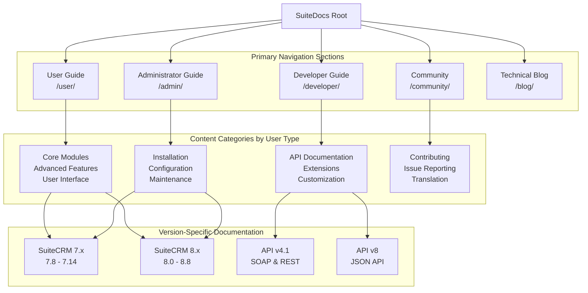
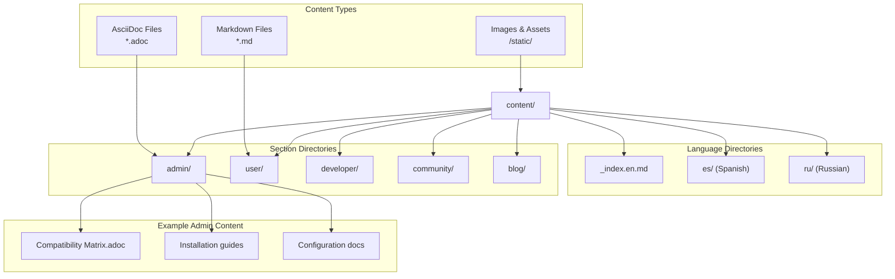
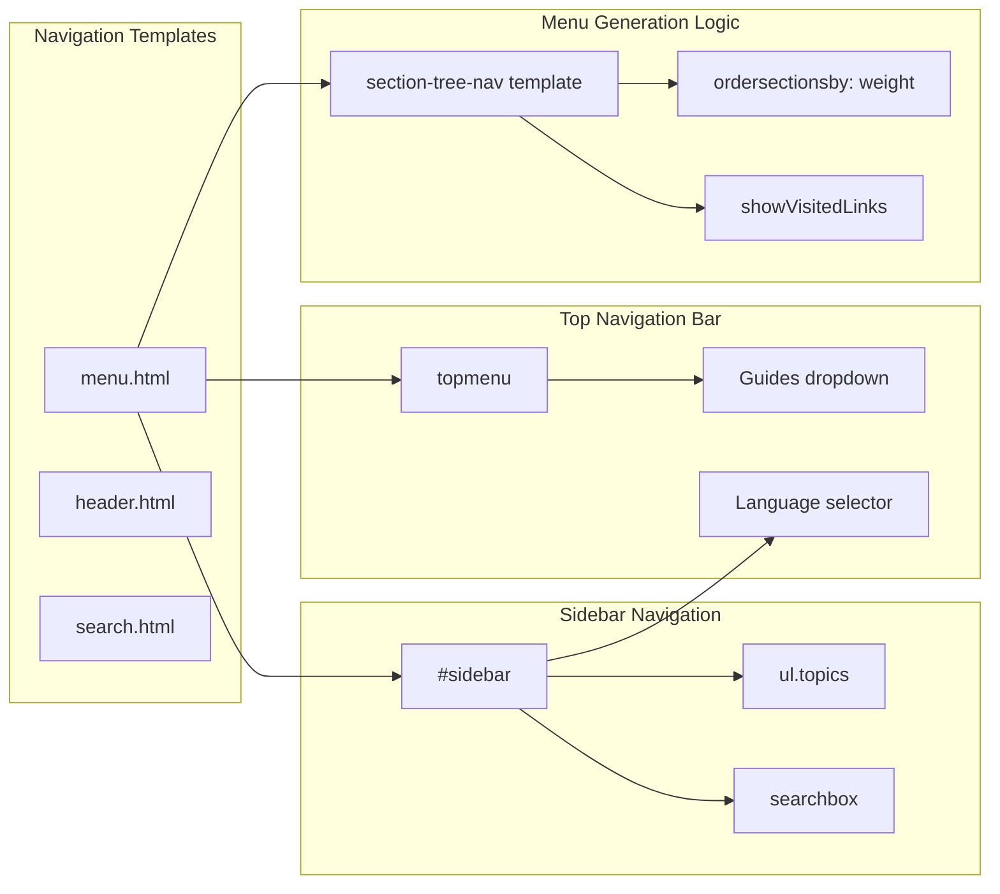
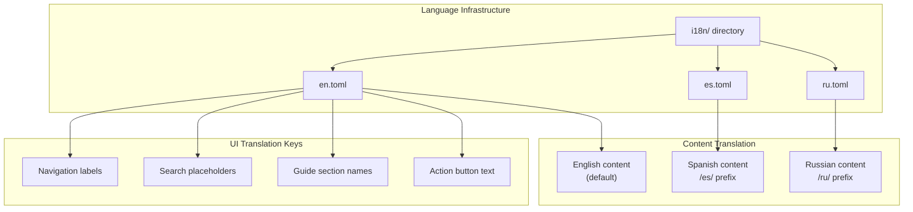
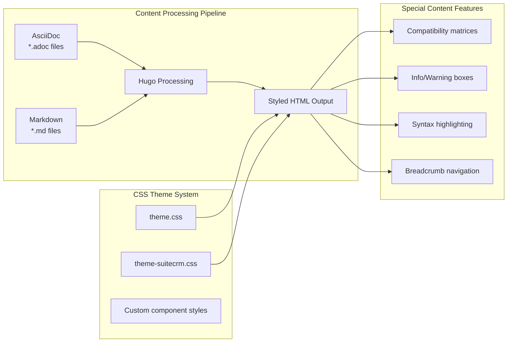
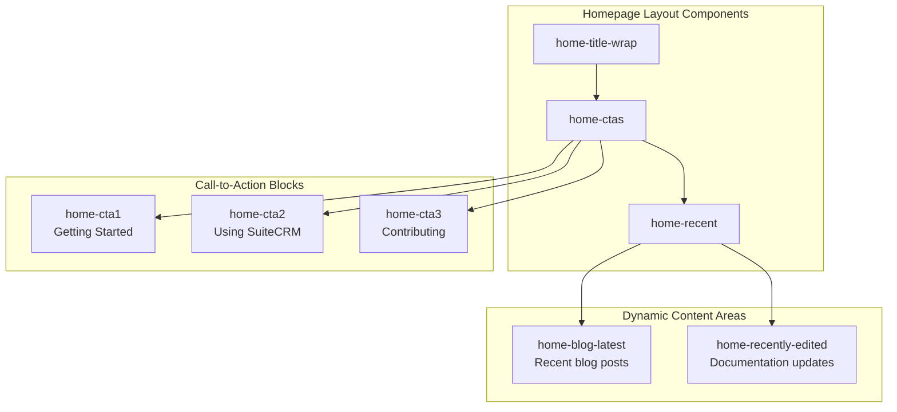

# Documentation Structure

Relevant source files

The following files were used as context for generating this wiki page:

- [.github/ISSUE_TEMPLATE.md](.github/ISSUE_TEMPLATE.md)
- [.github/ISSUE_TEMPLATE.md.NOT](.github/ISSUE_TEMPLATE.md.NOT)
- [LICENSE.md](LICENSE.md)
- [README.md](README.md)
- [archetypes/blog.md](archetypes/blog.md)
- [archetypes/default.md](archetypes/default.md)
- [content/_index.en.md](content/_index.en.md)
- [content/admin/Compatibility Matrix.adoc](content/admin/Compatibility Matrix.adoc)
- [i18n/en.toml](i18n/en.toml)
- [layouts/index.html](layouts/index.html)
- [layouts/partials/header.html](layouts/partials/header.html)
- [layouts/partials/menu.html](layouts/partials/menu.html)
- [layouts/partials/search.html](layouts/partials/search.html)
- [static/css/theme-suitecrm.css](static/css/theme-suitecrm.css)
- [static/css/theme.css](static/css/theme.css)
- [static/images/favicon.png](static/images/favicon.png)
- [themes/hugo-theme-learn/layouts/partials/menu.html](themes/hugo-theme-learn/layouts/partials/menu.html)

This document explains how the SuiteCRM documentation is organized across different user types, content categories, and technical implementation. It covers the hierarchical structure of documentation sections, content organization patterns, and navigation systems that make up the SuiteDocs repository.

For information about the technical build process and deployment pipeline, see [Documentation System Architecture](#2). For details about contributing to documentation, see [Contributing to Documentation](#8.1).

## Documentation Organization Hierarchy

The SuiteDocs repository follows a structured approach to organize documentation content across multiple dimensions: user types, SuiteCRM versions, and content categories.

**Top-Level Navigation Structure Implementation**

The main navigation is implemented in the menu template system, with distinct sections for different user audiences.

Sources: [layouts/partials/menu.html:64-75](), [i18n/en.toml:40-62]()

## Content File Organization

The documentation content follows a hierarchical file structure that mirrors the logical organization of information.

**File Naming and Weight System**

Content files use Hugo's weight system for ordering and AsciiDoc/Markdown frontmatter for metadata. The compatibility matrix demonstrates structured tabular documentation.

Sources: [content/admin/Compatibility Matrix.adoc:1-4](), [content/_index.en.md:1-6](), [archetypes/default.md:1-6]()

## Navigation System Implementation

The site navigation is implemented through Hugo's template system with multi-level menu generation and language switching capabilities.

**Menu Template Structure**

The navigation system uses recursive template generation to build hierarchical menus based on Hugo's content structure.

Sources: [layouts/partials/menu.html:134-146](), [layouts/partials/menu.html:179-236](), [layouts/partials/header.html:67-85]()

## Multi-Language Documentation Structure

The documentation supports multiple languages through Hugo's multi-language configuration and i18n templates.

| Language | Path Prefix | Configuration File | Status |
|----------|-------------|-------------------|---------|
| English | `/` (root) | `i18n/en.toml` | Primary language |
| Spanish | `/es/` | `i18n/es.toml` | Secondary language |
| Russian | `/ru/` | `i18n/ru.toml` | Secondary language |

**Language Switching Implementation**

The language selector is implemented in the sidebar with dropdown functionality and automatic URL translation.

Sources: [layouts/partials/menu.html:92-132](), [i18n/en.toml:1-147](), [layouts/partials/search.html:13-18]()

## Content Types and Styling

The documentation system supports different content types with specialized styling and formatting.

| Content Type | File Extension | Primary Use | Styling Classes |
|--------------|---------------|-------------|-----------------|
| AsciiDoc | `.adoc` | Structured documentation | `.admonition`, `.listingblock` |
| Markdown | `.md` | Simple content pages | `.markdown-body` |
| Blog Posts | `.md` | Technical blog content | `.blog-post`, `.tags` |
| Compatibility Tables | `.adoc` | Version matrices | `#smaller-table-spacing` |

**Specialized Table Styling**

The compatibility matrix uses custom CSS classes for compact table display with version-specific formatting.

Sources: [static/css/theme-suitecrm.css:119-128](), [content/admin/Compatibility Matrix.adoc:10-47](), [static/css/theme.css:726-737]()

## Homepage Structure and Call-to-Action System

The homepage implements a structured layout with multiple call-to-action sections targeting different user types.

**Homepage Template Implementation**

The homepage uses partial templates for modular content blocks with responsive flex layout.

Sources: [layouts/index.html:7-38](), [static/css/theme-suitecrm.css:873-1100](), [i18n/en.toml:70-147]()