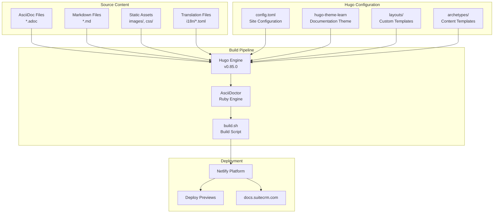
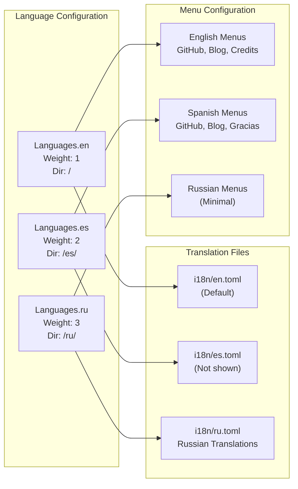
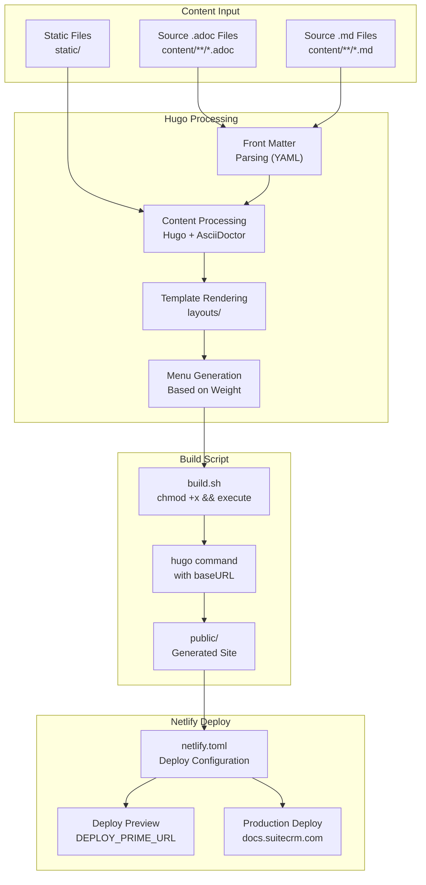
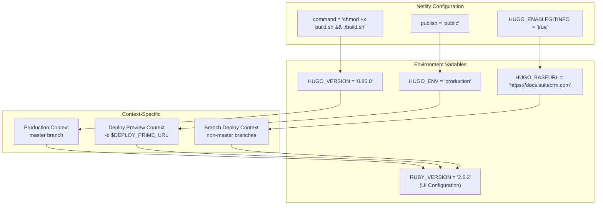

# Documentation System Architecture

<details>
<summary>Relevant source files</summary>

The following files were used as context for generating this wiki page:

- [LICENSE.md](LICENSE.md)
- [README.md](README.md)
- [archetypes/blog.md](archetypes/blog.md)
- [archetypes/default.md](archetypes/default.md)
- [config.toml](config.toml)
- [content/community/contributing-code/Forking.adoc](content/community/contributing-code/Forking.adoc)
- [i18n/ru.toml](i18n/ru.toml)
- [layouts/_default/single.html](layouts/_default/single.html)
- [layouts/partials/header-link.html](layouts/partials/header-link.html)
- [netlify.toml](netlify.toml)

</details>


This document describes the technical architecture of the SuiteDocs documentation system, including the static site generation pipeline, content processing, multi-language support, and deployment infrastructure. The system transforms AsciiDoc and Markdown source files into a multi-language documentation website using Hugo and deploys it via Netlify.

For information about contributing content to the documentation, see [Contributing to Documentation](#8.1). For details about the SuiteCRM versions covered, see [SuiteCRM Version Documentation](#3).

## System Overview

The SuiteDocs system is a Hugo-based static site generator that processes documentation content written in AsciiDoc format and deploys it as a multi-language website. The architecture follows a content-first approach where documentation authors write in markup formats, and the system handles rendering, navigation generation, and deployment automatically.



**Hugo Configuration and Content Processing Architecture**

Sources: [config.toml:1-118](), [README.md:11-18](), [netlify.toml:1-32]()

## Hugo Configuration System

The Hugo configuration is centralized in `config.toml`, which defines site-wide settings, language configurations, and theme parameters. The configuration uses TOML format and establishes the foundation for the entire documentation system.

### Core Site Configuration

| Configuration Key | Value | Purpose |
|------------------|-------|---------|
| `baseURL` | `"https://docs.suitecrm.com"` | Production site URL |
| `theme` | `"hugo-theme-learn"` | Documentation theme |
| `metaDataFormat` | `"yaml"` | Front matter format |
| `timeout` | `47000` | Build timeout (ms) |
| `enableGitInfo` | `true` | Git integration for edit links |

The site uses the Learn theme variant specifically customized for SuiteCRM (`themeVariant = "suitecrm"`), which provides documentation-focused navigation and styling.

### Multi-Language Configuration

The system supports three languages with distinct configurations:



**Multi-Language System Architecture**

Each language defines its own menu shortcuts, titles, and URL structure. The Russian translation file contains comprehensive translations for UI elements like navigation, search, and page actions.

Sources: [config.toml:28-118](), [i18n/ru.toml:1-142]()

## Content Processing Pipeline

The documentation system processes content through a multi-stage pipeline that transforms source markup into the final website. The process integrates AsciiDoc processing with Hugo's static site generation.

### Build Process Flow



**Content Processing and Deployment Pipeline**

The `build.sh` script serves as the entry point for the build process, making the script executable and running Hugo with appropriate parameters based on the deployment context (production vs. preview).

Sources: [netlify.toml:3-6](), [netlify.toml:17-17](), [README.md:14-17]()

## Template and Layout System

The documentation system uses Hugo's layout system with custom templates that extend the Learn theme. The layout system provides consistent structure across all documentation pages while allowing for customization.

### Layout Components

| Component | File Path | Purpose |
|-----------|-----------|---------|
| Single Page Layout | `layouts/_default/single.html` | Individual page rendering |
| Header Link Processing | `layouts/partials/header-link.html` | Auto-linking headers |
| Content Archetypes | `archetypes/default.md` | Default page templates |
| Blog Archetypes | `archetypes/blog.md` | Blog post templates |

The single page layout includes footer information with author details and modification dates, extracted from Git information when `enableGitInfo` is enabled.

### Header Link Generation

The system automatically generates anchor links for headers using a regex replacement in `header-link.html`:

```mermaid
graph LR
    subgraph "Header Processing"
        INPUT["Raw HTML Headers<br/>h2-h9 elements"]
        REGEX["RegEx Replacement<br/>header-link.html"]
        OUTPUT["Linked Headers<br/>with anchor icons"]
    end
    
    subgraph "Regex Pattern"
        PATTERN["(<h[2-9] id=\"([^\"]+)\">)(.+)(</h[2-9]+>)"]
        REPLACEMENT["${1}<a class=\"header-icon-link\"<br/>href=\"#${2}\">${3}<br/><i class=\"fas fa-link\"></i></a>${4}"]
    end
    
    INPUT --> REGEX
    REGEX --> PATTERN
    PATTERN --> REPLACEMENT
    REPLACEMENT --> OUTPUT
```

**Header Link Auto-Generation System**

This processing automatically adds clickable anchor links to all headers (h2-h9), improving navigation within long documentation pages.

Sources: [layouts/_default/single.html:1-14](), [layouts/partials/header-link.html:1-2](), [archetypes/default.md:1-6](), [archetypes/blog.md:1-15]()

## Netlify Deployment Configuration

The deployment system uses Netlify with environment-specific configurations defined in `netlify.toml`. The configuration supports multiple deployment contexts including production, deploy previews, and branch deployments.

### Deployment Contexts

| Context | Command | Environment | Purpose |
|---------|---------|-------------|---------|
| Production | `chmod +x build.sh && ./build.sh` | `HUGO_ENV=production` | Main site deployment |
| Deploy Preview | `chmod +x build.sh && ./build.sh -b $DEPLOY_PRIME_URL` | Hugo v0.85.0 | PR previews |
| Branch Deploy | `chmod +x build.sh && ./build.sh -b $DEPLOY_PRIME_URL` | Hugo v0.85.0 | Feature branch testing |

The system uses Hugo version 0.85.0 consistently across all deployment contexts, with Ruby version 2.6.2 configured as an environment variable in Netlify's UI for AsciiDoctor support.

### Build Configuration



**Netlify Deployment Configuration System**

The `$DEPLOY_PRIME_URL` variable is automatically provided by Netlify for preview deployments, allowing the build script to generate the site with the correct base URL for preview functionality.

Sources: [netlify.toml:1-32](), [README.md:17-17](), [README.md:21-29]()

## Git Integration and Edit Links

The documentation system integrates with Git to provide edit functionality and track page modifications. This integration enables community contributions and maintains revision history.

### Git Configuration Parameters

The site configuration includes several Git-related parameters that enable direct editing and issue reporting:

| Parameter | Value | Function |
|-----------|-------|----------|
| `GitHubRepo` | `"https://github.com/salesagility/SuiteDocs/"` | Repository base URL |
| `editURL` | `"https://github.com/salesagility/SuiteDocs/edit/master/content/"` | Edit link prefix |
| `issueURL` | `"https://github.com/salesagility/SuiteDocs/issues/new?"` | Issue creation URL |
| `enableGitInfo` | `true` | Enable Git metadata extraction |

The `enableGitInfo` setting allows Hugo to extract Git information for each page, including last modification date and author information, which is displayed in the page footer through the single page layout template.

Sources: [config.toml:13-21](), [layouts/_default/single.html:6-9]()