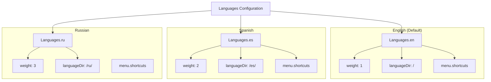
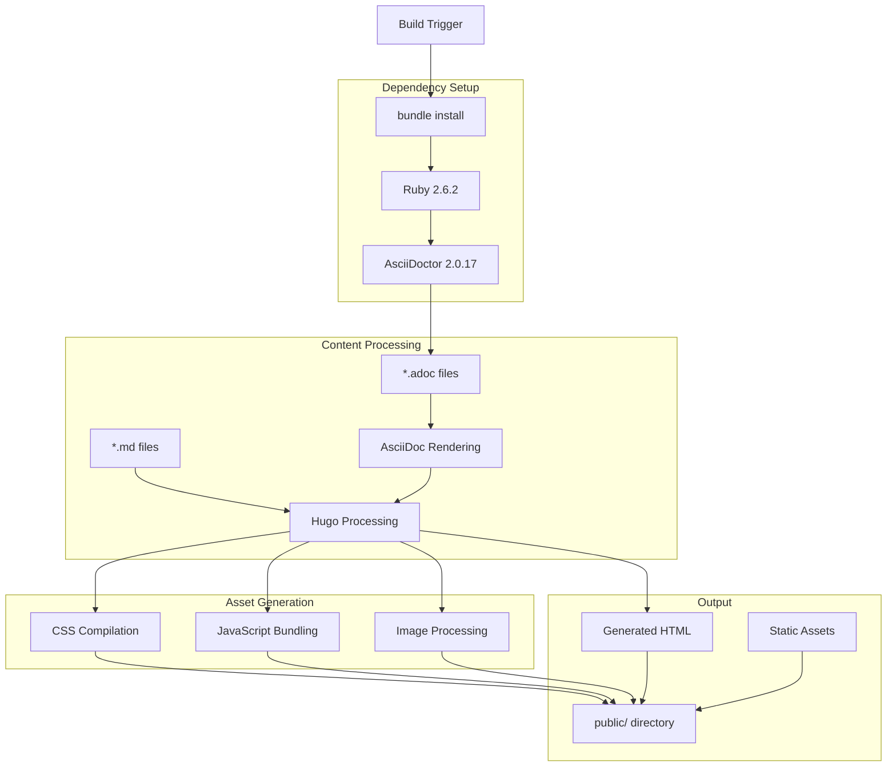
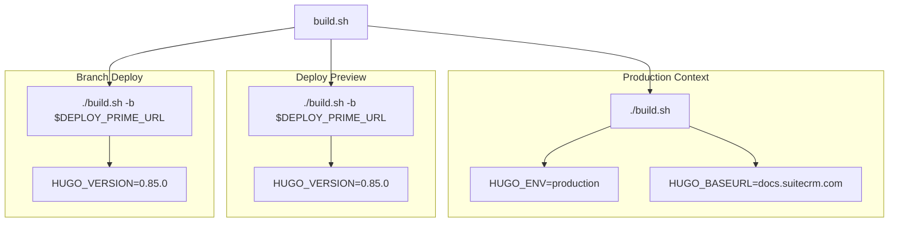
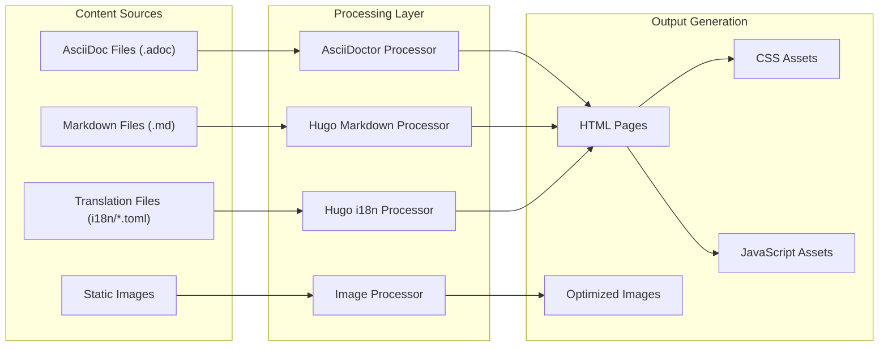
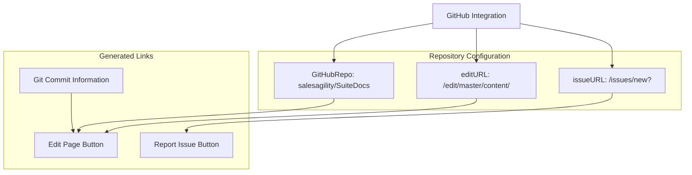
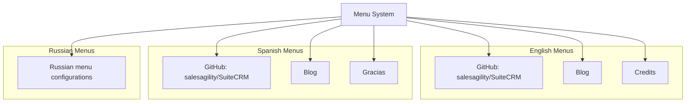

# Hugo Configuration and Build Process

Relevant source files

The following files were used as context for generating this wiki page:

- [Gemfile](Gemfile)
- [Gemfile.lock](Gemfile.lock)
- [_source/fixes.php](_source/fixes.php)
- [_source/yamlize](_source/yamlize)
- [config.toml](config.toml)
- [content/community/contributing-code/Forking.adoc](content/community/contributing-code/Forking.adoc)
- [content/developer/database-schema.adoc](content/developer/database-schema.adoc)
- [i18n/ru.toml](i18n/ru.toml)
- [layouts/_default/single.html](layouts/_default/single.html)
- [layouts/partials/header-link.html](layouts/partials/header-link.html)
- [netlify.toml](netlify.toml)
- [static/images/en/developer/database-schema/schema.png](static/images/en/developer/database-schema/schema.png)
- [static/images/en/developer/database-schema/schemaspy.png](static/images/en/developer/database-schema/schemaspy.png)
- [static/images/ru/user/core-modules/Calls/image2.png](static/images/ru/user/core-modules/Calls/image2.png)
- [static/images/ru/user/core-modules/Calls/image5.png](static/images/ru/user/core-modules/Calls/image5.png)
- [static/images/ru/user/core-modules/Meetings/image2.png](static/images/ru/user/core-modules/Meetings/image2.png)

This document covers the Hugo static site generator configuration and build process used by the SuiteDocs documentation system. It details how content is processed from AsciiDoc sources into the final deployed website, including multi-language support and deployment workflows.

For information about multi-language content structure and translation workflows, see [Multi-language Support](#2.2). For deployment specifics and Netlify configuration, see [Netlify Deployment](#2.3).

## Hugo Configuration Structure

The SuiteDocs system uses Hugo with a customized version of the `hugo-theme-learn` theme. The main configuration is defined in `config.toml`, which establishes the site structure, language settings, and integration parameters.

### Core Site Configuration

The base Hugo configuration defines essential site properties and build behavior:

```mermaid
graph TB
    config["config.toml"]
    
    subgraph "Site Properties"
        baseURL["baseURL: docs.suitecrm.com"]
        theme["theme: hugo-theme-learn"]
        timeout["timeout: 47000"]
        gitinfo["enableGitInfo: true"]
    end
    
    subgraph "Content Processing"
        metadata["metaDataFormat: yaml"]
        errors["ignoreErrors: error-remote-getjson"]
        outputs["outputs: HTML, RSS, JSON"]
    end
    
    subgraph "Parameters"
        github["GitHubRepo"]
        editurl["editURL"]
        issueurl["issueURL"]
        variant["themeVariant: suitecrm"]
    end
    
    config --> baseURL
    config --> theme
    config --> timeout
    config --> gitinfo
    config --> metadata
    config --> errors
    config --> outputs
    config --> github
    config --> editurl
    config --> issueurl
    config --> variant
```

**Sources:** [config.toml:1-27]()

### Multi-language Architecture

The configuration supports three languages with distinct URL structures and menu configurations:

**Sources:** [config.toml:28-118]()

## Build Dependencies and Process

The build system combines Hugo's static site generation with AsciiDoctor processing for enhanced documentation formatting capabilities.

### Dependency Management

The system uses Ruby's Bundler to manage AsciiDoctor dependencies:

| Component | Version | Purpose |
|-----------|---------|---------|
| `asciidoctor` | ~> 2.0, >= 2.0.17 | AsciiDoc processing |
| `hugo` | 0.85.0 | Static site generation |

**Sources:** [Gemfile:1-5](), [Gemfile.lock:1-10](), [netlify.toml:11]()

### Build Process Flow

**Sources:** [netlify.toml:3-7](), [Gemfile:1-5]()

### Build Script Configuration

The build process uses a custom `build.sh` script with different configurations for various deployment contexts:

**Sources:** [netlify.toml:3-28]()

## Content Processing Pipeline

The system processes multiple content formats and applies transformations during the build process.

### Content Source Processing

**Sources:** [config.toml:7](), [i18n/ru.toml:1-142]()

### Theme Integration

The system uses a customized version of `hugo-theme-learn` with SuiteCRM-specific styling:

| Configuration | Value | Purpose |
|---------------|-------|---------|
| `theme` | "hugo-theme-learn" | Base theme framework |
| `themeVariant` | "suitecrm" | Custom styling variant |
| `showVisitedLinks` | true | Track user navigation |

**Sources:** [config.toml:6](), [config.toml:22]()

## GitHub Integration Configuration

The system integrates with GitHub for content editing and issue reporting:

**Sources:** [config.toml:14-16]()

## Menu System Configuration

Each language has its own menu configuration with shortcuts to external resources:

### Common Menu Items

All languages include shortcuts to:
- GitHub repository
- Blog section  
- Credits page

### Language-specific Menu Structure

**Sources:** [config.toml:42-95]()