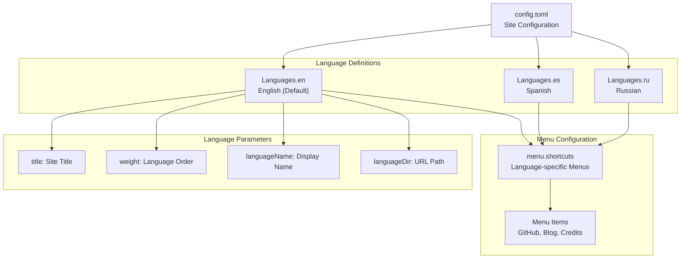
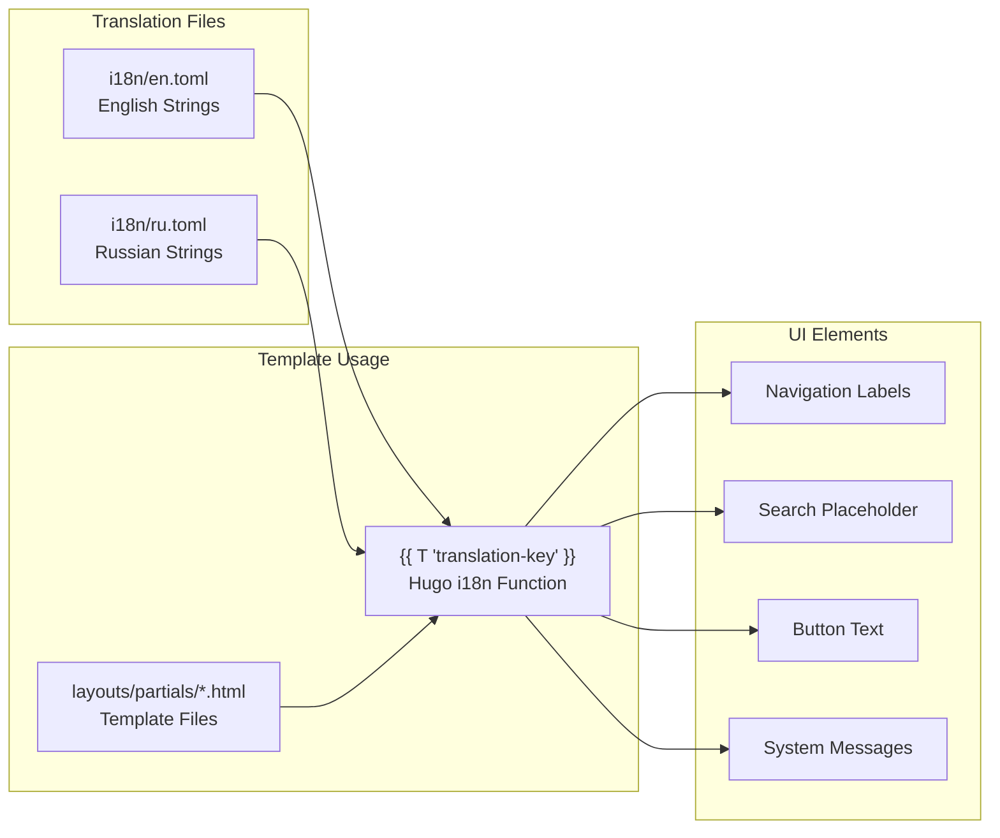
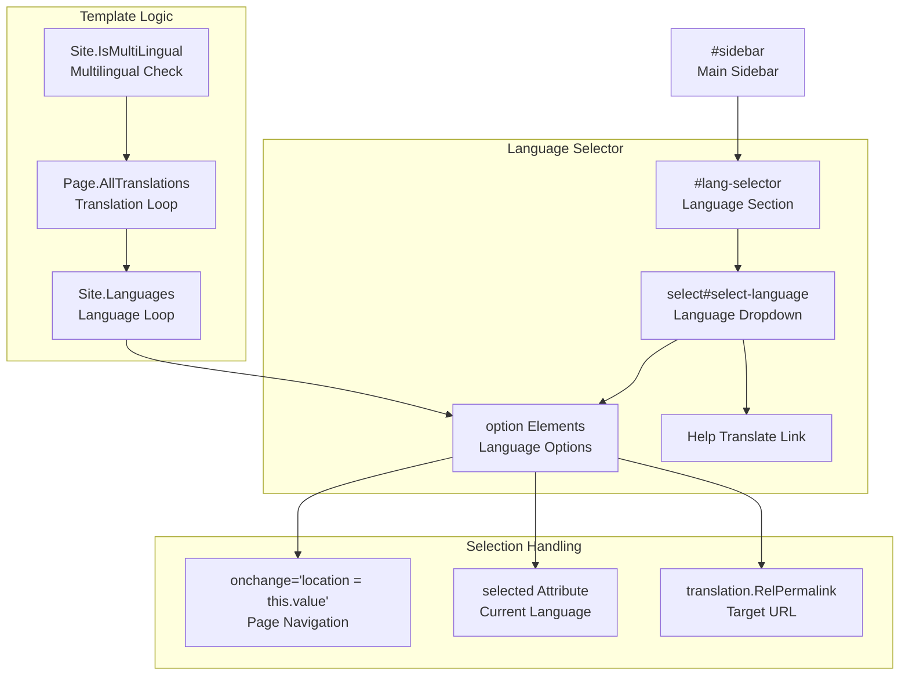
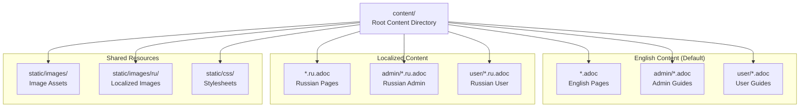
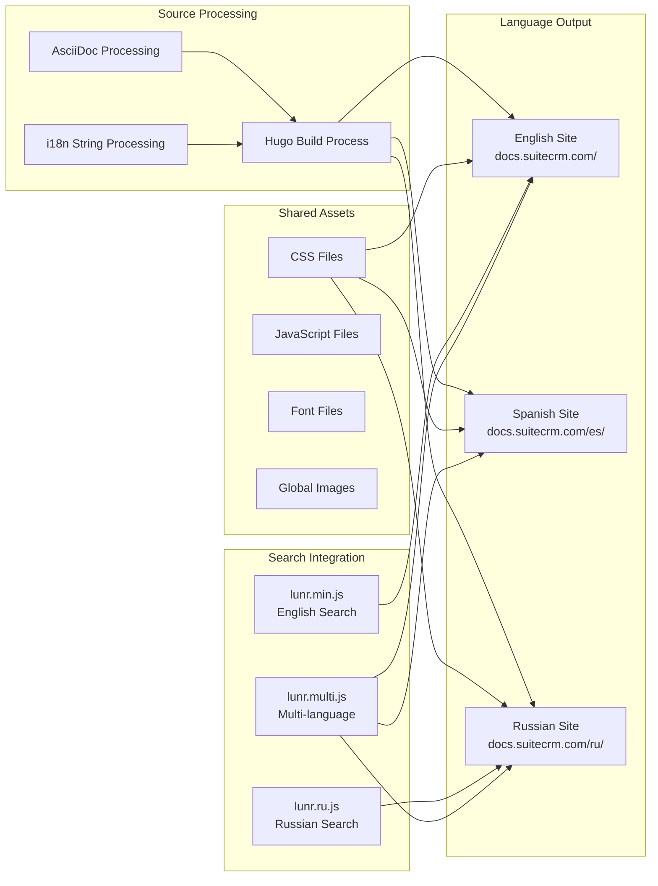

# Multi-language Support

Relevant source files

The following files were used as context for generating this wiki page:

- [config.toml](config.toml)
- [content/8.x/admin/Compatibility Matrix.ru.adoc](content/8.x/admin/Compatibility Matrix.ru.adoc)
- [content/admin/Compatibility Matrix.ru.adoc](content/admin/Compatibility Matrix.ru.adoc)
- [content/admin/Licensing.ru.adoc](content/admin/Licensing.ru.adoc)
- [content/admin/_index.ru.adoc](content/admin/_index.ru.adoc)
- [content/admin/administration-panel/search/elasticsearch/Introduction.ru.adoc](content/admin/administration-panel/search/elasticsearch/Introduction.ru.adoc)
- [content/admin/administration-panel/search/elasticsearch/Set up Elasticsearch.ru.adoc](content/admin/administration-panel/search/elasticsearch/Set up Elasticsearch.ru.adoc)
- [content/community/contributing-code/Forking.adoc](content/community/contributing-code/Forking.adoc)
- [content/user/_index.ru.adoc](content/user/_index.ru.adoc)
- [i18n/en.toml](i18n/en.toml)
- [i18n/ru.toml](i18n/ru.toml)
- [layouts/index.html](layouts/index.html)
- [layouts/partials/header.html](layouts/partials/header.html)
- [layouts/partials/menu.html](layouts/partials/menu.html)
- [layouts/partials/search.html](layouts/partials/search.html)
- [netlify.toml](netlify.toml)
- [static/css/theme-suitecrm.css](static/css/theme-suitecrm.css)
- [static/css/theme.css](static/css/theme.css)
- [static/images/favicon.png](static/images/favicon.png)
- [static/images/ru/admin/System/image6.png](static/images/ru/admin/System/image6.png)
- [themes/hugo-theme-learn/layouts/partials/menu.html](themes/hugo-theme-learn/layouts/partials/menu.html)

The SuiteDocs system provides comprehensive multi-language support to serve the global SuiteCRM community. This document covers the technical implementation of internationalization (i18n) features, including language configuration, translation management, content organization, and user interface elements for language switching.

For information about content creation and translation workflows, see [Contributing to Documentation](#8.1).

## Language Configuration Architecture

The multi-language system is built on Hugo's native internationalization capabilities, configured through the main site configuration and implemented across templates and content files.

**Sources:** [config.toml:28-118]()

### Language Settings

The system supports three languages with specific configurations:

| Language | Code | Weight | Directory | Display Name |
|----------|------|--------|-----------|--------------|
| English  | `en` | 1      | `/`       | English      |
| Spanish  | `es` | 2      | `/es/`    | Español      |
| Russian  | `ru` | 3      | `/ru/`    | Русский      |

Each language configuration includes site-specific settings such as titles and menu structures. The `defaultContentLanguageInSubdir` parameter is set to `false`, placing English content at the root path.

**Sources:** [config.toml:34-40](), [config.toml:69-73](), [config.toml:112-116]()

## Translation System

The i18n system uses TOML files to manage user interface translations, separate from content translations which are handled through dedicated content files.

**Sources:** [i18n/en.toml:1-147](), [i18n/ru.toml:1-142]()

### Translation Keys

The system defines standard translation keys for common UI elements:

- **Navigation**: `Documentation`, `Guides`, `User`, `Developer`, `Administrator`, `Community`
- **Search**: `Search-placeholder`, `Clear-History`
- **Actions**: `Edit-this-page`, `Issue-for-page`, `Go-to-homepage`
- **Content**: `GettingStarted`, `Installing`, `Upgrading`, `Using-SuiteCRM`

**Sources:** [i18n/en.toml:40-62](), [i18n/ru.toml:40-62]()

## Language Switching Interface

The language selector provides users with an accessible dropdown interface for switching between available languages.

**Sources:** [layouts/partials/menu.html:92-132]()

The language selector implementation includes:

1. **Conditional Display**: Only shown when `Site.IsMultiLingual` is true
2. **Dynamic Options**: Generated from available page translations
3. **Current Language Highlighting**: Selected attribute on current language option
4. **Translation Helper**: Link to translation contribution page
5. **JavaScript Navigation**: Immediate page redirect on selection change

**Sources:** [layouts/partials/menu.html:95-116]()

## Content Organization

Multi-language content follows a structured file organization pattern that separates language-specific content while maintaining consistency across versions.

**Sources:** [content/admin/_index.ru.adoc:1-12](), [content/user/_index.ru.adoc:1-12]()

### File Naming Convention

The system uses Hugo's filename-based language detection:

- **Default Language**: `filename.adoc` (English)
- **Localized Content**: `filename.LANG.adoc` (e.g., `filename.ru.adoc`)
- **Language-specific Assets**: `static/images/LANG/` directories

**Sources:** [content/admin/Compatibility Matrix.ru.adoc:1-465](), [static/images/ru/admin/System/image6.png:1]()

## Build and Deployment Process

The multi-language build process generates separate URL structures for each language while maintaining cross-language navigation and search functionality.

**Sources:** [netlify.toml:1-32](), [layouts/partials/search.html:7-19]()

### Search Localization

The search functionality includes language-specific components:

- **Language Detection**: `Site.IsMultiLingual` check determines search configuration
- **Lunr.js Libraries**: Separate stemmer support for Russian (`lunr.ru.js`)
- **Multi-language Support**: `lunr.multi.js` enables cross-language search capabilities
- **Base URL Configuration**: Language-specific base URLs for search indexing

**Sources:** [layouts/partials/search.html:13-17]()

### Navigation and Cross-linking

The template system generates language-aware navigation:

- **Language Parameter Access**: `Site.Language.Params.LanguageDir` for URL construction
- **Cross-language Links**: Automatic generation of translation links
- **Menu Localization**: Language-specific menu items and labels using `i18n` function

**Sources:** [layouts/partials/menu.html:67](), [layouts/partials/menu.html:103-115]()

## Theme Integration

The multi-language system integrates with the SuiteCRM theme through CSS and styling customizations that accommodate different text lengths and character sets.

**Sources:** [static/css/theme-suitecrm.css:812-823](), [layouts/partials/header.html:23-25]()